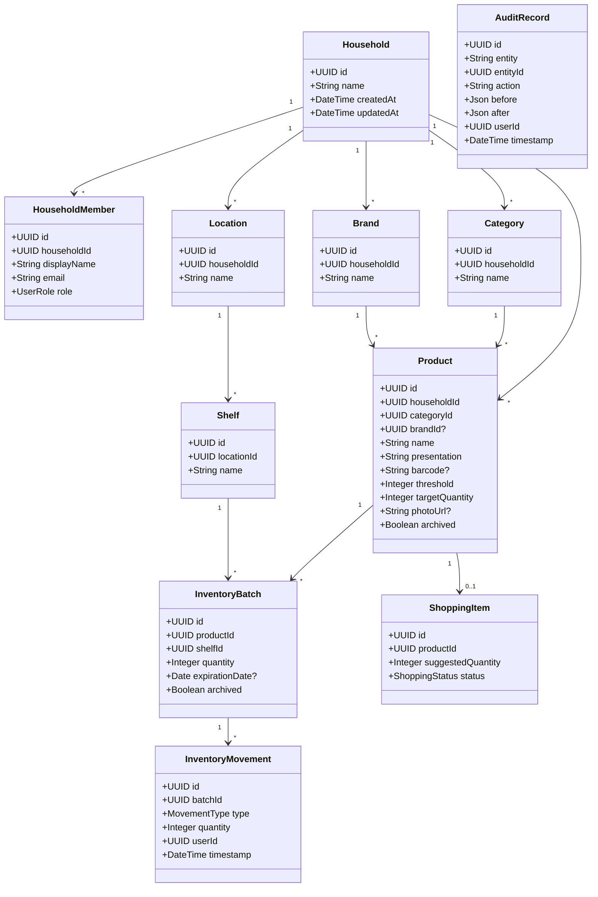

# Baulera

**Document:** 04-domain-model.md  
**Version:** 1.0  
**Status:** Final  
**Last Updated:** 2026-07-01

---

# 1. Introduction

## 1.1 Purpose

This document defines the **Domain Model** for Baulera.

The domain model represents the business concepts independently of:

- Flutter
- Supabase
- SQLite / Drift
- REST APIs
- UI
- Infrastructure

It is the heart of the application and the single source of truth for business rules.

---

## 1.2 Design Principles

The domain model follows the principles of:

- Domain-Driven Design (DDD)
- Clean Architecture
- Offline First
- Event-Based Inventory
- Immutable History
- High Cohesion
- Low Coupling

Business rules belong exclusively to the Domain Layer.

---

# 2 Domain Overview

The domain models a household inventory stored in a pantry or storage room ("Baulera").

The application tracks:

- Products
- Physical inventory
- Inventory batches
- Purchases
- Consumption
- Shopping suggestions
- Expiration dates
- Audit history

The inventory is shared by one Household.

---

# 3 Ubiquitous Language

The following terminology shall be used consistently throughout the project.

| Term | Definition |
|------|------------|
| Household | Shared workspace containing users, products and inventory. |
| Product | Permanent definition of an item independent of stock. |
| Inventory | Current physical stock. |
| Inventory Batch | Physical quantity of a Product sharing expiration and location. |
| Movement | Immutable stock operation. |
| Audit Record | Immutable business history. |
| Shopping Item | Suggested purchase. |
| Threshold | Minimum acceptable stock. |
| Target Quantity | Desired stock after replenishment. |
| Location | Physical area where products are stored. |
| Shelf | Subdivision of a Location. |

These names shall be used consistently in:

- Source Code
- Database
- Documentation
- APIs
- Tests

---

# 4 Bounded Contexts

The system is divided into cohesive business contexts.

---

## 4.1 Household Context

Responsible for:

- Household
- Members
- Shared configuration

Aggregate Root

```
Household
```

---

## 4.2 Catalog Context

Responsible for permanent product definitions.

Aggregate Root

```
Product
```

Contains

- Brand
- Category
- Presentation
- Barcode

---

## 4.3 Inventory Context

Responsible for physical stock.

Aggregate Root

```
InventoryBatch
```

Contains

- Quantity
- Expiration
- Location
- Shelf

---

## 4.4 Shopping Context

Responsible for purchase planning.

Aggregate Root

```
ShoppingItem
```

---

## 4.5 Statistics Context

Read-only context.

Consumes

- Inventory Movements
- Audit Records

Produces

- Charts
- Reports
- Metrics

---

## 4.6 Synchronization Context

Responsible for

- Offline Queue
- Sync Events
- Conflict Resolution

---

# 5 Aggregate Roots

Only Aggregate Roots may be referenced from outside their aggregate.

---

## Household

Responsibilities

- Members
- Configuration
- Ownership

Children

- HouseholdMember

---

## Product

Responsibilities

- Product Identity
- Product Metadata
- Threshold
- Target Quantity

Children

- ProductImage

---

## InventoryBatch

Responsibilities

- Current Quantity
- Expiration
- Shelf
- Location

Children

- Batch Notes

---

## ShoppingItem

Responsibilities

- Suggested Quantity
- Status

---

## InventoryMovement

Responsibilities

- Immutable inventory history

---

## AuditRecord

Responsibilities

- Immutable audit history

---

# 6 Domain Entities

The following entities exist in the system.

---

## Household

Represents a family inventory.

### Identity

```
HouseholdId
```

### Attributes

- Name
- CreatedAt
- UpdatedAt

---

## HouseholdMember

Represents a user inside a Household.

Attributes

- UserId
- DisplayName
- Email
- Role

---

## Product

Represents a catalog item.

A Product exists even if inventory equals zero.

Attributes

- ProductId
- Name
- Brand
- Category
- Presentation
- Barcode
- Threshold
- TargetQuantity
- PhotoUrl

---

## InventoryBatch

Represents physical stock.

Attributes

- BatchId
- ProductId
- Quantity
- ExpirationDate
- LocationId
- ShelfId

---

## InventoryMovement

Represents an immutable stock operation.

Attributes

- MovementId
- BatchId
- Quantity
- Type
- Timestamp
- UserId

---

## ShoppingItem

Represents a suggested purchase.

Attributes

- ShoppingItemId
- ProductId
- SuggestedQuantity
- Status

---

## AuditRecord

Represents immutable business history.

Attributes

- AuditId
- Entity
- EntityId
- Action
- Before
- After
- Timestamp

---

## Category

Product classification.

Examples

- Beverages
- Dairy
- Frozen Food

---

## Brand

Manufacturer.

Examples

- Coca-Cola
- Nestlé
- La Serenísima

---

## Location

Physical storage area.

Examples

- Pantry
- Storage Room
- Kitchen

---

## Shelf

Subdivision of a Location.

Example

```
Pantry

↓

Top Shelf

↓

Middle Shelf

↓

Bottom Shelf
```

---

# 7 Value Objects

Value Objects are immutable.

They have no identity.

---

## Barcode

Represents

```
7790895000999
```

Rules

- Immutable
- Validated

---

## Presentation

Examples

```
500 ml

1.5 L

750 g

12 units
```

---

## Quantity

Represents inventory amount.

Rules

- Cannot be negative.

---

## Threshold

Minimum desired stock.

Example

```
Milk

Threshold

3
```

---

## TargetQuantity

Desired stock after shopping.

Rules

Must be greater than or equal to Threshold.

---

## ExpirationDate

Represents the expiration of an Inventory Batch.

May be absent.

---

## ProductName

Immutable textual representation of the Product.

Normalization rules:

- Trim leading/trailing whitespace.
- Collapse consecutive spaces.
- Preserve original casing for display.
- Store normalized value for search.

---

## EmailAddress

Represents a validated email address associated with a Household Member.

Rules

- RFC-compliant validation.
- Stored in lowercase.
- Immutable after creation unless explicitly updated.

---

## UserRole

Represents permissions within a Household.

Supported values

- Administrator

Future values

- Editor
- Viewer

---


# 8 Aggregate Boundaries

Aggregate boundaries define transaction consistency.

Business rules shall always be enforced inside an Aggregate.

Communication between Aggregates occurs through identifiers or Domain Events.

---

## Household Aggregate

### Aggregate Root

```
Household
```

### Contains

- Household
- HouseholdMember

### Responsibilities

- Membership
- Ownership
- Shared configuration

### Invariants

- A Household must have at least one Administrator.
- Members belong to exactly one Household.
- Household deletion is not allowed.

---

## Product Aggregate

### Aggregate Root

```
Product
```

### Contains

- Product

### References

- Category
- Brand

### Responsibilities

- Product identity
- Product metadata
- Purchase thresholds

### Invariants

- Product name cannot be empty.
- Barcode is unique inside a Household.
- Threshold ≥ 0.
- Target Quantity ≥ Threshold.

---

## Inventory Aggregate

### Aggregate Root

```
InventoryBatch
```

### Contains

- InventoryBatch

### References

- Product
- Shelf

### Responsibilities

- Physical inventory
- Current quantity
- Expiration

### Invariants

- Quantity ≥ 0.
- Product reference is mandatory.
- Shelf reference is mandatory.
- Expiration belongs to the Batch, never to the Product.

---

## Shopping Aggregate

### Aggregate Root

```
ShoppingItem
```

### Responsibilities

- Purchase suggestion
- Suggested quantity
- Status

### Invariants

- Suggested Quantity > 0.
- Product reference is mandatory.

---

## Audit Aggregate

### Aggregate Root

```
AuditRecord
```

### Responsibilities

- Immutable business history

### Invariants

Audit records are append-only.

---

# 9 Entity Relationships

---

## Household → HouseholdMember

Relationship

```
Household

1

↓

*

HouseholdMember
```

Rules

- Every member belongs to one Household.
- A Household contains multiple members.

---

## Household → Product

```
Household

1

↓

*

Product
```

Products are private to a Household.

---

## Household → Category

```
Household

1

↓

*

Category
```

Categories are Household-specific.

Future versions may support shared categories.

---

## Household → Brand

```
Household

1

↓

*

Brand
```

Brands are reusable.

---

## Household → Location

```
Household

1

↓

*

Location
```

---

## Location → Shelf

```
Location

1

↓

*

Shelf
```

A Shelf cannot exist without a Location.

---

## Category → Product

```
Category

1

↓

*

Product
```

Every Product belongs to one Category.

---

## Brand → Product

```
Brand

1

↓

*

Product
```

Brand is optional.

---

## Product → InventoryBatch

```
Product

1

↓

*

InventoryBatch
```

Multiple batches represent different physical lots.

---

## Product → ShoppingItem

```
Product

1

↓

0..1

ShoppingItem
```

Business Rule

Only one active Shopping Item may exist for a Product.

---

## InventoryBatch → InventoryMovement

```
InventoryBatch

1

↓

*

InventoryMovement
```

Inventory history is immutable.

---

## Product → AuditRecord

```
Product

1

↓

*

AuditRecord
```

Indirect relationship through EntityId.

---

# 10 Cardinality Summary

| Parent | Child | Cardinality |
|---------|--------|------------|
| Household | HouseholdMember | 1 : N |
| Household | Product | 1 : N |
| Household | Category | 1 : N |
| Household | Brand | 1 : N |
| Household | Location | 1 : N |
| Location | Shelf | 1 : N |
| Category | Product | 1 : N |
| Brand | Product | 0..1 : N |
| Product | InventoryBatch | 1 : N |
| Product | ShoppingItem | 1 : 0..1 |
| InventoryBatch | InventoryMovement | 1 : N |

---

# 11 Composition

Some entities cannot exist independently.

---

## Household owns Members

Composition

```
Household

◆──── HouseholdMember
```

Deleting a Household would delete all members.

Although Household deletion is currently prohibited.

---

## Location owns Shelves

```
Location

◆──── Shelf
```

Shelf lifetime depends on Location.

---

## Product owns Inventory

No.

Inventory references Product.

Deleting Product does not remove Inventory History.

---

## Inventory owns Movements

No.

Movements remain forever.

InventoryBatch may reach zero.

History remains immutable.

---

# 12 Reference Rules

References across Aggregates shall use identifiers only.

Correct

```
InventoryBatch

↓

ProductId
```

Incorrect

```
InventoryBatch

↓

Complete Product Object
```

Reason

Keeps Aggregates independent.

---

# 13 Identity Rules

Every Entity uses UUID.

Examples

```
ProductId

InventoryBatchId

MovementId

AuditId

HouseholdId
```

Identifiers never change.

---

# 14 Lifecycle Rules

---

## Product Lifecycle

```
Created

↓

Updated

↓

Archived

↓

Still Available For History
```

Products are never physically deleted.

---

## Inventory Batch Lifecycle

```
Created

↓

Updated

↓

Quantity Zero

↓

Archived
```

Batch history remains.

---

## Shopping Item Lifecycle

```
Suggested

↓

Selected

↓

Purchased

↓

Completed
```

Alternative

```
Suggested

↓

Ignored
```

---

## Audit Record Lifecycle

```
Created

↓

Immutable Forever
```

---

## Inventory Movement Lifecycle

```
Created

↓

Immutable Forever
```

---

# 15 Entity Business Rules

## Product

- Product Name is required.
- Threshold cannot be negative.
- Target Quantity cannot be below Threshold.
- Barcode must be unique within the Household.
- Presentation is required.
- Category is required.

---

## InventoryBatch

- Quantity cannot be negative.
- Shelf is required.
- Product is required.
- Expiration Date is optional.
- A Batch with quantity zero is considered inactive but retained.

---

## ShoppingItem

- Suggested Quantity must be positive.
- Product is mandatory.
- Only one active Shopping Item per Product.
- Completing a Shopping Item never deletes it; it transitions to a completed state for historical purposes.

---

## HouseholdMember

- Email must be unique within the Household.
- Role is mandatory.
- At least one Administrator must always exist.

---

## Shelf

- Shelf name must be unique within its Location.
- Shelf cannot exist without a Location.

---

# 16 Domain Constraints

The following constraints apply globally.

### DC-001

A Product cannot exist without a Household.

---

### DC-002

Inventory cannot exist without a Product.

---

### DC-003

A Shelf cannot exist without a Location.

---

### DC-004

Every Inventory Movement belongs to exactly one Inventory Batch.

---

### DC-005

Audit Records are immutable.

---

### DC-006

Inventory Movements are immutable.

---

### DC-007

Historical data shall never be physically deleted.

---

### DC-008

Every inventory modification generates:

- Inventory Movement
- Audit Record
- Synchronization Event

---

### DC-009

Threshold and Target Quantity belong to the Product definition, never to an Inventory Batch.

---

### DC-010

Inventory quantity is always calculated from the current state of active Inventory Batches.

Historical movements are used for auditing and statistics, not for reconstructing current inventory in the initial implementation.


---

# 17 Domain Services

Domain Services encapsulate business behavior that does not naturally belong to a single Entity or Aggregate.

They are stateless and contain only business logic.

---

## InventoryService

### Responsibility

Central service responsible for inventory operations.

### Operations

- Register Purchase
- Consume Inventory
- Adjust Inventory
- Relocate Inventory
- Merge Batches
- Split Batch

### Business Rules

- Never produce negative stock.
- Always generate Inventory Movements.
- Always generate Audit Records.
- Always generate Synchronization Events.

---

## ShoppingService

### Responsibility

Maintains the Shopping List automatically.

### Operations

- Evaluate Threshold
- Generate Suggestions
- Complete Shopping Item
- Ignore Suggestion
- Recalculate Suggested Quantity

### Business Rules

Shopping List is derived from inventory state.

---

## ProductService

### Responsibility

Maintains Product Catalog consistency.

### Operations

- Create Product
- Update Product
- Validate Barcode
- Normalize Product Name
- Detect Duplicate Products

---

## SynchronizationService

### Responsibility

Coordinates local and remote synchronization.

### Operations

- Upload Pending Events
- Download Remote Events
- Resolve Conflicts
- Retry Failed Events

---

## StatisticsService

### Responsibility

Generates read-only metrics.

### Data Sources

- Inventory Movements
- Audit Records

### Outputs

- Consumption Statistics
- Purchase Statistics
- Expiration Statistics
- Product Rankings

---

## VoiceCommandService

### Responsibility

Transforms spoken language into domain actions.

### Operations

- Parse Speech
- Detect Intent
- Resolve Product
- Validate Action

---

## NotificationService

### Responsibility

Determines when notifications should be generated.

Examples

- Low Stock
- Expiration Warning
- Synchronization Failure

---

# 18 Domain Events

Every important business action produces a Domain Event.

Events are immutable.

---

## ProductCreated

Generated when

- Product is created.

Payload

- ProductId
- Timestamp
- UserId

---

## ProductUpdated

Generated whenever Product metadata changes.

---

## ProductArchived

Generated when Product becomes inactive.

---

## BatchCreated

Generated when new inventory arrives.

---

## BatchUpdated

Generated when Inventory Batch changes.

---

## InventoryConsumed

Generated whenever inventory decreases.

---

## InventoryAdjusted

Generated after manual inventory correction.

---

## InventoryRelocated

Generated after moving inventory between shelves.

---

## InventoryExpired

Generated when inventory is discarded because of expiration.

---

## ShoppingSuggested

Generated when Threshold is reached.

---

## ShoppingCompleted

Generated when suggested purchase has been completed.

---

## ThresholdReached

Generated immediately after stock falls below Threshold.

---

## SynchronizationStarted

Generated before synchronization begins.

---

## SynchronizationCompleted

Generated after successful synchronization.

---

## SynchronizationFailed

Generated whenever synchronization fails.

---

## VoiceCommandExecuted

Generated after successful voice interpretation.

---

## OpenFoodFactsLookupCompleted

Generated after successful product lookup.

---

# 19 Event Flow

Example

```
User

↓

Consume Milk

↓

InventoryService

↓

InventoryConsumed

↓

InventoryMovement

↓

AuditRecord

↓

ShoppingService

↓

ThresholdReached

↓

ShoppingSuggested

↓

NotificationService

↓

Low Stock Notification
```

---

# 20 Domain Policies

Policies define business decisions.

---

## Threshold Policy

Rule

```
Current Stock

<=

Threshold

↓

Shopping Suggestion
```

---

## Purchase Policy

When purchasing inventory,

new Batch shall be created whenever expiration date differs.

---

## Batch Merge Policy

Two batches shall automatically merge when all of the following match:

- Product
- Expiration Date
- Location
- Shelf

---

## Consumption Policy

User selects which Batch is consumed.

FIFO is available as a convenience,

never mandatory.

---

## Synchronization Policy

Local operations always execute first.

Synchronization never blocks the user.

---

## History Policy

Business history is immutable.

Corrections generate new events.

---

# 21 Business Algorithms

The following algorithms define domain behavior.

---

## Calculate Current Stock

```
Current Stock

=

Sum

(

All Active Inventory Batches

)
```

---

## Suggested Purchase Quantity

```
Suggested

=

Target Quantity

-

Current Stock
```

Minimum value

```
0
```

---

## Product Availability

```
Current Stock = 0

↓

Out of Stock

---------------

Current Stock <= Threshold

↓

Low Stock

---------------

Otherwise

↓

Available
```

---

## Days Until Expiration

```
Expiration Date

-

Today

=

Remaining Days
```

Negative values indicate expired inventory.

---

## Batch Merge

Merge occurs only when

```
Same Product

AND

Same Expiration

AND

Same Shelf

AND

Same Location
```

---

# 22 Aggregate Interactions

Aggregates communicate through identifiers and Domain Events.

---

## Purchase Flow

```
Product

↓

InventoryBatch

↓

InventoryMovement

↓

AuditRecord

↓

ShoppingItem
```

---

## Consumption Flow

```
InventoryBatch

↓

InventoryMovement

↓

AuditRecord

↓

ShoppingService
```

---

## Product Update

```
Product

↓

AuditRecord

↓

Synchronization Event
```

---

## Relocation

```
InventoryBatch

↓

InventoryMovement

↓

AuditRecord
```

---

# 23 State Machines

---

## Product

```
Created

↓

Active

↓

Archived
```

Archived Products remain searchable through history.

---

## Inventory Batch

```
Created

↓

Available

↓

Low Stock

↓

Empty

↓

Archived
```

Transitions

- Purchase
- Consumption
- Adjustment

---

## Shopping Item

```
Suggested

↓

Selected

↓

Purchased

↓

Completed
```

Alternative

```
Suggested

↓

Ignored
```

---

## Synchronization Event

```
Pending

↓

Uploading

↓

Completed
```

Alternative

```
Pending

↓

Uploading

↓

Failed

↓

Retry

↓

Completed
```

---

## Notification

```
Created

↓

Scheduled

↓

Delivered

↓

Dismissed
```

---

# 24 Consistency Rules

The following consistency rules shall always hold.

### CR-001

Every Inventory Batch references an existing Product.

---

### CR-002

Every Shelf belongs to an existing Location.

---

### CR-003

Every Shopping Item references an existing Product.

---

### CR-004

Inventory Movements shall always reference an existing Inventory Batch.

---

### CR-005

Audit Records shall reference an existing Entity.

---

### CR-006

Synchronization Events shall always reference an existing business event.

---

### CR-007

No Product shall have more than one active Shopping Item.

---

### CR-008

Household isolation shall always be preserved.

No cross-household references are allowed.

---

# 25 Domain Class Diagram (Mermaid)



---

# 26 Aggregate Diagram

```text
Household
│
├── Household Members
├── Categories
├── Brands
├── Locations
│     └── Shelves
│
├── Products
│     ├── Inventory Batches
│     │      └── Inventory Movements
│     │
│     └── Shopping Item
│
└── Audit Records
```

---

# 27 Aggregate Communication

Aggregates communicate exclusively through:

- UUID references
- Domain Events

Direct object references between Aggregates are forbidden.

Example

```text
InventoryBatch

contains

ProductId

NOT

Product
```

This keeps Aggregates independent and prevents accidental loading of large object graphs.

---

# 28 Domain Invariants

The following invariants shall always hold true.

---

## Household

- Must contain at least one Administrator.
- Cannot be deleted.
- Members belong to exactly one Household.

---

## Product

- Name is mandatory.
- Category is mandatory.
- Presentation is mandatory.
- Threshold ≥ 0.
- Target Quantity ≥ Threshold.
- Barcode is unique within the Household.
- Product identity never changes.

---

## Inventory Batch

- References exactly one Product.
- References exactly one Shelf.
- Quantity ≥ 0.
- Expiration Date belongs to the Batch.
- Empty batches are archived, not deleted.

---

## Inventory Movement

- Immutable.
- References exactly one Batch.
- Quantity is always positive.
- Movement Type is mandatory.
- Timestamp is immutable.

---

## Shopping Item

- References exactly one Product.
- Suggested Quantity > 0.
- Only one active Shopping Item exists per Product.

---

## Audit Record

- Immutable.
- Append-only.
- Never updated.
- Never deleted.

---

## Shelf

- Belongs to exactly one Location.
- Name must be unique inside its Location.

---

## Category

- Name must be unique within the Household.

---

## Brand

- Name must be unique within the Household.

---

# 29 Architectural Notes

## Domain Independence

The Domain Layer shall never depend on:

- Flutter
- Drift
- SQLite
- Supabase
- REST
- JSON serialization
- UI frameworks

The Domain Model must remain pure Dart.

---

## Repository Pattern

The Domain Layer communicates with infrastructure only through repository interfaces.

Example

```text
InventoryRepository

ProductRepository

ShoppingRepository

SynchronizationRepository
```

Infrastructure provides implementations.

---

## Domain Services

Business behavior that involves multiple Aggregates belongs to Domain Services.

Examples

- InventoryService
- ShoppingService
- SynchronizationService

Entities shall not depend on services.

---

## Domain Events

Every significant business operation generates one or more immutable Domain Events.

These events may later support:

- Event Sourcing
- Analytics
- Notifications
- Audit
- Synchronization
- AI insights

---

## Offline First

The Domain Model has no concept of:

- Internet
- Cloud
- Backend

It only models business behavior.

Synchronization is an infrastructure concern.

---

# 30 Design Decisions

| Decision | Rationale |
|----------|-----------|
| UUID identifiers | Safe offline creation without collisions. |
| InventoryBatch separate from Product | Allows multiple expiration dates and storage locations for the same product. |
| Immutable InventoryMovement | Complete historical traceability. |
| Immutable AuditRecord | Regulatory-grade audit history and easier debugging. |
| Product survives with zero stock | Preserves shopping preferences, thresholds and history. |
| Threshold and Target Quantity belong to Product | Defines purchasing policy independently of current inventory. |
| Local-first architecture | Enables full offline operation. |
| Repository abstraction | Prevents vendor lock-in and simplifies testing. |

---

# 31 Future Extensions

The current model intentionally leaves room for future capabilities without breaking compatibility.

Potential future modules include:

- Price History
- Promotions
- Favorite Products
- Recipes
- Meal Planning
- Budget Tracking
- OCR Receipt Import
- Smart Pantry Sensors
- NFC/RFID Inventory
- Shared Shopping Trips
- Product Ratings
- AI Consumption Forecasting
- Automatic Expiration Detection
- Multiple Households
- Enterprise Warehouse Mode

The current Aggregate structure is compatible with these extensions.

---

# 32 Traceability

| Document | Relationship |
|----------|--------------|
| 01-vision.md | Defines the business goals represented by this model. |
| 02-functional-requirements.md | Each Functional Requirement maps to one or more Aggregates or Domain Services. |
| 03-non-functional-requirements.md | Constrains how the Domain Model is implemented. |
| 05-use-cases.md | Implements the behaviors defined in this model. |
| 06-architecture.md | Describes how the Domain Model is realized in software. |
| 08-database-design.md | Maps Entities and Value Objects to PostgreSQL and Drift schemas. |
| 10-offline-first.md | Explains how Aggregate state is synchronized between devices. |

---

# 33 Glossary

| Term | Definition |
|------|------------|
| Aggregate | Consistency boundary in Domain-Driven Design. |
| Aggregate Root | The only externally accessible entity within an Aggregate. |
| Entity | Object with identity that persists over time. |
| Value Object | Immutable object defined only by its values. |
| Domain Event | Immutable representation of a business event. |
| Domain Service | Stateless business logic involving multiple Aggregates. |
| Invariant | Business rule that must always remain true. |
| Repository | Abstraction used by the Domain Layer to access persistence. |
| Bounded Context | Logical boundary separating business responsibilities. |
| Offline First | Design approach where the application remains fully functional without network connectivity. |

---

# Summary

## Domain Statistics

| Metric | Value |
|--------|------:|
| Bounded Contexts | 6 |
| Aggregate Roots | 6 |
| Domain Entities | 10 |
| Value Objects | 8 |
| Domain Services | 7 |
| Domain Events | 15 |
| Global Domain Constraints | 10 |
| Consistency Rules | 8 |

---

## Core Principles

The Baulera Domain Model is built around the following principles:

1. **Business logic lives exclusively in the Domain Layer.**
2. **Inventory is modeled as physical batches, not simple counters.**
3. **Every stock modification generates immutable history.**
4. **Products remain in the catalog even when stock reaches zero.**
5. **Offline operation is the default behavior.**
6. **Synchronization is eventual and transparent.**
7. **Aggregates are independent and communicate only through identifiers and Domain Events.**
8. **Infrastructure details never leak into the Domain Model.**
9. **The model favors long-term extensibility over short-term convenience.**
10. **The Domain Model is the foundation for Flutter entities, Drift tables, PostgreSQL schema and application use cases.**

---
