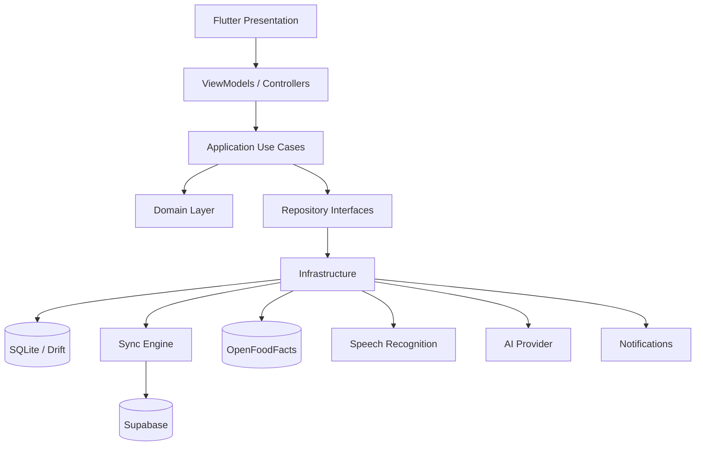
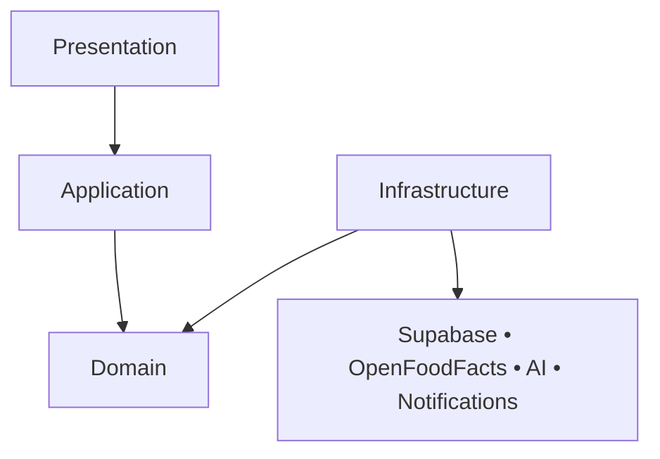
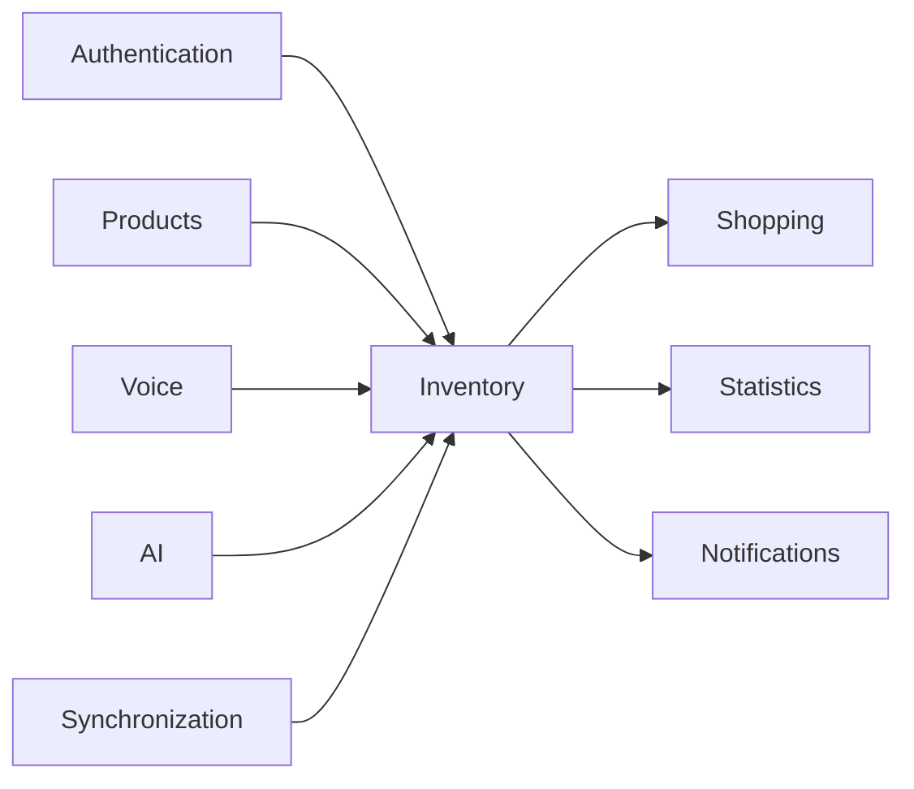
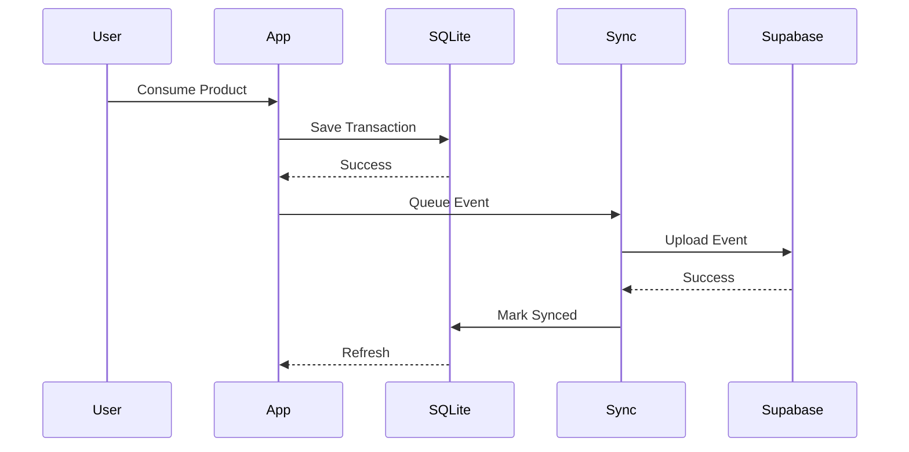

# 1. Introduction

## 1.1 Purpose

This document defines the software architecture of **Baulera**.

It describes:

- Architectural style
- Layers
- Modules
- Dependency rules
- Data flow
- Offline-first strategy
- External integrations
- Design principles

This architecture shall guide every implementation decision throughout the project.

---

# 2 Architectural Goals

The architecture has been designed to satisfy the following goals.

## AG-001 Offline First

The application shall remain fully functional without Internet connectivity.

Network availability is considered an enhancement, never a requirement.

---

## AG-002 Maintainability

The codebase shall be organized into cohesive modules with low coupling.

---

## AG-003 Testability

Business logic shall be testable independently from:

- Flutter
- SQLite
- Supabase
- REST APIs

---

## AG-004 Scalability

The architecture shall support future modules without requiring redesign.

Examples:

- OCR receipts
- Budget tracking
- Recipes
- AI recommendations
- Multiple households

---

## AG-005 Replaceable Infrastructure

Infrastructure providers shall be interchangeable.

Examples

Current

- Supabase

Future

- ASP.NET Backend
- Firebase
- Self-hosted PostgreSQL

No business logic shall depend directly on vendor SDKs.

---

## AG-006 Predictability

Business rules shall produce deterministic results.

Identical inputs shall always produce identical outputs.

---

## AG-007 Simplicity

Prefer the simplest architecture capable of satisfying all requirements.

Avoid unnecessary abstractions.

---

# 3 Architectural Principles

The following principles govern the entire solution.

---

## AP-001 Clean Architecture

Dependencies always point inward.

```
Presentation

↓

Application

↓

Domain

↓

Infrastructure
```

The Domain Layer never depends on outer layers.

---

## AP-002 Domain-Driven Design

Business concepts are modeled explicitly.

Examples

- Product
- InventoryBatch
- ShoppingItem
- InventoryMovement

Business terminology remains consistent across:

- Documentation
- Source Code
- Database
- APIs

---

## AP-003 Offline First

The local database is the primary source of truth while the application is running.

Cloud synchronization occurs asynchronously.

---

## AP-004 Event-Based Inventory

Inventory modifications generate immutable events.

Examples

- Purchase
- Consumption
- Adjustment
- Relocation

---

## AP-005 Immutable History

Historical information is never modified.

Corrections create additional records.

---

## AP-006 Repository Pattern

Persistence is accessed exclusively through repository interfaces.

Example

```
ProductRepository
```

instead of

```
SupabaseClient
```

inside business logic.

---

## AP-007 Dependency Inversion

High-level modules define interfaces.

Infrastructure implements them.

---

## AP-008 Modular Design

Features are organized by business capability.

---

# 4 High-Level Architecture

The application consists of four primary layers.

```text
┌──────────────────────────────┐
│ Presentation                 │
├──────────────────────────────┤
│ Application                  │
├──────────────────────────────┤
│ Domain                       │
├──────────────────────────────┤
│ Infrastructure               │
└──────────────────────────────┘
```

Each layer has clearly defined responsibilities.

---

# 5 Layer Responsibilities

---

## Presentation Layer

Responsible for:

- UI
- Navigation
- State Management
- User Interaction
- Themes
- Localization

Technologies

- Flutter
- Material 3

The Presentation Layer never contains business rules.

---

## Application Layer

Responsible for:

- Use Cases
- Orchestration
- Validation
- Transactions
- Permissions
- Coordination between repositories

Examples

```
ConsumeProductUseCase

RegisterPurchaseUseCase

ScanBarcodeUseCase
```

---

## Domain Layer

The heart of the application.

Contains

- Entities
- Value Objects
- Domain Services
- Domain Events
- Repository Interfaces
- Business Rules

The Domain Layer is pure Dart.

No Flutter imports are allowed.

---

## Infrastructure Layer

Responsible for technical implementation.

Contains

- Drift
- SQLite
- Supabase
- HTTP Clients
- OpenFoodFacts API
- Speech Recognition
- Push Notifications

Business logic is prohibited in Infrastructure.

---

# 6 Layer Dependencies

Dependency direction

```text
Presentation

↓

Application

↓

Domain

↑

Infrastructure
```

Allowed

Presentation → Application

Application → Domain

Infrastructure → Domain

Forbidden

Domain → Flutter

Domain → SQLite

Domain → Supabase

Application → Drift

Presentation → Supabase

---

# 7 Clean Architecture Diagram

```text
                    Flutter UI

                         │

             State Management

                         │

                 Application

          Use Cases / Commands

                         │

                    Domain

      Entities • Services • Events

                         ▲

         Repository Interfaces

                         ▲

               Infrastructure

 Drift • SQLite • Supabase • HTTP
```

---

# 8 Architectural Building Blocks

The solution consists of the following building blocks.

---

## Entities

Represent business identity.

Examples

- Product
- InventoryBatch
- ShoppingItem

---

## Value Objects

Immutable domain values.

Examples

- Barcode
- Quantity
- Presentation

---

## Domain Services

Business behavior involving multiple aggregates.

Examples

- InventoryService
- ShoppingService

---

## Repositories

Abstract persistence.

Examples

- ProductRepository
- InventoryRepository

---

## Use Cases

Represent business operations.

Examples

- RegisterPurchase
- ConsumeProduct

---

## Data Sources

Provide data.

Examples

- Local SQLite
- Supabase
- OpenFoodFacts

---

## Synchronization Engine

Coordinates local and remote data.

Runs independently of UI.

---

# 9 Architectural Constraints

The following constraints are mandatory.

### AC-001

Business rules shall never exist inside Widgets.

---

### AC-002

Business rules shall never exist inside Repositories.

---

### AC-003

Repositories shall never contain UI logic.

---

### AC-004

Infrastructure shall never know Presentation.

---

### AC-005

Presentation shall never know persistence details.

---

### AC-006

Every write operation shall pass through a Use Case.

---

### AC-007

Every Use Case shall execute inside the Application Layer.

---

### AC-008

Every business rule shall belong to the Domain Layer.

---

# 10 Layer Design

## 10.1 Presentation Layer

### Responsibilities

The Presentation Layer is responsible for:

- Rendering UI
- Receiving user input
- Navigation
- Theme management
- Localization
- State management
- Form validation (UI only)
- Displaying errors
- Loading indicators

### Responsibilities NOT Allowed

- Business rules
- Database access
- HTTP calls
- SQL
- Synchronization
- Inventory calculations

---

### Main Components

```text
Pages

↓

Widgets

↓

Controllers / ViewModels

↓

Application Use Cases
```

---

### Folder Structure

```text
presentation/

    pages/

    widgets/

    dialogs/

    navigation/

    state/

    theme/

    localization/
```

---

## 10.2 Application Layer

The Application Layer coordinates business operations.

It does not contain business rules.

Instead, it orchestrates Domain objects.

---

### Responsibilities

- Execute Use Cases
- Open transactions
- Coordinate repositories
- Authorization
- Validation requiring external data
- Emit Domain Events
- Queue synchronization events

---

### Example

```
RegisterPurchaseUseCase

↓

ProductRepository

↓

InventoryRepository

↓

ShoppingRepository

↓

SynchronizationRepository
```

---

### Folder Structure

```text
application/

    use_cases/

    commands/

    queries/

    dto/

    mappers/

    validators/
```

---

## 10.3 Domain Layer

The Domain Layer represents the business.

It is completely independent.

---

### Contains

- Entities
- Value Objects
- Domain Services
- Domain Events
- Repository Interfaces
- Business Policies

---

### Forbidden

- Flutter
- SQLite
- Supabase
- JSON
- HTTP
- Widgets
- SQL

---

### Folder Structure

```text
domain/

    entities/

    value_objects/

    repositories/

    services/

    events/

    exceptions/

    policies/
```

---

## 10.4 Infrastructure Layer

Implements technical concerns.

---

### Contains

- SQLite
- Drift
- Supabase
- REST
- Voice Recognition
- Notifications
- AI Providers

---

### Folder Structure

```text
infrastructure/

    database/

    repositories/

    api/

    auth/

    sync/

    notifications/

    speech/

    ai/
```

---

# 11 Module Architecture

The application is organized into independent business modules.

---

## Authentication Module

Responsibilities

- Login
- Logout
- Session
- User Profile

Depends on

- Supabase Auth

---

## Product Module

Responsibilities

- Product Catalog
- Categories
- Brands
- Search

---

## Inventory Module

Responsibilities

- Purchases
- Consumption
- Adjustments
- Inventory Batches
- Shelf Management

---

## Shopping Module

Responsibilities

- Shopping List
- Threshold Evaluation
- Purchase Suggestions

---

## Statistics Module

Responsibilities

- Dashboard
- Charts
- Reports

---

## Synchronization Module

Responsibilities

- Upload Queue
- Download Changes
- Conflict Resolution

---

## Voice Module

Responsibilities

- Speech Recognition
- Intent Parsing
- Command Execution

---

## AI Module

Responsibilities

- Natural Language Interpretation
- Product Suggestions
- Inventory Questions

---

## Notification Module

Responsibilities

- Expiration Alerts
- Low Stock Alerts
- Push Notifications

---

# 12 Dependency Rules

Dependencies shall always point toward the Domain.

```text
Presentation

↓

Application

↓

Domain

↑

Infrastructure
```

---

## Allowed Dependencies

| From | To |
|------|----|
| Presentation | Application |
| Application | Domain |
| Infrastructure | Domain |
| Infrastructure | External Services |

---

## Forbidden Dependencies

| From | To |
|------|----|
| Domain | Flutter |
| Domain | Drift |
| Domain | SQLite |
| Domain | Supabase |
| Domain | HTTP |
| Presentation | Database |
| Presentation | Supabase |
| Application | Flutter Widgets |

---

# 13 Package Responsibilities

## Flutter

Responsible for

- UI
- Navigation
- Material 3
- Responsive Layout

---

## Riverpod

Responsible for

- State Management
- Dependency Injection
- Reactive UI

---

## GoRouter

Responsible for

- Navigation
- Deep Links
- Route Guards

---

## Drift

Responsible for

- SQLite
- Local Queries
- Migrations
- Transactions

---

## SQLite

Responsible for

- Local Persistence

---

## Supabase

Responsible for

- Authentication
- PostgreSQL
- Storage
- Realtime
- Synchronization Backend

---

## OpenFoodFacts

Responsible for

- Product Metadata

---

## speech_to_text

Responsible for

- Speech Recognition

---

## flutter_local_notifications

Responsible for

- Local Notifications

---

## fl_chart

Responsible for

- Charts

---

# 14 Repository Pattern

Repositories abstract persistence.

---

## ProductRepository

Responsibilities

- Save Product
- Update Product
- Search Products
- Archive Product

---

## InventoryRepository

Responsibilities

- Save Batch
- Update Quantity
- Find Active Batches
- Register Inventory Movement

---

## ShoppingRepository

Responsibilities

- Create Shopping Item
- Update Shopping Item
- Complete Shopping Item

---

## AuditRepository

Responsibilities

- Save Audit Record
- Query History

---

## SynchronizationRepository

Responsibilities

- Save Sync Event
- Read Pending Events
- Mark Completed

---

## NotificationRepository

Responsibilities

- Save Notification
- Read Pending Notifications

---

# 15 Repository Implementation

Each repository has:

```text
Repository Interface

↓

Repository Implementation

↓

Local Data Source

↓

Remote Data Source
```

Example

```text
ProductRepository

↓

ProductRepositoryImpl

↓

Drift

↓

Supabase
```

The Application Layer only knows the interface.

---

# 16 DTO Strategy

The Domain never exposes database models.

Instead:

```text
Database

↓

Entity Mapper

↓

Domain Entity

↓

Use Case

↓

Presentation DTO

↓

Flutter UI
```

---

DTOs are used only for communication between layers.

Entities remain pure Domain objects.

---

# 17 Mapper Responsibilities

Every Infrastructure model has a dedicated mapper.

Examples

```text
ProductEntity

↔

ProductTable

↔

Supabase JSON
```

No Widget shall perform mapping.

---

# 18 Data Flow

This section describes how data flows through the application.

The architecture follows a unidirectional data flow.

```text
User

↓

Flutter Widget

↓

ViewModel / Controller

↓

Use Case

↓

Domain

↓

Repository

↓

Local Database (Drift)

↓

Synchronization Queue

↓

Supabase
```

Reads always originate from the local database.

Writes always update the local database first.

Cloud synchronization occurs asynchronously.

---

## Read Flow

```text
SQLite

↓

Repository

↓

Use Case

↓

ViewModel

↓

UI
```

Characteristics

- Offline
- Fast
- Deterministic
- Cached
- No network dependency

---

## Write Flow

```text
User Action

↓

Use Case

↓

Business Validation

↓

Repository

↓

SQLite Transaction

↓

Audit Record

↓

Sync Event

↓

UI Refresh
```

Only after the local transaction completes successfully is a synchronization event created.

---

# 19 CQRS Strategy

Baulera adopts a lightweight Command Query Responsibility Segregation (CQRS) pattern.

The goal is organizational clarity rather than physical separation.

---

## Commands

Commands modify state.

Examples

- RegisterPurchase
- ConsumeProduct
- AdjustInventory
- ArchiveProduct
- CompleteShoppingItem
- UpdateThreshold

Characteristics

- Produce side effects
- Generate Audit Records
- Generate Synchronization Events
- Execute inside transactions

---

## Queries

Queries never modify state.

Examples

- SearchProducts
- GetDashboard
- GetStatistics
- GetProductDetails
- GetShoppingList
- GetExpiringProducts

Characteristics

- Read-only
- Executed against SQLite
- Fully offline

---

# 20 Use Case Lifecycle

Every write operation follows the same execution pipeline.

```text
Request

↓

Validation

↓

Load Domain Objects

↓

Business Rules

↓

Repository Transaction

↓

Audit

↓

Synchronization Queue

↓

Result
```

---

## Validation Stages

### UI Validation

Examples

- Required fields
- Numeric input
- Date format

---

### Application Validation

Examples

- User permissions
- Product existence
- Shelf existence

---

### Domain Validation

Examples

- Quantity cannot be negative
- Threshold cannot exceed target quantity
- Inventory cannot become negative

---

# 21 Dependency Injection

Dependency Injection is managed using Riverpod.

The application depends exclusively on abstractions.

---

## Dependency Graph

```text
Widget

↓

ViewModel

↓

Use Case

↓

Repository Interface

↓

Repository Implementation

↓

Data Sources
```

---

## Example

```text
ConsumeProductPage

↓

ConsumeProductController

↓

ConsumeProductUseCase

↓

InventoryRepository

↓

InventoryRepositoryImpl
```

No class instantiates its own dependencies.

All dependencies are injected.

---

# 22 Repository Composition

Each Repository Implementation coordinates multiple data sources.

```text
Repository

↓

Local Data Source

↓

Remote Data Source

↓

Synchronization Queue
```

---

## Product Repository

Coordinates

- Drift
- Supabase
- OpenFoodFacts (read-only)

---

## Inventory Repository

Coordinates

- Drift
- Supabase

---

## Shopping Repository

Coordinates

- Drift
- Supabase

---

# 23 Transaction Strategy

Every business operation executes inside a local SQLite transaction.

Example

```text
Begin Transaction

↓

Update Inventory

↓

Create Movement

↓

Create Audit

↓

Create Sync Event

↓

Commit
```

If any step fails:

```text
Rollback
```

No partial updates are permitted.

---

# 24 Event-Driven Architecture

Although not event-sourced, the application emits Domain Events.

Examples

```text
ProductCreated

InventoryConsumed

InventoryPurchased

InventoryAdjusted

ThresholdReached

ProductArchived

ShoppingItemCompleted
```

Domain Events are immutable.

---

## Event Consumers

Events may trigger:

- Audit creation
- Shopping List updates
- Notifications
- Synchronization
- Statistics refresh

---

# 25 Aggregate Communication

Aggregates never communicate directly.

All interactions occur through Use Cases or Domain Services.

Example

```text
InventoryBatch

↓

InventoryService

↓

ShoppingService

↓

ShoppingItem
```

This avoids tight coupling between aggregates.

---

# 26 Error Handling Strategy

Errors are classified into four categories.

---

## Validation Errors

Examples

- Required field missing
- Invalid quantity
- Invalid expiration date

Displayed directly to the user.

---

## Business Errors

Examples

- Insufficient stock
- Duplicate barcode
- Invalid threshold

Returned by the Domain Layer.

---

## Infrastructure Errors

Examples

- SQLite unavailable
- HTTP timeout
- API unavailable

Handled by Infrastructure.

The application remains usable whenever possible.

---

## Synchronization Errors

Examples

- Network unavailable
- Authentication expired
- Conflict detected

Stored for retry.

Never block local operations.

---

# 27 Logging Strategy

Logging is structured by layer.

---

## Presentation

- Navigation
- User interactions
- UI exceptions

---

## Application

- Use Case execution
- Validation failures
- Performance timing

---

## Domain

Business events only.

No technical logging.

---

## Infrastructure

- HTTP requests
- Database operations
- Synchronization
- Push notifications

---

## Production Logging

Sensitive information shall never be logged.

Examples

Do not log:

- Passwords
- Authentication tokens
- Email verification codes

---

# 28 Performance Strategy

The architecture prioritizes responsiveness.

Guidelines

- Read from SQLite only.
- Avoid synchronous network calls during UI interactions.
- Lazy-load heavy screens.
- Paginate large result sets.
- Use indexes for searchable fields.
- Keep UI rendering independent from synchronization.

---

## Performance Targets

| Operation | Target |
|-----------|-------:|
| Open Dashboard | < 300 ms |
| Search Products | < 100 ms |
| Open Product | < 150 ms |
| Register Purchase | < 300 ms |
| Consume Product | < 300 ms |
| Synchronization Trigger | < 1 s |
| Barcode Scan Processing | < 2 s (online) |

---

# 29 Offline-First Architecture

Offline capability is a core architectural principle.

The application must remain fully usable without Internet access.

The cloud is used for synchronization only.

---

## Offline Principles

- Reads always come from SQLite.
- Writes always update SQLite first.
- Synchronization is asynchronous.
- External services are optional.
- UI never waits for the network.

---

## Local Source of Truth

During runtime, the authoritative data source is:

```text
SQLite (Drift)
```

Supabase acts as the synchronization backend, not as the live data source.

---

## Offline Write Flow

```text
User Action

↓

Use Case

↓

SQLite Transaction

↓

Audit Record

↓

Sync Event

↓

UI Updated

↓

Wait for Internet
```

The user immediately sees the result.

---

## Offline Read Flow

```text
SQLite

↓

Repository

↓

Use Case

↓

UI
```

No network access is required.

---

# 30 Synchronization Architecture

Synchronization runs independently from the UI.

It is implemented as a background service.

---

## Synchronization Pipeline

```text
Pending Events

↓

Connectivity Check

↓

Authentication Check

↓

Upload Events

↓

Download Changes

↓

Conflict Resolution

↓

Mark Events Completed

↓

Realtime Notification
```

---

## Synchronization Triggers

Synchronization starts when:

- Internet becomes available.
- User logs in.
- Application resumes.
- Pull-to-refresh is executed.
- Periodic synchronization timer fires.
- Realtime event received.

---

# 31 Synchronization Queue

Every write operation creates a Sync Event.

Example

```text
Register Purchase

↓

Inventory Updated

↓

Sync Event Created
```

The queue is stored locally.

---

## Queue Fields

- UUID
- Entity Type
- Entity ID
- Operation
- Payload
- Timestamp
- Retry Count
- Status

---

## Status Values

```text
Pending

Uploading

Completed

Failed

Conflict
```

---

## Queue Rules

Events are processed:

- FIFO
- Inside transactions
- Idempotently

---

# 32 Conflict Resolution

Conflicts occur when two devices modify the same entity before synchronization.

---

## Default Strategy

```
Last Write Wins
```

Based on server timestamps.

---

## Examples

### Product Metadata

Latest update replaces previous values.

---

### Inventory Quantity

The newest successful transaction becomes authoritative.

Inventory Movements remain preserved.

---

### Shopping List

Automatically recalculated after synchronization.

---

### Audit Records

Never conflict.

Always appended.

---

## Future Strategies

Potential future enhancements:

- Field-level merge
- Manual merge UI
- Operational Transformation
- CRDT

---

# 33 Realtime Updates

Supabase Realtime notifies connected devices of remote changes.

---

## Flow

```text
Device A

↓

SQLite

↓

Supabase

↓

Realtime Event

↓

Device B

↓

Synchronization

↓

SQLite Updated

↓

UI Refresh
```

---

## Benefits

- Near real-time updates
- Reduced polling
- Consistent household state

---

# 34 Connectivity Management

The application continuously monitors network status.

---

## States

```text
Online

Offline

Connecting

Synchronizing
```

---

## UI Behavior

### Offline

- Full functionality available.
- Offline indicator displayed.
- Pending changes badge shown.

---

### Synchronizing

- Small status indicator.
- No blocking dialogs.

---

### Online

Indicator hidden.

---

# 35 Background Processing

Background services are responsible for:

- Synchronization
- Notification scheduling
- Expiration checks
- Retry failed uploads

---

## Execution Principles

- Battery friendly
- Interruptible
- Restartable
- Idempotent

---

# 36 Retry Strategy

Temporary failures are retried automatically.

---

## Retry Delays

Attempt 1

Immediately

Attempt 2

30 seconds

Attempt 3

2 minutes

Attempt 4

10 minutes

Attempt 5

30 minutes

Further attempts

Exponential Backoff

---

## Permanent Failures

Examples

- Deleted account
- Invalid credentials
- Malformed payload

Marked as:

```
Failed
```

Require user intervention.

---

# 37 Caching Strategy

SQLite functions as the primary cache.

No secondary cache layer is required.

---

## Cached Data

- Products
- Inventory
- Shopping List
- Categories
- Brands
- Shelves
- Statistics
- Audit Records

---

## Non-Cached Data

- OpenFoodFacts responses
- AI responses

These may optionally be cached in future versions.

---

# 38 Data Freshness

Every synchronized entity contains metadata.

Fields

- CreatedAt
- UpdatedAt
- LastSyncedAt
- Version
- SyncStatus

---

## Freshness Rules

Local modifications always take precedence until synchronization completes.

After successful synchronization:

```
SyncStatus = Synced
```

---

# 39 Synchronization Performance

Goals

| Operation | Target |
|-----------|-------:|
| Queue Creation | < 10 ms |
| Upload Event | < 200 ms |
| Conflict Resolution | < 100 ms |
| Local Commit | < 50 ms |
| Queue Processing | Background |
| UI Blocking | Never |

---

# 40 Architectural Decisions

## AD-001

SQLite is always the runtime database.

---

## AD-002

Supabase is never queried directly by the UI.

---

## AD-003

Every write operation generates exactly one synchronization event.

---

## AD-004

Synchronization is eventually consistent.

Immediate consistency is not required.

---

## AD-005

Synchronization failures never prevent local usage.

---

## AD-006

Conflict resolution is deterministic.

---

## AD-007

Synchronization is transparent to the user.

---

## AD-008

The application remains fully functional even if Supabase is unavailable.

---

# 41 External Integrations

The application integrates with external services exclusively through the Infrastructure Layer.

No external SDK or HTTP client shall be referenced from the Domain or Presentation layers.

---

## External Services

| Service | Purpose |
|----------|---------|
| Supabase | Authentication, PostgreSQL, Realtime, Storage |
| OpenFoodFacts | Product metadata |
| speech_to_text | Voice recognition |
| flutter_local_notifications | Local notifications |
| Firebase Cloud Messaging (Future) | Push notifications |
| AI Provider (Future) | Natural language interpretation |

---

## Integration Principles

- Optional whenever possible.
- Replaceable.
- Isolated behind interfaces.
- Failure tolerant.
- Independently testable.

---

# 42 Supabase Architecture

Supabase is responsible for cloud synchronization only.

---

## Responsibilities

- Authentication
- PostgreSQL
- Realtime
- File Storage
- Row Level Security (RLS)

---

## Not Responsible For

- Business rules
- Inventory calculations
- Shopping recommendations
- Threshold evaluation

These responsibilities remain inside the Domain Layer.

---

## Access Flow

```text
Use Case

↓

Repository

↓

Supabase Gateway

↓

REST / Realtime

↓

Supabase
```

The UI never communicates directly with Supabase.

---

# 43 OpenFoodFacts Integration

OpenFoodFacts enriches Products with metadata.

---

## Request Flow

```text
Barcode

↓

Local Catalog

↓

Found?

↓

Yes → Return Product

↓

No

↓

OpenFoodFacts

↓

Metadata

↓

User Confirmation

↓

Product Created
```

---

## Imported Information

- Product Name
- Brand
- Barcode
- Image
- Categories
- Packaging (when available)

---

## Design Decisions

- Local data always has priority.
- Imported values are editable.
- OpenFoodFacts is read-only.

---

# 44 Voice Architecture

Voice functionality consists of three layers.

```text
Speech Recognition

↓

Intent Parser

↓

Application Use Case
```

---

## Speech Recognition

Responsibilities

- Capture audio
- Convert speech to text

Technology

```
speech_to_text
```

---

## Intent Parser

Responsibilities

- Detect action
- Identify Product
- Extract quantity
- Extract location
- Detect confidence

---

## Use Cases Supported

- Register Purchase
- Consume Product
- Search Product
- Move Product
- Update Threshold

---

## Confirmation Rule

Voice commands never execute automatically.

The interpreted command is always displayed for confirmation.

---

# 45 AI Architecture

AI is an optional enhancement layer.

The application remains fully functional without it.

---

## Responsibilities

- Interpret complex sentences
- Answer inventory questions
- Improve search
- Suggest products

---

## Invocation Flow

```text
Speech

↓

Local Parser

↓

Confidence High?

↓

Yes → Execute

↓

No

↓

AI Provider

↓

Structured Intent

↓

User Confirmation

↓

Execute
```

---

## AI Design Principles

- Optional
- Deterministic fallback
- Never modifies inventory without confirmation
- Replaceable provider

---

# 46 Notification Architecture

Notifications are generated locally.

---

## Notification Types

### Low Stock

Triggered by threshold evaluation.

---

### Expiration

Triggered by scheduled daily evaluation.

---

### Synchronization

Optional future enhancement.

---

## Notification Flow

```text
Inventory Updated

↓

Business Rule

↓

Notification Created

↓

Scheduler

↓

Device Notification
```

---

## Future Push Notifications

Future versions may notify all Household members through cloud messaging.

---

# 47 Security Architecture

Security is implemented across multiple layers.

---

## Authentication

Supabase Authentication.

---

## Authorization

Role-based authorization.

Current Version

```
Administrator
```

Future

```
Viewer

Editor

Administrator
```

---

## Data Protection

Sensitive information stored securely.

Examples

- Authentication Tokens
- Refresh Tokens

---

## Secure Storage

Flutter Secure Storage is used for:

- JWT
- Refresh Token
- Encryption Keys (future)

---

## Transport Security

All communication uses HTTPS.

TLS 1.2 or newer.

---

# 48 Observability

The architecture provides visibility into application behavior.

---

## Metrics

- Synchronization duration
- Queue size
- Failed synchronizations
- Barcode scan success
- Voice recognition accuracy

---

## Logs

Structured logging.

Categories

- UI
- Application
- Domain
- Infrastructure
- Synchronization

---

## Crash Reporting

Future versions may integrate

- Firebase Crashlytics
- Sentry

---

# 49 Extensibility

The architecture is designed for future expansion.

---

## Planned Modules

- OCR Receipt Import
- Budget Management
- Pantry Value
- Meal Planning
- Recipe Suggestions
- Product Recommendations
- Multiple Households
- Shared Shopping Trips

---

## Extension Strategy

Every new feature shall be implemented as an independent module following the same architecture.

No existing module shall require modification to introduce a new business capability whenever reasonably possible.

---

# 50 Architectural Guidelines

## AG-001

Business rules belong exclusively to the Domain Layer.

---

## AG-002

Every write operation executes through a Use Case.

---

## AG-003

Repositories abstract all persistence technologies.

---

## AG-004

Infrastructure is replaceable.

---

## AG-005

Offline behavior has priority over online optimization.

---

## AG-006

The UI must remain responsive during synchronization.

---

## AG-007

Every business modification is auditable.

---

## AG-008

The architecture shall favor readability over unnecessary abstraction.

---

## AG-009

All modules shall follow the same dependency rules.

---

## AG-010

External integrations shall degrade gracefully when unavailable.

---

# 51 Complete Architecture Diagram



---

# 52 Layer Dependency Diagram



---

# 53 Module Dependency Diagram



---

# 54 Request Lifecycle

```text
User

↓

Flutter Widget

↓

ViewModel

↓

Use Case

↓

Business Validation

↓

Repository

↓

SQLite Transaction

↓

Audit

↓

Synchronization Queue

↓

UI Updated

↓

Background Synchronization

↓

Supabase
```

---

# 55 Read Lifecycle

```text
SQLite

↓

Repository

↓

Query Use Case

↓

ViewModel

↓

Flutter Widget
```

Reads never require Internet access.

---

# 56 Write Lifecycle

```text
User Action

↓

Command Use Case

↓

Domain Validation

↓

SQLite Transaction

↓

Inventory Movement

↓

Audit Record

↓

Synchronization Event

↓

Commit

↓

Refresh UI
```

---

# 57 Synchronization Lifecycle



---

# 58 Architectural Decision Records (ADR)

| ADR | Decision | Status |
|------|----------|--------|
| ADR-001 | Flutter selected as the mobile framework | Accepted |
| ADR-002 | Drift selected as local persistence | Accepted |
| ADR-003 | SQLite is the runtime source of truth | Accepted |
| ADR-004 | Supabase selected as cloud backend | Accepted |
| ADR-005 | Offline-first architecture | Accepted |
| ADR-006 | Clean Architecture | Accepted |
| ADR-007 | Repository Pattern | Accepted |
| ADR-008 | Domain-Driven Design | Accepted |
| ADR-009 | Riverpod for state management | Accepted |
| ADR-010 | GoRouter for navigation | Accepted |
| ADR-011 | Material 3 UI | Accepted |
| ADR-012 | Automatic Shopping List generation | Accepted |
| ADR-013 | Threshold-based inventory alerts | Accepted |
| ADR-014 | Product Catalog independent from inventory | Accepted |
| ADR-015 | Inventory managed by batches | Accepted |
| ADR-016 | Immutable audit history | Accepted |
| ADR-017 | Event-based synchronization queue | Accepted |
| ADR-018 | Last Write Wins conflict resolution | Accepted |
| ADR-019 | Voice commands require confirmation | Accepted |
| ADR-020 | AI is optional and replaceable | Accepted |

---

# 59 Architecture Quality Attributes

| Attribute | Strategy |
|-----------|----------|
| Availability | Offline-first |
| Maintainability | Modular architecture |
| Testability | Pure Domain Layer + dependency inversion |
| Scalability | Independent business modules |
| Performance | Local database as runtime source |
| Reliability | Transactional writes |
| Security | Supabase Auth + RLS + Secure Storage |
| Portability | Flutter + PostgreSQL |
| Extensibility | Clean Architecture |
| Observability | Structured logging and audit records |

---

# 60 Architectural Constraints

## Mandatory Constraints

- The Domain Layer shall not depend on Flutter.
- The Domain Layer shall not depend on Drift.
- The Domain Layer shall not depend on Supabase.
- Every business operation shall be implemented as a Use Case.
- Every persistent modification shall generate an Audit Record.
- Every persistent modification shall create a Synchronization Event.
- Reads shall originate from SQLite.
- Synchronization shall execute in the background.
- Business rules shall never be implemented inside Widgets.
- Repository implementations shall remain replaceable.

---

## Technology Constraints

| Concern | Technology |
|----------|------------|
| UI | Flutter |
| Language | Dart |
| Local Database | SQLite |
| ORM | Drift |
| Cloud Database | PostgreSQL |
| Backend | Supabase |
| Authentication | Supabase Auth |
| Realtime | Supabase Realtime |
| Local Notifications | flutter_local_notifications |
| Voice Recognition | speech_to_text |
| Charts | fl_chart |
| Navigation | GoRouter |
| State Management | Riverpod |

---

# 61 Traceability

| Architecture Section | Related Documents |
|----------------------|-------------------|
| Vision | 01-vision.md |
| Functional Requirements | 02-functional-requirements.md |
| Non-Functional Requirements | 03-non-functional-requirements.md |
| Domain Model | 04-domain-model.md |
| Use Cases | 05-use-cases.md |
| Project Structure | 07-project-structure.md |
| Database Design | 08-database-design.md |
| Supabase | 09-supabase.md |
| Offline First | 10-offline-first.md |
| Synchronization | 11-sync-engine.md |
| Security | 12-security.md |
| Navigation | 13-navigation.md |
| UI/UX | 14-ui-ux.md |
| Design System | 15-design-system.md |

---

# 62 Architecture Summary

## Architectural Style

- Clean Architecture
- Domain-Driven Design (DDD)
- Repository Pattern
- Offline-First
- Event-Oriented Inventory
- Modular Feature-Based Structure

---

## Core Technologies

| Layer | Technology |
|-------|------------|
| Mobile | Flutter |
| Language | Dart |
| Local Storage | SQLite + Drift |
| Cloud | Supabase |
| Authentication | Supabase Auth |
| Database | PostgreSQL |
| State Management | Riverpod |
| Navigation | GoRouter |
| Charts | fl_chart |
| Voice | speech_to_text |
| Barcode | mobile_scanner |
| Notifications | flutter_local_notifications |

---

## Core Principles

1. SQLite is the runtime source of truth.
2. Supabase synchronizes devices, never drives the UI.
3. Every business action passes through a Use Case.
4. Business logic resides exclusively in the Domain Layer.
5. Every modification is transactional, auditable and synchronizable.
6. The application remains fully functional offline.
7. External services enrich the experience but never block core functionality.
8. Infrastructure is replaceable without affecting business logic.
9. The architecture favors simplicity, readability and long-term maintainability.
10. Every subsequent document in this repository derives from the architectural decisions defined here.

---
