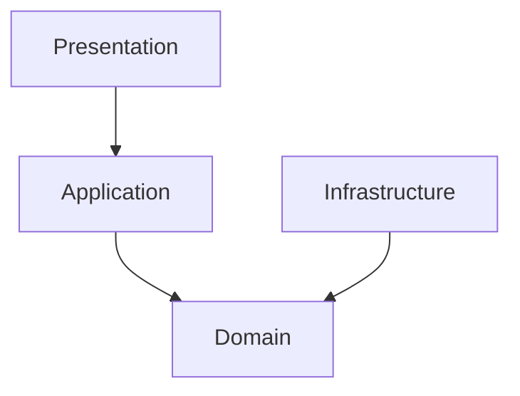

# 1. Purpose

This document defines the physical structure of the Baulera repository.

Its objectives are:

- Standardize project organization.
- Ensure consistency across all modules.
- Minimize coupling.
- Simplify navigation.
- Support long-term maintainability.
- Keep the structure aligned with the architecture defined in `06-architecture.md`.

Every source file shall have a single, well-defined responsibility.

---

# 2 Repository Structure

The repository is organized as follows:

```text
baulera/

│
├── .github/
├── .vscode/
├── android/
├── ios/
├── assets/
├── docs/
├── lib/
├── scripts/
├── test/
├── integration_test/
├── tool/
├── build/
├── pubspec.yaml
├── analysis_options.yaml
├── melos.yaml (future)
├── README.md
└── CHANGELOG.md
```

---

# 3 Top-Level Directories

## android/

Native Android project generated by Flutter.

Contains:

- Gradle
- Kotlin
- Android Manifest
- Icons
- Permissions

No business logic.

---

## ios/

Native iOS project.

Contains:

- Swift
- Xcode project
- Info.plist
- Permissions

No business logic.

---

## assets/

Static application resources.

Example:

```text
assets/

    images/

    icons/

    fonts/

    animations/

    illustrations/

    json/

    sounds/
```

---

## docs/

Project documentation.

Contains:

```text
01-vision.md

02-functional-requirements.md

...

27-decision-log.md
```

---

## scripts/

Development scripts.

Examples

```text
generate_icons.ps1

clean.ps1

build_release.ps1

run_tests.ps1
```

---

## tool/

Developer utilities.

Examples

- Code generators
- Migration helpers
- Database exporters

---

## test/

Unit and widget tests.

---

## integration_test/

End-to-end tests.

---

# 4 lib Structure

The entire application source code resides inside:

```text
lib/
```

Top-level organization:

```text
lib/

    app/

    core/

    features/

    shared/

    infrastructure/

    main.dart
```

---

# 5 app/

Contains application bootstrap code.

```text
app/

    app.dart

    router.dart

    providers.dart

    theme.dart

    localization.dart

    bootstrap.dart
```

Responsibilities

- App initialization
- Global providers
- Navigation
- Theme
- Localization

Contains no business logic.

---

# 6 core/

Contains reusable components shared across the application.

```text
core/

    constants/

    errors/

    exceptions/

    extensions/

    utilities/

    services/

    logging/

    configuration/
```

---

## constants/

Application-wide constants.

Examples

```text
app_constants.dart

route_constants.dart

ui_constants.dart
```

---

## errors/

Shared error models.

---

## exceptions/

Base exception hierarchy.

---

## extensions/

Dart extension methods.

Example

```dart
String.capitalize()

DateTime.startOfDay()
```

---

## utilities/

Reusable helper classes.

Examples

- Date utilities
- Number formatting
- Validators

---

## services/

Framework-independent reusable services.

Examples

- ConnectivityService
- ClockService
- UUIDService

---

## logging/

Logging infrastructure.

---

## configuration/

Runtime configuration.

Examples

- Environment
- Feature flags

---

# 7 shared/

Contains reusable UI components.

```text
shared/

    widgets/

    dialogs/

    components/

    layouts/

    forms/
```

---

## widgets/

Reusable widgets.

Examples

```text
PrimaryButton

SecondaryButton

LoadingIndicator

SearchField

EmptyState
```

---

## dialogs/

Reusable dialogs.

Examples

```text
ConfirmationDialog

DeleteDialog

ErrorDialog
```

---

## layouts/

Shared layouts.

Examples

```text
ResponsiveScaffold

TwoPaneLayout
```

---

## forms/

Reusable form controls.

Examples

```text
QuantityInput

BarcodeInput

ExpirationDateField
```

---

# 8 features/

Contains all business capabilities.

Each feature is isolated.

```text
features/

    authentication/

    products/

    inventory/

    shopping/

    statistics/

    notifications/

    settings/

    voice/
```

Every feature follows exactly the same internal structure.

---

# 9 Feature Template

Example

```text
products/

    presentation/

    application/

    domain/

    infrastructure/
```

Each layer mirrors the Clean Architecture defined previously.

---

## Benefits

- High cohesion
- Low coupling
- Easier testing
- Easier navigation
- Predictable structure
- Feature independence

---

# 10 Naming Principles

Directories use:

```
snake_case
```

Examples

```text
shopping_list

inventory

product_search
```

Files also use:

```
snake_case
```

Examples

```text
consume_product_use_case.dart

shopping_repository.dart

product_entity.dart
```

Classes use:

```
PascalCase
```

Examples

```dart
Product

InventoryBatch

RegisterPurchaseUseCase
```

Variables and methods use:

```
camelCase
```

Examples

```dart
currentStock

consumeProduct()

calculateThreshold()
```

---

# 11 Feature Internal Structure

Every feature follows exactly the same internal organization.

Example:

```text
features/

    inventory/

        presentation/

        application/

        domain/

        infrastructure/
```

This consistency allows developers to immediately understand any feature.

---

# 12 Presentation Layer Structure

```text
presentation/

    pages/

    widgets/

    controllers/

    providers/

    dialogs/

    state/

    navigation/
```

---

## pages/

Contains complete application screens.

Examples

```text
inventory_page.dart

shopping_list_page.dart

product_detail_page.dart
```

A page represents an entire screen.

---

## widgets/

Feature-specific reusable widgets.

Examples

```text
product_card.dart

inventory_tile.dart

expiration_badge.dart
```

Widgets shared between multiple features belong in:

```
shared/widgets
```

---

## controllers/

Presentation logic.

Responsibilities

- Call Use Cases
- Manage UI state
- Handle loading
- Handle errors

Controllers never access repositories directly.

---

## providers/

Riverpod providers.

Responsibilities

- Dependency injection
- Controller creation
- Shared state

---

## dialogs/

Feature dialogs.

Examples

```text
consume_product_dialog.dart

purchase_dialog.dart
```

---

## state/

UI state objects.

Examples

```text
inventory_state.dart

shopping_state.dart
```

---

## navigation/

Feature-specific routes.

---

# 13 Application Layer Structure

```text
application/

    use_cases/

    commands/

    queries/

    dto/

    validators/

    mappers/
```

---

## use_cases/

Business operations.

Examples

```text
register_purchase_use_case.dart

consume_product_use_case.dart

adjust_inventory_use_case.dart
```

Every write operation belongs here.

---

## commands/

Optional separation for write operations.

Examples

```text
create_product_command.dart

archive_product_command.dart
```

---

## queries/

Read operations.

Examples

```text
search_products_query.dart

dashboard_query.dart

shopping_list_query.dart
```

---

## dto/

Application DTOs.

Examples

```text
product_dto.dart

inventory_summary_dto.dart
```

DTOs never cross into the Domain layer.

---

## validators/

Application validations.

Examples

- Authorization
- Permissions
- Input consistency

---

## mappers/

Application ↔ Presentation transformations.

---

# 14 Domain Layer Structure

```text
domain/

    entities/

    value_objects/

    repositories/

    services/

    events/

    policies/

    exceptions/
```

---

## entities/

Business identity.

Examples

```text
product.dart

inventory_batch.dart

shopping_item.dart
```

---

## value_objects/

Immutable values.

Examples

```text
barcode.dart

presentation.dart

quantity.dart
```

---

## repositories/

Repository interfaces only.

Examples

```text
product_repository.dart

inventory_repository.dart
```

No implementation.

---

## services/

Domain Services.

Examples

```text
inventory_service.dart

shopping_service.dart
```

---

## events/

Domain Events.

Examples

```text
product_created.dart

inventory_consumed.dart

threshold_reached.dart
```

---

## policies/

Business policies.

Examples

```text
expiration_policy.dart

threshold_policy.dart
```

---

## exceptions/

Business exceptions.

Examples

```text
insufficient_stock_exception.dart

duplicate_barcode_exception.dart
```

---

# 15 Infrastructure Layer Structure

```text
infrastructure/

    repositories/

    database/

    datasource/

    api/

    mapper/

    models/
```

---

## repositories/

Repository implementations.

Examples

```text
product_repository_impl.dart

inventory_repository_impl.dart
```

---

## database/

Drift configuration.

Examples

```text
database.dart

tables/

dao/

migrations/
```

---

## datasource/

Concrete data providers.

```text
local/

remote/
```

---

### local/

SQLite access.

---

### remote/

Supabase access.

---

## api/

External HTTP services.

Examples

```text
openfoodfacts_api.dart

ai_api.dart
```

---

## mapper/

Infrastructure mapping.

Examples

```text
product_mapper.dart

inventory_mapper.dart
```

---

## models/

Infrastructure models.

Examples

```text
product_table.dart

supabase_product.dart
```

---

# 16 Shared Conventions

Every feature should expose only its public API.

Example

```text
products/

    product.dart
```

Internals remain private.

---

# 17 Imports

Preferred order

```dart
Dart SDK

↓

Flutter

↓

External Packages

↓

Core

↓

Shared

↓

Feature

↓

Relative Imports
```

---

Example

```dart
import 'dart:async';

import 'package:flutter/material.dart';
import 'package:flutter_riverpod/flutter_riverpod.dart';

import '../../../core/errors/app_error.dart';
```

---

# 18 File Size Guidelines

Recommended limits

| File Type | Maximum |
|-----------|---------:|
| Widget | 250 lines |
| Use Case | 200 lines |
| Entity | 150 lines |
| Repository | 250 lines |
| Controller | 250 lines |
| Mapper | 150 lines |

Large files should be split by responsibility.

---

# 19 Class Responsibilities

Each class should have one responsibility.

Examples

Good

```
ProductMapper
```

Bad

```
ProductMapperAndValidator
```

Good

```
InventoryService
```

Bad

```
InventoryServiceWithDatabase
```

---

# 20 Dependency Rules

Within a feature:

```text
Presentation

↓

Application

↓

Domain

↑

Infrastructure
```

Cross-feature communication occurs only through:

- Public Use Cases
- Repository interfaces
- Shared abstractions

Direct access to another feature's internal implementation is prohibited.

---

# 21 Assets Structure

All static resources are stored under the `assets/` directory.

```text
assets/

    images/

    icons/

    illustrations/

    animations/

    fonts/

    sounds/

    json/

    translations/
```

---

## images/

Contains raster images.

Examples

```text
logo.png

empty_inventory.png

shopping_placeholder.jpg
```

---

## icons/

Custom application icons.

Examples

```text
inventory.svg

shopping.svg

barcode.svg
```

Material Icons should be preferred whenever possible.

---

## illustrations/

Illustrations used for empty states and onboarding.

Examples

```text
empty_shopping.svg

offline.svg

success.svg
```

---

## animations/

Lottie or Rive animations.

Examples

```text
loading.json

success.json

syncing.json
```

Animations should remain lightweight.

---

## fonts/

Custom fonts.

Example

```text
Inter/

Roboto/
```

The project should use a single primary font family.

---

## sounds/

Optional UI sounds.

Examples

```text
scan_success.mp3

notification.mp3
```

Used sparingly.

---

## json/

Static JSON resources.

Examples

```text
sample_products.json

mock_inventory.json
```

---

## translations/

Localization files.

Examples

```text
en.arb

es.arb
```

---

# 22 Localization Structure

Localization is centralized.

```text
lib/

    app/

        localization/

            app_localizations.dart

            l10n.dart
```

Translation resources reside in:

```text
assets/translations/
```

---

## Supported Languages

Initial version

- English
- Spanish

Future versions can add:

- Portuguese
- Italian
- French

---

## Localization Rules

- Never hardcode UI strings.
- Use translation keys.
- Dates and numbers follow locale formatting.

---

# 23 Theme Structure

```text
app/

    theme/

        app_theme.dart

        light_theme.dart

        dark_theme.dart

        colors.dart

        typography.dart

        spacing.dart

        radius.dart
```

---

## Theme Responsibilities

- Colors
- Typography
- Elevation
- Shapes
- Spacing
- Material 3 customization

Widgets shall never define hardcoded colors.

---

# 24 Test Structure

Tests mirror the source code organization.

```text
test/

    unit/

    widget/

    integration/

    mocks/

    fixtures/

    helpers/
```

---

## unit/

Pure Dart tests.

Examples

```text
inventory_service_test.dart

shopping_policy_test.dart
```

---

## widget/

Flutter widget tests.

Examples

```text
product_card_test.dart

dashboard_page_test.dart
```

---

## integration/

End-to-end application flows.

Examples

```text
consume_inventory_test.dart

register_purchase_test.dart
```

---

## mocks/

Mock implementations.

Examples

```text
mock_product_repository.dart

mock_inventory_repository.dart
```

---

## fixtures/

Static test data.

Examples

```text
product_fixture.json

inventory_fixture.json
```

---

## helpers/

Reusable test utilities.

---

# 25 Generated Code

Generated files are separated from handwritten code whenever possible.

Examples

```text
*.g.dart

*.freezed.dart

database.g.dart
```

Rules

- Never edit generated files manually.
- Regenerate through build_runner.

---

# 26 Scripts

Development scripts reside under:

```text
scripts/
```

Examples

```text
build_release.ps1

run_tests.ps1

generate_icons.ps1

clean.ps1

format.ps1

analyze.ps1
```

Every repetitive developer task should be scriptable.

---

# 27 Configuration Files

Repository root contains:

```text
pubspec.yaml

analysis_options.yaml

README.md

CHANGELOG.md
```

Optional future additions

```text
melos.yaml

lefthook.yml

dart_test.yaml
```

---

# 28 Environment Configuration

Configuration is centralized.

```text
lib/

core/

configuration/
```

Examples

```text
environment.dart

feature_flags.dart

build_config.dart
```

No feature shall contain environment-specific constants.

---

# 29 Logging Structure

```text
core/

logging/

    logger.dart

    log_level.dart

    log_formatter.dart
```

Logging implementation can be replaced without affecting business logic.

---

# 30 Documentation Structure

All documentation resides in:

```text
docs/
```

Structure

```text
01-vision.md

02-functional-requirements.md

03-non-functional-requirements.md

...

27-decision-log.md
```

Documentation is version-controlled together with the source code.

Every architectural change should update the corresponding document.

---

# 31 Repository Tree

Complete repository layout.

```text
baulera/

├── .github/
│   ├── workflows/
│   └── ISSUE_TEMPLATE/
│
├── android/
├── ios/
│
├── assets/
│   ├── animations/
│   ├── fonts/
│   ├── icons/
│   ├── illustrations/
│   ├── images/
│   ├── json/
│   ├── sounds/
│   └── translations/
│
├── docs/
│   ├── 01-vision.md
│   ├── 02-functional-requirements.md
│   ├── ...
│   └── 27-decision-log.md
│
├── lib/
│   ├── app/
│   ├── core/
│   ├── shared/
│   ├── features/
│   ├── infrastructure/
│   └── main.dart
│
├── scripts/
├── test/
├── integration_test/
├── tool/
│
├── README.md
├── CHANGELOG.md
├── analysis_options.yaml
└── pubspec.yaml
```

---

# 32 Feature Tree

Every feature follows the exact same structure.

```text
feature/

├── presentation/
│
│   ├── controllers/
│   ├── dialogs/
│   ├── navigation/
│   ├── pages/
│   ├── providers/
│   ├── state/
│   └── widgets/
│
├── application/
│
│   ├── commands/
│   ├── dto/
│   ├── mappers/
│   ├── queries/
│   ├── use_cases/
│   └── validators/
│
├── domain/
│
│   ├── entities/
│   ├── events/
│   ├── exceptions/
│   ├── policies/
│   ├── repositories/
│   ├── services/
│   └── value_objects/
│
└── infrastructure/
    ├── api/
    ├── database/
    ├── datasource/
    │   ├── local/
    │   └── remote/
    ├── mapper/
    ├── models/
    └── repositories/
```

Every business feature in the application shall adhere to this structure without exception.

---

# 33 Dependency Rules

The following dependency graph is mandatory.



Forbidden dependencies:

```text
Presentation → Infrastructure

Presentation → SQLite

Presentation → Supabase

Domain → Flutter

Domain → Drift

Domain → HTTP

Application → Widgets
```

These constraints ensure low coupling and long-term maintainability.

---

# 34 File Templates

## Entity

```text
class Product {

    final ProductId id;

    final String name;

}
```

---

## Repository Interface

```text
abstract class ProductRepository {

    Future<Product?> findById();

    Future<void> save();

}
```

---

## Use Case

```text
class ConsumeProductUseCase {

    Future<void> execute();

}
```

---

## Controller

```text
class InventoryController {

    Future<void> consume();

}
```

---

## Widget

```text
class ProductCard extends StatelessWidget {

}
```

The implementation details are defined in later documents.

---

# 35 Naming Standards

## Directories

Always use:

```text
snake_case
```

Examples:

```text
shopping_list

inventory

product_search
```

---

## Files

Always use:

```text
snake_case
```

Examples:

```text
consume_product_use_case.dart

inventory_repository.dart

shopping_state.dart
```

---

## Classes

Always use:

```text
PascalCase
```

Examples:

```text
InventoryBatch

ProductRepository

RegisterPurchaseUseCase
```

---

## Variables

Always use:

```text
camelCase
```

Examples:

```text
currentStock

remainingQuantity

expirationDate
```

---

## Constants

Use:

```text
camelCase
```

For compile-time constants:

```dart
const defaultThreshold = 0;
```

---

# 36 Project Conventions

The following conventions apply to the entire repository.

- One public class per file.
- One primary responsibility per class.
- Avoid cyclic dependencies.
- Prefer composition over inheritance.
- Favor immutable models.
- Keep methods short and focused.
- Avoid business logic inside Widgets.
- Avoid duplicated code.
- Keep feature modules independent.
- Reuse shared components whenever possible.

---

# 37 Architectural Compliance Checklist

Every Pull Request should verify:

- New code follows the directory structure.
- Dependencies respect Clean Architecture.
- No business logic in Presentation.
- No Flutter imports in Domain.
- Repository interfaces remain technology-agnostic.
- Unit tests are added for new business logic.
- Documentation is updated if architecture changes.
- Generated files are not manually edited.
- Public APIs remain backward compatible when applicable.

---

# 38 Traceability

| Section | Related Documents |
|----------|-------------------|
| Repository Layout | 06-architecture.md |
| Feature Modules | 04-domain-model.md |
| Use Cases | 05-use-cases.md |
| Database Layer | 08-database-design.md |
| Supabase Integration | 09-supabase.md |
| Offline Structure | 10-offline-first.md |
| Synchronization | 11-sync-engine.md |
| Security | 12-security.md |
| Navigation | 13-navigation.md |
| UI Components | 14-ui-ux.md |
| Design Tokens | 15-design-system.md |
| Coding Standards | 26-coding-guidelines.md |

---

# 39 Summary

## Repository Characteristics

- Feature-oriented organization.
- Strict Clean Architecture.
- Offline-first by design.
- Consistent folder hierarchy.
- Modular and scalable.
- Technology-specific code isolated in Infrastructure.
- Shared UI components centralized.
- Test structure mirrors production code.
- Documentation versioned alongside source code.

---

## Project Organization Principles

1. Every feature follows the same internal layout.
2. Business logic resides exclusively in the Domain Layer.
3. Application logic is implemented through Use Cases.
4. Infrastructure contains all external integrations.
5. Presentation is responsible only for user interaction.
6. Dependencies always point inward.
7. Naming conventions are consistent across the repository.
8. Generated code is isolated from handwritten code.
9. Documentation evolves together with the implementation.
10. The repository structure is designed to support long-term growth without major refactoring.

---

