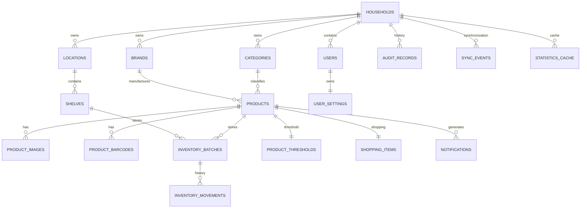

# 1. Purpose

This document defines the physical data model of **Baulera**.

It specifies:

- Database architecture
- Relational schema
- Naming conventions
- Primary and foreign keys
- Constraints
- Indexes
- Synchronization metadata
- SQLite (Drift) mapping
- PostgreSQL (Supabase) schema

This document is the authoritative reference for all persistent data.

---

# 2 Database Architecture

Baulera uses two relational databases.

```text
             Flutter

                │

        Repository Layer

       ↙                ↘

SQLite (Drift)      PostgreSQL

(Local)             (Supabase)

        ↘          ↙

       Synchronization
```

---

## SQLite

Purpose

- Runtime database
- Offline storage
- Fast queries
- Local transactions

---

## PostgreSQL

Purpose

- Shared cloud database
- Synchronization target
- Authentication integration
- Realtime events
- Backup

---

# 3 Design Principles

## DB-001

SQLite and PostgreSQL share the same logical schema whenever possible.

---

## DB-002

Every table uses UUID primary keys.

---

## DB-003

Foreign keys are enforced.

---

## DB-004

Soft deletion is preferred over physical deletion.

---

## DB-005

Audit history is immutable.

---

## DB-006

Inventory is event-driven.

Current stock is derived from inventory batches.

---

## DB-007

Every table includes synchronization metadata.

---

## DB-008

Tables are normalized to Third Normal Form (3NF).

---

# 4 Database Naming Conventions

## Tables

Plural.

Examples

```text
products

inventory_batches

shopping_items

audit_records
```

---

## Primary Keys

```
id
```

UUID

---

## Foreign Keys

```
product_id

category_id

household_id
```

---

## Boolean Fields

Prefix

```
is_

has_
```

Examples

```
is_active

is_archived

has_image
```

---

## Dates

Suffix

```
_at
```

Examples

```
created_at

updated_at

deleted_at
```

---

## Quantities

Suffix

```
quantity
```

Examples

```
current_quantity

minimum_quantity

target_quantity
```

---

# 5 Common Columns

Unless explicitly stated otherwise, every business table contains:

| Column | Type |
|---------|------|
| id | UUID |
| household_id | UUID |
| created_at | Timestamp |
| updated_at | Timestamp |
| created_by | UUID |
| updated_by | UUID |
| deleted_at | Timestamp NULL |
| version | Integer |
| sync_status | Text |

---

## created_at

Creation timestamp.

Immutable.

---

## updated_at

Last modification timestamp.

Automatically updated.

---

## deleted_at

NULL

Entity is active.

Not NULL

Entity is archived.

---

## version

Incremented every successful modification.

Used during synchronization.

---

## sync_status

Possible values

```
Pending

Synced

Conflict

Deleted
```

---

# 6 Entity Relationship Overview

```text
Household

│

├── Users

├── Categories

├── Brands

├── Locations

│      │

│      └── Shelves

│

├── Products

│      │

│      ├── Product Images

│      ├── Inventory Batches

│      ├── Thresholds

│      └── Shopping Items

│

├── Inventory Movements

├── Notifications

├── Audit Records

└── Sync Events
```

---

# 7 Main Entities

| Entity | Purpose |
|----------|---------|
| Households | Shared inventory ownership |
| Users | Household members |
| Categories | Product grouping |
| Brands | Product brands |
| Locations | Physical storage locations |
| Shelves | Shelves inside locations |
| Products | Product catalog |
| Inventory Batches | Physical stock by expiration |
| Inventory Movements | Inventory history |
| Shopping Items | Automatic shopping list |
| Thresholds | Replenishment rules |
| Notifications | Scheduled alerts |
| Audit Records | Immutable audit history |
| Sync Events | Offline synchronization |

---

# 8 Database Layers

The schema is divided into logical areas.

---

## Master Data

Contains relatively static entities.

- Categories
- Brands
- Locations
- Shelves

---

## Catalog

Contains product definitions.

- Products
- Images
- Barcodes

---

## Inventory

Contains stock information.

- Inventory Batches
- Inventory Movements

---

## Shopping

Contains shopping-related entities.

- Shopping Items
- Thresholds

---

## System

Contains infrastructure entities.

- Audit
- Notifications
- Sync
- Settings

---

# 9 UUID Strategy

All identifiers use UUID version 4.

Reasons

- Offline generation
- Merge safety
- Synchronization
- No collision between devices

UUIDs are generated locally.

The server never generates identifiers.

---

# 10 Data Ownership

Every business entity belongs to exactly one Household.

Example

```text
Household

↓

Products

↓

Inventory

↓

Shopping List

↓

Notifications
```

No entity is shared across households.

---

# 11 Multi-User Strategy

Multiple users collaborate inside one Household.

Every modification records:

- Creator
- Last modifier

Historical ownership remains preserved.

---

# 12 Soft Delete Strategy

Business entities are archived instead of deleted.

Example

```
deleted_at != NULL
```

Benefits

- Audit preservation
- Synchronization safety
- Recovery
- Historical statistics

Inventory Movements and Audit Records are never soft deleted.

They are immutable.

---

# 13 Data Integrity Principles

The database guarantees:

- Referential integrity.
- Unique UUIDs.
- Valid foreign keys.
- Positive quantities.
- Valid expiration dates.
- Consistent synchronization metadata.
- Immutable historical records.

Violations shall be prevented through:

- Constraints
- Transactions
- Domain validation

---
# 14 Table: households

Represents a shared inventory owned by one or more users.

---

## Purpose

A Household groups:

- Users
- Products
- Inventory
- Shopping List
- Notifications
- Statistics

The current version of Baulera supports one Household per user, but the schema is designed to support multiple households in the future.

---

## Columns

| Column | Type | Nullable | Notes |
|---------|------|----------|------|
| id | UUID | No | Primary Key |
| name | VARCHAR(100) | No | Household name |
| description | VARCHAR(500) | Yes | Optional description |
| created_at | TIMESTAMP | No | Creation timestamp |
| updated_at | TIMESTAMP | No | Last update |
| created_by | UUID | No | Creator |
| updated_by | UUID | No | Last modifier |
| deleted_at | TIMESTAMP | Yes | Soft delete |
| version | INTEGER | No | Sync version |
| sync_status | VARCHAR(20) | No | Sync state |

---

## Constraints

- Name required.
- Name length ≤ 100 characters.
- Household names are not globally unique.

---

## Indexes

```text
PK_households

IX_households_name

IX_households_deleted
```

---

# 15 Table: users

Represents authenticated users.

Authentication credentials are managed by Supabase Auth.

This table stores application-specific information.

---

## Columns

| Column | Type | Nullable | Notes |
|---------|------|----------|------|
| id | UUID | No | PK / Auth User ID |
| household_id | UUID | No | FK households |
| email | VARCHAR(320) | No | User email |
| display_name | VARCHAR(120) | No | Friendly name |
| role | VARCHAR(30) | No | Administrator |
| avatar_url | TEXT | Yes | Optional profile photo |
| last_login_at | TIMESTAMP | Yes | Last login |
| created_at | TIMESTAMP | No | Created |
| updated_at | TIMESTAMP | No | Updated |
| deleted_at | TIMESTAMP | Yes | Archived |
| version | INTEGER | No | Version |
| sync_status | VARCHAR(20) | No | Sync status |

---

## Constraints

- Email required.
- Email unique.
- Household required.
- Role required.

---

## Indexes

```text
PK_users

UX_users_email

IX_users_household

IX_users_deleted
```

---

# 16 Table: categories

Defines product categories.

Examples

- Drinks
- Dairy
- Frozen
- Pasta
- Cleaning
- Snacks

---

## Columns

| Column | Type |
|---------|------|
| id | UUID |
| household_id | UUID |
| name | VARCHAR(100) |
| icon | VARCHAR(50) |
| color | VARCHAR(20) |
| sort_order | INTEGER |
| is_active | BOOLEAN |
| created_at | TIMESTAMP |
| updated_at | TIMESTAMP |
| created_by | UUID |
| updated_by | UUID |
| deleted_at | TIMESTAMP |
| version | INTEGER |
| sync_status | VARCHAR(20) |

---

## Constraints

- Name required.
- Unique inside Household.

---

## Unique Constraint

```text
(household_id, name)
```

---

## Indexes

```text
IX_categories_name

IX_categories_household

IX_categories_active
```

---

# 17 Table: brands

Product brands.

Examples

- Coca-Cola
- La Serenísima
- Arcor

---

## Columns

| Column | Type |
|---------|------|
| id | UUID |
| household_id | UUID |
| name | VARCHAR(120) |
| logo_url | TEXT |
| notes | TEXT |
| created_at | TIMESTAMP |
| updated_at | TIMESTAMP |
| created_by | UUID |
| updated_by | UUID |
| deleted_at | TIMESTAMP |
| version | INTEGER |
| sync_status | VARCHAR(20) |

---

## Constraints

Unique per Household.

---

## Indexes

```text
UX_brands_name

IX_brands_household
```

---

# 18 Table: locations

Represents a physical storage location.

Examples

- Pantry
- Basement
- Garage
- Kitchen
- Storage Room

---

## Columns

| Column | Type |
|---------|------|
| id | UUID |
| household_id | UUID |
| name | VARCHAR(100) |
| description | TEXT |
| sort_order | INTEGER |
| created_at | TIMESTAMP |
| updated_at | TIMESTAMP |
| created_by | UUID |
| updated_by | UUID |
| deleted_at | TIMESTAMP |
| version | INTEGER |
| sync_status | VARCHAR(20) |

---

## Constraints

Unique name within Household.

---

## Indexes

```text
UX_locations_name

IX_locations_household
```

---

# 19 Table: shelves

Represents shelves inside a location.

Example

```text
Pantry

↓

Shelf A

Shelf B

Shelf C
```

---

## Columns

| Column | Type |
|---------|------|
| id | UUID |
| household_id | UUID |
| location_id | UUID |
| name | VARCHAR(100) |
| description | TEXT |
| sort_order | INTEGER |
| created_at | TIMESTAMP |
| updated_at | TIMESTAMP |
| created_by | UUID |
| updated_by | UUID |
| deleted_at | TIMESTAMP |
| version | INTEGER |
| sync_status | VARCHAR(20) |

---

## Constraints

Unique shelf name inside the same location.

---

## Unique Constraint

```text
(location_id, name)
```

---

## Indexes

```text
IX_shelves_location

IX_shelves_household

IX_shelves_deleted
```

---

# 20 Relationships

```text
Household

├── Users

├── Categories

├── Brands

├── Locations

│      │

│      └── Shelves
```

---

## Cardinalities

| Parent | Child | Relationship |
|----------|-------|-------------|
| Household | Users | 1 : N |
| Household | Categories | 1 : N |
| Household | Brands | 1 : N |
| Household | Locations | 1 : N |
| Location | Shelves | 1 : N |

---

# 21 Foreign Keys

```text
users.household_id

→ households.id
```

```text
categories.household_id

→ households.id
```

```text
brands.household_id

→ households.id
```

```text
locations.household_id

→ households.id
```

```text
shelves.household_id

→ households.id
```

```text
shelves.location_id

→ locations.id
```

All foreign keys enforce referential integrity.

---

# 22 Delete Behavior

| Parent | Child | Action |
|----------|-------|--------|
| Household | Users | Restrict |
| Household | Categories | Restrict |
| Household | Brands | Restrict |
| Household | Locations | Restrict |
| Location | Shelves | Restrict |

No cascade deletes are permitted.

Entities are archived using `deleted_at`.

---

# 23 Validation Rules

## Household

- Name required.

---

## User

- Email valid.
- Display name required.

---

## Category

- Name required.
- Name unique within Household.

---

## Brand

- Name required.
- Name unique within Household.

---

## Location

- Name required.

---

## Shelf

- Name required.
- Location required.
- Name unique within Location.

---

# 24 Table: products

Represents the product catalog.

A Product is a logical definition of an item and exists independently of inventory.

Examples

- Coca-Cola Zero 1.5 L
- Coca-Cola 500 ml
- Rice 1 kg
- Tomato Sauce 340 g

A Product remains in the catalog even when its stock reaches zero.

---

## Columns

| Column | Type | Nullable | Notes |
|---------|------|----------|------|
| id | UUID | No | Primary Key |
| household_id | UUID | No | FK households |
| category_id | UUID | Yes | FK categories |
| brand_id | UUID | Yes | FK brands |
| name | VARCHAR(200) | No | Product name |
| presentation | VARCHAR(100) | Yes | e.g. 500 ml, 1.5 L, 1 kg |
| barcode | VARCHAR(50) | Yes | Preferred barcode |
| default_image_url | TEXT | Yes | Main image |
| notes | TEXT | Yes | Optional notes |
| is_favorite | BOOLEAN | No | Frequently purchased |
| is_archived | BOOLEAN | No | Hidden from normal searches |
| created_at | TIMESTAMP | No | Created |
| updated_at | TIMESTAMP | No | Updated |
| created_by | UUID | No | Creator |
| updated_by | UUID | No | Last modifier |
| deleted_at | TIMESTAMP | Yes | Soft delete |
| version | INTEGER | No | Sync version |
| sync_status | VARCHAR(20) | No | Sync state |

---

## Constraints

- Name required.
- Household required.
- Presentation optional.
- Barcode optional.
- Product remains valid with zero stock.

---

## Unique Constraint

A household cannot contain duplicate logical products.

```text
(household_id,
 name,
 brand_id,
 presentation)
```

---

## Indexes

```text
PK_products

IX_products_household

IX_products_category

IX_products_brand

IX_products_name

IX_products_barcode

IX_products_archived

IX_products_deleted
```

---

# 25 Table: product_images

Allows multiple images per Product.

Future versions may support:

- User photos
- OpenFoodFacts images
- Multiple viewing angles

---

## Columns

| Column | Type |
|---------|------|
| id | UUID |
| product_id | UUID |
| image_url | TEXT |
| source | VARCHAR(30) |
| sort_order | INTEGER |
| is_primary | BOOLEAN |
| created_at | TIMESTAMP |
| updated_at | TIMESTAMP |
| created_by | UUID |
| updated_by | UUID |
| version | INTEGER |
| sync_status | VARCHAR(20) |

---

## Sources

Examples

```text
User

OpenFoodFacts

Camera
```

---

## Constraints

Only one primary image per Product.

---

## Indexes

```text
IX_product_images_product

IX_product_images_primary
```

---

# 26 Table: product_barcodes

Supports multiple barcodes for the same Product.

Examples

- Regional packaging
- Promotional packaging
- Manufacturer changes

---

## Columns

| Column | Type |
|---------|------|
| id | UUID |
| product_id | UUID |
| barcode | VARCHAR(50) |
| is_primary | BOOLEAN |
| source | VARCHAR(30) |
| created_at | TIMESTAMP |
| updated_at | TIMESTAMP |
| created_by | UUID |
| updated_by | UUID |
| version | INTEGER |
| sync_status | VARCHAR(20) |

---

## Constraints

Barcode must be unique inside the Household.

---

## Unique Constraint

```text
(household_id, barcode)
```

---

## Indexes

```text
UX_product_barcodes

IX_product_barcodes_product
```

---

# 27 Table: inventory_batches

Represents physical inventory.

Each batch corresponds to a specific expiration date and location.

Example

```text
Coca-Cola 500 ml

↓

Batch A

Expiration

12/2026

Quantity

2
```

```text
Coca-Cola 500 ml

↓

Batch B

Expiration

03/2027

Quantity

1
```

These are independent inventory batches.

---

## Columns

| Column | Type |
|---------|------|
| id | UUID |
| household_id | UUID |
| product_id | UUID |
| shelf_id | UUID |
| expiration_date | DATE |
| quantity | DECIMAL(10,2) |
| reserved_quantity | DECIMAL(10,2) |
| unit_cost | DECIMAL(10,2) |
| purchase_date | DATE |
| notes | TEXT |
| created_at | TIMESTAMP |
| updated_at | TIMESTAMP |
| created_by | UUID |
| updated_by | UUID |
| deleted_at | TIMESTAMP |
| version | INTEGER |
| sync_status | VARCHAR(20) |

---

## Constraints

- Quantity ≥ 0.
- Reserved quantity ≥ 0.
- Reserved quantity ≤ quantity.
- Product required.
- Shelf required.

---

## Unique Constraint

```text
(product_id,
 shelf_id,
 expiration_date)
```

If another purchase shares the same product, shelf and expiration date, quantities are merged into the existing batch.

---

## Indexes

```text
IX_batches_product

IX_batches_shelf

IX_batches_expiration

IX_batches_quantity

IX_batches_household
```

---

# 28 Inventory Philosophy

Inventory is managed by batches rather than directly by Products.

```text
Product

↓

InventoryBatch

↓

Quantity
```

Benefits

- Expiration tracking
- FIFO recommendations
- User-selectable batch consumption
- Multiple storage locations

---

# 29 Relationships

```text
Category

↓

Products

↓

Inventory Batches

↓

Shelf

↓

Location
```

---

## Cardinalities

| Parent | Child | Relationship |
|----------|-------|-------------|
| Category | Products | 1 : N |
| Brand | Products | 1 : N |
| Product | Product Images | 1 : N |
| Product | Product Barcodes | 1 : N |
| Product | Inventory Batches | 1 : N |
| Shelf | Inventory Batches | 1 : N |

---

# 30 Foreign Keys

```text
products.household_id

→ households.id
```

```text
products.category_id

→ categories.id
```

```text
products.brand_id

→ brands.id
```

```text
product_images.product_id

→ products.id
```

```text
product_barcodes.product_id

→ products.id
```

```text
inventory_batches.product_id

→ products.id
```

```text
inventory_batches.shelf_id

→ shelves.id
```

---

# 31 Delete Behavior

| Parent | Child | Action |
|----------|-------|--------|
| Product | Images | Restrict |
| Product | Barcodes | Restrict |
| Product | Inventory Batches | Restrict |
| Shelf | Inventory Batches | Restrict |

All entities use soft deletion where applicable.

Inventory Batches with historical movements should never be physically removed.

---

# 32 Validation Rules

## Product

- Name required.
- Duplicate logical products not allowed.
- Archived products remain searchable when explicitly requested.

---

## Product Image

- Valid URL.
- Only one primary image.

---

## Barcode

- Numeric or alphanumeric according to barcode standard.
- Unique within the Household.

---

## Inventory Batch

- Quantity cannot be negative.
- Expiration date may be null (non-perishable products).
- Shelf required.
- Product required.
- Existing batch reused when unique constraint matches.

---

# 33 Table: inventory_movements

Stores the complete history of inventory operations.

Inventory is never modified without creating an Inventory Movement.

This table is immutable.

---

## Purpose

Provides:

- Inventory history
- Consumption history
- Purchase history
- Statistics
- Audit support
- Synchronization traceability

---

## Columns

| Column | Type | Nullable | Notes |
|---------|------|----------|------|
| id | UUID | No | Primary Key |
| household_id | UUID | No | FK households |
| batch_id | UUID | No | FK inventory_batches |
| product_id | UUID | No | FK products |
| user_id | UUID | No | FK users |
| movement_type | VARCHAR(30) | No | Purchase, Consumption, Adjustment, Transfer |
| quantity_before | DECIMAL(10,2) | No | Stock before operation |
| quantity_change | DECIMAL(10,2) | No | Positive or negative |
| quantity_after | DECIMAL(10,2) | No | Stock after operation |
| reason | TEXT | Yes | Optional explanation |
| reference_id | UUID | Yes | Optional business reference |
| created_at | TIMESTAMP | No | Movement timestamp |
| version | INTEGER | No | Version |
| sync_status | VARCHAR(20) | No | Sync state |

---

## Movement Types

```text
Purchase

Consumption

Adjustment

Transfer

InitialLoad

Correction
```

---

## Constraints

- Quantity After ≥ 0
- Quantity Before ≥ 0
- Quantity Change ≠ 0

Rows are immutable.

---

## Indexes

```text
PK_inventory_movements

IX_movements_product

IX_movements_batch

IX_movements_user

IX_movements_created

IX_movements_household

IX_movements_type
```

---

# 34 Table: shopping_items

Represents the automatic shopping list.

Items remain in the catalog even after purchase.

Completion resets their pending state rather than deleting them.

---

## Columns

| Column | Type |
|---------|------|
| id | UUID |
| household_id | UUID |
| product_id | UUID |
| suggested_quantity | DECIMAL(10,2) |
| current_quantity | DECIMAL(10,2) |
| target_quantity | DECIMAL(10,2) |
| is_completed | BOOLEAN |
| completed_at | TIMESTAMP |
| completed_by | UUID |
| notes | TEXT |
| created_at | TIMESTAMP |
| updated_at | TIMESTAMP |
| created_by | UUID |
| updated_by | UUID |
| deleted_at | TIMESTAMP |
| version | INTEGER |
| sync_status | VARCHAR(20) |

---

## Business Rules

If current quantity reaches the configured threshold:

```
Shopping Item becomes active.
```

After purchasing:

```
Shopping Item becomes completed.
```

If inventory later falls below threshold again:

The existing Shopping Item is reused.

---

## Constraints

Only one Shopping Item per Product.

---

## Unique Constraint

```text
(household_id, product_id)
```

---

## Indexes

```text
IX_shopping_product

IX_shopping_completed

IX_shopping_household
```

---

# 35 Table: product_thresholds

Stores replenishment policies.

Example

```text
Milk

Current

2

Threshold

3

Target

6
```

Since

```
2 < 3
```

Shopping suggestion

```
Buy 4
```

---

## Columns

| Column | Type |
|---------|------|
| id | UUID |
| household_id | UUID |
| product_id | UUID |
| minimum_quantity | DECIMAL(10,2) |
| target_quantity | DECIMAL(10,2) |
| is_enabled | BOOLEAN |
| created_at | TIMESTAMP |
| updated_at | TIMESTAMP |
| created_by | UUID |
| updated_by | UUID |
| version | INTEGER |
| sync_status | VARCHAR(20) |

---

## Constraints

- Minimum ≥ 0
- Target > Minimum
- One threshold per Product

---

## Unique Constraint

```text
(product_id)
```

---

## Indexes

```text
IX_threshold_product

IX_threshold_enabled
```

---

# 36 Table: audit_records

Immutable audit trail.

Every business modification generates one Audit Record.

---

## Columns

| Column | Type |
|---------|------|
| id | UUID |
| household_id | UUID |
| entity_name | VARCHAR(100) |
| entity_id | UUID |
| action | VARCHAR(50) |
| performed_by | UUID |
| before_json | JSONB |
| after_json | JSONB |
| device_id | VARCHAR(100) |
| created_at | TIMESTAMP |

---

## Actions

```text
Create

Update

Delete

Archive

Purchase

Consume

Adjust

Transfer

ThresholdChanged
```

---

## Constraints

Rows are immutable.

No updates permitted.

---

## Indexes

```text
IX_audit_entity

IX_audit_user

IX_audit_created

IX_audit_household
```

---

# 37 Relationships

```text
Products

├── Inventory Batches

│      │

│      └── Inventory Movements

│

├── Shopping Item

│

└── Threshold
```

---

## Cardinalities

| Parent | Child | Relationship |
|----------|-------|-------------|
| Product | Inventory Movements | 1 : N |
| Inventory Batch | Inventory Movements | 1 : N |
| Product | Shopping Item | 1 : 1 |
| Product | Threshold | 1 : 1 |
| Product | Audit Records | 1 : N (logical) |

---

# 38 Foreign Keys

```text
inventory_movements.batch_id

→ inventory_batches.id
```

```text
inventory_movements.product_id

→ products.id
```

```text
inventory_movements.user_id

→ users.id
```

```text
shopping_items.product_id

→ products.id
```

```text
shopping_items.completed_by

→ users.id
```

```text
product_thresholds.product_id

→ products.id
```

```text
audit_records.performed_by

→ users.id
```

---

# 39 Delete Behavior

| Parent | Child | Action |
|----------|-------|--------|
| Product | Shopping Item | Restrict |
| Product | Threshold | Restrict |
| Product | Inventory Movements | Restrict |
| Inventory Batch | Inventory Movements | Restrict |
| User | Audit Records | Restrict |

Historical data must never be removed.

---

# 40 Validation Rules

## Inventory Movement

- Quantity change cannot be zero.
- Resulting quantity cannot be negative.
- Movement type required.
- User required.

---

## Shopping Item

- Product required.
- Suggested quantity ≥ 0.
- Target quantity ≥ Current quantity.

---

## Threshold

- Minimum quantity ≥ 0.
- Target quantity > Minimum quantity.
- Product required.
- Threshold optional (products without automatic replenishment are allowed).

---

## Audit Record

- Immutable after creation.
- Before and After JSON may be null depending on the action.
- Performed By required.

---

# 41 Table: sync_events

Stores every pending synchronization operation.

SQLite writes to this table first.

The Sync Engine later processes the queue and uploads the events to Supabase.

Rows are removed (or marked as synchronized) only after successful confirmation from the server.

---

## Purpose

- Offline synchronization
- Retry mechanism
- Conflict detection
- Ordered synchronization
- Crash recovery

---

## Columns

| Column | Type | Nullable | Notes |
|---------|------|----------|------|
| id | UUID | No | Primary Key |
| household_id | UUID | No | FK households |
| entity_name | VARCHAR(100) | No | Target table |
| entity_id | UUID | No | Target entity |
| operation | VARCHAR(20) | No | Insert, Update, Delete |
| payload | JSONB | No | Serialized entity |
| local_version | INTEGER | No | Local entity version |
| device_id | VARCHAR(100) | No | Origin device |
| status | VARCHAR(20) | No | Pending, Processing, Synced, Conflict, Failed |
| retry_count | INTEGER | No | Retry attempts |
| last_attempt_at | TIMESTAMP | Yes | Last retry |
| created_at | TIMESTAMP | No | Queue timestamp |

---

## Constraints

- Payload required.
- Retry count ≥ 0.
- Entity required.

---

## Status Values

```text
Pending

Processing

Synced

Conflict

Failed
```

---

## Indexes

```text
PK_sync_events

IX_sync_status

IX_sync_entity

IX_sync_household

IX_sync_created
```

---

# 42 Table: notifications

Represents scheduled local notifications.

Notifications are generated automatically from business rules.

---

## Columns

| Column | Type |
|---------|------|
| id | UUID |
| household_id | UUID |
| product_id | UUID |
| notification_type | VARCHAR(50) |
| title | VARCHAR(200) |
| body | TEXT |
| scheduled_for | TIMESTAMP |
| delivered_at | TIMESTAMP |
| is_enabled | BOOLEAN |
| is_delivered | BOOLEAN |
| created_at | TIMESTAMP |
| updated_at | TIMESTAMP |
| version | INTEGER |
| sync_status | VARCHAR(20) |

---

## Notification Types

```text
Expiration

ThresholdReached

ShoppingReminder

SynchronizationFailed

DailySummary
```

---

## Constraints

- Scheduled date required.
- Notification type required.

---

## Indexes

```text
IX_notifications_product

IX_notifications_date

IX_notifications_enabled

IX_notifications_household
```

---

# 43 Table: user_settings

Stores user-specific application preferences.

These settings are synchronized across devices.

---

## Columns

| Column | Type |
|---------|------|
| id | UUID |
| user_id | UUID |
| language | VARCHAR(10) |
| theme | VARCHAR(20) |
| notifications_enabled | BOOLEAN |
| expiration_warning_days | INTEGER |
| voice_enabled | BOOLEAN |
| ai_enabled | BOOLEAN |
| preferred_location_id | UUID |
| created_at | TIMESTAMP |
| updated_at | TIMESTAMP |
| version | INTEGER |
| sync_status | VARCHAR(20) |

---

## Constraints

One settings row per user.

---

## Unique Constraint

```text
(user_id)
```

---

## Indexes

```text
IX_settings_user
```

---

# 44 Table: statistics_cache

Stores precomputed statistics to avoid expensive queries.

This table is optional and can be rebuilt at any time.

---

## Columns

| Column | Type |
|---------|------|
| id | UUID |
| household_id | UUID |
| statistic_name | VARCHAR(100) |
| period | VARCHAR(20) |
| payload | JSONB |
| calculated_at | TIMESTAMP |

---

## Example Statistics

```text
MonthlyConsumption

CategoryDistribution

TopProducts

ExpirationForecast

ShoppingTrend
```

---

## Constraints

No business logic depends on this table.

It is considered disposable.

---

## Indexes

```text
IX_statistics_household

IX_statistics_name
```

---

# 45 Relationships

```text
Users

│

├── Settings

│

└── Notifications

Products

│

├── Notifications

│

└── Statistics

System

│

└── Sync Events
```

---

## Cardinalities

| Parent | Child | Relationship |
|----------|-------|-------------|
| User | User Settings | 1 : 1 |
| Product | Notifications | 1 : N |
| Household | Sync Events | 1 : N |
| Household | Statistics Cache | 1 : N |

---

# 46 Foreign Keys

```text
notifications.product_id

→ products.id
```

```text
user_settings.user_id

→ users.id
```

```text
user_settings.preferred_location_id

→ locations.id
```

```text
statistics_cache.household_id

→ households.id
```

```text
sync_events.household_id

→ households.id
```

---

# 47 Delete Behavior

| Parent | Child | Action |
|----------|-------|--------|
| User | User Settings | Cascade |
| Product | Notifications | Restrict |
| Household | Statistics Cache | Cascade |
| Household | Sync Events | Cascade |

System tables that are cache- or queue-based may be recreated after deletion.

Business entities continue using soft delete.

---

# 48 Validation Rules

## Sync Event

- Payload required.
- Entity required.
- Retry count cannot be negative.
- Status must be one of the predefined values.

---

## Notification

- Scheduled date required.
- Notification type required.
- Delivered notifications are immutable.

---

## User Settings

- Language required.
- Theme required.
- Expiration warning days ≥ 0.
- Only one settings record per user.

---

## Statistics Cache

- Payload required.
- Statistic name required.
- Calculated timestamp required.

---

# 49 System Data Lifecycle

```text
Business Change

↓

SQLite Transaction

↓

Audit Record

↓

Sync Event

↓

Background Sync

↓

Supabase

↓

Realtime Broadcast

↓

Other Devices

↓

SQLite Update

↓

Statistics Refresh

↓

Notification Evaluation
```

---

# 50 Design Principles for System Tables

- System tables must never contain business logic.
- Cached data must always be reconstructible.
- Queue processing must be idempotent.
- Notification scheduling must be repeatable.
- Synchronization metadata must never modify business entities directly.
- System tables may be purged or rebuilt without affecting inventory integrity.

---

# 51 Index Strategy

Indexes are designed to optimize the most common application queries.

Priority is given to:

- Product search
- Inventory lookup
- Expiration tracking
- Shopping list generation
- Synchronization
- Statistics

---

## Primary Key Indexes

Every table has a clustered primary key.

```text
PK_households

PK_users

PK_categories

PK_brands

PK_locations

PK_shelves

PK_products

PK_product_images

PK_product_barcodes

PK_inventory_batches

PK_inventory_movements

PK_shopping_items

PK_product_thresholds

PK_audit_records

PK_sync_events

PK_notifications

PK_user_settings

PK_statistics_cache
```

---

# 52 Secondary Indexes

## Products

```sql
(name)

(category_id)

(brand_id)

(barcode)

(is_archived)

(deleted_at)
```

---

## Inventory Batches

```sql
(product_id)

(expiration_date)

(shelf_id)

(quantity)

(household_id)
```

---

## Inventory Movements

```sql
(product_id)

(created_at DESC)

(user_id)

(movement_type)
```

---

## Shopping

```sql
(is_completed)

(product_id)

(household_id)
```

---

## Notifications

```sql
(scheduled_for)

(is_enabled)

(is_delivered)
```

---

## Synchronization

```sql
(status)

(created_at)

(entity_name)

(device_id)
```

---

# 53 Composite Indexes

Frequently executed queries benefit from composite indexes.

---

## Products

```sql
(household_id, name)

(household_id, barcode)

(category_id, brand_id)
```

---

## Inventory

```sql
(product_id, expiration_date)

(product_id, shelf_id)

(product_id, quantity)
```

---

## Shopping

```sql
(household_id, is_completed)

(product_id, is_completed)
```

---

## Notifications

```sql
(is_enabled, scheduled_for)
```

---

## Synchronization

```sql
(status, created_at)
```

---

# 54 Database Constraints

The database enforces integrity using constraints.

---

## Primary Keys

All tables

```sql
PRIMARY KEY(id)
```

---

## Foreign Keys

Examples

```sql
product_id

REFERENCES products(id)
```

```sql
household_id

REFERENCES households(id)
```

---

## Check Constraints

Examples

Inventory quantity

```sql
quantity >= 0
```

Threshold

```sql
target_quantity > minimum_quantity
```

Retry count

```sql
retry_count >= 0
```

Expiration warning

```sql
expiration_warning_days >= 0
```

---

## Unique Constraints

Examples

```sql
(household_id, barcode)
```

```sql
(household_id, category_name)
```

```sql
(product_id)
```

```sql
(user_id)
```

---

# 55 Database Views

Views simplify complex reporting queries.

---

## Current Inventory

```text
vw_current_inventory
```

Returns

- Product
- Total quantity
- Available quantity
- Shelf
- Next expiration

---

## Shopping List

```text
vw_shopping_list
```

Returns

Only pending shopping items.

---

## Expiring Products

```text
vw_expiring_products
```

Returns

Products expiring within configurable days.

---

## Consumption History

```text
vw_consumption_history
```

Returns

Consumption movements ordered by date.

---

## Dashboard Summary

```text
vw_dashboard_summary
```

Returns

- Total products
- Total batches
- Products below threshold
- Expiring products
- Pending shopping items

---

# 56 Database Triggers

Triggers keep the database internally consistent.

---

## Trigger

Update Timestamp

Executed

Before Update

Purpose

Automatically update

```
updated_at
```

---

## Trigger

Increment Version

Executed

Before Update

Purpose

Increase

```
version
```

---

## Trigger

Audit Record

Executed

After Insert

After Update

After Delete

Purpose

Insert Audit Record.

---

## Trigger

Shopping Evaluation

Executed

After Inventory Update

Purpose

Recalculate shopping list.

---

## Trigger

Threshold Evaluation

Executed

After Inventory Update

Purpose

Evaluate threshold notifications.

---

## Trigger

Notification Scheduling

Executed

After Batch Insert

Purpose

Schedule expiration notifications.

---

# 57 Stored Procedures

The application performs almost all business logic.

Stored procedures are intentionally minimal.

---

## sp_refresh_statistics

Purpose

Rebuild statistics cache.

---

## sp_recalculate_shopping

Purpose

Recompute automatic shopping list.

---

## sp_cleanup_notifications

Purpose

Remove obsolete notifications.

---

## sp_cleanup_sync_events

Purpose

Archive synchronized events.

---

# 58 Transactions

All write operations execute inside transactions.

Examples

Purchase

```text
Insert Inventory Batch

↓

Insert Movement

↓

Update Shopping Item

↓

Insert Audit

↓

Insert Sync Event

↓

Commit
```

---

Consumption

```text
Update Batch

↓

Insert Movement

↓

Evaluate Threshold

↓

Update Shopping

↓

Insert Audit

↓

Insert Sync Event

↓

Commit
```

---

# 59 Performance Guidelines

Expected workload

- <100 products
- <500 inventory batches
- <100,000 movements

The database is intentionally optimized for simplicity over extreme scalability.

Performance goals

| Operation | Target |
|-----------|--------|
| Product search | <50 ms |
| Dashboard load | <100 ms |
| Inventory update | <150 ms |
| Shopping list | <100 ms |
| Synchronization | Background |

---

# 60 Integrity Rules

The database guarantees the following invariants.

Inventory

- Stock never negative.
- Every stock modification generates a movement.

Shopping

- One Shopping Item per Product.
- Threshold optional.

Audit

- Immutable.
- Complete history.

Synchronization

- Every local modification creates one Sync Event.
- Failed synchronization never loses data.

Notifications

- No duplicate pending expiration notification for the same batch.
- Delivered notifications remain immutable.

Database

- Referential integrity enforced.
- Soft deletion preserved.
- UUID uniqueness guaranteed.

---

# 61 Drift Mapping

SQLite persistence is implemented using **Drift**.

Each business table has a corresponding Drift table.

The logical schema mirrors PostgreSQL as closely as possible.

```text
PostgreSQL

↓

Drift Table

↓

DAO

↓

Repository

↓

Domain
```

The application never interacts directly with SQL.

---

# 62 Drift Project Structure

```text
lib/

infrastructure/

    database/

        database.dart

        migrations/

        converters/

        tables/

        dao/

        generated/
```

---

## tables/

Contains all Drift table definitions.

```text
households_table.dart

users_table.dart

categories_table.dart

brands_table.dart

locations_table.dart

shelves_table.dart

products_table.dart

product_images_table.dart

product_barcodes_table.dart

inventory_batches_table.dart

inventory_movements_table.dart

shopping_items_table.dart

product_thresholds_table.dart

audit_records_table.dart

sync_events_table.dart

notifications_table.dart

user_settings_table.dart

statistics_cache_table.dart
```

---

## dao/

Contains Data Access Objects.

Examples

```text
product_dao.dart

inventory_dao.dart

shopping_dao.dart

notification_dao.dart

sync_dao.dart
```

Each DAO is responsible for a single aggregate or closely related entities.

---

## converters/

Custom type converters.

Examples

```text
uuid_converter.dart

json_converter.dart

datetime_converter.dart
```

---

## generated/

Generated by Drift.

Never edited manually.

---

# 63 Drift Table Mapping

| PostgreSQL | Drift |
|------------|-------|
| UUID | Text |
| TEXT | Text |
| VARCHAR | Text |
| BOOLEAN | Bool |
| INTEGER | Int |
| DECIMAL | Real |
| DATE | DateTime |
| TIMESTAMP | DateTime |
| JSONB | Text (serialized JSON) |

---

# 64 DAO Responsibilities

## ProductDao

Responsible for

- Product CRUD
- Search
- Barcode lookup

---

## InventoryDao

Responsible for

- Inventory batches
- Inventory totals
- Expiration queries

---

## ShoppingDao

Responsible for

- Shopping list
- Threshold evaluation
- Purchase completion

---

## NotificationDao

Responsible for

- Notification scheduling
- Notification cleanup

---

## SyncDao

Responsible for

- Pending events
- Retry queue
- Conflict persistence

---

## StatisticsDao

Responsible for

- Cached statistics
- Dashboard summaries

---

# 65 Migration Strategy

Database schema versioning follows semantic migrations.

Example

```text
Version 1

↓

Version 2

↓

Version 3
```

Each migration is incremental and idempotent.

---

## Migration Naming

```text
migration_001_initial.dart

migration_002_products.dart

migration_003_notifications.dart
```

---

## Migration Rules

- Never modify old migrations.
- Create a new migration for every schema change.
- Existing user data must always be preserved.
- Migrations must execute automatically during app startup.

---

# 66 Initial Database Creation

The first installation creates all tables in a single transaction.

```text
Create Tables

↓

Create Indexes

↓

Insert Default Categories

↓

Insert Default Settings

↓

Commit
```

If any step fails, the transaction is rolled back.

---

# 67 Seed Data

The application initializes with default reference data.

---

## Categories

Examples

```text
Drinks

Dairy

Snacks

Frozen

Cleaning

Personal Care

Canned Food

Pasta

Rice

Breakfast

Condiments
```

---

## Locations

```text
Pantry
```

---

## Shelves

```text
Shelf 1

Shelf 2

Shelf 3
```

Users can customize these values later.

---

# 68 Performance Guidelines

SQLite optimization principles

- Prefer indexed searches.
- Minimize full-table scans.
- Use transactions for batch operations.
- Avoid unnecessary joins.
- Cache frequently used queries.
- Keep writes atomic.

Expected local database size

| Entity | Approximate Rows |
|----------|-----------------:|
| Products | <100 |
| Inventory Batches | <300 |
| Shopping Items | <100 |
| Inventory Movements | <100,000 |
| Audit Records | <100,000 |
| Sync Events | <1,000 |
| Notifications | <500 |

These limits are well within SQLite's capabilities.

---

# 69 Backup and Recovery

SQLite database is considered a local cache plus offline workspace.

The authoritative shared copy resides in Supabase after synchronization.

Recovery process

```text
Login

↓

Download Household

↓

Download Catalog

↓

Download Inventory

↓

Download Shopping

↓

Download Settings

↓

Rebuild Local Database
```

If synchronization metadata is inconsistent, a full household refresh may be requested.

---

# 70 Database Design Principles

The database implementation adheres to the following principles.

1. SQLite and PostgreSQL share the same logical model.
2. Drift abstracts all SQL access.
3. UUIDs are generated locally.
4. Migrations are forward-only.
5. Every write operation is transactional.
6. Seed data is deterministic.
7. Synchronization metadata is stored alongside business entities.
8. DAOs expose persistence operations, never business logic.
9. Generated code is isolated from handwritten code.
10. The schema is designed for maintainability rather than premature optimization.

---

# 71 Complete Entity Relationship Diagram



---

# 72 Aggregate Diagram

The Domain Model is organized around Aggregate Roots.

```text
Household
│
├── Users
│
├── Categories
│
├── Brands
│
├── Locations
│      └── Shelves
│
├── Products
│      ├── Product Images
│      ├── Product Barcodes
│      ├── Threshold
│      ├── Shopping Item
│      └── Inventory Batches
│             └── Inventory Movements
│
├── Notifications
│
├── User Settings
│
├── Audit Records
│
└── Sync Events
```

Aggregate boundaries must be respected by every Repository.

---

# 73 Data Flow

## Purchase

```text
User

↓

Product

↓

Inventory Batch

↓

Inventory Movement

↓

Threshold Evaluation

↓

Shopping List Update

↓

Audit Record

↓

Sync Event
```

---

## Consumption

```text
User

↓

Inventory Batch

↓

Inventory Movement

↓

Threshold Evaluation

↓

Shopping Item

↓

Notification Evaluation

↓

Audit Record

↓

Sync Event
```

---

## Synchronization

```text
SQLite

↓

Sync Queue

↓

Supabase

↓

Realtime

↓

Other Devices

↓

SQLite
```

---

# 74 Database Invariants

The following rules must always hold true.

## Products

- A product always belongs to exactly one Household.
- A product may exist with zero inventory.
- A product may have multiple batches.
- A product may have multiple images.
- A product may have multiple barcodes.
- A product has at most one threshold.
- A product has at most one shopping item.

---

## Inventory

- Quantity is never negative.
- Inventory is tracked by batches.
- Every inventory modification creates a movement.
- Inventory movements are immutable.
- Batch identity is determined by product, shelf and expiration date.

---

## Shopping

- Shopping items are reusable.
- Shopping items are never duplicated.
- Shopping activation depends on threshold evaluation.

---

## Audit

- Audit records are immutable.
- Every business modification creates an audit record.

---

## Synchronization

- Every local modification creates exactly one Sync Event.
- Synchronization never modifies audit history.
- Synchronization never bypasses business validation.

---

# 75 Design Decisions

## DD-001

UUIDs are generated on the device.

Reason

Offline support.

---

## DD-002

Inventory is stored by batches.

Reason

Expiration management.

---

## DD-003

Products remain even when quantity reaches zero.

Reason

Shopping list reuse.

---

## DD-004

Inventory history is immutable.

Reason

Statistics and audit.

---

## DD-005

Soft delete is preferred.

Reason

Historical consistency.

---

## DD-006

SQLite is the runtime database.

Reason

Offline-first architecture.

---

## DD-007

Supabase is the synchronization backend.

Reason

Shared household support.

---

## DD-008

Statistics may be cached.

Reason

Fast dashboard loading.

---

## DD-009

Notifications are persisted.

Reason

Reliable scheduling and recovery.

---

## DD-010

Database schema remains normalized.

Reason

Consistency and maintainability.

---

# 76 Traceability Matrix

| Database Area | Related Documents |
|---------------|-------------------|
| Vision | 01-vision.md |
| Functional Requirements | 02-functional-requirements.md |
| Non-Functional Requirements | 03-non-functional-requirements.md |
| Domain Model | 04-domain-model.md |
| Use Cases | 05-use-cases.md |
| Architecture | 06-architecture.md |
| Project Structure | 07-project-structure.md |
| Supabase Integration | 09-supabase.md |
| Offline Strategy | 10-offline-first.md |
| Synchronization | 11-sync-engine.md |
| Security | 12-security.md |
| Notifications | 22-notifications.md |
| Statistics | 18-statistics.md |

---

# 77 Database Checklist

Every schema change should satisfy the following checklist.

- Uses UUID primary keys.
- Preserves referential integrity.
- Includes synchronization metadata where applicable.
- Includes audit support.
- Uses soft delete for business entities.
- Provides required indexes.
- Avoids duplicated data.
- Is compatible with Drift.
- Is compatible with PostgreSQL.
- Supports offline-first operation.

---

# 78 Glossary

| Term | Definition |
|------|------------|
| Aggregate | A consistency boundary in the domain model. |
| Audit Record | Immutable log of every business change. |
| Batch | A quantity of a product sharing the same shelf and expiration date. |
| Drift | SQLite ORM used by the Flutter application. |
| Household | Logical owner of all business data. |
| Inventory Movement | Immutable event representing a stock change. |
| Product | Logical catalog item independent of stock. |
| Shopping Item | Persistent entry in the automatic shopping list. |
| Soft Delete | Logical deletion using `deleted_at`. |
| Supabase | Cloud backend providing PostgreSQL, Auth and Realtime. |
| Sync Event | Pending operation waiting to be synchronized. |
| Threshold | Minimum stock level that triggers replenishment. |

---

# 79 Database Summary

## Storage Strategy

- SQLite is the local operational database.
- PostgreSQL (Supabase) is the shared cloud database.
- Both databases share the same logical schema.

---

## Data Model

- Normalized to Third Normal Form (3NF).
- UUID primary keys.
- Explicit foreign keys.
- Soft deletion for business entities.
- Immutable historical records.

---

## Inventory Model

- Products define the catalog.
- Inventory is stored by batches.
- Every stock modification generates an Inventory Movement.
- Shopping List is generated from threshold evaluation.
- Audit records preserve complete history.

---

## Architectural Principles

1. Offline-first by default.
2. SQLite as the runtime source of truth.
3. Supabase used exclusively for synchronization and collaboration.
4. Every business change is transactional.
5. Every business change is auditable.
6. Every business change is synchronizable.
7. Historical information is never lost.
8. Referential integrity is enforced at the database level.
9. Performance is optimized for a family-sized inventory.
10. The schema is designed to support future expansion without structural changes.

---


