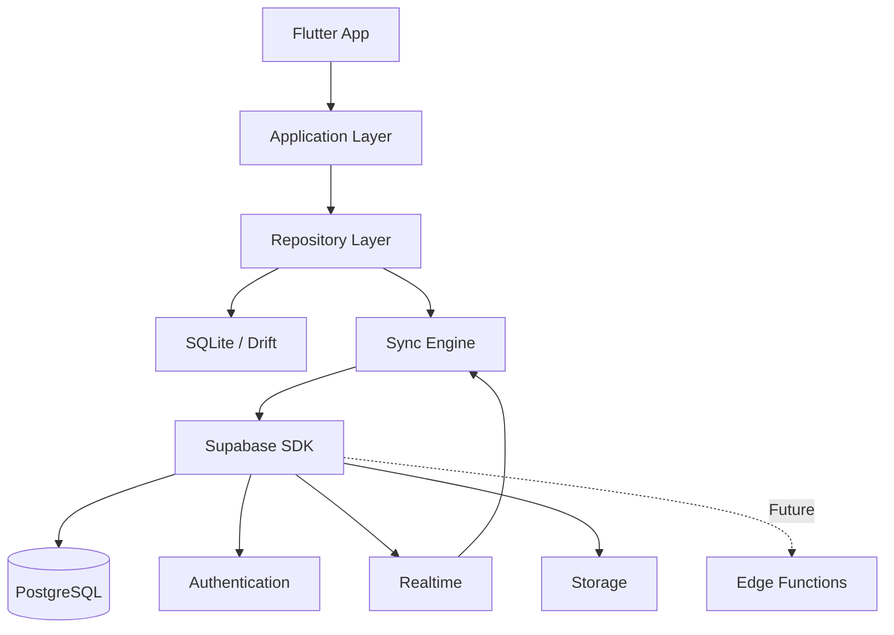
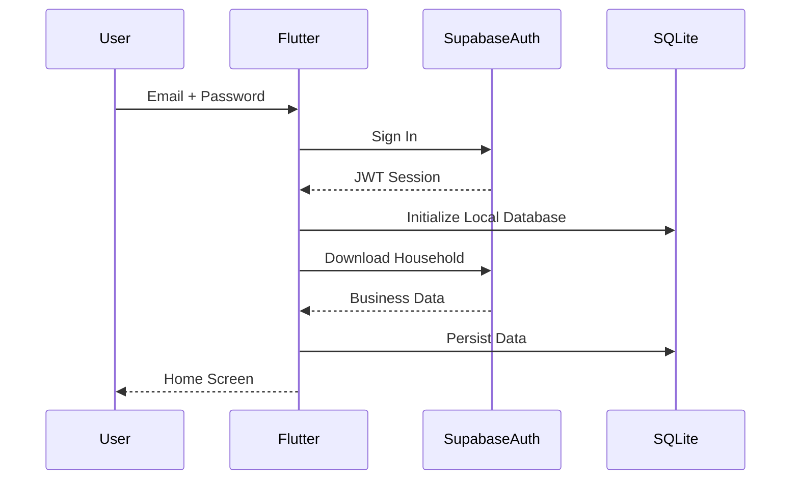
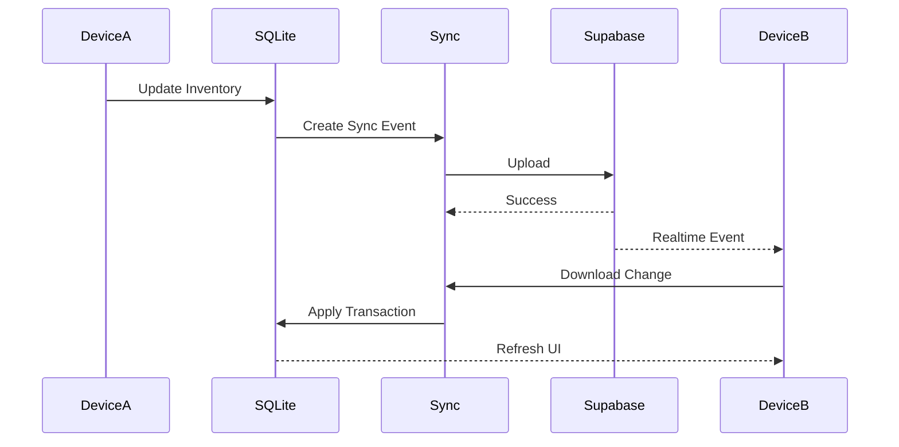

# 1. Purpose

This document defines how **Baulera** integrates with **Supabase**.

Supabase provides:

- Authentication
- PostgreSQL database
- Realtime synchronization
- File Storage
- Row Level Security (RLS)
- Future Edge Functions

Supabase is **not** the runtime database.

SQLite (Drift) remains the operational source of truth.

Supabase acts as the shared cloud synchronization platform.

---

# 2 Architecture Overview

```text
                Flutter

                   │

            Repository Layer

          ↙                 ↘

SQLite (Drift)       Supabase SDK

(Local)                    │

                    PostgreSQL

                    Authentication

                    Realtime

                    Storage

                    Edge Functions (future)
```

---

# 3 Responsibilities

## SQLite

Responsible for

- Runtime database
- Offline operation
- Fast queries
- Transactions
- Local synchronization queue

---

## Supabase

Responsible for

- User authentication
- Shared database
- Multi-device synchronization
- Realtime notifications
- Cloud backup
- User management

---

# 4 Services Used

Baulera uses the following Supabase services.

| Service | Usage |
|----------|------|
| PostgreSQL | Shared cloud database |
| Authentication | Email login |
| Realtime | Device synchronization |
| Storage | Product images |
| Row Level Security | Data isolation |
| Edge Functions | Future server-side logic |

Services intentionally not used in v1:

- Supabase Vector
- Supabase AI
- Cron Jobs
- Supabase Queues

---

# 5 Authentication

Authentication is handled entirely by Supabase Auth.

Supported provider

- Email + Password

Future providers

- Google
- Apple
- Microsoft

---

## Login Flow

```text
User

↓

Email

↓

Password

↓

Supabase Auth

↓

JWT

↓

Flutter

↓

SQLite Sync
```

---

## Registration

Steps

1. User enters email.
2. User enters password.
3. Supabase creates account.
4. User confirms email.
5. Application downloads household data.
6. Local SQLite database is initialized.

---

## Password Reset

Handled by Supabase.

Flow

```text
Forgot Password

↓

Email

↓

Reset Link

↓

New Password

↓

Login
```

---

# 6 User Identity

Each authenticated user has:

```text
Auth User

↓

UUID

↓

Application User

↓

Household
```

The Supabase Auth UUID is reused throughout the application.

No secondary identity system exists.

---

# 7 Household Ownership

Every authenticated user belongs to one Household.

```text
User

↓

Household

↓

Products

↓

Inventory

↓

Shopping

↓

Statistics
```

All business data is isolated by `household_id`.

---

# 8 Authentication Lifecycle

```text
Open App

↓

Existing Session?

↓

Yes

↓

Validate Token

↓

Refresh Token (if needed)

↓

Initialize SQLite

↓

Background Sync

↓

Application Ready
```

If no valid session exists:

```text
Login Screen

↓

Authentication

↓

Download Household

↓

SQLite Initialization

↓

Ready
```

---

# 9 Session Management

Supabase SDK automatically manages:

- Access Token
- Refresh Token
- Token renewal

The application should never manually persist authentication tokens.

Tokens remain inside the secure storage managed by the SDK.

---

# 10 Database Connection

The application never connects directly to PostgreSQL.

Communication always occurs through:

```text
Flutter

↓

Supabase SDK

↓

REST / Realtime

↓

PostgreSQL
```

No raw SQL is executed from the client.

---

# 11 Storage Usage

Supabase Storage stores binary assets.

Initial use cases

- Product images
- User avatars

Future use cases

- Household attachments
- Recipe photos

---

## Bucket Structure

```text
product-images/

avatars/
```

Future

```text
attachments/
```

---

# 12 Synchronization Role

Supabase acts as the synchronization hub.

```text
Device A

↓

Supabase

↓

Device B

↓

Device C
```

Devices never communicate directly.

---

# 13 Design Principles

SP-001

SQLite is the operational database.

---

SP-002

Supabase synchronizes devices.

---

SP-003

Authentication is fully delegated to Supabase Auth.

---

SP-004

Every business entity belongs to exactly one Household.

---

SP-005

Supabase Storage contains only binary assets.

---

SP-006

Business logic remains inside the Flutter application.

---

SP-007

Server-side logic is minimized.

---

SP-008

The application remains fully functional while offline.

---

# 14 PostgreSQL Schema

Supabase hosts the canonical shared PostgreSQL database.

The logical schema is identical to the SQLite schema defined in `08-database-design.md`.

Main tables

```text
households

users

categories

brands

locations

shelves

products

product_images

product_barcodes

inventory_batches

inventory_movements

shopping_items

product_thresholds

notifications

audit_records

sync_events

user_settings

statistics_cache
```

The client never depends on PostgreSQL-specific features.

---

# 15 Database Ownership

Every business row contains:

```text
household_id
```

This column is the basis for:

- Authorization
- Synchronization
- Multi-user collaboration
- Row Level Security

Example

```text
Product

↓

household_id

↓

Household

↓

Users
```

No business data is shared between households.

---

# 16 Row Level Security (RLS)

Row Level Security is enabled on every business table.

```sql
ALTER TABLE products
ENABLE ROW LEVEL SECURITY;
```

The same applies to:

- categories
- brands
- locations
- shelves
- inventory_batches
- inventory_movements
- shopping_items
- notifications
- audit_records
- product_thresholds
- product_images
- product_barcodes
- user_settings

---

## Security Principle

The client should never receive rows belonging to another household.

Filtering is enforced by PostgreSQL rather than relying solely on application logic.

---

# 17 User Roles

Application roles

| Role | Description |
|------|-------------|
| Administrator | Full access to the household |

Version 1 defines only one role.

The schema supports future roles:

- Editor
- Viewer
- Guest

---

# 18 Authorization Model

Authorization is based on two concepts.

```text
Authenticated User

↓

Household Membership

↓

Business Entity
```

If the user belongs to the entity's household:

Access is granted.

Otherwise:

Access is denied.

---

# 19 RLS Policies

## SELECT

Users may only read rows belonging to their household.

Example

```sql
household_id = current_user.household_id
```

---

## INSERT

Inserted rows must belong to the user's household.

Example

```sql
NEW.household_id = current_user.household_id
```

---

## UPDATE

Users may update only rows belonging to their household.

---

## DELETE

Physical deletion is generally disabled.

Business entities use soft delete.

Only administrators may perform exceptional cleanup operations.

---

# 20 Policy Examples

## Products

```text
SELECT

Allowed

Same Household

Denied

Different Household
```

---

## Inventory

```text
SELECT

Allowed

Same Household
```

---

## Shopping List

```text
Read

Allowed

Household only
```

---

## Notifications

```text
Read

Allowed

Own Household
```

---

## Audit

```text
Read

Allowed

Own Household
```

---

# 21 PostgreSQL Constraints

Database-level constraints mirror SQLite.

Examples

```sql
quantity >= 0
```

```sql
target_quantity > minimum_quantity
```

```sql
retry_count >= 0
```

```sql
deleted_at IS NULL
```

when querying active entities.

---

# 22 PostgreSQL Indexes

Primary indexes

```text
UUID

Household

Foreign Keys
```

Secondary indexes

```text
Barcode

Product Name

Expiration Date

Shopping Status

Notification Date

Sync Status
```

Composite indexes

```text
(household_id, name)

(product_id, expiration_date)

(status, created_at)
```

---

# 23 UUID Strategy

UUIDs are generated locally.

Advantages

- Offline creation
- No round-trip required
- Synchronization-safe
- Merge-friendly

PostgreSQL never generates identifiers for business entities.

---

# 24 Referential Integrity

Every foreign key is enforced.

Examples

```text
Product

↓

Category
```

```text
Inventory Batch

↓

Shelf
```

```text
Shopping Item

↓

Product
```

Cascade deletes are intentionally avoided for business entities.

---

# 25 Soft Delete Strategy

Business entities are archived.

```text
deleted_at

NULL

↓

Visible
```

```text
deleted_at

Timestamp

↓

Archived
```

Historical entities remain synchronized.

---

# 26 Database Principles

- Every table uses UUID primary keys.
- Every business row belongs to a Household.
- Every business table has RLS enabled.
- Authorization is enforced inside PostgreSQL.
- SQLite and PostgreSQL share the same logical model.
- Physical deletion is exceptional.
- Referential integrity is enforced.
- Queries rely on indexed access whenever possible.
- Business rules remain in the application layer.

---

# 27 Realtime

Supabase Realtime keeps multiple devices synchronized.

Whenever a synchronized change is committed, every connected device receives an event.

```text
Device A

↓

Supabase PostgreSQL

↓

Realtime

↓

Device B

↓

Device C
```

Realtime never modifies the UI directly.

Events are first validated and then applied through the Synchronization Engine.

---

# 28 Realtime Channels

The application subscribes to one channel per Household.

Example

```text
household:<household_id>
```

Every synchronized entity publishes events to this channel.

Supported event types

```text
INSERT

UPDATE

DELETE (soft delete)

SYNC_COMPLETED
```

Future versions may include:

```text
USER_JOINED

USER_LEFT

HOUSEHOLD_UPDATED
```

---

# 29 Realtime Event Flow

```text
User A

↓

SQLite

↓

Sync Queue

↓

Supabase

↓

Realtime Event

↓

User B

↓

Sync Engine

↓

SQLite

↓

UI Refresh
```

The UI never consumes Realtime messages directly.

---

# 30 Storage

Supabase Storage is used exclusively for binary files.

Current buckets

```text
product-images/

avatars/
```

Future buckets

```text
attachments/

recipes/

documents/
```

---

## Product Images

Each Product may have multiple images.

Storage path

```text
product-images/

{household_id}/

{product_id}/

{image_uuid}.jpg
```

---

## User Avatars

Storage path

```text
avatars/

{user_id}.jpg
```

---

# 31 Storage Policies

Every uploaded file belongs to one Household.

Rules

- Users may upload only to their Household.
- Users may read only files belonging to their Household.
- File names are immutable.
- Public buckets are not used.

---

## Supported Formats

Images

```text
jpg

jpeg

png

webp
```

Maximum size

```
10 MB
```

Future optimization

Automatic image compression before upload.

---

# 32 Authentication Lifecycle

```text
Application Start

↓

Existing Session?

↓

Yes

↓

Refresh Token

↓

Authenticated

↓

Initialize Database

↓

Start Synchronization

↓

Subscribe to Realtime

↓

Application Ready
```

---

If authentication fails

```text
Logout

↓

Clear Local Credentials

↓

Return to Login
```

The local SQLite database is preserved unless the user explicitly signs out and requests local data removal.

---

# 33 Session Lifecycle

Supabase SDK automatically manages:

- Access Token
- Refresh Token
- Session expiration

The application reacts to session changes.

Events

```text
SIGNED_IN

TOKEN_REFRESHED

SIGNED_OUT

USER_UPDATED
```

---

## Sign Out

Sequence

```text
Stop Synchronization

↓

Unsubscribe Realtime

↓

Invalidate Session

↓

Clear Secure Storage

↓

Return Login Screen
```

Business data stored locally may remain available for future login by the same household, depending on application settings.

---

# 34 Household Initialization

First login performs a complete synchronization.

```text
Authenticate

↓

Download Household

↓

Download Categories

↓

Download Brands

↓

Download Locations

↓

Download Shelves

↓

Download Products

↓

Download Inventory

↓

Download Thresholds

↓

Download Shopping

↓

Download Notifications

↓

Download Settings

↓

SQLite Ready
```

Subsequent launches synchronize incrementally.

---

# 35 Error Handling

Authentication errors

Examples

```text
Invalid credentials

Email not verified

Network unavailable

Session expired
```

Realtime errors

```text
Subscription failed

Connection lost

Reconnect timeout
```

Storage errors

```text
Upload failed

Download failed

Unauthorized

Quota exceeded
```

Every error is logged locally and presented with user-friendly messages.

---

# 36 Operational Principles

- Realtime is an optimization, not a dependency.
- The application remains fully functional without Realtime.
- Storage contains only binary assets.
- Sessions are managed exclusively by Supabase Auth.
- Authentication tokens are never stored manually.
- Every connected device subscribes only to its Household channel.
- Synchronization always occurs before UI reconciliation.
- Storage operations never block inventory operations.

---

# 37 Synchronization Architecture

Supabase acts as the cloud synchronization hub.

The synchronization model follows an **Offline-First** strategy.

```text
               Device A

                   │

             SQLite (Drift)

                   │

             Sync Engine

                   │

──────────── Internet ────────────

                   │

               Supabase

                   │

──────────── Internet ────────────

          Sync Engine

               │

        SQLite (Drift)

               │

            Device B
```

Synchronization is asynchronous.

The UI never waits for cloud synchronization to complete.

---

# 38 Synchronization Pipeline

Every modification follows the same lifecycle.

```text
User Action

↓

SQLite Transaction

↓

Audit Record

↓

Sync Event

↓

Commit

↓

UI Updated

↓

Background Sync

↓

Supabase

↓

Realtime

↓

Other Devices
```

The user receives immediate feedback because the local database is updated first.

---

# 39 Upload Synchronization

Pending Sync Events are processed in FIFO order.

```text
Pending

↓

Processing

↓

Upload

↓

Success

↓

Remove Queue Item
```

If the upload fails:

```text
Retry Later
```

No user action is required.

---

## Upload Rules

- Preserve event order.
- Upload only committed transactions.
- Retry automatically.
- Never skip events.
- Never reorder events.

---

# 40 Download Synchronization

The application periodically checks for remote changes.

Sources

- Realtime events
- Initial synchronization
- Manual refresh
- Periodic background synchronization

Downloaded changes are applied atomically.

```text
Download

↓

Validate

↓

Apply

↓

Update SQLite

↓

Refresh UI
```

---

# 41 Conflict Detection

Conflicts occur when two devices modify the same entity before synchronization.

Example

```text
Device A

Quantity

5 → 4

(Not synchronized)
```

```text
Device B

Quantity

5 → 3

(Not synchronized)
```

When both synchronize:

Conflict detected.

---

## Conflict Metadata

Every synchronized entity contains

```text
version

updated_at

updated_by

device_id
```

These values allow deterministic conflict resolution.

---

# 42 Conflict Resolution

Version 1 adopts a **Last Write Wins (LWW)** strategy.

Comparison order

1. Highest version
2. Most recent `updated_at`
3. Device identifier (tie breaker)

This guarantees deterministic convergence across all devices.

---

## Exceptions

The following entities are immutable and therefore never conflict.

- Inventory Movements
- Audit Records
- Sync Events

They are always appended.

---

# 43 Merge Strategy

Some entities are merged instead of overwritten.

| Entity | Strategy |
|---------|----------|
| Product | Last Write Wins |
| Category | Last Write Wins |
| Brand | Last Write Wins |
| Inventory Batch | Last Write Wins |
| Threshold | Last Write Wins |
| User Settings | Last Write Wins |
| Inventory Movement | Append |
| Audit Record | Append |
| Notification | Merge by identifier |

Future versions may introduce field-level merging.

---

# 44 Synchronization States

Every entity tracks its synchronization state.

Possible values

```text
Pending

Processing

Synchronized

Conflict

Failed
```

Meaning

| State | Description |
|--------|-------------|
| Pending | Waiting for upload |
| Processing | Currently synchronizing |
| Synchronized | Cloud and local copies match |
| Conflict | Manual or automatic resolution required |
| Failed | Upload failed after retry |

---

# 45 Retry Strategy

Synchronization retries automatically.

Retry schedule

```text
1 minute

↓

2 minutes

↓

5 minutes

↓

10 minutes

↓

30 minutes

↓

1 hour

↓

Every hour
```

Retry continues until success or explicit user intervention.

---

## Retry Conditions

Retry occurs when

- Network unavailable
- Timeout
- Temporary server error
- Lost connection

Retry does **not** occur automatically for permanent authorization failures.

---

# 46 Offline Interaction

The application behaves identically online and offline.

Offline actions

- Add product
- Consume product
- Purchase product
- Edit inventory
- Search
- Barcode scan
- Shopping list
- Statistics

All operations are stored locally.

Synchronization resumes automatically when connectivity returns.

---

# 47 Synchronization Principles

- SQLite is always updated first.
- Cloud synchronization is asynchronous.
- Synchronization never blocks the UI.
- Every committed transaction generates a Sync Event.
- Realtime accelerates synchronization but is not required.
- Conflicts are deterministic.
- Immutable entities are append-only.
- Synchronization is idempotent.
- Every retry is safe to execute multiple times.
- Data integrity has priority over synchronization speed.

---

# 48 Edge Functions

Version 1 intentionally minimizes server-side logic.

Almost all business rules execute inside the Flutter application.

Supabase Edge Functions are reserved for operations that require a trusted backend.

---

## Current Usage

No mandatory Edge Functions.

Version 1 operates correctly without them.

---

## Future Candidates

- AI product normalization
- OCR processing
- Scheduled cleanup
- Daily reports
- Shared household invitations
- Push notification orchestration
- OpenFoodFacts cache
- Backup generation

---

## Principles

Edge Functions must:

- Be stateless.
- Be idempotent.
- Never replace the Sync Engine.
- Never become the primary business layer.

---

# 49 Monitoring

Supabase provides operational visibility for cloud components.

The application should monitor:

- Authentication failures
- Database errors
- Storage usage
- Realtime connectivity
- API latency
- Synchronization failures

---

## Client Logging

The application logs locally:

```text
Login

Logout

Synchronization

Retry

Realtime

Storage

Notifications

Voice

AI

Barcode
```

Sensitive information is never written to logs.

---

## Error Levels

```text
Debug

Information

Warning

Error

Critical
```

Production builds disable verbose logging.

---

# 50 Backup Strategy

Supabase acts as the canonical shared repository after synchronization.

Protection exists at three levels.

---

## Level 1

SQLite

Temporary offline workspace.

---

## Level 2

Supabase PostgreSQL

Shared persistent database.

---

## Level 3

Supabase automatic backups

Cloud recovery.

Future versions may support manual exports.

---

## Recovery

```text
Install App

↓

Login

↓

Download Household

↓

Rebuild SQLite

↓

Ready
```

No manual database restoration is required on the client.

---

# 51 Performance Guidelines

Expected household size

| Entity | Expected Maximum |
|----------|-----------------:|
| Users | 10 |
| Products | 100 |
| Inventory Batches | 300 |
| Inventory Movements | 100,000 |
| Shopping Items | 100 |
| Notifications | 500 |

---

## Synchronization Targets

| Operation | Target |
|-----------|--------|
| Login | <2 seconds |
| Initial download | <5 seconds |
| Incremental sync | <1 second |
| Realtime propagation | <500 ms |
| Storage upload | Background |

---

## Network Usage

Only modified entities are synchronized.

No full database uploads.

Compression is enabled whenever supported by the transport layer.

---

# 52 Security

Supabase Security relies on several layers.

---

## Authentication

Supabase Auth.

---

## Authorization

Row Level Security.

---

## Transport

HTTPS/TLS.

---

## Data Isolation

Household identifier.

---

## Local Storage

Encrypted secure storage for authentication credentials.

SQLite contains only business data.

---

## File Access

Storage buckets protected by authenticated policies.

Public access is disabled.

---

# 53 Operational Limits

To simplify Version 1.

Supported

- One Household per user.
- One active session per device.
- Email authentication.
- Shared household inventory.

Not Supported

- Household switching.
- Anonymous users.
- Public inventory sharing.
- Multi-tenant administration.
- Cross-household queries.

These features may be introduced in future versions.

---

# 54 Deployment

One Supabase project.

Environment separation.

```text
Development

↓

Testing

↓

Production
```

Each environment has

- Independent database
- Independent Storage
- Independent Authentication
- Independent API Keys

Flutter selects the environment through build configuration.

---

## Secrets

Never embedded in source code.

Configuration stored using:

```text
.env

CI/CD Secrets

Flutter Build Variables
```

Service Role keys are never shipped to mobile devices.

---

# 55 Operational Principles

- SQLite remains the operational database.
- PostgreSQL is the shared synchronization database.
- Authentication is delegated to Supabase Auth.
- RLS protects every business entity.
- Storage is private by default.
- Edge Functions remain optional.
- Incremental synchronization minimizes bandwidth.
- Monitoring is enabled for every cloud component.
- Recovery requires only user authentication.
- The architecture supports future horizontal growth without structural changes.

---

# 56 Complete Cloud Architecture



---

# 57 Authentication Flow



---

# 58 Synchronization Flow



---

# 59 Storage Flow

```mermaid
flowchart LR

Camera

↓

Image

↓

Compression

↓

Supabase Storage

↓

Public URL (Private Bucket)

↓

Product Image

↓

SQLite Metadata
```

Only image metadata is stored in SQLite and PostgreSQL.

Binary files remain in Storage.

---

# 60 Cloud Responsibilities

| Component | Responsibility |
|------------|----------------|
| SQLite | Runtime database |
| Drift | Local persistence |
| Repository | Persistence abstraction |
| Sync Engine | Upload and download synchronization |
| Supabase Auth | Authentication |
| PostgreSQL | Shared business database |
| Realtime | Device notifications |
| Storage | Images |
| Edge Functions | Future backend logic |

---

# 61 Traceability Matrix

| Topic | Related Document |
|--------|------------------|
| Vision | 01-vision.md |
| Functional Requirements | 02-functional-requirements.md |
| Non-Functional Requirements | 03-non-functional-requirements.md |
| Domain Model | 04-domain-model.md |
| Use Cases | 05-use-cases.md |
| Architecture | 06-architecture.md |
| Database Design | 08-database-design.md |
| Offline Strategy | 10-offline-first.md |
| Synchronization Engine | 11-sync-engine.md |
| Security | 12-security.md |
| Notifications | 22-notifications.md |
| Voice | 19-voice.md |
| AI | 20-ai.md |
| OpenFoodFacts | 21-openfoodfacts.md |

---

# 62 Supabase Configuration Checklist

## Authentication

- Email provider enabled.
- Email confirmation enabled.
- Password recovery configured.

---

## PostgreSQL

- UUID extensions enabled.
- Row Level Security enabled.
- Foreign keys validated.
- Indexes created.

---

## Storage

- Product image bucket created.
- Avatar bucket created.
- Buckets marked as private.
- Upload size limits configured.

---

## Realtime

- Required tables added to publication.
- Household channels verified.
- Client subscriptions tested.

---

## Security

- Anonymous access disabled.
- Service Role key stored only on the server.
- Client uses only the public anonymous key.
- HTTPS enforced.

---

## Monitoring

- Authentication logs enabled.
- Database metrics enabled.
- API monitoring enabled.
- Storage usage monitored.

---

# 63 Future Evolution

The current architecture supports future enhancements without major redesign.

Possible additions

- Google Sign-In
- Apple Sign-In
- Household invitations
- Push notifications through Edge Functions
- AI-assisted inventory management
- OCR for receipts
- Automatic shopping recommendations
- Product price history
- Multi-household support
- Web administration portal
- Shared recipe management
- Cloud backups on demand

These capabilities can be introduced incrementally while preserving the existing schema.

---

# 64 Glossary

| Term | Definition |
|------|------------|
| Access Token | Short-lived token used to access Supabase services. |
| Edge Function | Server-side TypeScript function executed by Supabase. |
| Household | Logical container that owns all business data. |
| JWT | Authentication token issued after login. |
| PostgreSQL | Cloud database hosted by Supabase. |
| Realtime | Change notification service built on PostgreSQL replication. |
| Refresh Token | Long-lived token used to renew authentication sessions. |
| RLS | Row Level Security, PostgreSQL authorization mechanism. |
| Storage | Supabase service for binary files. |
| Supabase SDK | Flutter client library used to access cloud services. |

---

# 65 Supabase Summary

## Role in the Architecture

Supabase is the cloud collaboration platform for Baulera.

It provides:

- Authentication
- Shared PostgreSQL database
- Realtime synchronization
- Private file storage
- Secure authorization through Row Level Security

---

## Architectural Decisions

1. SQLite remains the operational database.
2. PostgreSQL stores the shared canonical dataset.
3. Authentication is fully delegated to Supabase Auth.
4. Authorization is enforced through Row Level Security.
5. Binary assets are stored in private Storage buckets.
6. Realtime accelerates synchronization but is not required for correctness.
7. Business logic remains in the Flutter application.
8. UUIDs are generated locally to support offline creation.
9. Synchronization is incremental and resilient to connectivity loss.
10. The cloud architecture is intentionally simple, scalable, and compatible with future extensions.

---

