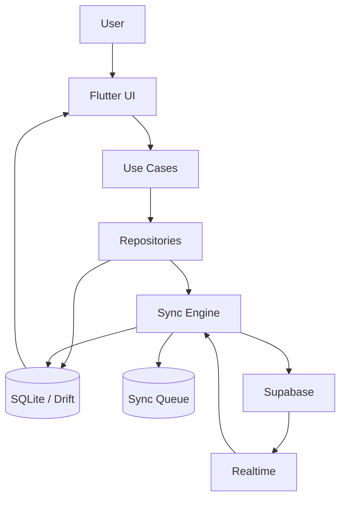
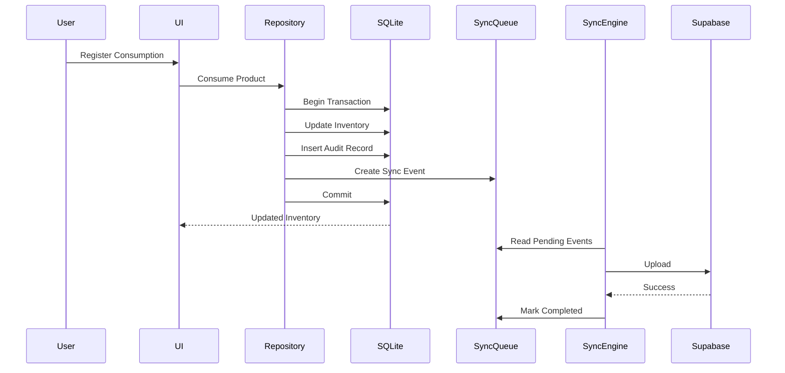
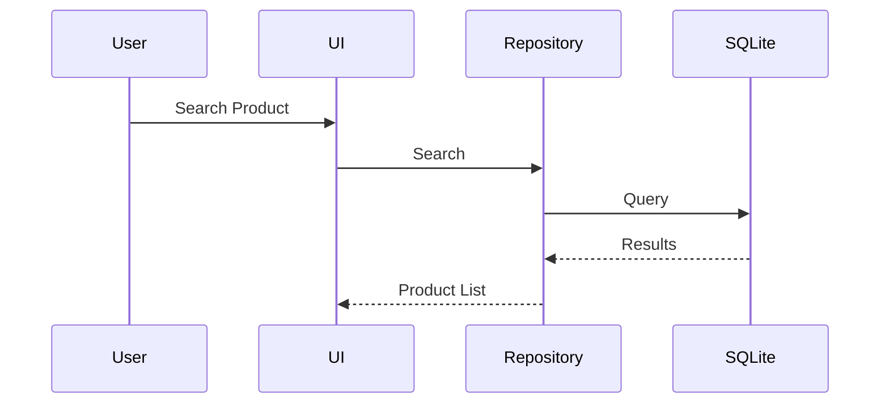
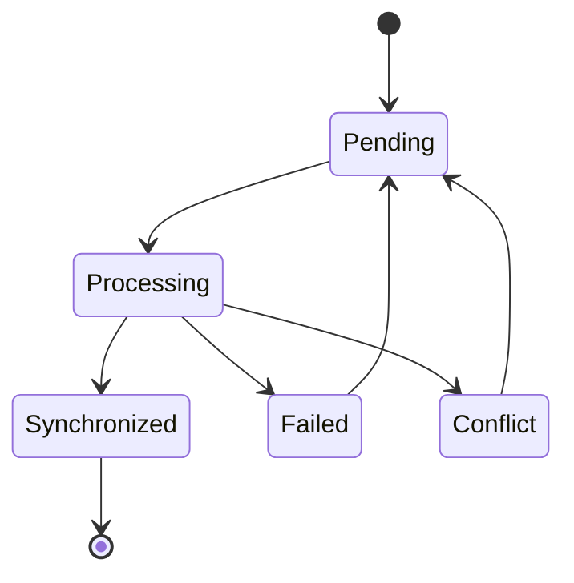
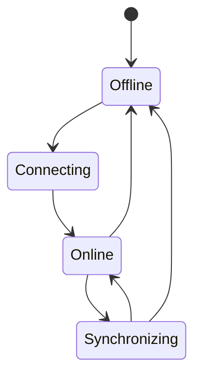

# 1. Purpose

This document defines the **Offline-First Architecture** of Baulera.

Offline support is a core architectural principle rather than an optional feature.

The application must remain fully operational regardless of network availability.

Synchronization is performed asynchronously whenever connectivity is restored.

---

# 2 Philosophy

Baulera is designed with the following principle:

> The user should never have to think about whether the application is online or offline.

Every interaction must behave identically in both situations.

The only difference is **when** synchronization occurs.

---

# 3 Objectives

The Offline-First architecture has the following objectives.

- Immediate user response.
- Zero data loss.
- Full application functionality without Internet.
- Automatic synchronization.
- Transparent conflict resolution.
- Reliable multi-device collaboration.
- Consistent local database.
- Background synchronization.

---

# 4 Design Principles

OF-001

SQLite is always the operational database.

---

OF-002

Every user action is committed locally before any network operation.

---

OF-003

Synchronization never blocks the UI.

---

OF-004

The application never depends on network availability.

---

OF-005

Synchronization always occurs in the background.

---

OF-006

Every committed transaction is durable.

---

OF-007

Local data remains available across application restarts.

---

OF-008

Cloud connectivity is an enhancement, not a dependency.

---

OF-009

Every modification is recoverable.

---

OF-010

Synchronization is deterministic.

---

# 5 Source of Truth

Baulera has two persistence layers.

## Local

SQLite (Drift)

Purpose

Operational database.

Used by

- UI
- Search
- Inventory
- Shopping List
- Statistics
- Voice Commands

---

## Cloud

Supabase PostgreSQL

Purpose

Shared synchronization database.

Used by

- Collaboration
- Backup
- Realtime
- Authentication

---

The UI always reads from SQLite.

It never queries Supabase directly.

---

# 6 Architecture

```text
                User

                  │

              Flutter UI

                  │

           Application Layer

                  │

             Repository Layer

          ┌────────┴────────┐

          │                 │

      SQLite           Sync Engine

          │                 │

          └────────┬────────┘

                   │

               Supabase
```

---

# 7 Read Strategy

Every read operation follows the same flow.

```text
UI

↓

Repository

↓

SQLite

↓

Result
```

Characteristics

- No network latency.
- Deterministic.
- Fast.
- Available offline.

Supabase is never queried for interactive reads.

---

# 8 Write Strategy

Every write operation follows this sequence.

```text
User

↓

Repository

↓

SQLite Transaction

↓

Audit Record

↓

Sync Event

↓

Commit

↓

UI Refresh

↓

Background Synchronization
```

The user receives confirmation immediately after the local transaction commits.

Cloud synchronization happens independently.

---

# 9 Offline Capabilities

The following features must work without Internet.

| Feature | Offline |
|----------|---------|
| Login (existing session) | ✔ |
| Inventory | ✔ |
| Shopping List | ✔ |
| Barcode Scan | ✔ (lookup deferred if needed) |
| Product Search | ✔ |
| Statistics | ✔ |
| Notifications | ✔ |
| Voice Commands | ✔ |
| Product Editing | ✔ |
| Inventory History | ✔ |

Only features requiring external services degrade gracefully.

Examples

- OpenFoodFacts lookup
- First authentication
- Initial household download

---

# 10 Data Availability

After the initial synchronization, all required business data exists locally.

```text
Categories

Brands

Products

Inventory

Shopping

Thresholds

Locations

Shelves

Settings

Notifications
```

No routine workflow depends on downloading data during normal operation.

---

# 11 Offline Session

If a valid authentication session already exists:

```text
Application Start

↓

Session Valid

↓

SQLite Opens

↓

UI Ready
```

Internet connectivity is not required.

Token renewal is attempted in the background when connectivity becomes available.

---

# 12 First Installation

Internet is required only once.

Sequence

```text
Install

↓

Login

↓

Download Household

↓

Initialize SQLite

↓

Ready
```

After this point the application becomes fully offline capable.

---

# 13 Offline Design Principles

- Reads always come from SQLite.
- Writes always commit locally first.
- The UI never waits for cloud responses.
- Synchronization is asynchronous.
- Local persistence survives application restarts.
- The application behaves consistently online and offline.
- Every committed operation becomes eligible for synchronization.
- Offline capability is a mandatory architectural requirement.

---

# 14 Local Write Pipeline

Every business operation is executed entirely inside SQLite before any network communication occurs.

The write pipeline is identical for all entities.

```text
User Action

↓

Validate Request

↓

Open SQLite Transaction

↓

Persist Business Entity

↓

Create Audit Record

↓

Create Sync Event

↓

Commit Transaction

↓

Refresh UI

↓

Schedule Background Sync
```

If any step fails before the transaction commits, the entire operation is rolled back.

---

# 15 Transaction Boundaries

Every business operation is atomic.

Examples

## Register Purchase

```text
Insert Inventory Batch

↓

Insert Inventory Movement

↓

Update Shopping Item

↓

Evaluate Threshold

↓

Insert Notification (if required)

↓

Insert Audit Record

↓

Insert Sync Event

↓

Commit
```

---

## Consume Product

```text
Update Inventory Batch

↓

Insert Inventory Movement

↓

Evaluate Threshold

↓

Update Shopping Item

↓

Insert Audit Record

↓

Insert Sync Event

↓

Commit
```

---

## Edit Product

```text
Update Product

↓

Insert Audit Record

↓

Insert Sync Event

↓

Commit
```

---

# 16 Read Pipeline

Every screen follows the same read path.

```text
Flutter UI

↓

Use Case

↓

Repository

↓

SQLite DAO

↓

SQLite

↓

Domain Model

↓

UI
```

Characteristics

- No network dependency.
- Constant response time.
- Predictable behavior.
- Testable.

---

# 17 Repository Responsibilities

Repositories abstract all persistence concerns.

Responsibilities

- Read SQLite
- Write SQLite
- Create Sync Events
- Hide Supabase implementation
- Hide Drift implementation
- Coordinate transactions

Repositories never expose SQL.

---

# 18 Sync Queue

Every successful transaction creates exactly one or more Sync Events.

```text
Business Change

↓

Sync Event

↓

Pending Queue
```

The queue is persistent.

It survives:

- Application restart
- Device reboot
- Network interruption
- Application crash

---

## Queue Ordering

Events are processed in creation order.

```text
1

↓

2

↓

3

↓

4
```

FIFO ordering guarantees deterministic synchronization.

---

# 19 Queue Contents

Each Sync Event contains:

| Field | Purpose |
|--------|---------|
| Event ID | Unique identifier |
| Entity | Target table |
| Entity ID | Business entity |
| Operation | Insert, Update, Delete |
| Payload | Serialized data |
| Version | Local version |
| Timestamp | Creation time |
| Device ID | Origin device |
| Retry Count | Retry tracking |
| Status | Pending, Processing, etc. |

The payload is sufficient to replay the operation safely.

---

# 20 Local Commit

The application confirms success immediately after the SQLite transaction commits.

```text
Commit

↓

UI Updated

↓

Success Message

↓

Background Synchronization
```

The user never waits for cloud confirmation.

---

# 21 Deferred Cloud Synchronization

Uploading begins only after the local transaction completes.

```text
Local Commit

↓

Queue Updated

↓

Synchronization Scheduled

↓

Internet Available?

↓

Yes → Upload

↓

No → Wait
```

No business operation is blocked by connectivity.

---

# 22 Application Restart

After restarting the application:

```text
Open SQLite

↓

Load Pending Queue

↓

Resume Synchronization

↓

Continue Normally
```

Pending events are never discarded automatically.

---

# 23 Crash Recovery

If the application crashes:

Before Commit

```text
Transaction

↓

Rollback
```

No partial data exists.

---

After Commit

```text
Transaction

↓

Committed

↓

Sync Queue Exists

↓

Resume Later
```

Synchronization resumes automatically on the next launch.

---

# 24 Queue Persistence

The synchronization queue is stored inside SQLite.

Benefits

- Crash resistant
- Offline capable
- Transactional
- Queryable
- Recoverable

The queue is not maintained in memory.

---

# 25 Background Worker

The Sync Engine runs independently from the UI.

Responsibilities

- Detect connectivity.
- Process pending events.
- Retry failures.
- Receive Realtime updates.
- Download remote changes.

The worker must stop gracefully when the application is terminated and resume automatically when restarted.

---

# 26 Local Database Guarantees

SQLite guarantees:

- ACID transactions.
- Durable commits.
- Referential integrity.
- Indexed queries.
- Consistent reads.
- Rollback on failure.

These guarantees are inherited by the Offline-First architecture.

---

# 27 Offline Write Principles

- Every write is transactional.
- SQLite commits before synchronization.
- Every transaction generates audit information.
- Every transaction generates synchronization metadata.
- The UI reflects committed local data immediately.
- Synchronization is completely decoupled from user interaction.
- Pending work survives crashes and restarts.
- FIFO ordering is preserved throughout synchronization.

---

# 28 Connectivity Detection

The application continuously monitors network availability.

Connectivity states

```text
Online

Offline

Connecting

Limited
```

Definitions

| State | Description |
|--------|-------------|
| Online | Internet available and Supabase reachable |
| Offline | No Internet connectivity |
| Connecting | Connectivity is being established |
| Limited | Internet available but Supabase temporarily unreachable |

The Sync Engine reacts automatically to state changes.

---

# 29 Connectivity Lifecycle

```text
Application Running

↓

Connectivity Changes

↓

Sync Engine Notified

↓

Evaluate Pending Queue

↓

Online?

↓

Yes

↓

Start Synchronization

↓

No

↓

Remain Offline
```

No user interaction is required.

---

# 30 Offline Operation

While offline:

The application continues operating normally.

Allowed operations include

- Register purchases
- Register consumption
- Edit products
- Create products
- Delete (soft delete)
- Barcode scanning
- Product search
- Shopping list
- Statistics
- Voice commands

External integrations are postponed until connectivity is restored.

---

# 31 Reconnection

When connectivity returns:

```text
Internet Available

↓

Reconnect

↓

Authenticate Session

↓

Resume Queue

↓

Upload Pending Events

↓

Receive Remote Updates

↓

Realtime Subscription

↓

Idle
```

Synchronization is completely automatic.

---

# 32 Incremental Synchronization

Only modified entities are synchronized.

```text
Pending Event

↓

Upload

↓

Success

↓

Remove Event
```

The application never uploads the complete database.

Advantages

- Low bandwidth
- Fast synchronization
- Battery efficient
- Predictable performance

---

# 33 Download Strategy

Remote updates are applied incrementally.

Sources

- Realtime
- Initial synchronization
- Manual refresh
- Scheduled synchronization

Pipeline

```text
Receive Remote Entity

↓

Validate

↓

Compare Version

↓

Apply Changes

↓

Refresh UI
```

Downloaded entities are applied inside SQLite transactions.

---

# 34 Conflict Detection

Conflicts occur when the same entity is modified independently on multiple devices.

Example

```text
Device A

Product

Quantity

5 → 4
```

```text
Device B

Product

Quantity

5 → 3
```

Both synchronize later.

Conflict detected.

---

## Conflict Metadata

Comparison uses

```text
Version

Updated At

Updated By

Device ID
```

This metadata exists on every synchronized entity.

---

# 35 Conflict Resolution

Version 1 uses **Last Write Wins (LWW)**.

Decision order

1. Highest version.
2. Most recent timestamp.
3. Device ID.

Result

Every device converges to the same state.

---

## Immutable Entities

These entities never participate in conflicts.

- Inventory Movements
- Audit Records
- Sync Events

They are append-only.

---

# 36 Synchronization Failures

Temporary failures

Examples

- Timeout
- Network interruption
- Server unavailable

Behavior

```text
Retry Later
```

Permanent failures

Examples

- Invalid authentication
- Unauthorized household
- Invalid payload

Behavior

```text
Pause Synchronization

↓

Log Error

↓

Notify User
```

---

# 37 Retry Policy

Retry intervals

```text
1 minute

↓

2 minutes

↓

5 minutes

↓

10 minutes

↓

30 minutes

↓

60 minutes

↓

Repeat Hourly
```

Retries use exponential backoff to reduce unnecessary network traffic.

Retry count is persisted in SQLite.

---

# 38 Duplicate Protection

Synchronization must be idempotent.

Duplicate uploads must not create duplicate data.

Mechanisms

- UUID identifiers
- Entity version
- Sync Event ID

Repeated processing of the same event produces the same final state.

---

# 39 Recovery After Failure

Example

```text
Upload Started

↓

Connection Lost

↓

Retry Scheduled

↓

Application Closed

↓

Restart

↓

Queue Reloaded

↓

Retry

↓

Success
```

No committed operation is lost.

---

# 40 Offline Synchronization Principles

- Connectivity changes are handled automatically.
- Offline mode is transparent to the user.
- Synchronization is incremental.
- Remote updates are transactional.
- Conflicts are deterministic.
- Retry is automatic.
- Synchronization is idempotent.
- Local commits always survive synchronization failures.
- The queue remains persistent until successful upload.
- Every synchronized device eventually converges to the same data.

---

# 41 Synchronization States

Every synchronized entity exposes its current synchronization state.

```text
Pending

Processing

Synchronized

Conflict

Failed
```

Definitions

| State | Description |
|--------|-------------|
| Pending | Waiting to be uploaded |
| Processing | Upload in progress |
| Synchronized | Local and cloud versions are consistent |
| Conflict | Automatic or manual conflict resolution required |
| Failed | Synchronization failed after the last attempt |

These states are internal to the application and primarily used by the Sync Engine.

---

# 42 Application Connectivity State

The application exposes an overall connectivity status.

Possible values

```text
Offline

Connecting

Online

Synchronizing
```

This state is derived from:

- Network connectivity
- Authentication session
- Pending synchronization queue
- Active synchronization tasks

---

## State Diagram

```text
Offline

↓

Connecting

↓

Online

↓

Synchronizing

↓

Online
```

Connection loss may occur from any state.

```text
Any State

↓

Offline
```

---

# 43 User Experience Principles

Offline mode should require no user training.

The application should behave naturally.

Users should not need to:

- Start synchronization manually.
- Retry operations manually.
- Save changes manually.
- Choose between local and cloud storage.

Synchronization is automatic.

---

# 44 UI Indicators

A small synchronization indicator is displayed in the application header.

Possible states

| Icon | Meaning |
|------|---------|
| Cloud Check | Fully synchronized |
| Cloud Upload | Synchronization in progress |
| Cloud Off | Offline |
| Warning | Synchronization issue |

The indicator informs the user without interrupting normal workflows.

---

# 45 Offline Notifications

The application informs the user only when necessary.

Examples

```text
Working Offline
```

Displayed once after losing connectivity.

---

```text
Synchronization Complete
```

Optional notification after a large synchronization.

---

```text
Synchronization Failed

Retrying...
```

Shown only for repeated failures.

---

Authentication problems require explicit user action.

---

# 46 UI Behavior During Offline Mode

All inventory screens remain fully interactive.

Supported operations

- Search products
- Consume inventory
- Register purchases
- Move inventory
- Edit products
- Add categories
- View statistics
- View shopping list
- Browse history

Unavailable cloud features fail gracefully.

Example

```text
OpenFoodFacts

↓

No Internet

↓

Offer Manual Product Creation
```

---

# 47 Pending Changes

The application internally tracks pending changes.

Examples

```text
3 Pending Changes
```

or

```text
Synchronization Complete
```

This information may be displayed on the Settings screen or Synchronization diagnostics page.

It is not shown during normal inventory workflows.

---

# 48 Background Synchronization

Synchronization starts automatically when one of the following occurs.

- Internet becomes available.
- User logs in.
- Application starts.
- Application returns to foreground.
- Periodic synchronization interval expires.
- Realtime reconnects.

No user interaction is required.

---

# 49 Background Execution

Synchronization continues while the application is active.

If supported by the operating system, synchronization may also continue briefly in the background.

Operating system limitations always take precedence.

If background execution is interrupted:

```text
Application Resumed

↓

Resume Synchronization
```

No pending work is discarded.

---

# 50 Local Notifications

Offline mode does not affect locally scheduled notifications.

Examples

- Product expiring soon.
- Shopping reminder.
- Threshold reached.

These notifications are generated from SQLite and therefore continue working without Internet access.

---

# 51 User Experience Goals

The user should perceive:

- Instant response.
- Reliable storage.
- Automatic synchronization.
- Consistent inventory.
- Minimal waiting.
- No technical complexity.

The application should feel identical whether online or offline.

---

# 52 Offline UX Principles

- Offline mode is transparent.
- Synchronization is invisible whenever possible.
- Errors are communicated only when user action is required.
- Local data is always prioritized.
- The interface never freezes while synchronizing.
- Connectivity indicators remain subtle.
- Background work never interrupts inventory tasks.
- Every successful local operation immediately updates the UI.
- Offline notifications continue functioning.
- User trust is built through predictable behavior.

---

# 53 Exceptional Scenarios

The Offline-First architecture must remain reliable even under unexpected conditions.

Examples

- Application crash
- Device reboot
- Battery depletion
- Network instability
- Authentication expiration
- Simultaneous edits
- Storage exhaustion

No committed business transaction may be lost.

---

# 54 Crash During Transaction

If the application crashes before the SQLite transaction commits:

```text
Begin Transaction

↓

Application Crash

↓

Rollback

↓

No Changes
```

The database remains consistent.

---

If the crash occurs after commit:

```text
Commit

↓

Crash

↓

Restart

↓

Pending Queue Restored

↓

Synchronization Continues
```

No data loss occurs.

---

# 55 Device Restart

After rebooting the device:

```text
Launch App

↓

Open SQLite

↓

Restore Session

↓

Load Pending Queue

↓

Reconnect

↓

Continue Synchronization
```

No manual recovery is required.

---

# 56 Authentication Expiration

If the authentication token expires:

```text
Token Expired

↓

Refresh Token

↓

Success

↓

Continue Synchronization
```

If refresh fails:

```text
User Login Required

↓

Pause Synchronization

↓

Keep Local Data
```

Local inventory remains fully available.

---

# 57 Storage Full

If the device runs out of storage:

Possible effects

- SQLite cannot grow.
- Images cannot be stored.
- New transactions may fail.

Behavior

- Abort the transaction.
- Preserve database consistency.
- Display an actionable error message.

No partial writes are allowed.

---

# 58 Long Offline Periods

The application may remain offline for extended periods.

Example

```text
30 Days Offline
```

Behavior

- Continue normal operation.
- Accumulate Sync Events.
- Preserve ordering.
- Synchronize incrementally after reconnection.

The synchronization queue has no functional expiration.

---

# 59 Large Synchronization Queue

Example

```text
2,000 Pending Events
```

Processing strategy

```text
Queue

↓

Batch Upload

↓

Commit

↓

Next Batch
```

Recommended batch size

```text
50 Events
```

Benefits

- Lower memory usage
- Faster retries
- Better progress tracking
- Reduced network overhead

---

# 60 Partial Synchronization Failure

Example

```text
50 Events

↓

45 Success

↓

5 Failed
```

Behavior

```text
Mark Successful Events

↓

Retry Failed Events

↓

Continue Queue
```

Previously synchronized events are never repeated unnecessarily.

---

# 61 Simultaneous Device Updates

Example

```text
Phone

↓

Consume Product
```

```text
Tablet

↓

Edit Product
```

Both synchronize independently.

Conflict resolution is deterministic according to the Sync Engine strategy.

All devices eventually converge to the same state.

---

# 62 Performance Considerations

Offline architecture prioritizes responsiveness.

Guidelines

- Read only from SQLite.
- Batch writes inside transactions.
- Process synchronization in batches.
- Avoid unnecessary object allocations.
- Cache frequently used reference data.
- Minimize serialization overhead.
- Perform network operations asynchronously.

---

## Expected Performance

| Operation | Target |
|-----------|--------|
| Product Search | <50 ms |
| Inventory Update | <150 ms |
| Purchase Registration | <200 ms |
| Consumption Registration | <150 ms |
| Queue Insert | <20 ms |
| Startup | <2 seconds |

These targets assume the expected household size defined in previous documents.

---

# 63 Operational Recommendations

Implementation guidelines

- Keep transactions short.
- Never perform network requests inside SQLite transactions.
- Use immutable domain models where practical.
- Generate UUIDs locally.
- Retry only transient failures.
- Log synchronization failures.
- Monitor queue size.
- Prevent duplicate Sync Events.
- Use indexes for queue processing.
- Avoid blocking the UI thread.

---

# 64 Offline-First Validation Checklist

Every new feature must satisfy the following requirements.

- Works without Internet.
- Reads from SQLite.
- Writes inside a transaction.
- Creates Audit Records when applicable.
- Creates Sync Events.
- Survives application restart.
- Survives device reboot.
- Does not block the UI.
- Synchronizes automatically.
- Handles retries safely.
- Preserves data consistency.
- Is idempotent when synchronized.

Features that cannot satisfy these requirements must explicitly document their online dependency.

---

# 65 Offline Architecture Principles

1. SQLite is the operational source of truth.
2. Every local commit is durable.
3. Network failures never invalidate committed work.
4. Synchronization is asynchronous.
5. Synchronization is incremental.
6. Recovery is automatic.
7. Local persistence survives crashes and reboots.
8. Conflicts are deterministic.
9. The user experience remains consistent regardless of connectivity.
10. Data integrity always takes precedence over synchronization speed.

---

# 66 Complete Offline-First Architecture



The UI always communicates with SQLite through the Repository layer.

Synchronization occurs entirely in the background.

---

# 67 Write Sequence



---

# 68 Read Sequence



No network request occurs.

---

# 69 Synchronization Lifecycle



Each Sync Event progresses independently through this lifecycle.

---

# 70 Connectivity State Machine



The application automatically transitions between states based on connectivity and synchronization activity.

---

# 71 Offline Decision Matrix

| Situation | User Can Continue | Sync Required | UI Impact |
|------------|------------------|---------------|-----------|
| Internet unavailable | Yes | Deferred | None |
| Supabase unavailable | Yes | Deferred | None |
| Realtime disconnected | Yes | No | None |
| Authentication expired | Yes (existing data) | Paused | Login required for cloud sync |
| SQLite failure | No | No | Critical error |
| Storage upload failed | Yes | Retry | Image upload delayed |
| OpenFoodFacts unavailable | Yes | No | Manual product entry |

---

# 72 Traceability Matrix

| Topic | Related Document |
|--------|------------------|
| Vision | 01-vision.md |
| Functional Requirements | 02-functional-requirements.md |
| Non-Functional Requirements | 03-non-functional-requirements.md |
| Domain Model | 04-domain-model.md |
| Use Cases | 05-use-cases.md |
| Architecture | 06-architecture.md |
| Project Structure | 07-project-structure.md |
| Database Design | 08-database-design.md |
| Supabase | 09-supabase.md |
| Synchronization Engine | 11-sync-engine.md |
| Security | 12-security.md |
| Notifications | 22-notifications.md |
| Testing | 23-testing.md |

---

# 73 Implementation Checklist

Every feature implemented in Baulera must satisfy the Offline-First architecture.

### Persistence

- SQLite is the first persistence target.
- Transactions are atomic.
- UUIDs are generated locally.
- Business entities are persisted before synchronization.

### Synchronization

- Sync Event generated.
- Audit Record generated.
- FIFO ordering preserved.
- Automatic retry supported.
- Idempotent upload.

### User Experience

- Immediate UI update.
- No waiting for cloud responses.
- Offline support.
- Automatic synchronization.
- Graceful degradation for cloud-only services.

### Reliability

- Crash safe.
- Restart safe.
- Reboot safe.
- Conflict resilient.
- Recovery automatic.

---

# 74 Glossary

| Term | Definition |
|------|------------|
| Offline-First | Architectural approach where the application operates independently of network connectivity. |
| SQLite | Local operational database used by the application. |
| Drift | ORM used to manage the SQLite database in Flutter. |
| Sync Engine | Background component responsible for synchronizing local and cloud data. |
| Sync Event | Persistent record representing a pending cloud synchronization operation. |
| Realtime | Supabase service used to notify clients of remote changes. |
| Source of Truth | The authoritative data source for a given context. SQLite is the operational source of truth; PostgreSQL is the shared collaborative source after synchronization. |
| LWW | Last Write Wins conflict resolution strategy. |
| Idempotent | An operation that produces the same result regardless of how many times it is executed. |
| Queue | Persistent FIFO structure storing pending synchronization events. |

---

# 75 Summary

The Offline-First architecture is the foundation of Baulera.

Its key characteristics are:

- SQLite is the operational database.
- The application remains fully functional without Internet.
- Every write operation commits locally before synchronization.
- Synchronization is asynchronous, incremental, and transparent.
- Pending operations survive crashes, restarts, and long offline periods.
- Conflicts are resolved deterministically.
- Realtime accelerates synchronization but is not required for correctness.
- Cloud services enhance collaboration without compromising offline usability.
- User experience remains consistent regardless of network conditions.
- Data integrity and durability always take precedence over synchronization speed.

This architecture enables Baulera to provide a fast, resilient, and reliable inventory management experience while supporting seamless collaboration across multiple devices.

---

