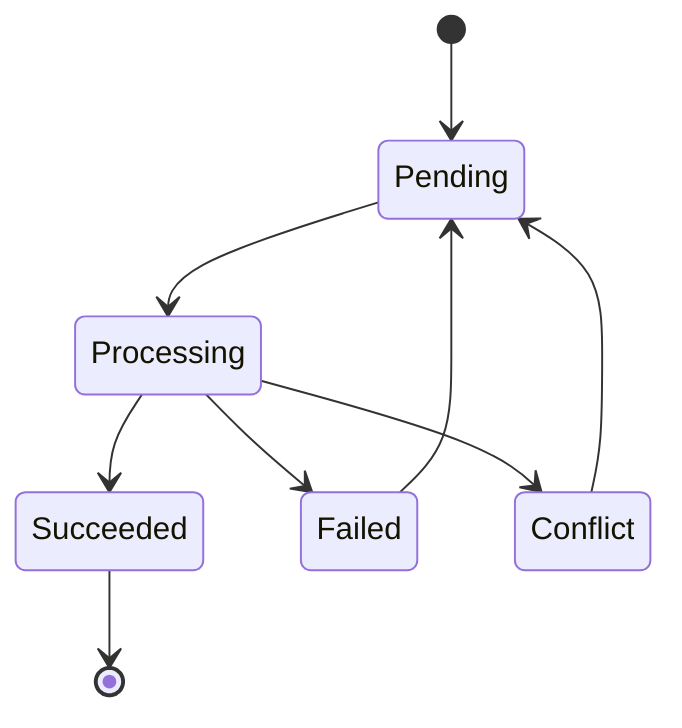
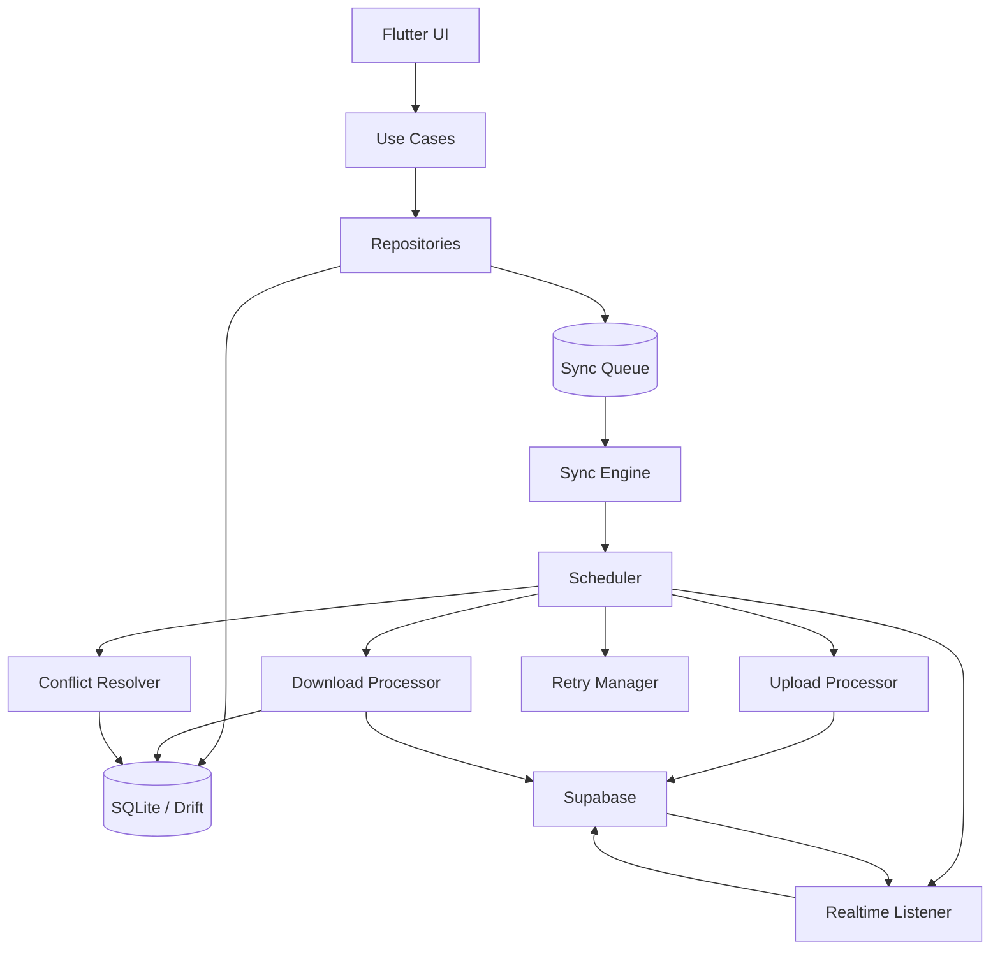
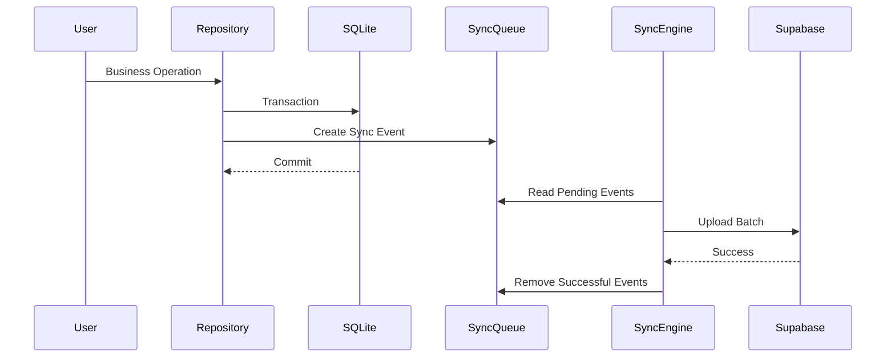
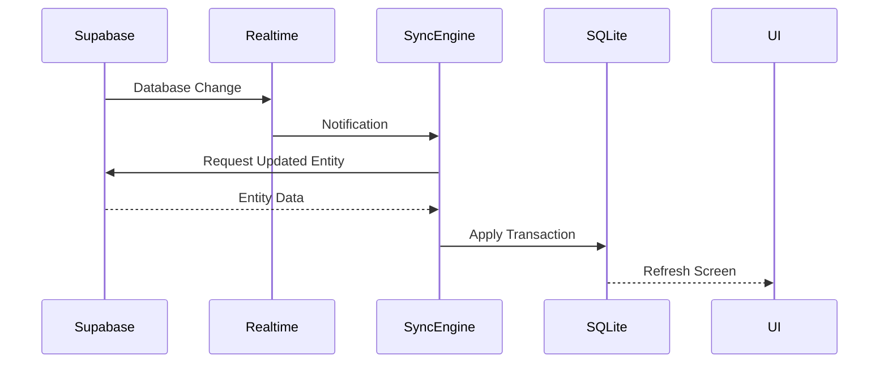
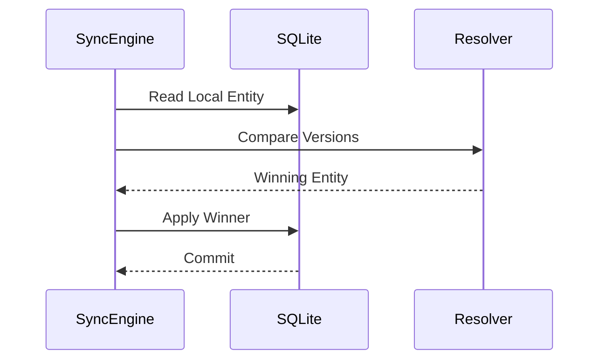
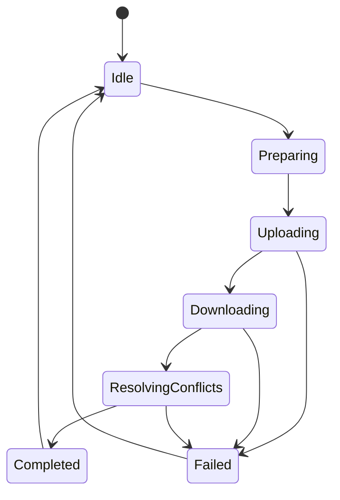
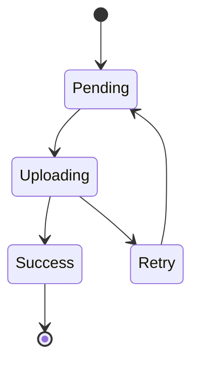

# 1. Purpose

This document defines the **Synchronization Engine (Sync Engine)** used by Baulera.

The Sync Engine is responsible for maintaining consistency between the local SQLite database (Drift) and the shared PostgreSQL database hosted in Supabase.

The synchronization process is:

- Automatic
- Incremental
- Deterministic
- Offline-first
- Eventually consistent

The Sync Engine operates entirely in the background and never blocks user interaction.

---

# 2 Objectives

The Sync Engine has the following objectives.

- Synchronize local changes with Supabase.
- Download remote changes.
- Keep all household devices consistent.
- Operate completely automatically.
- Minimize network traffic.
- Guarantee data durability.
- Survive crashes and application restarts.
- Support offline operation indefinitely.
- Resolve conflicts deterministically.
- Prevent duplicated operations.

---

# 3 Responsibilities

The Sync Engine is responsible for:

- Monitoring the synchronization queue.
- Uploading pending events.
- Downloading remote changes.
- Applying remote transactions.
- Detecting conflicts.
- Resolving conflicts.
- Receiving Realtime notifications.
- Scheduling retries.
- Maintaining synchronization metadata.
- Reporting synchronization status.

The Sync Engine is **not** responsible for business rules.

Business rules remain inside the Domain Layer.

---

# 4 Architecture

```text
                 Flutter

                    │

             Application Layer

                    │

              Repository Layer

        ┌───────────┴───────────┐

        │                       │

   SQLite (Drift)         Sync Engine

        │                       │

        └───────────┬───────────┘

                    │

              Supabase SDK

                    │

          PostgreSQL + Realtime
```

---

# 5 High-Level Workflow

```text
User Action

↓

SQLite Transaction

↓

Audit Record

↓

Sync Event

↓

Commit

↓

Background Upload

↓

Supabase

↓

Realtime

↓

Other Devices

↓

Local Apply

↓

Consistent Household
```

---

# 6 Design Principles

SE-001

Synchronization never blocks the UI.

---

SE-002

SQLite commits before synchronization.

---

SE-003

Every committed transaction produces synchronization metadata.

---

SE-004

Synchronization is incremental.

---

SE-005

Every operation is idempotent.

---

SE-006

Failures never invalidate committed local data.

---

SE-007

Synchronization survives application restarts.

---

SE-008

Synchronization order is deterministic.

---

SE-009

Network failures are expected.

---

SE-010

Eventually every synchronized device converges to the same state.

---

# 7 Engine Components

The Sync Engine consists of several cooperating components.

```text
Sync Manager

↓

Upload Processor

↓

Download Processor

↓

Realtime Listener

↓

Conflict Resolver

↓

Retry Scheduler

↓

Diagnostics
```

Each component has a single responsibility.

---

# 8 Synchronization Lifecycle

```text
Application Starts

↓

Open SQLite

↓

Load Pending Queue

↓

Restore Session

↓

Check Connectivity

↓

Upload Pending Events

↓

Download Remote Changes

↓

Subscribe Realtime

↓

Idle

↓

Repeat
```

The engine remains active during the application's lifetime.

---

# 9 Synchronization Triggers

Synchronization may start for several reasons.

Automatic triggers

- Application startup
- Connectivity restored
- New local change
- Realtime notification
- Periodic synchronization timer
- User login
- Manual synchronization request

The engine decides whether synchronization is required.

---

# 10 Synchronization Scope

Only synchronized entities are processed.

Included entities

- Products
- Categories
- Brands
- Locations
- Shelves
- Inventory Batches
- Shopping Items
- Thresholds
- Notifications
- User Settings

Append-only entities

- Inventory Movements
- Audit Records

Internal entities

- Sync Events

---

# 11 Eventual Consistency

Baulera guarantees **eventual consistency**.

This means:

Immediately after a local operation:

```text
SQLite

Updated
```

Cloud:

```text
Pending
```

Later:

```text
SQLite

=

Supabase

=

Other Devices
```

Temporary differences between devices are expected and acceptable.

---

# 12 Operational Guarantees

The Sync Engine guarantees:

- No committed operation is lost.
- Every Sync Event is eventually processed.
- Duplicate processing is safe.
- Synchronization is deterministic.
- Queue ordering is preserved.
- Local responsiveness is maintained.
- Remote updates are transactional.
- Recovery is automatic after failures.

---

# 13 Core Principles

- SQLite is always the operational source of truth.
- Supabase is the shared synchronization platform.
- Synchronization is asynchronous.
- All synchronization work occurs in the background.
- Queue processing is persistent.
- Synchronization never requires user intervention.
- Every device eventually converges to the same dataset.
- Reliability has priority over synchronization speed.

---

# 14 Sync Queue

The Sync Queue is the persistent list of pending synchronization operations.

Every successful local transaction generates one or more Sync Events.

The queue is stored inside SQLite.

```text
Business Transaction

↓

Sync Event

↓

SQLite Queue

↓

Sync Engine

↓

Supabase
```

The queue survives:

- Application restart
- Device reboot
- Network loss
- Authentication expiration
- Application crash

---

# 15 Queue Responsibilities

The Sync Queue is responsible for:

- Persisting pending synchronization work.
- Preserving operation order.
- Tracking retries.
- Tracking synchronization state.
- Supporting recovery after failures.
- Preventing lost updates.

The queue is **not** responsible for conflict resolution.

---

# 16 Sync Event Structure

Each Sync Event contains the information required to replay a business operation.

| Field | Description |
|--------|-------------|
| event_id | Unique UUID |
| entity_type | Target entity |
| entity_id | Business entity UUID |
| household_id | Household owner |
| operation | INSERT, UPDATE, DELETE |
| payload | Serialized entity data |
| entity_version | Current entity version |
| device_id | Origin device |
| user_id | User who generated the change |
| created_at | Event creation timestamp |
| retry_count | Number of retries |
| state | Current synchronization state |
| error_message | Last synchronization error |

---

# 17 Queue States

Each Sync Event progresses through a defined lifecycle.

Possible states

```text
Pending

Processing

Succeeded

Failed

Conflict
```

Definitions

| State | Description |
|--------|-------------|
| Pending | Waiting for upload |
| Processing | Upload in progress |
| Succeeded | Successfully synchronized |
| Failed | Upload failed, retry scheduled |
| Conflict | Conflict detected during synchronization |

Succeeded events are removed from the queue after successful confirmation.

---

# 18 Queue State Machine



Every transition is persisted.

---

# 19 FIFO Processing

Events are processed in creation order.

```text
Event 1

↓

Event 2

↓

Event 3

↓

Event 4
```

The queue guarantees First-In, First-Out ordering.

Ordering is maintained per Household.

---

# 20 Batch Processing

To improve performance, events are uploaded in batches.

Example

```text
Batch Size

50 Events
```

Processing

```text
Queue

↓

Read First 50

↓

Upload

↓

Commit

↓

Next Batch
```

Batch size is configurable.

Recommended default

```text
50
```

---

# 21 Queue Priorities

Version 1 uses a single priority level.

All events are processed in FIFO order.

Future versions may introduce priorities such as

- Critical
- High
- Normal
- Low

This is intentionally deferred to keep synchronization deterministic.

---

# 22 Event Creation

Every successful business transaction creates synchronization metadata.

Example

```text
Consume Product

↓

Update Inventory Batch

↓

Insert Inventory Movement

↓

Insert Audit Record

↓

Create Sync Event

↓

Commit
```

No Sync Event is created until the transaction is ready to commit.

---

# 23 Event Removal

A Sync Event is removed only after:

```text
Upload Success

↓

Server Confirmation

↓

SQLite Transaction

↓

Delete Queue Entry
```

Events are never removed before successful acknowledgment.

---

# 24 Queue Recovery

During application startup

```text
Open SQLite

↓

Read Queue

↓

Pending Events?

↓

Yes

↓

Resume Processing
```

Queue recovery is automatic.

---

# 25 Queue Integrity

The queue satisfies the following guarantees.

- Persistent.
- Transactional.
- Crash-safe.
- Ordered.
- Recoverable.
- Idempotent.
- Queryable.

No in-memory queue is maintained.

SQLite is the only queue implementation.

---

# 26 Queue Maintenance

Periodic maintenance removes obsolete information.

Eligible for cleanup

- Successfully synchronized events.
- Old diagnostic entries.
- Expired retry metadata.

Cleanup never affects pending events.

Maintenance runs in the background.

---

# 27 Queue Design Principles

- Every local transaction generates synchronization metadata.
- Queue persistence is mandatory.
- FIFO ordering is preserved.
- Queue entries are immutable after creation, except for synchronization metadata.
- Successful events are removed only after server confirmation.
- Queue recovery is automatic.
- Failed events remain recoverable.
- Synchronization is resilient to crashes and restarts.

---

# 28 Upload Pipeline

The Upload Pipeline is responsible for transferring locally committed changes to Supabase.

The pipeline always operates in the background.

```text
Pending Event

↓

Validate

↓

Serialize

↓

Upload

↓

Server Confirmation

↓

Mark Synchronized

↓

Remove Queue Entry
```

The upload pipeline never modifies the business transaction.

---

# 29 Upload Flow

```text
Read Queue

↓

Pending Event

↓

Connectivity Available?

↓

No

↓

Wait

↓

Yes

↓

Authenticate

↓

Upload

↓

Success?

↓

Yes

↓

Complete

↓

No

↓

Retry
```

The queue remains intact until upload succeeds.

---

# 30 Upload Transaction

Each upload follows the same sequence.

```text
Processing

↓

Read Payload

↓

Validate Version

↓

Upload Entity

↓

Receive Confirmation

↓

Commit Queue Update

↓

Continue
```

The Sync Engine never uploads partially serialized entities.

---

# 31 Download Pipeline

The Download Pipeline applies remote changes received from Supabase.

Sources

- Realtime
- Initial synchronization
- Manual synchronization
- Periodic synchronization

Flow

```text
Receive Entity

↓

Validate

↓

Conflict Detection

↓

SQLite Transaction

↓

Apply Changes

↓

Commit

↓

Refresh UI
```

Downloads are applied atomically.

---

# 32 Initial Synchronization

First login downloads the complete household.

Sequence

```text
Authenticate

↓

Download Categories

↓

Download Brands

↓

Download Locations

↓

Download Shelves

↓

Download Products

↓

Download Inventory

↓

Download Thresholds

↓

Download Shopping List

↓

Download Notifications

↓

Download User Settings

↓

Ready
```

After initialization, only incremental synchronization is used.

---

# 33 Incremental Synchronization

Incremental synchronization transfers only modified entities.

```text
Last Sync Timestamp

↓

Request Changes

↓

Receive Modified Rows

↓

Apply

↓

Update Last Sync
```

Benefits

- Lower bandwidth
- Faster synchronization
- Reduced battery usage
- Smaller payloads

---

# 34 Realtime Listener

The Realtime Listener subscribes to Household events.

```text
Supabase

↓

Realtime

↓

Sync Engine

↓

Download Processor

↓

SQLite

↓

UI
```

Realtime accelerates synchronization.

It is not required for correctness.

---

# 35 Realtime Events

Supported events

```text
INSERT

UPDATE

DELETE

SYNC
```

Future events

```text
HOUSEHOLD_UPDATED

USER_JOINED

USER_LEFT
```

Unknown events are ignored safely.

---

# 36 Synchronization Scheduling

Synchronization begins automatically when:

- Local transaction commits.
- Connectivity returns.
- Realtime notification arrives.
- Application starts.
- User signs in.
- Application returns to foreground.
- Periodic synchronization timer expires.

The scheduler prevents overlapping synchronization jobs.

---

# 37 Parallelism

Version 1 uses a conservative execution model.

Upload

```text
Single Worker
```

Download

```text
Single Worker
```

Conflict Resolution

```text
Single Worker
```

This simplifies correctness and preserves deterministic ordering.

Future versions may parallelize independent entity groups.

---

# 38 Synchronization Lock

Only one synchronization session may execute at a time.

```text
Synchronization Running

↓

New Request

↓

Already Running?

↓

Yes

↓

Ignore Request
```

The active synchronization cycle completes before another begins.

---

# 39 Background Execution

The Sync Engine operates independently from the UI thread.

Responsibilities

- Upload events
- Download changes
- Retry failures
- Receive Realtime events
- Schedule future work

The UI remains responsive throughout synchronization.

---

# 40 Processing Guarantees

The Upload and Download Pipelines guarantee:

- Incremental synchronization.
- Transactional application.
- Ordered uploads.
- Deterministic downloads.
- Atomic updates.
- Safe retries.
- Background execution.
- Automatic scheduling.
- No duplicate processing.
- Eventual consistency.

---

# 41 Conflict Detection

A conflict occurs when two or more devices modify the same synchronized entity independently before synchronization completes.

Example

```text
Initial State

Quantity = 5
```

Device A

```text
Quantity = 4
```

Device B

```text
Quantity = 3
```

Both devices synchronize later.

The Sync Engine detects that the entity has diverged.

---

# 42 Conflict Detection Strategy

Every synchronized entity contains metadata used to detect concurrent modifications.

Required metadata

| Field | Purpose |
|--------|---------|
| version | Entity revision number |
| updated_at | Last modification timestamp |
| updated_by | User UUID |
| device_id | Originating device |
| household_id | Ownership validation |

Before applying a remote update, the Sync Engine compares this metadata with the local entity.

---

# 43 Versioning

Every synchronized entity contains an integer version.

Example

```text
Product

Version 1

↓

Edit

↓

Version 2

↓

Edit

↓

Version 3
```

Version numbers always increase.

Versions are never reused.

---

## Version Rules

- Created entities start at Version 1.
- Every successful modification increments the version.
- Synchronization never decreases a version.
- Immutable entities do not require version increments.

---

# 44 Conflict Resolution Strategy

Version 1 adopts **Last Write Wins (LWW)**.

Resolution order

1. Highest version.
2. Most recent `updated_at`.
3. Lowest lexical `device_id` (deterministic tie breaker).

This guarantees that every device reaches the same final state.

---

# 45 Merge Strategies

Different entity types require different merge behavior.

| Entity | Merge Strategy |
|---------|----------------|
| Product | Last Write Wins |
| Category | Last Write Wins |
| Brand | Last Write Wins |
| Shelf | Last Write Wins |
| Location | Last Write Wins |
| Threshold | Last Write Wins |
| Shopping Item | Last Write Wins |
| User Settings | Last Write Wins |
| Inventory Batch | Last Write Wins |
| Inventory Movement | Append Only |
| Audit Record | Append Only |
| Sync Event | Local Only |

Append-only entities never overwrite previous data.

---

# 46 Non-Conflicting Operations

Many operations cannot generate conflicts.

Examples

```text
Insert Inventory Movement
```

```text
Insert Audit Record
```

```text
Create Notification
```

```text
Create Sync Event
```

These entities are immutable and therefore merged by simple insertion.

---

# 47 Concurrent Updates

Example

Device A

```text
Rename Product
```

Device B

```text
Change Threshold
```

Both update the same Product.

Version comparison determines the winning state.

Future versions may support field-level merging.

---

# 48 Conflict Workflow

```text
Remote Entity

↓

Compare Version

↓

Conflict?

↓

No

↓

Apply

↓

Done
```

If conflict detected

```text
Conflict

↓

Resolve Automatically

↓

Apply Winning Version

↓

Continue Synchronization
```

Manual conflict resolution is intentionally omitted from Version 1.

---

# 49 Entity Validation

Before applying a remote entity

Validation includes

- Household ownership
- UUID integrity
- Entity version
- Foreign key existence
- Required fields
- Soft delete state

Invalid entities are rejected and logged.

---

# 50 Synchronization Transactions

Every remote update executes inside a SQLite transaction.

```text
Begin Transaction

↓

Validate

↓

Apply Entity

↓

Update Metadata

↓

Commit
```

If validation fails

```text
Rollback
```

The local database remains consistent.

---

# 51 Conflict Logging

Every automatically resolved conflict generates a diagnostic record.

Logged information

- Entity type
- Entity ID
- Local version
- Remote version
- Winning device
- Resolution strategy
- Timestamp

Conflict logs assist future diagnostics but do not affect application behavior.

---

# 52 Conflict Resolution Principles

- Conflict detection is automatic.
- Conflict resolution is deterministic.
- Last Write Wins is the default strategy.
- Append-only entities never conflict.
- Every synchronized entity is versioned.
- Validation occurs before applying remote data.
- SQLite transactions guarantee atomic updates.
- Automatic resolution requires no user interaction.
- Every device converges toward the same state.
- Future merge strategies can replace LWW without changing the overall architecture.

---

# 53 Retry Strategy

Synchronization failures are expected and handled automatically.

The Sync Engine retries only transient failures.

Examples

- Network unavailable
- Timeout
- Temporary server error
- Lost connection
- Realtime interruption

Permanent failures require user intervention or application updates.

---

# 54 Retry Lifecycle

```text
Upload

↓

Failure

↓

Increment Retry Count

↓

Schedule Retry

↓

Wait

↓

Retry

↓

Success?

↓

Yes

↓

Complete

↓

No

↓

Repeat
```

Retries continue until the operation succeeds or is classified as a permanent failure.

---

# 55 Retry Schedule

The retry mechanism uses exponential backoff.

Default schedule

| Attempt | Delay |
|----------|------:|
| 1 | 1 minute |
| 2 | 2 minutes |
| 3 | 5 minutes |
| 4 | 10 minutes |
| 5 | 30 minutes |
| 6 | 1 hour |
| 7+ | Every hour |

The schedule is configurable.

Retry metadata is stored inside SQLite.

---

# 56 Failure Classification

Failures are categorized before scheduling retries.

## Transient Failures

Examples

- Network timeout
- DNS failure
- Connection lost
- HTTP 429
- HTTP 500
- HTTP 502
- HTTP 503
- HTTP 504

Behavior

```text
Retry
```

---

## Permanent Failures

Examples

- Invalid payload
- Unauthorized household
- Authentication permanently revoked
- Corrupted entity
- Invalid schema

Behavior

```text
Pause Event

↓

Log Error

↓

Notify User
```

No automatic retry is performed until the underlying issue is resolved.

---

# 57 Idempotency

Synchronization operations must be idempotent.

Executing the same Sync Event multiple times must produce the same final state.

Example

```text
Upload Product

↓

Timeout

↓

Retry Upload
```

The Product is updated only once.

Mechanisms

- UUID primary keys
- Entity version
- Sync Event ID
- UPSERT operations

---

# 58 Duplicate Protection

Duplicate synchronization may occur because of:

- Network retries
- Lost acknowledgements
- Realtime reconnect
- Application restart

Protection mechanisms

- UUID comparison
- Version comparison
- Event identifiers
- Server-side UPSERT semantics

Duplicate processing is always safe.

---

# 59 Crash Recovery

If the application terminates unexpectedly

```text
Crash

↓

Restart

↓

Open SQLite

↓

Recover Queue

↓

Resume Synchronization
```

The queue is never reconstructed from memory.

SQLite contains the complete synchronization state.

---

# 60 Interrupted Synchronization

Example

```text
Batch

50 Events

↓

20 Uploaded

↓

Application Closed
```

After restart

```text
Remaining 30 Events

↓

Resume Processing
```

Successfully processed events are not uploaded again.

---

# 61 Diagnostics

The Sync Engine records operational diagnostics.

Examples

- Synchronization duration
- Queue length
- Retry count
- Failed uploads
- Conflict count
- Download count
- Realtime reconnects
- Authentication failures

Diagnostics are intended for troubleshooting and monitoring.

---

# 62 Health Monitoring

The Sync Engine continuously evaluates its own health.

Metrics

| Metric | Purpose |
|--------|---------|
| Pending Queue Size | Detect backlog |
| Oldest Pending Event | Detect stalled synchronization |
| Average Upload Time | Performance monitoring |
| Retry Rate | Network quality |
| Conflict Frequency | Multi-device behavior |
| Synchronization Duration | Overall efficiency |

Thresholds may generate warnings in future versions.

---

# 63 Recovery Principles

The Sync Engine guarantees

- Automatic recovery.
- Crash resilience.
- Safe retries.
- Persistent synchronization state.
- Idempotent processing.
- Duplicate protection.
- Transactional updates.
- Background execution.
- Deterministic behavior.
- Eventual consistency.

---

# 64 Reliability Principles

- Failures are expected.
- Retries are automatic.
- Only transient failures are retried.
- Permanent failures remain visible until resolved.
- Synchronization state is persisted.
- Queue recovery requires no user interaction.
- Duplicate operations are harmless.
- Diagnostics support troubleshooting.
- Reliability has higher priority than synchronization speed.
- No committed business transaction is ever discarded.

---

# 65 Background Execution

The Sync Engine executes independently from the Flutter UI.

Synchronization must never block rendering, navigation, animations, or user interaction.

Execution model

```text
Flutter UI

↓

Repositories

↓

SQLite

↓

Sync Queue

↓

Background Sync Engine

↓

Supabase
```

The UI communicates only with SQLite.

---

# 66 Synchronization Scheduler

The Scheduler coordinates when synchronization should occur.

Responsibilities

- Start synchronization.
- Prevent overlapping executions.
- Schedule retries.
- Resume interrupted work.
- Trigger incremental downloads.
- Maintain synchronization intervals.

The Scheduler is event-driven rather than continuously polling.

---

# 67 Synchronization Triggers

Synchronization begins automatically when one or more triggers occur.

Primary triggers

- Local transaction committed.
- Internet connectivity restored.
- User authenticated.
- Application started.
- Application resumed.
- Realtime notification received.

Secondary triggers

- Manual synchronization request.
- Periodic health verification.
- Retry timer expiration.

The Scheduler consolidates multiple triggers into a single synchronization cycle.

---

# 68 Execution States

The Sync Engine maintains its own execution state.

```text
Idle

Preparing

Uploading

Downloading

Resolving Conflicts

Completed

Failed
```

State transitions

```text
Idle

↓

Preparing

↓

Uploading

↓

Downloading

↓

Completed

↓

Idle
```

Failure may occur from any state.

---

# 69 Background Lifecycle

Application lifecycle interaction

```text
Application Started

↓

Initialize Engine

↓

Idle

↓

Synchronization Trigger

↓

Execute

↓

Idle
```

Application backgrounded

```text
Background

↓

Pause Long Operations

↓

Persist State
```

Application resumed

```text
Foreground

↓

Restore State

↓

Continue Synchronization
```

---

# 70 Performance Targets

Expected synchronization performance

| Operation | Target |
|-----------|--------|
| Queue Read | <20 ms |
| Queue Insert | <20 ms |
| Upload Batch | <1 second |
| Download Batch | <1 second |
| Conflict Resolution | <100 ms |
| Queue Recovery | <200 ms |
| Realtime Processing | <250 ms |

These targets assume the expected household size defined in the architecture documents.

---

# 71 Monitoring

The Sync Engine exposes runtime metrics.

Examples

```text
Pending Events

Current State

Queue Length

Synchronization Time

Retry Count

Realtime Status

Connectivity

Last Successful Sync
```

These metrics are available through an internal diagnostics service.

---

# 72 Diagnostic Screen

A hidden diagnostics screen is recommended for development and support.

Suggested information

Synchronization

```text
Current State

Pending Queue

Retry Count

Conflicts

Last Sync
```

Connectivity

```text
Internet

Supabase

Realtime

Authentication
```

Performance

```text
Average Upload

Average Download

Synchronization Duration
```

This screen is optional in production builds.

---

# 73 Logging

The Sync Engine generates structured logs.

Examples

```text
Synchronization Started
```

```text
Upload Batch Completed
```

```text
Conflict Resolved
```

```text
Retry Scheduled
```

```text
Realtime Connected
```

Logs should contain

- Timestamp
- Severity
- Component
- Event
- Entity ID (when applicable)

Sensitive information is never logged.

---

# 74 Resource Management

The Sync Engine minimizes resource consumption.

Guidelines

- Avoid unnecessary polling.
- Batch uploads.
- Batch downloads.
- Reuse database connections.
- Release subscriptions when inactive.
- Minimize memory allocations.
- Compress payloads where appropriate.
- Avoid long-running SQLite transactions.

The engine is optimized for battery efficiency.

---

# 75 Scalability

Although Baulera targets small households, the Sync Engine is designed to scale.

Supported future enhancements

- Multiple households.
- Multiple synchronization workers.
- Parallel uploads.
- Field-level merges.
- Delta synchronization.
- Push-driven synchronization.
- Selective synchronization.
- Background operating system jobs.

The current architecture does not require structural changes to support these capabilities.

---

# 76 Implementation Principles

- Synchronization is event-driven.
- Background execution is independent of the UI.
- The Scheduler coordinates all synchronization work.
- Performance is optimized through batching.
- Diagnostics are always available for troubleshooting.
- Logging is structured and secure.
- Resource usage is minimized.
- Scalability is achieved through modular engine components.
- Future enhancements preserve backward compatibility.
- The Sync Engine remains isolated from business logic.

---

# 77 Complete Synchronization Architecture



The Sync Engine is fully decoupled from the business layer and interacts only through the Repository layer and SQLite.

---

# 78 Upload Sequence



---

# 79 Download Sequence



---

# 80 Conflict Resolution Sequence



---

# 81 Synchronization State Machine



---

# 82 Retry State Machine



---

# 83 Processing Pipeline

```text
Business Transaction

↓

SQLite Commit

↓

Audit Record

↓

Sync Event

↓

Pending Queue

↓

Upload Processor

↓

Supabase

↓

Realtime

↓

Download Processor

↓

Conflict Resolver

↓

SQLite Transaction

↓

Updated UI
```

This pipeline is executed continuously throughout the application's lifetime.

---

# 84 Traceability Matrix

| Sync Engine Component | Related Document |
|----------------------|------------------|
| Offline Architecture | 10-offline-first.md |
| SQLite Schema | 08-database-design.md |
| Supabase Integration | 09-supabase.md |
| Repository Layer | 06-architecture.md |
| Domain Model | 04-domain-model.md |
| Security | 12-security.md |
| Notifications | 22-notifications.md |
| Testing | 23-testing.md |
| CI/CD | 24-cicd.md |

---

# 85 Implementation Checklist

## Queue

- Persistent SQLite queue.
- FIFO ordering.
- UUID identifiers.
- Batch processing.
- Crash recovery.

---

## Upload

- Incremental synchronization.
- Background execution.
- Automatic retries.
- Idempotent operations.
- Authentication validation.

---

## Download

- Incremental updates.
- Transactional application.
- Realtime integration.
- Version validation.
- SQLite commit.

---

## Conflict Resolution

- Entity versioning.
- Last Write Wins.
- Append-only entities.
- Automatic resolution.
- Conflict diagnostics.

---

## Reliability

- Automatic recovery.
- Persistent synchronization state.
- Retry scheduling.
- Queue integrity.
- Duplicate protection.

---

## Monitoring

- Structured logging.
- Runtime metrics.
- Diagnostic screen.
- Synchronization statistics.
- Health monitoring.

---

# 86 Glossary

| Term | Definition |
|------|------------|
| Batch | A group of Sync Events processed together. |
| Conflict | Concurrent modification of the same synchronized entity. |
| Conflict Resolver | Component responsible for deterministic conflict resolution. |
| Download Processor | Component that applies remote changes locally. |
| Eventual Consistency | Property ensuring all devices eventually converge to the same state. |
| FIFO | First-In, First-Out queue processing order. |
| Retry Manager | Component that schedules retries after transient failures. |
| Scheduler | Component coordinating synchronization execution. |
| Sync Event | Persistent representation of a pending synchronization operation. |
| Upload Processor | Component responsible for sending local changes to Supabase. |

---

# 87 Summary

The Sync Engine is the foundation of Baulera's collaborative architecture.

Its primary responsibilities are to ensure that every committed local change is safely propagated to the cloud and that every remote change is consistently applied to every participating device.

Key architectural characteristics

- Event-driven synchronization.
- Persistent FIFO synchronization queue.
- Offline-first operation.
- SQLite-first persistence.
- Incremental upload and download.
- Automatic conflict detection.
- Deterministic conflict resolution using Last Write Wins.
- Automatic retry with exponential backoff.
- Crash-safe recovery.
- Idempotent processing.
- Background execution independent of the UI.
- Realtime integration for rapid propagation.
- Eventual consistency across all household devices.
- Structured diagnostics and monitoring.
- Modular architecture supporting future scalability.

Together with the Offline-First architecture and Supabase integration, the Sync Engine provides a resilient synchronization platform that allows Baulera to function reliably in unreliable network conditions while maintaining a fast and seamless user experience.

---


