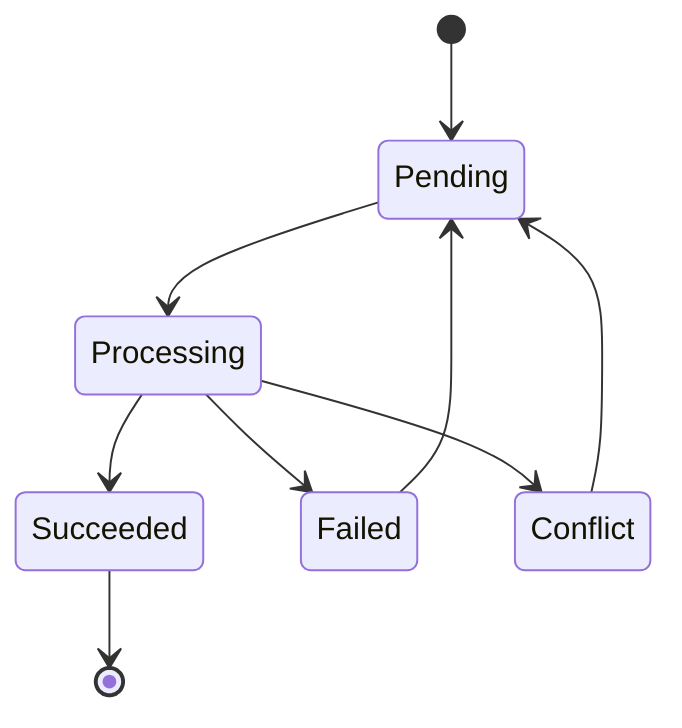

# 1. Purpose

This document defines the **Synchronization Engine (Sync Engine)** used by Baulera.

The Sync Engine is responsible for maintaining consistency between the local SQLite database (Drift) and the shared PostgreSQL database hosted in Supabase.

The synchronization process is:

- Automatic
- Incremental
- Deterministic
- Offline-first
- Eventually consistent

The Sync Engine operates entirely in the background and never blocks user interaction.

---

# 2 Objectives

The Sync Engine has the following objectives.

- Synchronize local changes with Supabase.
- Download remote changes.
- Keep all household devices consistent.
- Operate completely automatically.
- Minimize network traffic.
- Guarantee data durability.
- Survive crashes and application restarts.
- Support offline operation indefinitely.
- Resolve conflicts deterministically.
- Prevent duplicated operations.

---

# 3 Responsibilities

The Sync Engine is responsible for:

- Monitoring the synchronization queue.
- Uploading pending events.
- Downloading remote changes.
- Applying remote transactions.
- Detecting conflicts.
- Resolving conflicts.
- Receiving Realtime notifications.
- Scheduling retries.
- Maintaining synchronization metadata.
- Reporting synchronization status.

The Sync Engine is **not** responsible for business rules.

Business rules remain inside the Domain Layer.

---

# 4 Architecture

```text
                 Flutter

                    │

             Application Layer

                    │

              Repository Layer

        ┌───────────┴───────────┐

        │                       │

   SQLite (Drift)         Sync Engine

        │                       │

        └───────────┬───────────┘

                    │

              Supabase SDK

                    │

          PostgreSQL + Realtime
```

---

# 5 High-Level Workflow

```text
User Action

↓

SQLite Transaction

↓

Audit Record

↓

Sync Event

↓

Commit

↓

Background Upload

↓

Supabase

↓

Realtime

↓

Other Devices

↓

Local Apply

↓

Consistent Household
```

---

# 6 Design Principles

SE-001

Synchronization never blocks the UI.

---

SE-002

SQLite commits before synchronization.

---

SE-003

Every committed transaction produces synchronization metadata.

---

SE-004

Synchronization is incremental.

---

SE-005

Every operation is idempotent.

---

SE-006

Failures never invalidate committed local data.

---

SE-007

Synchronization survives application restarts.

---

SE-008

Synchronization order is deterministic.

---

SE-009

Network failures are expected.

---

SE-010

Eventually every synchronized device converges to the same state.

---

# 7 Engine Components

The Sync Engine consists of several cooperating components.

```text
Sync Manager

↓

Upload Processor

↓

Download Processor

↓

Realtime Listener

↓

Conflict Resolver

↓

Retry Scheduler

↓

Diagnostics
```

Each component has a single responsibility.

---

# 8 Synchronization Lifecycle

```text
Application Starts

↓

Open SQLite

↓

Load Pending Queue

↓

Restore Session

↓

Check Connectivity

↓

Upload Pending Events

↓

Download Remote Changes

↓

Subscribe Realtime

↓

Idle

↓

Repeat
```

The engine remains active during the application's lifetime.

---

# 9 Synchronization Triggers

Synchronization may start for several reasons.

Automatic triggers

- Application startup
- Connectivity restored
- New local change
- Realtime notification
- Periodic synchronization timer
- User login
- Manual synchronization request

The engine decides whether synchronization is required.

---

# 10 Synchronization Scope

Only synchronized entities are processed.

Included entities

- Products
- Categories
- Brands
- Locations
- Shelves
- Inventory Batches
- Shopping Items
- Thresholds
- Notifications
- User Settings

Append-only entities

- Inventory Movements
- Audit Records

Internal entities

- Sync Events

---

# 11 Eventual Consistency

Baulera guarantees **eventual consistency**.

This means:

Immediately after a local operation:

```text
SQLite

Updated
```

Cloud:

```text
Pending
```

Later:

```text
SQLite

=

Supabase

=

Other Devices
```

Temporary differences between devices are expected and acceptable.

---

# 12 Operational Guarantees

The Sync Engine guarantees:

- No committed operation is lost.
- Every Sync Event is eventually processed.
- Duplicate processing is safe.
- Synchronization is deterministic.
- Queue ordering is preserved.
- Local responsiveness is maintained.
- Remote updates are transactional.
- Recovery is automatic after failures.

---

# 13 Core Principles

- SQLite is always the operational source of truth.
- Supabase is the shared synchronization platform.
- Synchronization is asynchronous.
- All synchronization work occurs in the background.
- Queue processing is persistent.
- Synchronization never requires user intervention.
- Every device eventually converges to the same dataset.
- Reliability has priority over synchronization speed.

---

# 14 Sync Queue

The Sync Queue is the persistent list of pending synchronization operations.

Every successful local transaction generates one or more Sync Events.

The queue is stored inside SQLite.

```text
Business Transaction

↓

Sync Event

↓

SQLite Queue

↓

Sync Engine

↓

Supabase
```

The queue survives:

- Application restart
- Device reboot
- Network loss
- Authentication expiration
- Application crash

---

# 15 Queue Responsibilities

The Sync Queue is responsible for:

- Persisting pending synchronization work.
- Preserving operation order.
- Tracking retries.
- Tracking synchronization state.
- Supporting recovery after failures.
- Preventing lost updates.

The queue is **not** responsible for conflict resolution.

---

# 16 Sync Event Structure

Each Sync Event contains the information required to replay a business operation.

| Field | Description |
|--------|-------------|
| event_id | Unique UUID |
| entity_type | Target entity |
| entity_id | Business entity UUID |
| household_id | Household owner |
| operation | INSERT, UPDATE, DELETE |
| payload | Serialized entity data |
| entity_version | Current entity version |
| device_id | Origin device |
| user_id | User who generated the change |
| created_at | Event creation timestamp |
| retry_count | Number of retries |
| state | Current synchronization state |
| error_message | Last synchronization error |

---

# 17 Queue States

Each Sync Event progresses through a defined lifecycle.

Possible states

```text
Pending

Processing

Succeeded

Failed

Conflict
```

Definitions

| State | Description |
|--------|-------------|
| Pending | Waiting for upload |
| Processing | Upload in progress |
| Succeeded | Successfully synchronized |
| Failed | Upload failed, retry scheduled |
| Conflict | Conflict detected during synchronization |

Succeeded events are removed from the queue after successful confirmation.

---

# 18 Queue State Machine



Every transition is persisted.

---

# 19 FIFO Processing

Events are processed in creation order.

```text
Event 1

↓

Event 2

↓

Event 3

↓

Event 4
```

The queue guarantees First-In, First-Out ordering.

Ordering is maintained per Household.

---

# 20 Batch Processing

To improve performance, events are uploaded in batches.

Example

```text
Batch Size

50 Events
```

Processing

```text
Queue

↓

Read First 50

↓

Upload

↓

Commit

↓

Next Batch
```

Batch size is configurable.

Recommended default

```text
50
```

---

# 21 Queue Priorities

Version 1 uses a single priority level.

All events are processed in FIFO order.

Future versions may introduce priorities such as

- Critical
- High
- Normal
- Low

This is intentionally deferred to keep synchronization deterministic.

---

# 22 Event Creation

Every successful business transaction creates synchronization metadata.

Example

```text
Consume Product

↓

Update Inventory Batch

↓

Insert Inventory Movement

↓

Insert Audit Record

↓

Create Sync Event

↓

Commit
```

No Sync Event is created until the transaction is ready to commit.

---

# 23 Event Removal

A Sync Event is removed only after:

```text
Upload Success

↓

Server Confirmation

↓

SQLite Transaction

↓

Delete Queue Entry
```

Events are never removed before successful acknowledgment.

---

# 24 Queue Recovery

During application startup

```text
Open SQLite

↓

Read Queue

↓

Pending Events?

↓

Yes

↓

Resume Processing
```

Queue recovery is automatic.

---

# 25 Queue Integrity

The queue satisfies the following guarantees.

- Persistent.
- Transactional.
- Crash-safe.
- Ordered.
- Recoverable.
- Idempotent.
- Queryable.

No in-memory queue is maintained.

SQLite is the only queue implementation.

---

# 26 Queue Maintenance

Periodic maintenance removes obsolete information.

Eligible for cleanup

- Successfully synchronized events.
- Old diagnostic entries.
- Expired retry metadata.

Cleanup never affects pending events.

Maintenance runs in the background.

---

# 27 Queue Design Principles

- Every local transaction generates synchronization metadata.
- Queue persistence is mandatory.
- FIFO ordering is preserved.
- Queue entries are immutable after creation, except for synchronization metadata.
- Successful events are removed only after server confirmation.
- Queue recovery is automatic.
- Failed events remain recoverable.
- Synchronization is resilient to crashes and restarts.

---

# End of Part 2
