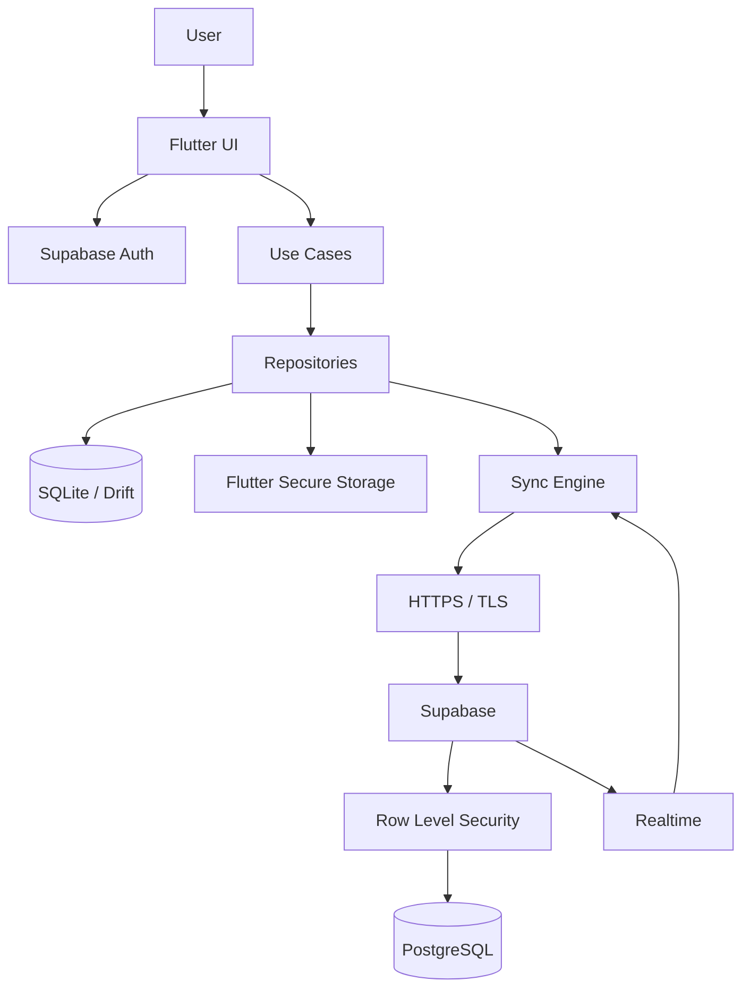
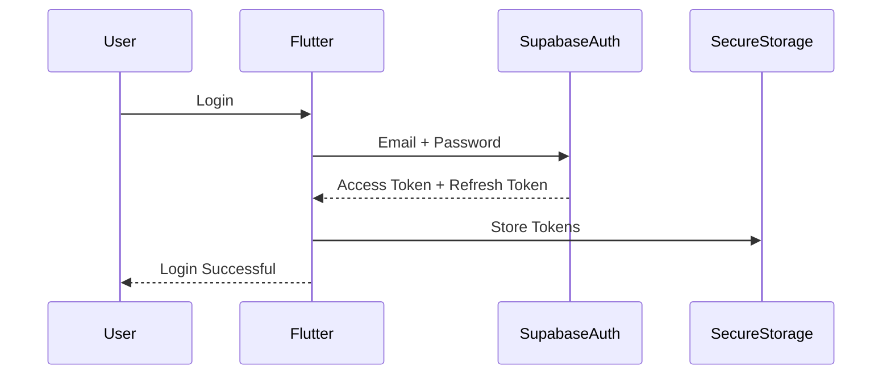
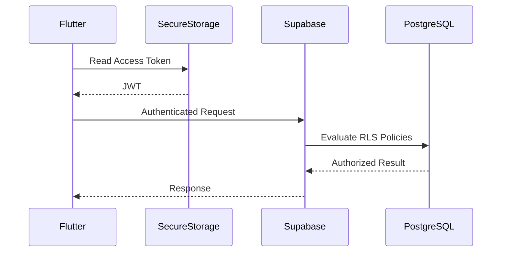
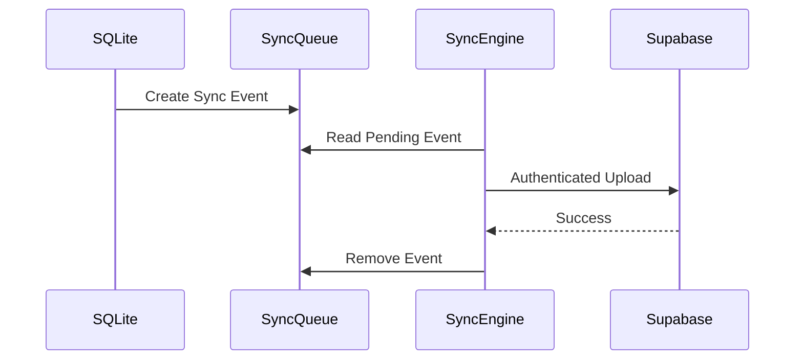

# Baulera

**Document:** 12-security.md

**Title:** Security

**Version:** 1.0

---

# 1. Purpose

This document defines the security architecture of Baulera.

It specifies how the application protects:

- User identity
- Household data
- Local storage
- Cloud storage
- Network communication
- Synchronization
- Secrets
- Privacy

Security is applied across every application layer.

---

# 2 Security Goals

The primary goals are:

- Protect user data.
- Prevent unauthorized access.
- Secure offline information.
- Secure synchronization.
- Minimize attack surface.
- Preserve privacy.
- Ensure data integrity.
- Guarantee authentication.
- Guarantee authorization.
- Support secure collaboration.

---

# 3 Security Principles

SEC-001

Security by Design.

Security is considered from the beginning of the architecture.

---

SEC-002

Least Privilege.

Every component receives only the permissions it requires.

---

SEC-003

Defense in Depth.

Multiple independent security layers are applied.

---

SEC-004

Secure Defaults.

The safest behavior is the default behavior.

---

SEC-005

Zero Trust.

Every request is validated.

---

SEC-006

Fail Secure.

Failures never expose protected information.

---

SEC-007

Privacy First.

Only necessary information is collected.

---

SEC-008

Offline Security.

Offline functionality must remain secure.

---

SEC-009

Encryption Everywhere.

Sensitive information is encrypted whenever possible.

---

SEC-010

Auditability.

Important security events are traceable.

---

# 4 Threat Model

Potential threats include:

- Lost device.
- Stolen device.
- Credential theft.
- Network interception.
- Malicious client.
- SQL injection.
- Replay attacks.
- Unauthorized synchronization.
- Data corruption.
- API abuse.
- Session hijacking.
- Token leakage.

The architecture addresses each threat individually.

---

# 5 Security Layers

```text
Flutter UI

↓

Application Layer

↓

Domain Layer

↓

Repository Layer

↓

SQLite

↓

Sync Engine

↓

Supabase SDK

↓

HTTPS

↓

Supabase

↓

PostgreSQL
```

Every layer contributes to the overall security model.

---

# 6 Authentication

Authentication is delegated to Supabase Auth.

Supported providers

- Email + Password
- Magic Link (future)
- OAuth (future)

Version 1 implements:

- Email
- Password

---

Authentication responsibilities

- Identity verification.
- Session creation.
- Session refresh.
- Password reset.
- Email verification.

Business logic never authenticates users directly.

---

# 7 Session Management

Supabase manages:

- Access Token
- Refresh Token
- Session expiration
- Token renewal

The application must never implement its own authentication protocol.

---

Session lifecycle

```text
Login

↓

Access Token

↓

Refresh Token

↓

Automatic Renewal

↓

Logout
```

---

# 8 Authorization

Authentication identifies the user.

Authorization determines what the user may access.

Authorization is enforced through:

- Supabase Row Level Security (RLS)
- Household membership
- User roles
- Ownership validation

---

# 9 Household Security Model

Every entity belongs to exactly one Household.

```text
Household

↓

Products

↓

Inventory

↓

Shopping

↓

Notifications
```

No entity may belong to multiple households.

Household isolation is mandatory.

---

# 10 User Roles

Version 1 defines the following roles.

Owner

- Full access.
- Invite members.
- Remove members.
- Delete household.

Member

- Read inventory.
- Edit inventory.
- Create products.
- Register purchases.
- Register consumption.

Future versions may introduce:

- Read-only member.
- Guest.
- Administrator.

---

# 11 Authorization Rules

Every request must verify:

- Authenticated user.
- Household membership.
- Entity ownership.
- Requested operation.
- RLS policy.

Unauthorized requests are rejected before business processing begins.

---

# 12 Identity Principles

- Authentication is centralized in Supabase.
- Authorization is enforced through RLS.
- Every entity belongs to one household.
- Sessions are managed automatically.
- Business logic never stores passwords.
- Identity verification is delegated to trusted services.
- Authorization always precedes business operations.
- Security checks occur on every synchronized request.

---

# 13 Data Classification

Application data is classified according to its sensitivity.

| Classification | Examples | Protection Level |
|----------------|----------|------------------|
| Public | Application version, static assets | Low |
| Internal | Product categories, brands | Medium |
| Confidential | Inventory, shopping lists, notifications | High |
| Sensitive | Authentication tokens, refresh tokens | Critical |

The protection strategy depends on the classification.

---

# 14 Data Protection

Sensitive information must be protected at every stage.

Protection layers

- Secure storage
- HTTPS
- TLS
- Database access control
- Authentication
- Authorization
- Device security
- Row Level Security

No sensitive information should be stored unnecessarily.

---

# 15 Encryption in Transit

All communication between the application and Supabase uses HTTPS.

```text
Flutter

↓

HTTPS

↓

TLS 1.2+

↓

Supabase
```

Requirements

- HTTPS only.
- Certificate validation enabled.
- No insecure HTTP fallback.
- No self-signed certificates in production.

---

# 16 Encryption at Rest

## Local Database

SQLite itself is not encrypted by default.

Version 1 relies on:

- Operating system disk encryption.
- Android File-Based Encryption.
- iOS Data Protection.

Future versions may migrate to SQLCipher if stronger local encryption is required.

---

## Cloud Database

Supabase encrypts stored data using managed infrastructure.

The application delegates storage encryption to Supabase.

---

# 17 Secure Storage

Sensitive credentials must never be stored inside SQLite.

Secure Storage is used for:

- Access Token
- Refresh Token
- Session metadata
- Device identifier
- Encryption keys (future)

Flutter Secure Storage is the recommended implementation.

Platform storage

| Platform | Storage |
|----------|---------|
| Android | Android Keystore |
| iOS | Keychain |
| Desktop | Platform secure credential store (where available) |

---

# 18 Secret Management

The application contains several categories of secrets.

Examples

- Supabase URL
- Supabase Anonymous Key
- Access Token
- Refresh Token
- Future API Keys

Rules

- Never hardcode secrets inside business logic.
- Never expose service-role keys.
- Never commit secrets to Git.
- Never log secrets.
- Rotate compromised secrets immediately.

---

# 19 API Keys

Version 1 exposes only the public Supabase Anonymous Key.

The following must never appear inside the client application.

- Service Role Key
- Database credentials
- PostgreSQL password
- Administrative tokens

Privileged operations belong exclusively on trusted backend services.

---

# 20 Password Security

Passwords are never processed directly by the application.

Responsibilities delegated to Supabase

- Password hashing
- Password verification
- Password reset
- Password policy
- Credential storage

The client never stores plaintext passwords.

---

# 21 Sensitive Data

The following data requires special handling.

- Authentication tokens
- Refresh tokens
- Email address
- Household identifier
- User identifier

Rules

- Do not log.
- Do not expose in analytics.
- Do not display in diagnostics.
- Do not persist outside secure storage unless required.

---

# 22 Clipboard Policy

Sensitive information should not be copied automatically.

Examples

Forbidden

- Access Token
- Refresh Token
- Authentication headers

Allowed

- Shopping list
- Product name
- Barcode

---

# 23 Screenshot Policy

Sensitive authentication screens should discourage screenshots where supported.

Examples

- Login
- Password Reset
- Authentication Diagnostics

Inventory screens may be captured normally.

---

# 24 Local Cache

Only business data is cached in SQLite.

Cached

- Products
- Inventory
- Categories
- Shopping list
- Statistics

Not cached

- Password
- Authentication secrets
- Private encryption keys

---

# 25 Data Protection Principles

- Sensitive credentials remain outside SQLite.
- Authentication tokens use secure storage.
- HTTPS is mandatory.
- TLS protects all communications.
- Secrets are never logged.
- Password handling is delegated to Supabase.
- The application exposes only public client credentials.
- Local storage contains only required business information.
- Confidential information is protected according to its classification.
- Every layer contributes to overall data security.

---

# 26 Network Security

All communication between the application and cloud services must occur over secure channels.

Requirements

- HTTPS only.
- TLS 1.2 or higher.
- Certificate validation enabled.
- No insecure redirects.
- No plaintext protocols.

Network communication must fail securely.

---

# 27 API Security

The application communicates only with approved services.

Version 1

- Supabase
- OpenFoodFacts (public API)

Future

- AI Provider
- Push Notification Provider
- Cloud Functions

Every external service must use authenticated and encrypted communication when supported.

---

# 28 Supabase Authentication

Every authenticated request includes a valid JWT Access Token.

```text
Flutter

↓

Access Token

↓

Supabase Auth

↓

Row Level Security

↓

Database
```

Expired tokens are refreshed automatically before protected requests.

---

# 29 JWT Security

JWT tokens are treated as confidential credentials.

Rules

- Never log JWTs.
- Never store JWTs in SQLite.
- Store only in secure storage.
- Refresh automatically.
- Remove immediately during logout.

JWT validation is performed by Supabase.

---

# 30 Row Level Security (RLS)

All application tables use Row Level Security.

Objectives

- Household isolation.
- User authorization.
- Data ownership.
- Least privilege.

No table containing business data may disable RLS.

---

# 31 RLS Policy Principles

Typical policy requirements

```text
Authenticated User

AND

Household Member

AND

Entity Household = User Household
```

Only authorized household members may access shared data.

---

# 32 CRUD Authorization

Each operation requires an independent policy.

| Operation | Authorization |
|-----------|---------------|
| SELECT | Household member |
| INSERT | Household member |
| UPDATE | Household member |
| DELETE | Household owner or authorized member |

Policies are evaluated server-side.

The client cannot bypass RLS.

---

# 33 Service Role Security

The Service Role Key has unrestricted database access.

Rules

- Never embedded in Flutter.
- Never distributed to users.
- Never stored on the device.
- Only used by trusted backend services.

Compromise of the Service Role Key is considered a critical security incident.

---

# 34 API Abuse Protection

The architecture minimizes abuse by

- Authentication.
- Authorization.
- RLS.
- HTTPS.
- JWT validation.
- Incremental synchronization.
- Controlled API surface.

Future versions may introduce

- Rate limiting.
- Cloud Functions.
- CAPTCHA for registration.

---

# 35 Replay Protection

Replay attacks occur when intercepted requests are resent.

Mitigation

- HTTPS.
- JWT expiration.
- Version validation.
- Entity version numbers.
- Idempotent synchronization.

Repeated requests produce consistent results without corrupting data.

---

# 36 Request Validation

Every incoming request is validated.

Validation includes

- Authentication.
- Authorization.
- JWT validity.
- Household ownership.
- Entity integrity.
- Required fields.
- Version consistency.

Invalid requests are rejected before database modification.

---

# 37 OpenFoodFacts Security

OpenFoodFacts is a public read-only integration.

Security considerations

- No authentication required.
- No user credentials transmitted.
- No household information shared.
- Responses validated before persistence.

Downloaded product information is treated as untrusted input.

---

# 38 Future AI Integration

Future AI providers must follow the same security model.

Requirements

- HTTPS.
- Authenticated requests.
- No unnecessary personal information.
- Prompt sanitization.
- Response validation.
- Configurable provider credentials.

Sensitive household data must not be transmitted unless explicitly required.

---

# 39 Network Security Principles

- HTTPS is mandatory.
- TLS protects every connection.
- JWTs authenticate every protected request.
- Row Level Security protects every business table.
- Authorization is enforced server-side.
- Service Role Keys never reach the client.
- Public APIs are treated as untrusted sources.
- Every request is validated before execution.
- Synchronization operations are idempotent.
- Security controls remain effective even in hostile network environments.

---

# 40 Local Database Security

SQLite is the operational database of the application.

Security objectives

- Preserve data integrity.
- Prevent unauthorized modification.
- Protect against corruption.
- Maintain transactional consistency.

SQLite is never exposed directly outside the Repository layer.

---

# 41 Repository Isolation

The Repository layer is the only component allowed to access SQLite.

```text
Flutter UI

↓

Use Cases

↓

Repositories

↓

SQLite
```

Business logic must never execute SQL directly.

Benefits

- Centralized validation.
- Consistent authorization.
- Easier auditing.
- Better testability.

---

# 42 Offline Security

Offline operation must not reduce the application's security posture.

Requirements

- Authentication remains required.
- Existing local data stays protected.
- Authorization rules continue to apply.
- Synchronization resumes only after successful authentication.

Users cannot bypass authorization simply by disconnecting from the network.

---

# 43 Device Security

Baulera relies on operating system security features.

Supported mechanisms

- Android File-Based Encryption
- Android Keystore
- iOS Keychain
- iOS Data Protection
- Secure application sandbox

The application does not attempt to replace platform security.

---

# 44 Rooted and Jailbroken Devices

Version 1 does not block execution on rooted or jailbroken devices.

However

- Sensitive credentials remain in secure storage.
- Authentication still applies.
- RLS remains enforced.
- Local data remains sandboxed where possible.

Future versions may detect compromised devices and display security warnings.

---

# 45 Logging Policy

Application logs must never expose confidential information.

Forbidden

- Passwords
- JWT tokens
- Refresh tokens
- API keys
- Authorization headers
- Personal identifiers beyond what is operationally necessary

Allowed

- Entity IDs
- Synchronization states
- Error codes
- Timing information
- Component names

---

# 46 Exception Handling

Unexpected errors must fail securely.

Rules

- Do not expose stack traces to users.
- Do not expose SQL queries.
- Do not expose internal implementation details.
- Log technical information only in diagnostic logs.

User-facing messages should remain generic and actionable.

Example

```text
Synchronization failed.

Retrying automatically.
```

Instead of

```text
PostgreSQL constraint violation...
```

---

# 47 Input Validation

All external input is considered untrusted.

Sources

- User input
- Barcode scanner
- OpenFoodFacts
- Synchronization payloads
- Future AI providers

Validation includes

- Required fields
- Maximum length
- Allowed formats
- UUID validation
- Enum validation
- Numeric ranges

Validation occurs before persistence.

---

# 48 Data Integrity

SQLite transactions guarantee local consistency.

Integrity mechanisms

- Foreign keys
- Unique constraints
- Check constraints
- Transactions
- Repository validation
- Domain validation

Synchronization never bypasses these constraints.

---

# 49 Audit Logging

Security-sensitive operations generate audit records.

Examples

- User login
- Household invitation accepted
- Product deleted
- Inventory adjusted
- Synchronization conflict resolved

Audit records include

- Timestamp
- User ID
- Device ID
- Entity
- Operation
- Result

Audit records are immutable.

---

# 50 Session Termination

Logout performs the following sequence.

```text
User Logout

↓

Invalidate Session

↓

Remove Access Token

↓

Remove Refresh Token

↓

Clear Secure Storage

↓

Return to Login Screen
```

Business data stored in SQLite is preserved unless the user explicitly requests local data removal.

---

# 51 Secure Development Principles

Developers should follow these practices.

- Validate all inputs.
- Never trust client data.
- Keep dependencies updated.
- Review third-party libraries.
- Minimize permissions.
- Use immutable models when practical.
- Prefer compile-time safety.
- Avoid reflection where unnecessary.
- Remove debug functionality from production builds.

---

# 52 Local Security Principles

- SQLite is accessed only through repositories.
- Offline mode preserves authentication and authorization.
- Platform security mechanisms are leveraged whenever possible.
- Sensitive credentials remain outside SQLite.
- Logs never expose secrets.
- External input is always validated.
- Transactions preserve database integrity.
- Audit records support traceability.
- Secure logout removes authentication credentials.
- Secure coding practices are applied throughout the project.

---

# 53 Security Monitoring

The application continuously records operational security events.

Monitoring objectives

- Detect abnormal behavior.
- Support troubleshooting.
- Improve reliability.
- Assist future incident investigations.

Security monitoring must not expose confidential information.

---

# 54 Security Events

Examples of monitored events

Authentication

- Login successful
- Login failed
- Logout
- Session expired
- Session refreshed

Synchronization

- Authentication rejected
- Unauthorized synchronization
- Repeated synchronization failures
- Conflict resolution

Application

- Database corruption detected
- Secure storage unavailable
- Configuration error

These events are stored as diagnostic information.

---

# 55 Audit Strategy

Audit records provide historical traceability.

Characteristics

- Immutable.
- Timestamped.
- Associated with user.
- Associated with device.
- Associated with household.

Typical audited actions

- Product creation
- Product deletion
- Inventory adjustment
- Threshold modification
- Household membership changes
- Synchronization conflict resolution

Audit data is never modified after creation.

---

# 56 Incident Response

Unexpected security incidents follow a predictable workflow.

```text
Incident Detected

↓

Log Event

↓

Determine Severity

↓

Automatic Recovery?

↓

Yes

↓

Recover

↓

Continue
```

If automatic recovery is impossible

```text
Notify User

↓

Require User Action
```

Examples requiring user action

- Authentication revoked.
- Household access removed.
- Invalid session.
- Permanent synchronization failure.

---

# 57 Privacy Principles

Baulera follows the principle of data minimization.

Collect only what is necessary.

Examples

Collected

- Email
- Household membership
- Product information
- Inventory

Not collected

- Contacts
- Photos (unless explicitly selected)
- Location
- Camera images after barcode recognition
- Device usage outside application diagnostics

---

# 58 Personal Data

Personally identifiable information (PII)

Version 1

- Email address
- User identifier

Non-PII

- Product names
- Categories
- Brands
- Inventory quantities
- Shopping list

PII receives additional protection.

---

# 59 Analytics

Version 1 does not require third-party analytics.

If analytics are introduced later

Requirements

- Anonymous identifiers.
- No authentication tokens.
- No inventory contents.
- No household information.
- Explicit privacy policy.

Analytics must never interfere with application performance.

---

# 60 Compliance Objectives

The architecture is designed to facilitate compliance with common privacy principles.

Objectives

- Data minimization.
- User authentication.
- Authorization.
- Auditability.
- Secure communications.
- Data integrity.
- User control over household membership.

Formal regulatory compliance may require additional legal review depending on deployment regions.

---

# 61 Dependency Security

Third-party dependencies introduce security risk.

Guidelines

- Prefer well-maintained libraries.
- Minimize dependency count.
- Keep packages updated.
- Review release notes.
- Remove unused libraries.
- Monitor security advisories.

Critical dependencies include

- Flutter SDK
- Drift
- Supabase SDK
- Flutter Secure Storage

---

# 62 Build Security

Release builds must differ from development builds.

Production requirements

- Debug logging disabled.
- Assertions removed.
- Development endpoints removed.
- Test credentials removed.
- Production configuration enabled.

Build configuration should prevent accidental deployment of development settings.

---

# 63 Security Review Checklist

Every feature should be reviewed before release.

Questions

- Are inputs validated?
- Are secrets protected?
- Is authentication required?
- Is authorization enforced?
- Are RLS policies correct?
- Are logs free of secrets?
- Are transactions atomic?
- Is synchronization secure?
- Are errors handled safely?
- Is user privacy preserved?

---

# 64 Security Principles

- Security is continuously monitored.
- Audit records are immutable.
- Privacy is protected through data minimization.
- PII receives additional protection.
- Analytics are optional and privacy-conscious.
- Dependencies are regularly maintained.
- Production builds remove development functionality.
- Security reviews are part of the development lifecycle.
- Automatic recovery is preferred whenever safe.
- User trust is a primary architectural objective.

---

# 65 Complete Security Architecture



Every layer contributes to the application's overall security posture.

---

# 66 Authentication Sequence



Authentication credentials are never persisted in SQLite.

---

# 67 Authorized Request Sequence



Authorization is always enforced server-side.

---

# 68 Secure Synchronization Sequence



Synchronization never bypasses authentication or authorization.

---

# 69 Security Layers

```text
User

↓

Authentication

↓

Authorization

↓

Repositories

↓

SQLite Validation

↓

Sync Engine

↓

HTTPS

↓

Supabase Auth

↓

Row Level Security

↓

PostgreSQL
```

Each layer provides independent protection.

---

# 70 Threat Mitigation Matrix

| Threat | Mitigation |
|---------|------------|
| Credential theft | Secure Storage, JWT expiration |
| Network interception | HTTPS + TLS |
| Unauthorized access | Authentication + RLS |
| Cross-household access | Household isolation |
| SQL Injection | Parameterized queries via Drift |
| Replay attacks | JWT expiration, versioning, idempotent synchronization |
| Lost device | OS encryption, secure storage |
| Duplicate synchronization | UUIDs, UPSERT, Sync Event IDs |
| Data corruption | SQLite transactions, foreign keys, constraints |
| Secret leakage | Secure storage, structured logging, no embedded service keys |

---

# 71 Traceability Matrix

| Security Topic | Related Document |
|----------------|------------------|
| Architecture | 06-architecture.md |
| Database Design | 08-database-design.md |
| Supabase | 09-supabase.md |
| Offline Architecture | 10-offline-first.md |
| Sync Engine | 11-sync-engine.md |
| Navigation | 13-navigation.md |
| Notifications | 22-notifications.md |
| Testing | 23-testing.md |
| CI/CD | 24-cicd.md |

---

# 72 Security Checklist

## Authentication

- Supabase Auth enabled.
- Secure session management.
- Automatic token refresh.
- Secure logout.

---

## Authorization

- Row Level Security enabled.
- Household isolation enforced.
- User roles validated.
- Entity ownership verified.

---

## Local Security

- Secure Storage for credentials.
- SQLite accessed only through repositories.
- Transactions enabled.
- Foreign keys enforced.

---

## Network Security

- HTTPS only.
- TLS enabled.
- JWT authentication.
- No service-role keys on clients.

---

## Synchronization

- Authenticated uploads.
- Incremental synchronization.
- Idempotent processing.
- Conflict validation.

---

## Development

- Structured logging.
- Secrets excluded from source control.
- Debug features removed from release builds.
- Dependency reviews performed regularly.

---

# 73 Glossary

| Term | Definition |
|------|------------|
| Access Token | Short-lived JWT used to authenticate API requests. |
| Audit Record | Immutable record of security-relevant operations. |
| Defense in Depth | Security strategy using multiple independent protective layers. |
| Flutter Secure Storage | Plugin that stores credentials using platform secure storage. |
| Household Isolation | Security model ensuring data is accessible only within its owning household. |
| JWT | JSON Web Token used by Supabase Auth. |
| Least Privilege | Principle granting only the minimum required permissions. |
| RLS | Row Level Security policies enforced by PostgreSQL through Supabase. |
| Secure Storage | Platform-provided encrypted credential storage (Android Keystore, iOS Keychain). |
| Zero Trust | Security model where every request is authenticated and authorized independently. |

---

# 74 Summary

Baulera implements a layered security architecture that protects data from the user interface to the database.

The security model is built around:

- Supabase Authentication for identity management.
- Row Level Security for authorization.
- Household-based data isolation.
- Secure credential storage using platform secure storage.
- HTTPS and TLS for encrypted communication.
- SQLite transactions for local integrity.
- Offline security without reducing protection.
- Deterministic synchronization with authenticated requests.
- Structured audit logging and diagnostics.
- Privacy-first data collection.
- Secure development practices and production hardening.

Together, these mechanisms provide a secure foundation for a collaborative, offline-first inventory management application while preserving user privacy, ensuring data integrity, and maintaining a consistent security posture across all supported platforms.

---

