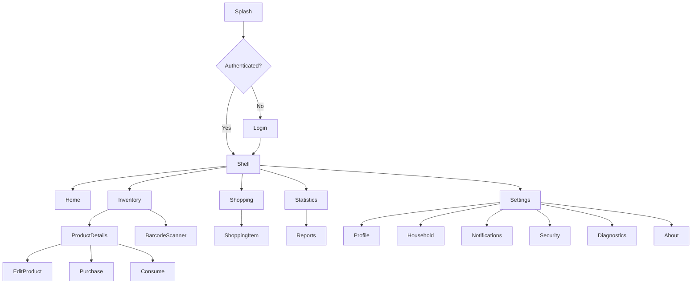
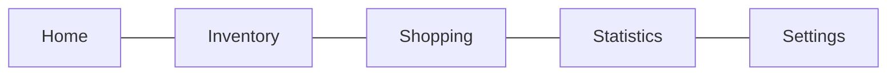
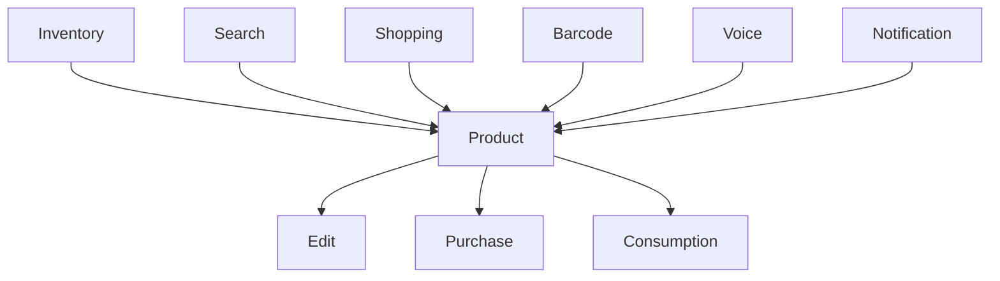
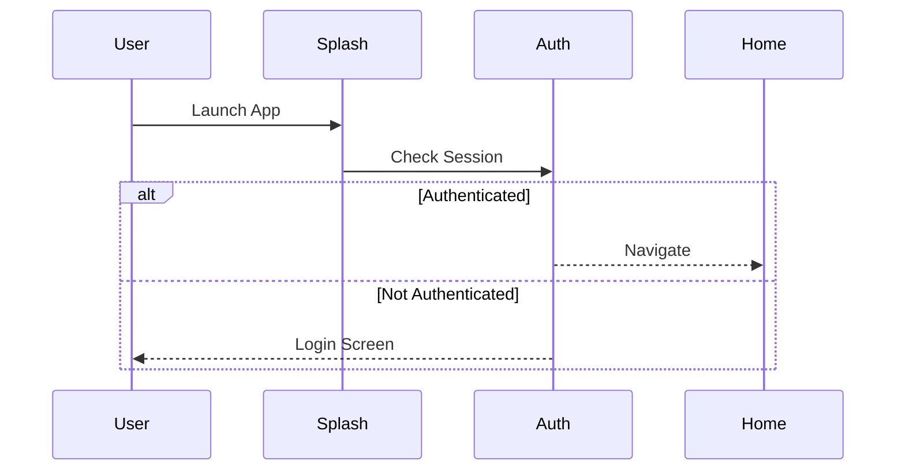

# Baulera

**Document:** 13-navigation.md

**Title:** Navigation

**Version:** 1.0

---

# 1 Purpose

This document defines the complete navigation architecture of Baulera.

It specifies:

- Screen hierarchy
- Navigation flows
- Route definitions
- Authentication navigation
- Nested navigation
- Bottom navigation
- Deep linking
- Navigation guards
- State restoration

The application uses **GoRouter** as the routing framework.

---

# 2 Navigation Goals

The navigation system must:

- Be simple and predictable.
- Minimize user interaction.
- Support Offline-First operation.
- Restore navigation after restart.
- Support deep links.
- Support authenticated routes.
- Support nested navigation.
- Avoid duplicate pages.
- Preserve UI state whenever possible.

---

# 3 Navigation Principles

NAV-001

Every screen has a unique route.

---

NAV-002

Navigation must be declarative.

---

NAV-003

Business logic never performs navigation directly.

---

NAV-004

Navigation state is managed by GoRouter.

---

NAV-005

Deep links resolve to the appropriate screen.

---

NAV-006

Offline mode never blocks navigation.

---

NAV-007

Bottom navigation preserves page state.

---

NAV-008

Navigation must be deterministic.

---

NAV-009

Unknown routes display an error page.

---

NAV-010

Authentication determines the initial route.

---

# 4 Navigation Architecture

```text
Flutter

↓

GoRouter

↓

ShellRoute

↓

Feature Routes

↓

Pages

↓

Widgets
```

GoRouter is responsible for all navigation decisions.

---

# 5 High-Level Application Flow

```text
Splash

↓

Authentication Check

↓

Authenticated?

↓

No

↓

Login

↓

Yes

↓

Main Application

↓

Feature Screens
```

---

# 6 Initial Route

Application startup follows this sequence.

```text
Application Launch

↓

Initialize Services

↓

Restore Session

↓

Check Authentication

↓

Navigate
```

Possible destinations

- Login
- Home

---

# 7 Route Categories

Routes are divided into four groups.

Authentication

- Splash
- Login
- Forgot Password

---

Main Application

- Home
- Inventory
- Shopping
- Statistics
- Settings

---

Feature Pages

- Product Details
- Product Editor
- Purchase
- Consumption
- Barcode Scanner
- Voice Assistant

---

System Pages

- About
- Diagnostics
- Error
- Not Found

---

# 8 Route Naming Convention

Every route has

- Path
- Name
- Page

Example

```text
Path

/products/:id
```

```text
Name

productDetails
```

```text
Page

ProductDetailsPage
```

---

# 9 Authentication Flow

```text
Splash

↓

Check Session

↓

Session Exists?

↓

No

↓

Login

↓

Successful Login

↓

Home
```

Existing sessions bypass the Login screen.

---

# 10 Logout Flow

```text
Settings

↓

Logout

↓

Clear Session

↓

Clear Tokens

↓

Login Screen
```

Business data remains stored locally unless explicitly deleted.

---

# 11 Main Navigation Structure

After authentication

```text
Shell Route

├── Home

├── Inventory

├── Shopping

├── Statistics

└── Settings
```

Each section owns its own nested navigation stack.

---

# 12 Navigation Principles Summary

- GoRouter manages all navigation.
- Routes are declarative.
- Authentication determines entry.
- ShellRoute hosts the primary application.
- Offline mode never blocks navigation.
- Every route has a unique name.
- Unknown routes are handled gracefully.
- Navigation remains independent from business logic.
- Page state should be preserved whenever practical.
- Deep links integrate naturally with the routing system.

---

# 13 Shell Route

The authenticated area of the application is hosted inside a single `ShellRoute`.

```text
ShellRoute

├── Home

├── Inventory

├── Shopping

├── Statistics

└── Settings
```

The ShellRoute provides

- Shared AppBar
- Bottom Navigation Bar
- Global FAB (when applicable)
- Navigation state preservation

The ShellRoute itself contains no business logic.

---

# 14 Bottom Navigation

The Bottom Navigation Bar is the primary navigation mechanism.

| Tab | Purpose |
|------|---------|
| Home | Dashboard and quick actions |
| Inventory | Products and inventory management |
| Shopping | Shopping list management |
| Statistics | Analytics and reports |
| Settings | Configuration and account |

The selected tab is synchronized with the current route.

---

# 15 Home Navigation

The Home tab provides quick access to frequently used actions.

Possible destinations

```text
Home

↓

Recent Products

↓

Product Details
```

```text
Home

↓

Expiring Products

↓

Inventory
```

```text
Home

↓

Shopping Summary

↓

Shopping
```

```text
Home

↓

Quick Add

↓

Purchase Flow
```

---

# 16 Inventory Navigation

Inventory is the application's primary feature.

Navigation hierarchy

```text
Inventory

↓

Product List

↓

Product Details

↓

Edit Product

↓

Save

↓

Back
```

Additional flows

```text
Inventory

↓

Search
```

```text
Inventory

↓

Barcode Scanner
```

```text
Inventory

↓

Voice Assistant
```

---

# 17 Product Navigation

Every product can be opened from multiple entry points.

Sources

- Inventory
- Search
- Shopping List
- Statistics
- Barcode Scanner
- Voice Assistant
- Notifications

Regardless of origin, navigation always reaches the same Product Details page.

---

# 18 Product Creation

Navigation flow

```text
Inventory

↓

New Product

↓

Edit Product

↓

Save

↓

Product Details
```

If cancelled

```text
Edit Product

↓

Cancel

↓

Back
```

---

# 19 Product Editing

Editing uses the same screen as creation.

```text
Product Details

↓

Edit

↓

Edit Product

↓

Save

↓

Product Details
```

Unsaved changes require user confirmation before leaving the page.

---

# 20 Nested Navigation

Each Bottom Navigation tab owns an independent navigation stack.

Example

Inventory stack

```text
Inventory

↓

Product

↓

Purchase
```

Shopping stack

```text
Shopping

↓

Shopping Item

↓

Edit Quantity
```

Switching tabs preserves each stack independently.

---

# 21 State Preservation

Changing tabs must preserve

- Scroll position
- Search filters
- Selected category
- Expanded sections
- Navigation stack
- Open dialogs (where supported)

The user should return to the exact previous state.

---

# 22 Floating Action Button (FAB)

The FAB changes according to the active tab.

| Tab | FAB Action |
|------|------------|
| Home | Quick Add Product |
| Inventory | New Product |
| Shopping | New Shopping Item |
| Statistics | None |
| Settings | None |

Future versions may introduce contextual FAB actions.

---

# 23 Navigation History

GoRouter maintains navigation history.

Supported actions

- Push
- Pop
- Replace
- Deep Link
- Browser Back (Web)

Business logic never manipulates the history directly.

---

# 24 Navigation Principles

- ShellRoute hosts the authenticated application.
- Bottom Navigation is the primary navigation pattern.
- Each tab maintains an independent navigation stack.
- Product pages are reusable regardless of entry point.
- Creation and editing share the same screen.
- Navigation history is managed exclusively by GoRouter.
- UI state is preserved across tab switches.
- Contextual actions adapt to the active feature.
- Navigation remains predictable and consistent.

---

# 25 Shopping Navigation

The Shopping feature manages the household shopping list.

Navigation hierarchy

```text
Shopping

↓

Shopping List

↓

Shopping Item

↓

Edit

↓

Save
```

Additional flows

```text
Shopping

↓

Completed Items

↓

History
```

```text
Shopping

↓

Suggested Products

↓

Product Details
```

---

# 26 Statistics Navigation

Statistics are read-only views.

Navigation hierarchy

```text
Statistics

↓

Dashboard

↓

Category Statistics

↓

Product Statistics
```

Additional screens

- Consumption Trends
- Purchase Trends
- Waste Analysis
- Inventory Value
- Monthly Reports

Navigation never modifies business data.

---

# 27 Voice Navigation

The Voice Assistant can initiate navigation.

Examples

```text
"Show milk"

↓

Product Details
```

```text
"Shopping list"

↓

Shopping
```

```text
"Statistics"

↓

Statistics Dashboard
```

```text
"Scan barcode"

↓

Barcode Scanner
```

Voice commands use the same routes as manual navigation.

---

# 28 Barcode Scanner Navigation

Scanner entry points

```text
Inventory

↓

Scan Barcode
```

```text
Home

↓

Quick Scan
```

```text
Voice

↓

Open Scanner
```

Possible outcomes

Known product

```text
Scanner

↓

Product Details
```

Unknown product

```text
Scanner

↓

Product Creation
```

Cancelled

```text
Scanner

↓

Previous Screen
```

---

# 29 Notifications Navigation

Notifications may navigate directly to relevant content.

Examples

Expiration reminder

```text
Notification

↓

Product Details
```

Shopping reminder

```text
Notification

↓

Shopping List
```

Low inventory

```text
Notification

↓

Purchase Screen
```

Each notification defines a target route.

---

# 30 Settings Navigation

Hierarchy

```text
Settings

├── Profile

├── Household

├── Appearance

├── Notifications

├── Synchronization

├── Security

├── Diagnostics

├── About

└── Logout
```

Settings pages are independent of business workflows.

---

# 31 Diagnostics Navigation

Diagnostics are intended for troubleshooting.

Hierarchy

```text
Settings

↓

Diagnostics

↓

Synchronization

↓

Database

↓

Logs
```

Diagnostics are optional in production builds and may be hidden behind a developer mode.

---

# 32 Deep Links

The application supports deep linking.

Examples

```text
/products/{productId}
```

```text
/shopping
```

```text
/statistics
```

```text
/settings
```

If the user is not authenticated

```text
Deep Link

↓

Login

↓

Restore Destination

↓

Target Screen
```

The original destination is preserved after successful authentication.

---

# 33 Route Parameters

Routes may include parameters.

Examples

Product Details

```text
/products/:productId
```

Purchase

```text
/products/:productId/purchase
```

Consumption

```text
/products/:productId/consume
```

Notification

```text
/notifications/:notificationId
```

Route parameters are validated before page construction.

---

# 34 Navigation Principles

- Every feature has a dedicated navigation flow.
- Voice commands reuse existing routes.
- Barcode scanning integrates seamlessly with product workflows.
- Notifications navigate directly to relevant screens.
- Settings remain isolated from business operations.
- Deep links support authenticated and unauthenticated users.
- Route parameters are validated before use.
- Navigation remains consistent regardless of the entry point.
- Feature navigation is reusable and predictable.

---

# 35 Navigation Guards

Navigation Guards determine whether a route may be accessed.

Guards execute before page construction.

Typical responsibilities

- Authentication verification
- Session validation
- Route parameter validation
- Household membership verification
- Feature availability checks

Guards return either

- Continue navigation
- Redirect
- Error page

---

# 36 Authentication Guard

Protected routes require an authenticated session.

Flow

```text
Navigate

↓

Authenticated?

↓

Yes

↓

Continue
```

Otherwise

```text
Navigate

↓

Authenticated?

↓

No

↓

Redirect

↓

Login
```

After successful login, navigation resumes to the originally requested route.

---

# 37 Session Validation

Before entering authenticated routes

Checks

- Access Token exists
- Refresh Token exists
- Session valid
- User authenticated

If validation fails

```text
Logout

↓

Login
```

---

# 38 Parameter Validation

Routes containing parameters validate them before loading.

Example

```text
/products/:productId
```

Validation

- UUID format
- Entity exists
- Household ownership
- Entity not deleted

Invalid parameters navigate to

```text
Not Found
```

or

```text
Access Denied
```

depending on the failure.

---

# 39 Offline Navigation

Offline mode never prevents navigation.

Available while offline

- Inventory
- Product Details
- Shopping List
- Statistics (cached)
- Settings
- Search

Unavailable operations display an informational message when synchronization or remote resources are required.

Navigation itself is never blocked.

---

# 40 Error Pages

Dedicated pages handle navigation failures.

| Situation | Destination |
|-----------|-------------|
| Unknown route | Not Found |
| Unauthorized | Access Denied |
| Session expired | Login |
| Invalid parameter | Not Found |
| Unexpected error | Error Page |

Every error page provides a safe way to return to the application.

---

# 41 Not Found Page

Displayed when

- Unknown route
- Deleted entity
- Invalid identifier
- Unsupported deep link

Suggested actions

- Return Home
- Search Products
- Open Inventory

---

# 42 Access Denied

Displayed when

- Household mismatch
- Unauthorized resource
- Missing permissions

The page must not reveal whether the requested resource actually exists.

---

# 43 State Restoration

Navigation state should survive application interruptions.

State to restore

- Selected tab
- Navigation stack
- Scroll positions
- Search filters
- Selected product
- Open route parameters

If restoration is not possible, the application returns to the Home screen.

---

# 44 Browser Navigation (Web)

For Flutter Web, GoRouter integrates with browser navigation.

Supported behavior

- Browser Back
- Browser Forward
- Deep links
- Refresh current page
- URL synchronization

The browser URL always reflects the current route.

---

# 45 Navigation Transitions

Default transitions should remain simple and consistent.

Recommended transitions

- Material page transition
- Cupertino transition (iOS)
- Fade transition for dialogs
- Bottom sheet for contextual actions

Avoid unnecessary custom animations that reduce responsiveness.

---

# 46 Navigation Performance

Target performance

| Operation | Target |
|-----------|--------|
| Route change | <100 ms |
| Tab switch | <50 ms |
| Deep link resolution | <150 ms |
| State restoration | <250 ms |
| Authentication redirect | <200 ms |

Navigation should feel instantaneous under normal conditions.

---

# 47 Navigation Principles

- Guards execute before page creation.
- Authentication protects private routes.
- Offline mode never blocks navigation.
- Invalid routes fail safely.
- Error pages do not expose sensitive information.
- Navigation state is restored whenever practical.
- Browser navigation is fully supported on Web.
- Route transitions remain consistent.
- Performance is prioritized over visual effects.
- Every navigation outcome is deterministic.

---

# 48 Complete Route Map



---

# 49 Shell Navigation Diagram



Each tab maintains an independent navigation stack.

---

# 50 Product Navigation Diagram



All entry points converge on the same Product Details page.

---

# 51 Authentication Flow



---

# 52 Deep Link Flow

```mermaid
sequenceDiagram

participant Link

participant Router

participant Auth

participant Screen

Link->>Router: Open Route

Router->>Auth: Validate Session

alt Authenticated

Auth-->>Screen: Navigate

else Login Required

Auth-->>Screen: Login

Screen-->>Router: Restore Destination

end
```

---

# 53 Route Reference

| Route Name | Path | Authentication Required |
|------------|------|-------------------------|
| splash | `/` | No |
| login | `/login` | No |
| home | `/home` | Yes |
| inventory | `/inventory` | Yes |
| productDetails | `/products/:productId` | Yes |
| editProduct | `/products/:productId/edit` | Yes |
| newProduct | `/products/new` | Yes |
| purchase | `/products/:productId/purchase` | Yes |
| consume | `/products/:productId/consume` | Yes |
| barcodeScanner | `/scanner` | Yes |
| shopping | `/shopping` | Yes |
| statistics | `/statistics` | Yes |
| settings | `/settings` | Yes |
| diagnostics | `/settings/diagnostics` | Yes |
| about | `/settings/about` | Yes |
| notFound | `/404` | No |
| accessDenied | `/403` | No |

---

# 54 Navigation Checklist

## Routing

- GoRouter configured.
- Declarative routes.
- Named routes.
- Route parameters validated.

---

## Authentication

- Login redirect.
- Session restoration.
- Protected routes.
- Logout redirect.

---

## Shell Navigation

- Bottom Navigation.
- Independent tab stacks.
- State preservation.
- Contextual FAB.

---

## Feature Navigation

- Inventory flows.
- Shopping flows.
- Statistics.
- Voice.
- Barcode scanner.
- Notifications.

---

## Advanced Features

- Deep links.
- Offline navigation.
- Navigation guards.
- Browser support.
- State restoration.

---

# 55 Traceability Matrix

| Navigation Topic | Related Document |
|------------------|------------------|
| Vision | 01-vision.md |
| Functional Requirements | 02-functional-requirements.md |
| Architecture | 06-architecture.md |
| Project Structure | 07-project-structure.md |
| Offline-First | 10-offline-first.md |
| Security | 12-security.md |
| UI/UX | 14-ui-ux.md |
| Design System | 15-design-system.md |
| Notifications | 22-notifications.md |
| Testing | 23-testing.md |

---

# 56 Glossary

| Term | Definition |
|------|------------|
| Bottom Navigation | Primary navigation component providing access to the application's main sections. |
| Deep Link | URL or external link that opens a specific screen inside the application. |
| GoRouter | Flutter routing package used to manage navigation declaratively. |
| Navigation Guard | Logic executed before entering a route to determine whether navigation is permitted. |
| Route | A uniquely identifiable destination within the application. |
| Route Parameter | Dynamic value embedded in a route path, such as a product identifier. |
| ShellRoute | GoRouter container that hosts the main authenticated navigation structure. |
| Stack | Ordered collection of pages managed by the navigation system. |
| State Restoration | Recovery of the user's previous navigation state after an interruption. |
| Tab Stack | Independent navigation history maintained for each Bottom Navigation tab. |

---

# 57 Summary

Baulera uses a declarative navigation architecture based on GoRouter, centered around a ShellRoute that hosts the authenticated experience.

The navigation model provides:

- Clear and predictable route hierarchy.
- Authentication-aware navigation.
- Independent navigation stacks for each Bottom Navigation tab.
- Seamless integration with Offline-First behavior.
- Deep link support with destination restoration after authentication.
- Navigation guards for authentication, authorization, and parameter validation.
- State preservation across tab changes and application restarts.
- Consistent route naming and parameter handling.
- Browser-compatible navigation for Flutter Web.
- Extensible routing architecture that supports future modules without structural changes.

This navigation architecture ensures that users can move efficiently through the application while maintaining consistency, performance, and security across all supported platforms.

---

