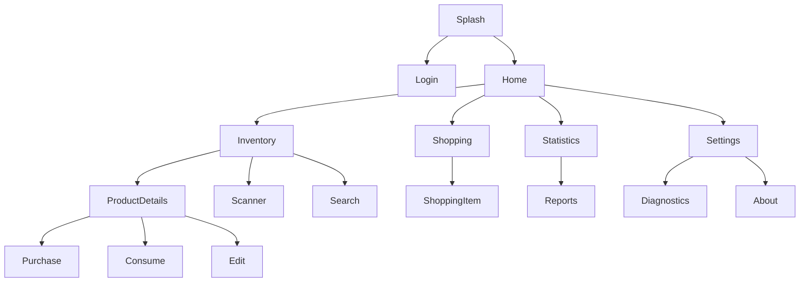
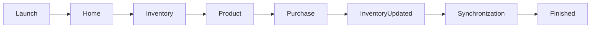
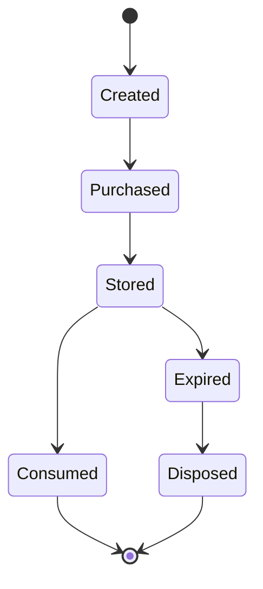

# Baulera

**Document:** 14-ui-ux.md

**Title:** User Interface & User Experience

**Version:** 1.0

---

# 1 Purpose

This document defines the User Experience (UX) and User Interface (UI) principles for Baulera.

It establishes:

- UX principles
- Screen organization
- Interaction guidelines
- Layout rules
- Responsive behavior
- User flows
- Visual consistency
- Accessibility
- Feedback patterns

Visual components themselves are defined in **15-design-system.md**.

---

# 2 UX Goals

The application should be:

- Fast
- Predictable
- Simple
- Discoverable
- Consistent
- Accessible
- Offline-friendly
- Pleasant to use

Every screen should minimize cognitive load.

---

# 3 Design Philosophy

Baulera follows a philosophy of:

> "Minimal interaction with maximum clarity."

Users should complete common tasks using as few steps as possible.

Examples

Adding a purchase

Goal

```text
3 taps or fewer
```

Checking inventory

Goal

```text
Immediate visibility
```

Finding a product

Goal

```text
Search within seconds
```

---

# 4 UX Principles

UX-001

Consistency over creativity.

---

UX-002

Frequent actions require fewer interactions.

---

UX-003

Never surprise the user.

---

UX-004

Every action produces immediate feedback.

---

UX-005

Offline usage feels identical whenever possible.

---

UX-006

Important information is visible without navigation.

---

UX-007

Editing is easier than recreation.

---

UX-008

Progressive disclosure.

Advanced options remain hidden until needed.

---

UX-009

Recoverability.

Mistakes should be reversible whenever practical.

---

UX-010

Performance is part of UX.

---

# 5 User Personas

Primary persona

Household Member

Goals

- Track inventory.
- Add purchases.
- Consume products.
- Build shopping lists.

---

Secondary persona

Household Owner

Additional goals

- Manage household.
- Configure settings.
- Invite members.
- Review statistics.

---

Future personas

- Guest
- Read-only member

---

# 6 Primary User Flows

The most frequent flows are

1.

```text
Open App

↓

Inventory
```

2.

```text
Purchase Product

↓

Inventory Updated
```

3.

```text
Consume Product

↓

Inventory Updated
```

4.

```text
Search Product

↓

Product Details
```

5.

```text
Barcode Scan

↓

Product Found
```

These flows receive the highest UX priority.

---

# 7 Screen Organization

The application is divided into five primary areas.

```text
Home

Inventory

Shopping

Statistics

Settings
```

Each area focuses on a single responsibility.

---

# 8 Information Hierarchy

Every screen follows the same hierarchy.

```text
Primary Action

↓

Primary Information

↓

Secondary Information

↓

Advanced Information
```

The most important information always appears first.

---

# 9 Layout Principles

Every page follows a predictable layout.

```text
AppBar

↓

Primary Content

↓

Secondary Content

↓

Floating Action Button (optional)

↓

Bottom Navigation
```

Scrolling should occur only within the content area.

---

# 10 Visual Hierarchy

Importance is communicated through

- Position
- Size
- Typography
- Spacing
- Color
- Elevation

Not through excessive decoration.

---

# 11 Navigation UX

Users should always know

- Where they are.
- Where they came from.
- How to go back.
- What the primary action is.

Navigation should never require explanation.

---

# 12 UX Principles Summary

- Simplicity is preferred over feature density.
- Common tasks require minimal interaction.
- Information follows a consistent hierarchy.
- Layouts remain predictable.
- Navigation is always understandable.
- Performance contributes directly to usability.
- Offline usage should feel natural.
- Progressive disclosure reduces complexity.
- User mistakes should be recoverable.
- Every screen prioritizes clarity over visual complexity.

---

# 13 Screen Types

Baulera uses a limited number of reusable screen patterns.

| Screen Type | Purpose |
|-------------|---------|
| Dashboard | Summarize important information |
| List | Display collections |
| Detail | Display a single entity |
| Form | Create or edit entities |
| Search | Locate information quickly |
| Statistics | Present analytical data |
| Settings | Configure the application |
| Wizard | Multi-step guided process |
| Dialog | Short confirmation or input |
| Bottom Sheet | Contextual actions |

Using consistent screen types reduces the learning curve.

---

# 14 List Screens

Lists are the most common UI pattern.

Examples

- Inventory
- Shopping List
- Categories
- Brands
- Locations
- Shelves
- Notifications

List behavior

- Fast scrolling
- Pull to refresh (optional)
- Infinite height
- Search support
- Filtering
- Sorting

Large lists should use lazy rendering.

---

# 15 Detail Screens

Detail pages display complete information about a single entity.

Typical structure

```text
Header

↓

Primary Information

↓

Secondary Information

↓

Actions

↓

History (optional)
```

Primary actions remain visible without excessive scrolling.

---

# 16 Forms

Forms are used for creation and editing.

Rules

- One logical purpose per form.
- Related fields grouped together.
- Immediate validation.
- Required fields clearly identified.
- Save action always visible.

Long forms should be divided into sections.

---

# 17 Form Validation

Validation occurs while the user edits.

Validation types

- Required fields
- Numeric range
- Maximum length
- Valid barcode
- Valid quantity
- Duplicate detection

Errors are displayed adjacent to the affected field.

---

# 18 Dialogs

Dialogs are reserved for short interactions.

Examples

- Delete confirmation
- Unsaved changes
- Rename
- Quantity adjustment
- Household invitation

Dialogs should never contain complex workflows.

---

# 19 Bottom Sheets

Bottom Sheets present contextual actions.

Typical actions

```text
Purchase

Consume

Move

Duplicate

Delete
```

Bottom Sheets avoid cluttering the primary interface.

---

# 20 Navigation UX

Page transitions should preserve context.

Preferred behavior

```text
Inventory

↓

Product

↓

Purchase

↓

Back

↓

Same Scroll Position
```

The user should never lose context unnecessarily.

---

# 21 Search Experience

Search is globally available within supported features.

Characteristics

- Instant results
- Incremental filtering
- Typo tolerance (future)
- Barcode search
- Voice search
- Category filtering

Search results update while typing.

---

# 22 Contextual Actions

Every page exposes only relevant actions.

Example

Product Details

Primary

- Purchase
- Consume

Secondary

- Edit
- Move
- Duplicate
- Delete

Advanced actions remain hidden inside menus.

---

# 23 Empty Screens

Empty screens should encourage the next action.

Example

Inventory Empty

```text
No products yet.

Add your first product.
```

Shopping Empty

```text
Nothing to buy.

Everything is stocked.
```

Empty states should be informative rather than decorative.

---

# 24 Interaction Principles

- Screen patterns remain consistent.
- Lists prioritize speed and readability.
- Detail pages focus on a single entity.
- Forms validate immediately.
- Dialogs remain simple.
- Bottom Sheets expose contextual actions.
- Search is fast and always available where relevant.
- Navigation preserves user context.
- Empty states guide the next meaningful action.

---

# 25 User Feedback

Every user action should produce immediate visual feedback.

Examples

Successful save

```text
✓ Product updated
```

Synchronization

```text
Synchronizing...
```

Completed synchronization

```text
All changes synchronized
```

Feedback should be concise and non-intrusive.

---

# 26 Loading States

Loading indicators communicate ongoing operations.

Guidelines

- Display loading only when necessary.
- Avoid blocking the interface.
- Preserve layout stability.
- Prefer skeleton placeholders over spinners for lists.

Typical loading scenarios

- Initial application startup
- Product search
- Statistics generation
- Synchronization
- OpenFoodFacts lookup

---

# 27 Skeleton Screens

Skeleton screens are preferred for predictable layouts.

Examples

Inventory

```text
██████████████

██████████████

██████████████
```

Shopping

```text
████████████

████████████

████████████
```

Skeletons reduce perceived waiting time.

---

# 28 Success States

Successful operations provide subtle confirmation.

Examples

- Snackbar
- Small banner
- Inline confirmation
- Checkmark animation

Avoid interrupting the user with unnecessary dialogs.

---

# 29 Error States

Errors should explain

- What happened
- Why it happened (if known)
- How to recover

Example

```text
Unable to synchronize.

We'll retry automatically.
```

Avoid technical language whenever possible.

---

# 30 Empty States

Every feature defines an appropriate empty state.

Examples

Inventory

```text
No products found.
```

Shopping

```text
Shopping list is empty.
```

Statistics

```text
Not enough data yet.
```

Notifications

```text
No notifications.
```

Empty states should always provide a suggested next action.

---

# 31 Accessibility

Accessibility is a core requirement.

Requirements

- Screen reader support.
- Semantic widgets.
- Keyboard navigation.
- High contrast compatibility.
- Sufficient touch targets.
- Dynamic text scaling.

Accessibility should not be treated as an optional enhancement.

---

# 32 Typography Accessibility

Text should remain readable under accessibility settings.

Requirements

- Support system font scaling.
- Avoid fixed font sizes.
- Maintain appropriate line spacing.
- Preserve layout during scaling.

Critical information must never become truncated solely due to larger text settings.

---

# 33 Color Accessibility

Color must never be the only communication mechanism.

Examples

Incorrect

```text
Red = Error
```

Preferred

```text
Icon

+

Color

+

Text
```

Every important status should be understandable without relying exclusively on color perception.

---

# 34 Touch Targets

Interactive elements should be easy to activate.

Recommended minimum size

```text
48 × 48 dp
```

Spacing should prevent accidental taps.

---

# 35 Keyboard Support

Desktop and Web versions support keyboard navigation.

Examples

- Tab navigation
- Enter to confirm
- Escape to cancel
- Arrow keys for lists
- Shortcut keys (future)

Keyboard navigation follows platform conventions.

---

# 36 Focus Management

Input focus should move predictably.

Example

```text
Barcode

↓

Name

↓

Brand

↓

Quantity

↓

Save
```

Dialogs should trap focus until dismissed.

---

# 37 Feedback Principles

- Every action provides immediate feedback.
- Loading indicators preserve layout stability.
- Skeleton screens are preferred over blocking spinners.
- Errors are understandable and actionable.
- Empty states encourage meaningful next steps.
- Accessibility is built into every screen.
- Color is never the only indicator.
- Touch targets are large enough for reliable interaction.
- Keyboard navigation is supported where applicable.
- Focus order follows the user's workflow.

---

# 38 Responsive Design

Baulera is designed to work across multiple screen sizes while maintaining a consistent experience.

Supported platforms

- Android
- iOS
- Web
- Desktop (future)

Layouts adapt without changing user workflows.

---

# 39 Breakpoints

Recommended responsive breakpoints

| Width | Layout |
|--------|--------|
| <600 dp | Phone |
| 600–839 dp | Large Phone / Small Tablet |
| 840–1199 dp | Tablet |
| ≥1200 dp | Desktop |

These values follow common Flutter responsive design practices.

---

# 40 Phone Layout

Phones use a single-column layout.

Structure

```text
AppBar

↓

Scrollable Content

↓

Floating Action Button (optional)

↓

Bottom Navigation
```

Content is optimized for one-handed interaction whenever possible.

---

# 41 Tablet Layout

Tablets use additional horizontal space.

Examples

```text
Product List

│

Product Details
```

or

```text
Navigation Rail

│

Content
```

Master-detail layouts reduce unnecessary navigation.

---

# 42 Desktop Layout

Desktop layouts prioritize productivity.

Possible structure

```text
Navigation Rail

│

Sidebar

│

Content

│

Inspector
```

Additional shortcuts

- Keyboard navigation
- Context menus
- Multi-selection (future)

---

# 43 Orientation

Portrait is the primary orientation.

Landscape support

- Improved data density.
- Side-by-side panels where appropriate.
- No loss of functionality.

The application should rotate gracefully without restarting workflows.

---

# 44 Adaptive Components

Certain components adapt to screen size.

| Component | Phone | Tablet/Desktop |
|-----------|--------|----------------|
| Navigation | Bottom Navigation | Navigation Rail |
| Lists | Single column | Multi-column (where beneficial) |
| Product Details | Full screen | Split view |
| Dialogs | Full-width modal | Centered dialog |
| Statistics | Vertical cards | Dashboard grid |

Behavior remains consistent despite layout differences.

---

# 45 Animations

Animations should reinforce user understanding.

Recommended uses

- Page transitions
- List insertions
- Item removal
- FAB transformations
- Snackbar appearance
- Expand/collapse sections

Animations must never delay interaction.

---

# 46 Animation Guidelines

Animations should be

- Fast
- Smooth
- Consistent
- Purposeful

Recommended duration

| Animation | Duration |
|-----------|-----------|
| Button feedback | 100–150 ms |
| List update | 150–250 ms |
| Page transition | 200–300 ms |
| Dialog | 200 ms |
| Bottom Sheet | 250–300 ms |

Avoid decorative animations that do not communicate state changes.

---

# 47 Gestures

Supported gestures

- Tap
- Double tap (where meaningful)
- Long press
- Swipe
- Drag
- Pull to refresh (optional)
- Pinch to zoom (future, charts/images)

Gestures should follow platform conventions.

---

# 48 Swipe Actions

List items may expose contextual actions via swipe.

Examples

Inventory

- Consume
- Purchase
- Edit

Shopping

- Complete
- Increase quantity
- Delete

Destructive actions require confirmation when data loss is possible.

---

# 49 Haptic Feedback

Where supported by the platform, subtle haptic feedback enhances important interactions.

Recommended scenarios

- Successful barcode scan
- Completing a shopping item
- Confirming a purchase
- Error after invalid action
- Long-press contextual menu

Haptic feedback should complement, not replace, visual feedback.

---

# 50 Motion Principles

- Responsive layouts preserve functionality.
- Phone-first design remains the baseline.
- Larger screens expose additional information without increasing complexity.
- Animations communicate changes rather than decorate the interface.
- Gestures follow platform standards.
- Swipe actions improve efficiency for frequent tasks.
- Haptic feedback reinforces key interactions.
- Motion never compromises performance or accessibility.
- Layout adaptations preserve user familiarity.

---

# 51 Home Experience

The Home screen provides an overview of the household.

Primary sections

- Inventory summary
- Expiring products
- Low stock products
- Shopping summary
- Recent activity
- Quick actions

Goals

- Immediate understanding of household status.
- One-tap access to common actions.

---

# 52 Inventory Experience

Inventory is the application's central feature.

Primary actions

- Search
- Filter
- Scan barcode
- Add product
- Open product
- Sort

Typical flow

```text
Inventory

↓

Product

↓

Purchase

↓

Inventory Updated
```

The inventory should remain responsive even with large product collections.

---

# 53 Product Details Experience

The Product Details page emphasizes clarity and fast actions.

Recommended layout

```text
Product Header

↓

Current Quantity

↓

Expiration Information

↓

Storage Location

↓

Purchase

Consume

↓

History

↓

Advanced Information
```

The most common actions should be visible without scrolling.

---

# 54 Shopping Experience

The Shopping List prioritizes speed during shopping.

Capabilities

- Large touch targets
- Fast item completion
- Quantity adjustment
- Product grouping
- Sorting by aisle or category
- Offline operation

Completed items remain accessible until the shopping session ends.

---

# 55 Statistics Experience

Statistics should answer questions rather than display raw data.

Examples

- What is consumed the most?
- Which products expire frequently?
- How much is spent monthly?
- Which categories grow fastest?

Visualizations should remain simple and understandable.

---

# 56 Voice Experience

Voice interaction complements traditional navigation.

Typical scenarios

```text
"Add milk"
```

```text
"Consume two eggs"
```

```text
"Open shopping list"
```

Voice responses should be concise and confirm recognized actions before executing destructive operations.

---

# 57 Barcode Scanner Experience

The scanner should open quickly and require minimal interaction.

Workflow

```text
Open Scanner

↓

Detect Barcode

↓

Product Found?

↓

Yes

↓

Product Details

↓

No

↓

Create Product
```

Feedback

- Visual scan indicator
- Audible confirmation (optional)
- Haptic feedback (where supported)

---

# 58 Notifications Experience

Notifications should help users take action immediately.

Examples

- Product expires tomorrow
- Low stock
- Synchronization completed
- Household invitation

Selecting a notification opens the relevant screen directly.

---

# 59 Settings Experience

Settings are grouped by purpose.

Suggested sections

- Account
- Household
- Appearance
- Notifications
- Synchronization
- Security
- Diagnostics
- About

Advanced settings remain separate from everyday configuration.

---

# 60 Developer Experience

Diagnostic tools should be available through a dedicated developer mode.

Possible sections

- Sync Queue
- Local Database
- Current User
- Realtime Status
- Pending Events
- Performance Metrics
- Logs

These screens are intended for troubleshooting and should remain hidden during normal use.

---

# 61 Cross-Feature UX

Shared UX principles

- Consistent page layouts.
- Reusable action patterns.
- Identical confirmation dialogs.
- Standard loading indicators.
- Common search experience.
- Unified typography and spacing.
- Predictable navigation behavior.

Users should never relearn interactions between modules.

---

# 62 UX Quality Principles

- Home focuses on awareness and quick actions.
- Inventory prioritizes efficiency.
- Product Details emphasize the most frequent operations.
- Shopping supports rapid item completion.
- Statistics present meaningful insights.
- Voice interaction accelerates common tasks.
- Barcode scanning minimizes manual entry.
- Notifications drive users directly to relevant actions.
- Settings separate everyday and advanced configuration.
- Consistency across features is more important than visual variety.

---

# 63 Complete UX Architecture



The user experience is centered around quick access to the most frequent workflows while maintaining a consistent navigation structure.

---

# 64 Primary User Journey



This represents the most common daily interaction with the application.

---

# 65 Product Lifecycle UX



The interface should clearly communicate the current state of every product throughout its lifecycle.

---

# 66 Screen Inventory

| Module | Primary Screens |
|---------|-----------------|
| Authentication | Splash, Login, Forgot Password |
| Home | Dashboard |
| Inventory | Product List, Product Details, Product Editor |
| Shopping | Shopping List, Shopping Item |
| Statistics | Dashboard, Reports |
| Voice | Voice Assistant |
| Scanner | Barcode Scanner |
| Settings | Profile, Household, Notifications, Security, Diagnostics, About |
| System | Error, Not Found, Access Denied |

---

# 67 UX Checklist

## Navigation

- Consistent navigation hierarchy.
- Predictable page transitions.
- Independent navigation stacks.
- State restoration.

---

## Layout

- Responsive layouts.
- Consistent spacing.
- Clear visual hierarchy.
- Adaptive components.

---

## Interaction

- Immediate feedback.
- Accessible controls.
- Appropriate touch targets.
- Standard gestures.

---

## Forms

- Immediate validation.
- Clear error messages.
- Logical grouping.
- Minimal required fields.

---

## Accessibility

- Screen reader support.
- Keyboard navigation.
- Dynamic text scaling.
- Color-independent communication.

---

## Performance

- Fast startup.
- Smooth scrolling.
- Lightweight animations.
- Responsive interactions.

---

# 68 UX Acceptance Criteria

| Area | Acceptance Criteria |
|------|----------------------|
| Navigation | Users can reach any primary feature in no more than three taps from the Home screen. |
| Product Search | Results appear incrementally while typing. |
| Product Creation | Common products can be added in under 30 seconds. |
| Shopping | Users can complete items quickly with minimal interaction. |
| Accessibility | Core functionality remains usable with screen readers and large text enabled. |
| Offline | Primary workflows remain available without an internet connection. |
| Performance | Navigation and interactions remain responsive within defined performance targets. |

---

# 69 Traceability Matrix

| UX Topic | Related Document |
|-----------|------------------|
| Vision | 01-vision.md |
| Functional Requirements | 02-functional-requirements.md |
| Architecture | 06-architecture.md |
| Navigation | 13-navigation.md |
| Design System | 15-design-system.md |
| Products | 16-products.md |
| Shopping | 17-shopping-list.md |
| Statistics | 18-statistics.md |
| Voice | 19-voice.md |
| Notifications | 22-notifications.md |
| Testing | 23-testing.md |

---

# 70 Glossary

| Term | Definition |
|------|------------|
| Dashboard | High-level summary screen showing the most relevant information and actions. |
| Empty State | UI displayed when no data is available, guiding the user toward the next action. |
| Feedback | Visual, auditory, or haptic response indicating the result of a user action. |
| Information Hierarchy | Organization of content according to importance and user needs. |
| Progressive Disclosure | UX technique that reveals advanced options only when needed. |
| Responsive Layout | Layout that adapts to different screen sizes while preserving usability. |
| Skeleton Screen | Placeholder layout shown while content is loading. |
| Split View | Layout displaying two related panels simultaneously, typically on tablets or desktops. |
| Touch Target | Interactive area sized to support accurate user interaction. |
| User Journey | Sequence of interactions a user performs to accomplish a specific goal. |

---

# 71 Summary

Baulera adopts a user-centered, mobile-first experience designed around speed, clarity, and consistency.

The UX architecture emphasizes:

- Minimal interaction for common tasks.
- Clear information hierarchy.
- Predictable navigation and reusable interaction patterns.
- Responsive layouts for phones, tablets, and future desktop support.
- Immediate feedback for every significant user action.
- Offline-first workflows that remain fully usable without connectivity.
- Accessibility as a core design requirement.
- Fast product discovery through search, barcode scanning, and voice commands.
- Consistent visual and interaction patterns across all modules.
- Scalable UX foundations that support future features without introducing unnecessary complexity.

Together with the Navigation and Design System documents, this UX specification provides the foundation for implementing a cohesive, intuitive, and efficient user experience across the entire Baulera application.

---


