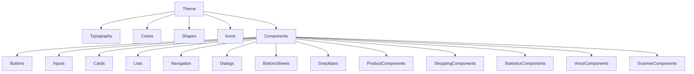
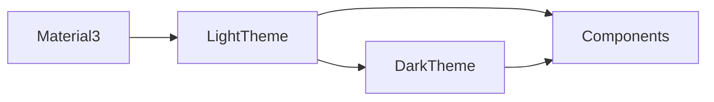

# Baulera

**Document:** 15-design-system.md

**Title:** Design System

**Version:** 1.0

---

# 1 Purpose

This document defines the Design System used throughout Baulera.

It standardizes:

- Visual language
- Material 3 implementation
- Themes
- Colors
- Typography
- Components
- Icons
- Layout
- Design tokens

The goal is to ensure visual consistency across all screens and platforms.

---

# 2 Design Goals

The Design System must be

- Consistent
- Accessible
- Scalable
- Reusable
- Responsive
- Maintainable
- Modern
- Minimalistic

Visual simplicity is preferred over decorative complexity.

---

# 3 Design Principles

DS-001

Consistency before customization.

---

DS-002

Components should be reusable.

---

DS-003

Accessibility is mandatory.

---

DS-004

Spacing communicates hierarchy.

---

DS-005

Typography communicates importance.

---

DS-006

Color communicates status.

---

DS-007

Animations should support usability.

---

DS-008

Material 3 is the design foundation.

---

DS-009

Dark Mode is fully supported.

---

DS-010

Every visual decision should improve usability.

---

# 4 Material Design

Baulera adopts Google's Material Design 3.

Key characteristics

- Dynamic color support (future)
- Material components
- Adaptive layouts
- Elevation system
- Shape system
- Motion system
- Accessibility guidelines

Custom styling extends Material rather than replacing it.

---

# 5 Theme Architecture

The application exposes two themes.

```text
Theme

├── Light

└── Dark
```

Both themes share

- Typography
- Spacing
- Shapes
- Components
- Motion
- Layout

Only visual properties differ.

---

# 6 Color Philosophy

Colors communicate meaning.

Primary purposes

- Branding
- Status
- Feedback
- Hierarchy

Colors should never be used purely for decoration.

---

# 7 Color Roles

Material 3 roles

| Role | Purpose |
|------|---------|
| Primary | Main actions |
| OnPrimary | Text/icons on Primary |
| Secondary | Secondary emphasis |
| Tertiary | Complementary accents |
| Surface | Background for components |
| Background | Main application background |
| Error | Errors and destructive actions |
| Outline | Borders and dividers |
| Shadow | Elevation |
| Scrim | Modal overlays |

The application should rely on semantic color roles rather than hard-coded values.

---

# 8 Semantic Colors

Application-specific semantic colors

| Meaning | Usage |
|----------|-------|
| Success | Completed operations |
| Warning | Products nearing expiration |
| Error | Failures and destructive actions |
| Info | Informational messages |
| Low Stock | Inventory requires attention |
| Expired | Product expiration reached |
| Purchased | Recent purchase |
| Consumed | Consumption history |
| Synced | Successful synchronization |
| Pending | Waiting for synchronization |

Semantic colors map to the active Material theme.

---

# 9 Theme Switching

Users may choose

- Light
- Dark
- Follow System

Theme changes should occur immediately without requiring an application restart.

The selected theme is persisted locally and synchronized across devices when applicable.

---

# 10 Contrast

Minimum contrast ratios

| Content | Minimum Ratio |
|----------|---------------|
| Normal text | 4.5 : 1 |
| Large text | 3 : 1 |
| Icons | 3 : 1 |
| Interactive controls | 3 : 1 |

Higher contrast should be preferred whenever practical.

---

# 11 Branding

The visual identity should remain subtle.

Branding elements include

- Application icon
- Splash screen
- Accent color
- Typography
- Illustrations (future)

Branding must never interfere with usability.

---

# 12 Design Principles Summary

- Material Design 3 is the visual foundation.
- Every component follows a consistent theme architecture.
- Semantic colors communicate application state.
- Light and Dark themes provide equivalent functionality.
- Accessibility requirements apply to all visual elements.
- Branding remains secondary to usability.
- Color roles are semantic rather than hard-coded.
- Visual consistency takes priority over individual customization.
- The Design System is reusable across all application modules.

---

# 13 Typography

Typography establishes visual hierarchy and readability.

Objectives

- Excellent readability
- Consistent hierarchy
- Accessibility
- Cross-platform consistency

The application uses the Material 3 typography scale.

---

# 14 Typography Scale

| Style | Typical Usage |
|--------|---------------|
| Display Large | Splash, onboarding (future) |
| Display Medium | Major headings |
| Display Small | Large section titles |
| Headline Large | Page titles |
| Headline Medium | Screen headings |
| Headline Small | Section headings |
| Title Large | Cards, dialogs |
| Title Medium | List sections |
| Title Small | Secondary headings |
| Body Large | Primary body text |
| Body Medium | Standard content |
| Body Small | Supporting information |
| Label Large | Buttons |
| Label Medium | Chips |
| Label Small | Captions |

Typography should remain semantic rather than size-driven.

---

# 15 Font Selection

Requirements

- Native Flutter support.
- High readability.
- Unicode coverage.
- Consistent rendering across platforms.

The default font family follows the Material 3 theme configuration.

Future branding may introduce a custom typeface if accessibility is preserved.

---

# 16 Spacing System

A consistent spacing scale is used throughout the application.

Base unit

```text
4 dp
```

Recommended spacing

| Value | Usage |
|--------|-------|
| 4 dp | Tight spacing |
| 8 dp | Related elements |
| 12 dp | Small groups |
| 16 dp | Standard padding |
| 24 dp | Section spacing |
| 32 dp | Large separation |
| 48 dp | Major layout divisions |

Spacing should communicate relationships between elements.

---

# 17 Layout Grid

Phone

```text
Single Column
```

Tablet

```text
Two Columns
```

Desktop

```text
Adaptive Grid
```

The grid system prioritizes readability over maximizing content density.

---

# 18 Elevation

Elevation indicates visual hierarchy.

Material elevation guidelines

| Level | Typical Usage |
|--------|---------------|
| 0 | Background |
| 1 | Cards |
| 2 | Elevated cards |
| 3 | FAB |
| 4 | Navigation components |
| 6 | Dialogs |
| 8 | Modal surfaces |

Elevation should be subtle and consistent.

---

# 19 Shape System

The application uses rounded corners consistently.

Recommended corner radii

| Radius | Usage |
|---------|-------|
| 4 dp | Small controls |
| 8 dp | Inputs |
| 12 dp | Cards |
| 16 dp | Dialogs |
| 20 dp | Bottom Sheets |
| 28 dp | Floating Action Button (Material default) |

Shape consistency reinforces visual cohesion.

---

# 20 Borders and Dividers

Borders should be lightweight.

Usage

- List separation
- Form grouping
- Card outlines (optional)
- Table layouts

Avoid excessive borders when spacing communicates structure more effectively.

---

# 21 Iconography

Icons should come from the Material Symbols collection.

Guidelines

- Use outlined variants by default.
- Filled variants may indicate active states.
- Avoid mixing icon styles.
- Icons should always have semantic meaning.

Decorative icons should be minimized.

---

# 22 Icon Sizes

Recommended sizes

| Size | Usage |
|------|-------|
| 16 dp | Inline indicators |
| 20 dp | Compact actions |
| 24 dp | Standard icons |
| 32 dp | Feature highlights |
| 48 dp | Empty states |
| 64 dp | Large illustrations |

Icons should align consistently with surrounding typography.

---

# 23 Imagery

Images support understanding rather than decoration.

Examples

- Product photos (future)
- Household avatars
- Empty state illustrations
- Application branding

Large decorative graphics should be avoided in primary workflows.

---

# 24 Visual Foundations

- Typography defines hierarchy.
- Spacing communicates relationships.
- Responsive grids adapt to available space.
- Elevation is used sparingly.
- Rounded shapes provide visual consistency.
- Borders remain subtle.
- Material Symbols are the standard icon set.
- Images support content rather than distract from it.
- Every visual element contributes to clarity and usability.

---

# 25 Buttons

Buttons represent the primary interaction mechanism.

Supported button types

| Component | Usage |
|-----------|-------|
| Filled Button | Primary action |
| Filled Tonal Button | Secondary emphasis |
| Outlined Button | Alternative action |
| Text Button | Low-priority action |
| Icon Button | Compact action |
| Floating Action Button | Primary contextual action |

Only one primary button should appear within a given context.

---

# 26 Button States

Every button supports the following states.

- Enabled
- Disabled
- Focused
- Hovered
- Pressed
- Loading

During loading, repeated user interaction must be prevented.

---

# 27 Text Fields

Text fields follow Material 3 guidelines.

Supported variants

- Single line
- Multi-line
- Numeric
- Password
- Search
- Read-only

Features

- Floating label
- Helper text
- Validation message
- Leading icon
- Trailing icon

Validation occurs as early as practical without interrupting user input.

---

# 28 Search Bar

Search is a first-class component.

Capabilities

- Instant filtering
- Clear button
- Voice search shortcut
- Barcode shortcut (where applicable)
- Search suggestions (future)

The search field remains visible in search-oriented screens.

---

# 29 Cards

Cards group related information.

Typical usage

- Product summary
- Dashboard widgets
- Statistics
- Household information

Recommended structure

```text
Title

↓

Content

↓

Optional Actions
```

Cards should avoid unnecessary nesting.

---

# 30 Lists

Lists display collections efficiently.

Supported list types

- Standard list
- Grouped list
- Sectioned list
- Expandable list
- Reorderable list (future)

Lists should support virtualization for large datasets.

---

# 31 Chips

Chips communicate lightweight information and enable quick filtering.

Chip variants

| Chip | Usage |
|------|-------|
| Assist | Suggested actions |
| Filter | Filtering |
| Choice | Single selection |
| Input | Dynamic values |
| Suggestion | Recommendations |

Examples

- Dairy
- Frozen
- Expiring Soon
- Pending Sync

---

# 32 Floating Action Button

The FAB exposes the most important contextual action.

Examples

Inventory

```text
+
Add Product
```

Shopping

```text
+
Add Item
```

Only one FAB should be visible per screen.

---

# 33 Navigation Components

Primary navigation components

- Bottom Navigation Bar
- Navigation Rail
- Navigation Drawer (future)
- AppBar
- Breadcrumbs (Desktop future)

Navigation components remain visually consistent across modules.

---

# 34 AppBar

The AppBar contains

- Page title
- Navigation control
- Search (where applicable)
- Overflow menu
- Optional actions

The AppBar should remain uncluttered.

---

# 35 Menus

Menus expose secondary functionality.

Typical actions

- Sort
- Filter
- Duplicate
- Export
- Delete
- Diagnostics

Destructive actions should appear last.

---

# 36 Badges

Badges communicate counts or status.

Examples

- Pending shopping items
- Expiring products
- Notifications
- Sync queue

Badges should remain concise and avoid large numbers.

---

# 37 Component Principles

- Buttons clearly communicate priority.
- Forms validate consistently.
- Cards organize related information.
- Lists scale efficiently.
- Chips simplify filtering and categorization.
- The FAB highlights the primary contextual action.
- Navigation components remain predictable.
- Menus contain secondary actions.
- Badges communicate important status without distraction.

---

# 38 Dialogs

Dialogs are used for short, focused interactions.

Typical scenarios

- Delete confirmation
- Unsaved changes
- Rename product
- Quantity adjustment
- Household invitation
- Permission request

Dialogs should interrupt the user only when confirmation or immediate attention is required.

---

# 39 Dialog Structure

Recommended layout

```text
Title

↓

Message

↓

Optional Content

↓

Actions
```

Action order follows platform conventions.

Primary action

- Right side (Android / Material)

Destructive actions should be clearly distinguished.

---

# 40 Bottom Sheets

Bottom Sheets present contextual actions without leaving the current page.

Typical usage

- Product actions
- Shopping item actions
- Sorting options
- Filtering options
- Quick edits

Bottom Sheets should be dismissed by

- Swipe
- Tap outside
- Explicit close action

---

# 41 Snackbars

Snackbars provide temporary feedback.

Examples

```text
Product updated
```

```text
Purchase recorded
```

```text
Synchronization completed
```

Characteristics

- Short duration
- Non-blocking
- Optional Undo action

Snackbars should not display critical errors.

---

# 42 Banners

Banners communicate persistent information.

Examples

- Offline mode
- Synchronization paused
- Update available
- Household invitation pending

Banners remain visible until the condition is resolved or dismissed.

---

# 43 Progress Indicators

Supported indicators

- Circular Progress Indicator
- Linear Progress Indicator
- Skeleton Screen

Usage

| Indicator | Scenario |
|-----------|----------|
| Circular | Unknown duration |
| Linear | Known progress |
| Skeleton | Content loading |

Skeletons are preferred whenever the final layout is predictable.

---

# 44 Empty State Components

Each empty state contains

- Illustration or icon
- Title
- Description
- Primary action

Example

```text
No products found.

Add your first product.
```

The primary action should guide the user toward completing the intended workflow.

---

# 45 Error Components

Errors should be informative without exposing technical details.

Recommended structure

```text
Icon

↓

Title

↓

Explanation

↓

Recovery Action
```

Examples of recovery actions

- Retry
- Go Back
- Open Settings
- Contact Support (future)

---

# 46 Status Indicators

Status indicators communicate the current state of entities.

Examples

- In Stock
- Low Stock
- Out of Stock
- Expiring Soon
- Expired
- Pending Sync
- Synced

Status should combine

- Color
- Icon
- Text

Color alone must never communicate meaning.

---

# 47 Dividers

Dividers separate related content.

Recommended usage

- Sections within a page
- Menu groups
- Lists
- Dialog content

Avoid excessive use where whitespace provides sufficient separation.

---

# 48 Tooltips

Tooltips explain controls with unclear intent.

Typical usage

- Icon buttons
- Toolbar actions
- Charts
- Developer tools

Tooltips should be concise and disappear automatically.

---

# 49 Loading Overlays

Loading overlays are reserved for blocking operations.

Examples

- Initial authentication
- Database migration
- Household creation

Routine operations should prefer inline loading indicators.

---

# 50 Feedback Components Principles

- Dialogs remain focused and concise.
- Bottom Sheets expose contextual actions.
- Snackbars provide lightweight feedback.
- Banners communicate persistent conditions.
- Progress indicators match the nature of the task.
- Empty states encourage meaningful action.
- Error components support recovery.
- Status indicators combine color, icon, and text.
- Tooltips clarify advanced controls.
- Blocking overlays are used only when unavoidable.

---

# 51 Product Components

Products are represented through reusable components.

Core components

- Product Card
- Product List Tile
- Product Header
- Product Status Badge
- Product Quantity Indicator
- Expiration Indicator
- Product Actions Panel

These components should present information consistently across all modules.

---

# 52 Product Card

Recommended structure

```text
Product Name

↓

Brand

↓

Current Quantity

↓

Expiration Status

↓

Storage Location

↓

Quick Actions
```

Optional information

- Barcode
- Category
- Purchase price
- Last purchase date

Cards should prioritize the information most relevant to daily use.

---

# 53 Shopping Components

Shopping-specific components

- Shopping Item Tile
- Shopping Progress Bar
- Shopping Summary Card
- Shopping Section Header
- Quantity Selector

Visual states

- Pending
- Purchased
- Skipped
- Deleted

Completed items should remain visually distinct from pending items.

---

# 54 Statistics Components

Statistics are presented through reusable visualization containers.

Components

- Statistic Card
- KPI Tile
- Chart Container
- Trend Indicator
- Report Section

Charts should always include

- Title
- Units
- Legend (when applicable)
- Empty state

Visualizations must remain readable on small screens.

---

# 55 Voice Components

Voice interaction uses dedicated interface elements.

Components

- Voice Activation Button
- Listening Indicator
- Voice Waveform
- Recognized Text
- Confirmation Dialog

States

```text
Idle

↓

Listening

↓

Processing

↓

Recognized

↓

Completed
```

The interface should clearly indicate the current voice processing state.

---

# 56 Barcode Scanner Components

Scanner interface

Components

- Camera Preview
- Scan Frame
- Flash Toggle
- Manual Entry Button
- Scan Result Banner

Workflow

```text
Camera

↓

Barcode Detected

↓

Lookup

↓

Result
```

The scan frame should remain fixed to reduce user movement.

---

# 57 Notification Components

Reusable notification UI

Components

- Notification Tile
- Notification Badge
- Notification Banner
- Notification Summary Card

Notification priorities

- Information
- Reminder
- Warning
- Critical

Priority influences visual emphasis but not navigation behavior.

---

# 58 Synchronization Components

Synchronization status is visible through dedicated indicators.

Components

- Sync Status Icon
- Pending Changes Badge
- Sync Progress Indicator
- Conflict Banner
- Offline Banner

These components provide immediate visibility into synchronization state.

---

# 59 Dashboard Components

Dashboard widgets summarize household activity.

Examples

- Inventory Summary
- Expiring Products
- Low Stock Products
- Shopping Progress
- Recent Activity
- Monthly Spending
- Consumption Trends

Widgets should be modular and independently refreshable.

---

# 60 Settings Components

Reusable settings UI

Components

- Settings Section
- Preference Tile
- Toggle Tile
- Selection Tile
- Account Card
- Household Card

Settings components follow a consistent visual hierarchy across all configuration screens.

---

# 61 Component Reuse Principles

- Product components are shared across Inventory, Search, Shopping, and Statistics.
- Shopping components prioritize speed and readability.
- Statistics components present information consistently.
- Voice components clearly communicate interaction state.
- Scanner components minimize user effort.
- Notification and synchronization indicators remain visible but unobtrusive.
- Dashboard widgets are modular and reusable.
- Settings components maintain a uniform configuration experience.
- New features should reuse existing components whenever possible before introducing new ones.

---

# 62 Component Hierarchy



All visual elements inherit the active application theme.

---

# 63 Theme Architecture



Component behavior remains identical across themes; only visual tokens change.

---

# 64 Design Token Categories

The Design System is based on reusable design tokens.

| Token Category | Examples |
|----------------|----------|
| Color | Primary, Surface, Error, Success |
| Typography | Headline, Body, Label |
| Spacing | 4, 8, 16, 24, 32 dp |
| Radius | 4, 8, 12, 16, 20, 28 dp |
| Elevation | 0–8 |
| Duration | 100–300 ms |
| Icon Size | 16, 20, 24, 32, 48, 64 dp |
| Opacity | Disabled, Hover, Pressed |

Application code should consume semantic tokens rather than hard-coded values.

---

# 65 Component Inventory

| Category | Primary Components |
|----------|--------------------|
| Navigation | AppBar, Bottom Navigation, Navigation Rail, FAB |
| Inputs | Text Field, Search Bar, Quantity Selector |
| Buttons | Filled, Tonal, Outlined, Text, Icon |
| Display | Card, List Tile, Chip, Badge |
| Feedback | Snackbar, Banner, Dialog, Bottom Sheet |
| Progress | Circular, Linear, Skeleton |
| Product | Product Card, Product Header, Status Badge |
| Shopping | Shopping Item, Progress Bar |
| Statistics | KPI Card, Chart Container |
| Voice | Voice Button, Listening Indicator |
| Scanner | Camera Preview, Scan Frame |
| Settings | Preference Tile, Toggle Tile |

---

# 66 Design System Checklist

## Themes

- Light Theme
- Dark Theme
- System Theme

---

## Foundations

- Material 3
- Semantic colors
- Typography scale
- Spacing system
- Shape system
- Elevation system

---

## Components

- Buttons
- Forms
- Cards
- Lists
- Chips
- Navigation
- Dialogs
- Feedback components

---

## Feature Components

- Products
- Shopping
- Statistics
- Voice
- Scanner
- Notifications
- Synchronization

---

## Accessibility

- Contrast compliance
- Dynamic text scaling
- Screen reader support
- Keyboard navigation
- Accessible touch targets
- Color-independent communication

---

## Responsiveness

- Phone
- Tablet
- Desktop-ready
- Adaptive layouts

---

# 67 Traceability Matrix

| Design System Topic | Related Document |
|---------------------|------------------|
| Vision | 01-vision.md |
| Functional Requirements | 02-functional-requirements.md |
| UI/UX | 14-ui-ux.md |
| Navigation | 13-navigation.md |
| Products | 16-products.md |
| Shopping | 17-shopping-list.md |
| Statistics | 18-statistics.md |
| Voice | 19-voice.md |
| Notifications | 22-notifications.md |
| Testing | 23-testing.md |

---

# 68 Glossary

| Term | Definition |
|------|------------|
| Design Token | Reusable design value such as a color, spacing, radius, or typography style. |
| Elevation | Visual depth applied through Material Design surfaces. |
| Material 3 | Google's latest design system used as the foundation for Baulera's UI. |
| Semantic Color | Color assigned according to meaning (e.g., success, error, warning) rather than a fixed hue. |
| Skeleton Screen | Placeholder representation of content while data is loading. |
| Theme | Collection of visual properties defining the application's appearance. |
| Variant | Different implementation of the same component, such as Filled or Outlined buttons. |
| Visual Hierarchy | Organization of interface elements according to importance. |
| Widget | Reusable Flutter UI component implementing part of the Design System. |

---

# 69 Summary

Baulera's Design System provides a unified visual foundation built on Material Design 3 and optimized for consistency, accessibility, and long-term scalability.

The system establishes:

- A semantic theme architecture supporting Light, Dark, and System modes.
- Reusable design tokens for colors, typography, spacing, shapes, elevation, and motion.
- Consistent implementation of Material 3 components across all modules.
- Specialized reusable components for Inventory, Shopping, Statistics, Voice, Scanner, Notifications, and Settings.
- Responsive layouts that adapt from phones to tablets and future desktop environments.
- Accessibility-first design through contrast compliance, dynamic typography, semantic colors, and accessible interaction targets.
- Clear component reuse principles to minimize duplication and ensure a coherent user experience.
- A scalable foundation that enables future features to integrate without introducing visual inconsistency.

Together with the Navigation and UI/UX specifications, this Design System serves as the single source of truth for implementing and maintaining every visual aspect of the Baulera application.

---


