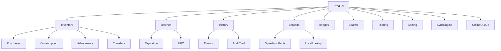

# Baulera

**Document:** 16-products.md

**Title:** Products Module

**Version:** 1.0

---

# 1 Purpose

This document defines the complete Product module of Baulera.

The Product module is the core of the application and is responsible for managing every item stored by a household throughout its entire lifecycle.

It defines:

- Product model
- Inventory behavior
- Product lifecycle
- Purchases
- Consumption
- Expiration
- Storage
- Barcode integration
- Product history
- Synchronization behavior
- Business rules

The Product module interacts directly with:

- Inventory
- Shopping List
- Statistics
- Voice Assistant
- OpenFoodFacts
- Notifications
- Sync Engine

---

# 2 Objectives

The Product module must allow users to

- Register products.
- Maintain an accurate inventory.
- Know current quantities.
- Track expiration dates.
- Record purchases.
- Record consumption.
- Organize storage locations.
- Search products instantly.
- Work completely offline.
- Synchronize automatically.

The module must minimize manual data entry while maintaining inventory accuracy.

---

# 3 Scope

Version 1 supports

- Household inventory
- Product catalog
- Multiple storage locations
- Barcode support
- Multiple units
- Expiration tracking
- Purchase history
- Consumption history
- Product movements
- Product images (optional)
- Synchronization

Not included in Version 1

- Nutritional analysis
- Recipes
- Automatic grocery ordering
- OCR label recognition
- AI inventory prediction
- Multi-household sharing of products

---

# 4 Product Definition

A Product represents a logical household item that can exist in one or more physical units.

Examples

- Milk
- Eggs
- Rice
- Butter
- Shampoo
- Toothpaste

A product is independent of its current inventory quantity.

Inventory changes over time while the product identity remains constant.

---

# 5 Product Identity

Each product owns a globally unique identifier.

Primary identifier

```text
ProductId (UUID)
```

Additional identifiers

- Barcode (optional)
- External Product ID (future)
- OpenFoodFacts ID (optional)

The UUID never changes.

---

# 6 Product Lifecycle

A product progresses through multiple stages.

```text
Created

↓

Purchased

↓

Stored

↓

Consumed

↓

Purchased Again

↓

Consumed

↓

Archived (optional)

↓

Deleted (rare)
```

Deletion should be exceptional.

Archiving is preferred whenever historical information should be preserved.

---

# 7 Product Ownership

Every product belongs to exactly one household.

```text
Household

↓

Products
```

Products cannot be shared between households.

Household isolation is enforced by Row Level Security.

---

# 8 Product Structure

A product consists of

Core Information

- Name
- Category
- Brand

Inventory

- Quantity
- Unit
- Threshold

Storage

- Location
- Shelf

Tracking

- Expiration
- Barcode
- Purchase History
- Consumption History

Metadata

- Created
- Updated
- Version
- Sync Status

---

# 9 Core Attributes

Minimum required fields

| Attribute | Required |
|-----------|----------|
| ProductId | Yes |
| HouseholdId | Yes |
| Name | Yes |
| CategoryId | Yes |
| UnitId | Yes |

Optional fields

| Attribute |
|-----------|
| Brand |
| Barcode |
| Description |
| Image |
| Shelf |
| Threshold |
| Notes |
| OpenFoodFacts ID |

---

# 10 Product Naming

Names should

- Be descriptive.
- Avoid abbreviations.
- Be unique within a household whenever practical.
- Support search.

Examples

Preferred

```text
Whole Milk
```

Instead of

```text
Milk1
```

---

# 11 Product Metadata

Every product stores metadata.

| Field | Purpose |
|--------|----------|
| CreatedAt | Creation timestamp |
| UpdatedAt | Last modification |
| CreatedBy | User |
| UpdatedBy | User |
| Version | Synchronization |
| IsDeleted | Soft delete |
| SyncStatus | Offline synchronization |

Metadata is managed automatically.

---

# 12 Product Module Principles

- Products are the central entity of Baulera.
- Product identity is independent of inventory quantity.
- Every product belongs to exactly one household.
- UUIDs are immutable.
- Metadata is managed automatically.
- Deletion is rare; archiving is preferred.
- Products are designed for complete offline operation.
- The module integrates with every major subsystem.
- Manual data entry should be minimized whenever possible.

---

# 13 Inventory Quantities

Inventory represents the current amount of a product available within the household.

Inventory is updated through domain events rather than direct quantity editing whenever possible.

Typical events

- Purchase
- Consumption
- Adjustment
- Transfer
- Product creation
- Product deletion

Every inventory modification is recorded in the product history.

---

# 14 Units of Measure

Every product uses a base unit.

Supported examples

| Unit Type | Examples |
|-----------|----------|
| Count | Unit, Piece, Bottle, Can |
| Weight | Gram, Kilogram |
| Volume | Milliliter, Liter |
| Package | Box, Pack, Bag |

Rules

- A product has exactly one base unit.
- Quantities must be stored using the base unit.
- Display formatting may use localized representations.

Future versions may support automatic unit conversion.

---

# 15 Quantity Rules

Quantities must satisfy the following constraints.

- Cannot be negative.
- May be zero.
- Decimal values are allowed when appropriate.
- Precision depends on the unit type.

Examples

```text
Milk
1.5 L
```

```text
Rice
2.75 kg
```

```text
Eggs
12 units
```

Inventory updates are transactional and atomic.

---

# 16 Minimum Stock Threshold

Products may define a minimum desired quantity.

Examples

```text
Milk

Threshold: 1 L
```

```text
Eggs

Threshold: 6 units
```

When inventory falls below the threshold

- Product is marked as Low Stock.
- Notification may be generated.
- Shopping List suggestions may be created.
- Statistics are updated.

Thresholds are optional.

---

# 17 Purchases

Purchases increase inventory.

Purchase information may include

- Quantity
- Unit
- Purchase date
- Store (future)
- Price (optional)
- Expiration date
- Batch information
- Notes

Workflow

```text
Purchase

↓

Inventory Updated

↓

History Recorded

↓

Synchronization
```

Purchases never overwrite previous inventory history.

---

# 18 Consumption

Consumption decreases inventory.

Supported consumption types

- Manual quantity
- Complete product
- Batch-specific consumption
- Voice command
- Shopping workflow (future)

Workflow

```text
Consume

↓

Inventory Updated

↓

History Recorded

↓

Statistics Updated
```

Consumption cannot reduce inventory below zero.

---

# 19 Inventory Adjustments

Adjustments correct discrepancies between physical inventory and recorded inventory.

Reasons

- Counting error
- Damaged products
- Lost products
- Manual correction
- Migration

Each adjustment records

- Previous quantity
- New quantity
- Difference
- Reason
- User
- Timestamp

Adjustments are fully auditable.

---

# 20 Product Transfers

Products may be moved between storage locations.

Examples

```text
Pantry

↓

Kitchen
```

```text
Freezer

↓

Refrigerator
```

Transfers do not change inventory quantity.

Only storage metadata is modified.

---

# 21 Inventory Availability

Products are classified according to available inventory.

States

| State | Condition |
|-------|-----------|
| In Stock | Quantity > Threshold |
| Low Stock | Quantity ≤ Threshold |
| Out of Stock | Quantity = 0 |

These states are calculated dynamically and should not be persisted.

---

# 22 Inventory Consistency

Inventory consistency rules

- Quantities never become negative.
- Every inventory change creates a history entry.
- Purchases only increase inventory.
- Consumption only decreases inventory.
- Adjustments require an explicit reason.
- Transfers preserve quantity.
- Inventory updates are atomic.
- Concurrent modifications are resolved through the synchronization engine.

---

# 23 Inventory Module Principles

- Inventory is event-driven rather than manually overwritten.
- Units are standardized per product.
- Thresholds support proactive inventory management.
- Purchases and consumption maintain complete historical records.
- Adjustments provide full auditability.
- Storage transfers preserve inventory levels.
- Inventory state is derived from current quantities.
- Offline updates follow the same business rules as online updates.
- Every inventory change contributes to synchronization and statistics.

---

# 24 Expiration Management

Expiration tracking is optional but strongly recommended for perishable products.

A product may have

- No expiration
- Single expiration date
- Multiple expiration dates through batches

Expiration information supports notifications, search, filtering, and statistics.

---

# 25 Expiration Dates

Each purchased batch may define its own expiration date.

Example

| Batch | Quantity | Expiration |
|--------|----------|------------|
| A | 2 L | 2026-08-15 |
| B | 1 L | 2026-08-28 |

The application must always preserve the expiration associated with each batch.

---

# 26 Batch Management

A batch represents a group of products purchased together.

Batch attributes

- BatchId
- ProductId
- Quantity
- Purchase Date
- Expiration Date
- Purchase Price (optional)
- Notes

Benefits

- Accurate expiration tracking.
- FIFO consumption.
- Better inventory history.
- Improved statistics.

---

# 27 FIFO Consumption

By default, consumption follows the **First In, First Out (FIFO)** strategy using expiration dates.

Priority order

```text
Earliest Expiration

↓

Oldest Purchase Date

↓

Oldest Batch
```

This minimizes product waste.

Future versions may allow manual batch selection.

---

# 28 Expiration States

Products and batches expose expiration states.

| State | Condition |
|-------|-----------|
| Fresh | Outside warning period |
| Expiring Soon | Within configured warning window |
| Expired | Expiration date reached or passed |
| No Expiration | Expiration tracking disabled |

Expiration state is calculated dynamically.

---

# 29 Expiration Warning Window

Users can configure a warning period.

Examples

- 3 days
- 7 days
- 14 days
- 30 days

Workflow

```text
Expiration Date

↓

Warning Window

↓

Notification

↓

Dashboard

↓

Statistics
```

The warning period is configured per household.

---

# 30 Product States

A product can simultaneously have multiple logical states.

Examples

```text
Milk

In Stock

Expiring Soon

Pending Sync
```

or

```text
Rice

Low Stock

Synced
```

State calculation combines inventory, expiration, and synchronization information.

---

# 31 Product Availability

Availability is determined from inventory.

| State | Description |
|--------|-------------|
| Available | Quantity > 0 |
| Unavailable | Quantity = 0 |
| Archived | Hidden from normal inventory |
| Deleted | Soft deleted |

Archived products remain searchable through dedicated filters.

---

# 32 Archiving Products

Archiving removes products from daily workflows without deleting historical information.

Archived products

- Do not appear in default inventory views.
- Retain purchase history.
- Retain consumption history.
- Continue to exist in statistics.
- May be restored at any time.

Archiving is preferred over deletion.

---

# 33 Deleting Products

Deletion should be exceptional.

Rules

- Soft delete only.
- Historical events remain preserved.
- Synchronization propagates deletion.
- Related statistics continue using historical events.

A deleted product is never physically removed during normal application operation.

---

# 34 Expiration Business Rules

- Every batch may have its own expiration date.
- Products may contain multiple active batches.
- FIFO consumption prioritizes the earliest expiration.
- Expiration states are calculated dynamically.
- Warning periods are configurable.
- Archived products preserve historical information.
- Soft deletion maintains referential integrity.
- Product state combines inventory, expiration, and synchronization status.
- Expiration tracking integrates with notifications, search, and statistics.

---

# 35 Product Search

Product search is one of the primary interactions within Baulera.

Supported search methods

- Product name
- Barcode
- Brand
- Category
- Storage location
- Notes (future)
- Voice search
- OpenFoodFacts lookup

Search results should update incrementally while the user types.

---

# 36 Search Behavior

Search characteristics

- Case-insensitive
- Accent-insensitive
- Partial matching
- Offline support
- Instant filtering
- Optimized for large inventories

Examples

Searching

```text
mil
```

returns

```text
Milk

Almond Milk

Chocolate Milk
```

Search should prioritize exact matches over partial matches.

---

# 37 Product Filtering

Inventory may be filtered by multiple criteria.

Supported filters

- Category
- Brand
- Storage location
- Shelf
- Expiration status
- Inventory status
- Archived
- Favorites (future)
- Recently purchased
- Recently consumed

Multiple filters may be applied simultaneously.

---

# 38 Sorting

Supported sorting options

Alphabetical

```text
A → Z

Z → A
```

Inventory

- Highest quantity
- Lowest quantity

Expiration

- Earliest first
- Latest first

Activity

- Recently purchased
- Recently consumed
- Recently modified

Sorting should be stable and deterministic.

---

# 39 Categories

Every product belongs to one category.

Examples

- Dairy
- Beverages
- Frozen Food
- Meat
- Vegetables
- Fruits
- Bakery
- Cleaning
- Personal Care
- Pet Supplies

Categories simplify filtering, statistics, and shopping suggestions.

---

# 40 Brands

Brands are optional.

Examples

```text
Coca-Cola
```

```text
Nutella
```

```text
Colgate
```

Brands improve

- Search
- Product recognition
- Statistics
- Future AI recommendations

---

# 41 Storage Locations

Products are organized using storage locations.

Examples

- Pantry
- Refrigerator
- Freezer
- Bathroom
- Laundry Room
- Garage

Each product belongs to one primary storage location.

Future versions may support multiple locations.

---

# 42 Shelves

Shelves provide finer organization within a storage location.

Example

```text
Refrigerator

↓

Top Shelf
```

```text
Pantry

↓

Left Cabinet
```

Shelves are optional.

---

# 43 Favorites

Future versions may allow users to mark products as favorites.

Potential uses

- Faster search
- Quick purchase
- Frequently consumed section
- Dashboard shortcuts

Favorites do not affect inventory calculations.

---

# 44 Recently Used Products

Recently used products accelerate repetitive workflows.

Tracked activities

- Purchased
- Consumed
- Edited
- Scanned
- Searched

Recent products may appear as suggestions during

- Product creation
- Shopping
- Voice commands
- Search

Recent activity is stored locally and synchronized when appropriate.

---

# 45 Product Discovery Principles

- Search is optimized for speed and offline usage.
- Filtering supports multiple simultaneous criteria.
- Sorting remains predictable and stable.
- Categories organize products logically.
- Brands improve recognition without being mandatory.
- Storage locations reflect the physical organization of the household.
- Shelves provide optional granular organization.
- Recent activity reduces repetitive input.
- Product discovery minimizes the time required to locate any item.

---

# 46 Product History

Every meaningful product action generates a historical record.

Tracked events

- Product created
- Product updated
- Purchase recorded
- Consumption recorded
- Inventory adjustment
- Storage transfer
- Barcode linked
- Product archived
- Product restored
- Product deleted (soft delete)

History provides a complete audit trail for inventory changes.

---

# 47 History Record Structure

Each history entry contains

| Field | Description |
|--------|-------------|
| EventId | Unique identifier |
| ProductId | Related product |
| EventType | Type of operation |
| Timestamp | Date and time |
| UserId | User who performed the action |
| Previous Value | Before the change (when applicable) |
| New Value | After the change (when applicable) |
| Metadata | Additional contextual information |

History records are immutable once created.

---

# 48 Event Types

Supported event types

| Event | Description |
|-------|-------------|
| Created | Product added to inventory |
| Updated | Product information modified |
| Purchased | Inventory increased |
| Consumed | Inventory decreased |
| Adjusted | Manual inventory correction |
| Moved | Storage location changed |
| Archived | Product hidden from active inventory |
| Restored | Product returned to active inventory |
| Deleted | Soft deletion |
| Synced | Synchronization completed |

Future event types may be added without changing existing records.

---

# 49 Activity Timeline

Each product exposes a chronological timeline.

Example

```text
Created

↓

Purchased

↓

Consumed

↓

Purchased

↓

Moved

↓

Consumed
```

The timeline helps users understand the complete lifecycle of a product.

---

# 50 Inventory Audit

Inventory can always be reconstructed from historical events.

Formula

```text
Initial Quantity

+

Purchases

-

Consumption

±

Adjustments

=

Current Inventory
```

The current inventory should always match the accumulated event history.

---

# 51 Statistics Integration

Product events are the primary source of statistical data.

Examples

Purchases contribute to

- Spending reports
- Purchase frequency
- Category trends

Consumption contributes to

- Consumption trends
- Product popularity
- Usage frequency

Expiration contributes to

- Waste reports
- Expiration statistics

Statistics should be derived from history rather than duplicated.

---

# 52 Recent Activity

The Home dashboard displays recent activity.

Examples

```text
Purchased Milk

10 minutes ago
```

```text
Consumed Eggs

Yesterday
```

```text
Moved Rice

Today
```

Recent activity provides quick visibility into household changes.

---

# 53 Undo Support

Certain operations may support a short undo window.

Examples

- Product creation
- Purchase
- Consumption
- Inventory adjustment
- Product movement

Undo is implemented at the UI level before synchronization whenever possible.

Destructive operations beyond the undo window require manual correction.

---

# 54 Event Ordering

Events must maintain a deterministic order.

Ordering priority

1. Timestamp
2. Local sequence number
3. Event identifier

The synchronization engine preserves event ordering across devices to ensure consistent inventory reconstruction.

---

# 55 Product History Principles

- Every inventory change creates an immutable history record.
- Product history serves as the authoritative audit trail.
- Inventory can always be reconstructed from recorded events.
- Statistics are generated from historical events.
- Recent activity improves situational awareness.
- Undo is limited to appropriate short-lived actions.
- Event ordering remains deterministic across offline and synchronized devices.
- Historical information is preserved even when products are archived or soft deleted.
- The history model supports future event types without schema redesign.

---

# 56 Barcode Support

Barcode scanning is the fastest method for identifying products.

Supported capabilities

- Scan existing products
- Create new products
- Lookup external databases
- Search inventory
- Avoid duplicate products

Barcode scanning should require minimal user interaction.

---

# 57 Barcode Types

Supported barcode standards

| Standard | Typical Usage |
|----------|---------------|
| EAN-13 | International retail products |
| EAN-8 | Small retail products |
| UPC-A | North American retail products |
| UPC-E | Compact UPC format |
| QR Code | Future extensions |
| Code 128 | Future support |

Unknown formats should be stored as plain barcode values when technically possible.

---

# 58 Barcode Workflow

Product already exists

```text
Open Scanner

↓

Barcode Detected

↓

Local Lookup

↓

Product Found

↓

Open Product
```

Product does not exist

```text
Barcode Detected

↓

OpenFoodFacts Lookup

↓

Product Found?

↓

Yes

↓

Pre-filled Product

↓

User Review

↓

Save

↓

Inventory Updated
```

If no external information is available, the user creates the product manually.

---

# 59 OpenFoodFacts Integration

When connectivity is available, Baulera may retrieve public product information.

Typical imported fields

- Product name
- Brand
- Category
- Image
- Barcode
- Quantity description (when available)

Imported information is treated as an initial suggestion and remains editable.

---

# 60 Offline Barcode Behavior

When offline

Workflow

```text
Scan Barcode

↓

Local Database Lookup

↓

Found?

↓

Yes

↓

Open Product

↓

No

↓

Manual Product Creation

↓

Pending Synchronization
```

External lookups are deferred until connectivity is restored.

---

# 61 Duplicate Detection

Before creating a product, the application checks for possible duplicates.

Detection criteria

- Same barcode
- Same name within the household
- Same category and similar name (future)

If a duplicate is detected

- Show existing product.
- Allow the user to update inventory instead of creating a new item.
- Allow explicit creation only when justified.

---

# 62 Product Images

Product images are optional.

Sources

- OpenFoodFacts
- User camera
- Gallery
- Future AI-generated placeholder

Guidelines

- Images should be compressed before upload.
- Local cache should be maintained for offline viewing.
- Images are synchronized independently from product metadata.

Missing images must not affect usability.

---

# 63 Offline Synchronization

Product operations performed offline include

- Creation
- Editing
- Purchase
- Consumption
- Adjustment
- Movement
- Archiving

Each operation produces a synchronization event.

Synchronization does not alter the original user workflow.

---

# 64 Integration Points

The Product module integrates with

| Module | Purpose |
|--------|---------|
| Inventory | Quantity management |
| Shopping List | Suggested purchases |
| Statistics | Consumption and purchasing analytics |
| Voice | Product identification and commands |
| OpenFoodFacts | Product metadata lookup |
| Notifications | Expiration and low-stock alerts |
| Sync Engine | Cross-device synchronization |
| AI | Future recommendations and automation |

Each integration remains loosely coupled through well-defined domain events and services.

---

# 65 Barcode & Integration Principles

- Barcode scanning is the preferred identification method.
- Local inventory is always checked before external services.
- External metadata pre-fills, but never overrides, user-controlled data.
- Offline workflows remain fully functional without internet access.
- Duplicate detection prevents accidental inventory fragmentation.
- Product images enhance recognition but are optional.
- Every offline operation is synchronized transparently.
- External integrations are modular and may be replaced without affecting the Product domain.
- The Product module remains the single source of truth for inventory information.

---

# 66 Product Screens

The Product module exposes the following primary screens.

| Screen | Purpose |
|---------|---------|
| Product List | Browse inventory |
| Product Details | View complete product information |
| Product Editor | Create or edit a product |
| Barcode Scanner | Scan and identify products |
| Purchase Dialog | Record purchases |
| Consumption Dialog | Record consumption |
| Batch Management | View and manage batches |
| Product History | Display activity timeline |

Each screen focuses on a single responsibility.

---

# 67 Product List

The Product List is the main inventory view.

Capabilities

- Instant search
- Multi-filter support
- Sorting
- Pull-to-refresh
- Barcode shortcut
- Add Product action
- Infinite scrolling (when required)

Displayed information

- Product name
- Quantity
- Unit
- Expiration status
- Storage location
- Synchronization indicator

---

# 68 Product Details

The Product Details screen presents all information about a product.

Recommended sections

```text
Header

↓

Inventory

↓

Batches

↓

Expiration

↓

Storage

↓

Purchase History

↓

Consumption History

↓

Activity Timeline
```

Primary actions

- Purchase
- Consume
- Edit
- Move
- Archive

---

# 69 Product Editor

The editor supports both product creation and modification.

Required fields

- Name
- Category
- Base Unit

Optional fields

- Brand
- Barcode
- Description
- Image
- Storage location
- Shelf
- Threshold
- Notes

Validation is performed continuously and before saving.

---

# 70 Purchase Flow

```text
Open Product

↓

Purchase

↓

Enter Quantity

↓

Optional Batch Data

↓

Save

↓

Inventory Updated

↓

History Recorded

↓

Synchronization
```

Purchase confirmation should be immediate and non-blocking.

---

# 71 Consumption Flow

```text
Open Product

↓

Consume

↓

Select Quantity

↓

FIFO Batch Selection

↓

Confirm

↓

Inventory Updated

↓

Statistics Updated

↓

Synchronization
```

The application should automatically determine the appropriate batch using FIFO rules unless manual selection is introduced in a future version.

---

# 72 Validation Rules

General validation

| Rule | Description |
|------|-------------|
| Name | Required, non-empty |
| Category | Required |
| Base Unit | Required |
| Quantity | Must be ≥ 0 |
| Threshold | Must be ≥ 0 |
| Barcode | Must match supported formats when provided |
| Expiration Date | Cannot precede the purchase date |
| Batch Quantity | Must be greater than 0 |

Validation errors should clearly identify the field requiring correction.

---

# 73 Business Rules

BR-PRD-001

Every product belongs to exactly one household.

---

BR-PRD-002

Product identifiers are immutable.

---

BR-PRD-003

Inventory cannot become negative.

---

BR-PRD-004

Every inventory modification creates a history record.

---

BR-PRD-005

FIFO is the default batch consumption strategy.

---

BR-PRD-006

Archived products preserve all historical information.

---

BR-PRD-007

Soft deletion is used instead of physical deletion.

---

BR-PRD-008

Barcode uniqueness is enforced within a household whenever possible.

---

BR-PRD-009

Offline and online operations follow identical business rules.

---

BR-PRD-010

Synchronization must never modify user intent.

---

# 74 Acceptance Criteria

| Area | Acceptance Criteria |
|------|----------------------|
| Product Creation | A new product can be created with the required fields only. |
| Inventory | Quantities remain accurate after purchases, consumption, and adjustments. |
| Search | Products are found instantly using supported search criteria. |
| Barcode | Existing products are resolved locally before external lookup. |
| Expiration | FIFO consumption always selects the appropriate batch. |
| Offline | All product operations remain functional without internet access. |
| Synchronization | Offline changes are synchronized without data loss. |
| History | Every inventory change appears in the activity timeline. |
| Performance | Product list remains responsive with large inventories. |

---

# 75 Product Module Principles

- Product screens prioritize the most frequent inventory operations.
- Validation prevents inconsistent data while remaining unobtrusive.
- Business rules are enforced consistently online and offline.
- Inventory workflows generate complete audit trails.
- FIFO simplifies expiration management and minimizes waste.
- Barcode support minimizes manual entry.
- Product history remains immutable and fully traceable.
- Acceptance criteria provide measurable implementation goals.
- The Product module serves as the foundation for Inventory, Shopping, Statistics, Notifications, Voice, and AI features.

---

# 76 Product Module Diagram



---

# 77 Domain Traceability

| Concept | Related Module |
|---------|----------------|
| Product Identity | 04-domain-model.md |
| Use Cases | 05-use-cases.md |
| Architecture | 06-architecture.md |
| Database | 08-database-design.md |
| Supabase | 09-supabase.md |
| Offline Behavior | 10-offline-first.md |
| Sync Engine | 11-sync-engine.md |
| Security | 12-security.md |
| Navigation | 13-navigation.md |
| UI/UX | 14-ui-ux.md |
| Design System | 15-design-system.md |
| Notifications | 22-notifications.md |
| AI | 20-ai.md |
| OpenFoodFacts | 21-openfoodfacts.md |

---

# 78 Design Principles Summary

The Product module is designed around the following core principles:

## 78.1 Single Source of Truth

All product data is centralized under a single domain model. Inventory, history, and metadata derive from this model.

---

## 78.2 Event-Driven Inventory

Inventory changes are represented as events rather than direct mutations, ensuring full auditability and synchronization safety.

---

## 78.3 Offline-First Consistency

All product operations are fully functional offline and later synchronized without altering user intent or workflow order.

---

## 78.4 Batch-Based Expiration Model

Expiration is managed per batch to ensure accurate FIFO consumption and minimize waste.

---

## 78.5 Minimal User Friction

Product creation, update, and consumption flows are optimized for speed:

- Barcode scanning
- Voice input
- Defaults from OpenFoodFacts
- Smart suggestions

---

## 78.6 Deterministic Inventory

Inventory state is always reproducible from the event history, ensuring consistency across devices and sync states.

---

## 78.7 Modular Integration

The Product module integrates with all major systems via domain events:

- Shopping List
- Statistics
- Notifications
- Voice
- AI
- Sync Engine

---

## 78.8 Data Integrity First

Rules are enforced at multiple layers:

- Domain layer
- Application layer
- Database constraints
- Synchronization engine

---

## 78.9 Scalability Ready

The design supports future extensions without breaking existing contracts:

- Multi-household support (future)
- Advanced analytics
- AI-based predictions
- Automated purchasing

---

## 78.10 User-Centric Design

Every design decision prioritizes:

- Speed of interaction
- Reduction of manual input
- Clarity of information
- Prevention of errors

---

# 79 Final Summary

The Product module is the core of Baulera’s domain model.

It unifies:

- Inventory management
- Product lifecycle tracking
- Batch-based expiration control
- Barcode-driven identification
- Offline-first operations
- Event-sourced history
- Cross-module integration

It is designed to remain stable, extensible, and consistent across all future system evolution.

---

