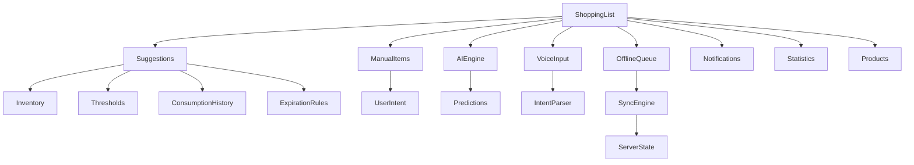

# Baulera

**Document:** 17-shopping-list.md

**Title:** Shopping List Module

**Version:** 1.0

---

# 1 Purpose

The Shopping List module manages all products that need to be purchased by the household.

It connects:

- Inventory levels
- Product thresholds
- Consumption behavior
- Manual user input
- AI suggestions (future)

The goal is to ensure that users always know what needs to be purchased with minimal effort.

---

# 2 Objectives

The Shopping List must:

- Automatically suggest missing products.
- Allow manual item addition.
- Track purchase status.
- Support offline usage.
- Sync across devices.
- Integrate with inventory.
- Reduce cognitive load during shopping.

---

# 3 Scope

Included:

- Shopping list creation
- Manual item management
- Suggested items
- Quantity tracking
- Product linking
- Purchase confirmation
- Offline mode
- Synchronization

Not included in version 1:

- Automatic ordering
- Store-specific pricing
- Route optimization in stores
- Payment integration
- Shared shopping across multiple households

---

# 4 Domain Model

The Shopping List module is composed of:

```text
ShoppingList

↓

ShoppingItem

↓

Product (optional link)
```

Each ShoppingItem may or may not be linked to a Product entity.

---

# 5 Shopping List Concept

A Shopping List is a dynamic collection of items that represent desired future inventory states.

Unlike Inventory, Shopping List items represent intent rather than actual stock.

Example

```text
Milk → Need 2L
Eggs → Need 12 units
Rice → Need 1kg
```

---

# 6 Shopping Item Definition

A Shopping Item represents a single entry in the list.

It may include:

- Name
- Quantity
- Unit
- ProductId (optional)
- Category
- Status
- Priority
- Notes

Shopping Items can exist independently of Products.

---

# 7 Relationship with Products

Shopping Items may be:

| Type | Description |
|------|-------------|
| Linked | Associated with a Product |
| Unlinked | Free-form item |
| Suggested | Generated by system |
| Manual | Added by user |

Linked items provide better automation and inventory synchronization.

---

# 8 Core Principles

SP-001

Shopping List represents intent, not inventory.

---

SP-002

Items can exist without a product link.

---

SP-003

All changes must work offline.

---

SP-004

Synchronization must preserve item state.

---

SP-005

Suggestions never override user decisions.

---

# 9 Item Lifecycle

A shopping item follows a lifecycle:

```text
Suggested

↓

Added to List

↓

In Progress

↓

Purchased

↓

Removed (optional)
```

Items can be re-added after completion.

---

# 10 Item States

| State | Description |
|------|-------------|
| Suggested | Generated automatically |
| Pending | Awaiting purchase |
| Purchased | Already bought |
| Skipped | Intentionally ignored |
| Removed | Deleted from list |

States are critical for UX behavior and analytics.

---

# 11 Quantity Model

Shopping quantities are flexible.

Examples:

- 1 unit
- 2 kg
- 500 ml
- "2 packs"

Rules:

- Quantity must always be positive when applicable.
- Unit consistency is required when linked to a Product.
- Free-text quantities are allowed for unlinked items.

---

# 12 Category Mapping

Shopping items inherit or define a category.

Examples:

- Dairy
- Fruits
- Vegetables
- Meat
- Cleaning
- Personal Care

Category helps:

- Store organization
- UI grouping
- Shopping efficiency

---

# 13 Priority System

Shopping items may have priority levels.

| Priority | Meaning |
|----------|---------|
| High | Urgent need |
| Medium | Normal need |
| Low | Optional |

Priority affects ordering in UI and suggestions.

---

# 14 Shopping List Principles

- Shopping List represents future intent.
- Items may or may not be linked to products.
- Suggestions are derived from inventory and thresholds.
- Lifecycle states reflect shopping progress.
- Quantities must remain flexible.
- Categories improve usability and organization.
- Priority helps optimize shopping decisions.
- All operations must support offline mode.
- Synchronization preserves user intent exactly.

---

# 15 List Generation

Shopping List items can be generated from multiple sources:

- Low stock detection (threshold-based)
- Expiration warnings
- Manual user actions
- Historical consumption patterns
- Voice commands
- Future AI recommendations

Generation does not automatically create final items unless explicitly confirmed by the user (except optional auto-suggestions configured per household).

---

# 16 Threshold-Based Suggestions

When a product falls below its configured threshold:

```text
Current Stock <= Threshold
```

The system generates a suggested shopping item.

Example:

```text
Milk
Current: 0.5 L
Threshold: 1 L
→ Suggest: Buy 2 L
```

Rules:

- Suggestions are recalculated whenever inventory changes.
- Suggestions do not override existing shopping items.
- Users may accept, ignore, or modify suggestions.

---

# 17 Expiration-Based Suggestions

Products nearing expiration may trigger shopping suggestions depending on configuration.

Example:

```text
Milk expires in 2 days
→ Suggest replacement purchase
```

This behavior is optional and configurable per household.

---

# 18 Consumption-Based Prediction

The system analyzes consumption history to predict future needs.

Example:

```text
Eggs consumed: 12 per week
→ Suggest weekly replenishment
```

Prediction rules:

- Based on historical averages.
- Requires minimum data history.
- Adjusts dynamically over time.
- Never overrides user-defined preferences.

---

# 19 Manual Additions

Users can manually add items to the Shopping List.

Manual items:

- Are always respected.
- Override system suggestions.
- Can optionally be linked to products later.
- Support free-form text input.

Manual entry flow must be fast and frictionless.

---

# 20 Suggestion Merging

When multiple sources generate the same item:

- Merge quantities if linked to the same product.
- Keep separate entries if unlinked or ambiguous.
- Prioritize user-defined items over system suggestions.
- Preserve source metadata for analytics.

Example:

```text
Milk (Threshold Suggestion: 1L)
Milk (Consumption Prediction: 2L)
→ Merged: Milk (3L recommended)
```

---

# 21 Duplicate Prevention

The system avoids duplicate shopping entries using:

- ProductId match
- Name similarity
- Barcode match
- Category + fuzzy match (fallback)

If duplicates are detected:

- Merge automatically when safe
- Otherwise prompt user for resolution

---

# 22 Suggested vs Confirmed Items

Shopping items are divided into:

| Type | Description |
|------|-------------|
| Suggested | System-generated, not confirmed |
| Confirmed | User accepted or manually created |

Suggested items remain lightweight and non-intrusive.

Confirmed items become part of the active shopping list.

---

# 23 List Grouping

Items can be grouped for better usability.

Grouping criteria:

- Category
- Storage location (future mapping)
- Priority
- Status (pending/purchased)

Example:

```text
Dairy
  - Milk
  - Cheese

Fruits
  - Apples
  - Bananas
```

Grouping is dynamic and does not affect underlying data.

---

# 24 Sorting Rules

Default sorting priority:

1. Priority (High → Low)
2. Category grouping
3. Suggested vs Confirmed (Confirmed first in active view)
4. Alphabetical fallback

Users may override sorting per session.

---

# 25 List Recalculation

Shopping List is recalculated when:

- Inventory changes
- Product thresholds change
- Consumption occurs
- User modifies settings
- Sync events arrive

Recalculation must be efficient and incremental.

---

# 26 Conflict Prevention

When offline changes exist:

- Local user edits take precedence.
- Server suggestions are merged carefully.
- Conflicts are resolved using timestamps and event history.
- No user intent is overwritten.

---

# 27 Business Rules (Generation)

BR-SL-001

Threshold-based suggestions are always derived from inventory state.

---

BR-SL-002

Manual items always override system suggestions.

---

BR-SL-003

Suggestions never directly modify inventory.

---

BR-SL-004

Duplicate items must be merged or prevented.

---

BR-SL-005

Consumption data influences future suggestions but never forces them.

---

BR-SL-006

Shopping List generation must not block user interactions.

---

# 28 Shopping Item Lifecycle

A Shopping Item evolves through a defined lifecycle from suggestion to completion.

```text
Suggested → Added → Active → Purchased → Completed
                         ↘ Skipped / Removed
```

Each transition is event-driven and recorded for analytics and synchronization.

---

# 29 Lifecycle States

| State | Description |
|------|-------------|
| Suggested | System-generated recommendation |
| Added | User added or accepted suggestion |
| Active | Currently in shopping list |
| Purchased | Marked as bought |
| Skipped | Intentionally ignored |
| Removed | Deleted from list |
| Completed | Fully processed (post-purchase sync) |

States are immutable per event; transitions are derived.

---

# 30 State Transition Rules

Allowed transitions:

- Suggested → Added
- Suggested → Skipped
- Added → Active
- Active → Purchased
- Active → Removed
- Active → Skipped
- Purchased → Completed

Invalid transitions must be rejected by the domain layer.

---

# 31 Quantity Tracking

Shopping quantities are independent from inventory units but must remain compatible when linked.

Rules:

- Quantity must be positive for Active items.
- Purchased items preserve original requested quantity.
- Partial purchases are supported.

Example:

```text
Requested: Milk 2L
Purchased: Milk 1L
Remaining: 1L (still Active)
```

---

# 32 Partial Fulfillment

Shopping items support partial fulfillment.

Use cases:

- Buying part of an item in different stores
- Substituting products
- Splitting bulk purchases

Behavior:

- Item remains Active until fully satisfied.
- Each partial purchase generates a purchase event.
- Remaining quantity is updated dynamically.

---

# 33 Product Linking During Lifecycle

A Shopping Item may be linked to a Product at any stage:

- During creation
- After suggestion acceptance
- During purchase
- After scanning barcode

Once linked:

- Inventory synchronization becomes possible.
- FIFO and batch logic may apply.
- Duplicate detection is enabled.

---

# 34 Purchase Confirmation Flow

```text
Shopping Item Selected

↓

Mark as Purchased

↓

Optional: Scan Barcode

↓

Confirm Quantity

↓

Update Inventory

↓

Record Event

↓

Sync Queue
```

This flow must be optimized for speed during real shopping scenarios.

---

# 35 Undo Mechanism

Short-term undo is supported for:

- Mark as purchased
- Remove item
- Quantity changes

Constraints:

- Undo window is limited (time-based or session-based)
- Undo does not reverse external side effects once synced
- Undo actions are also recorded for traceability

---

# 36 Re-Adding Items

Completed or removed items can be re-added:

- From history
- From suggestions
- Manually by user

Re-added items:

- Generate new lifecycle instance
- Do not modify previous history

---

# 37 Bulk Actions

Shopping List supports batch operations:

- Mark multiple items as purchased
- Remove multiple items
- Change category for multiple items
- Adjust quantities in bulk

Bulk actions must be atomic and reversible when possible.

---

# 38 Item Priority Evolution

Priority may change dynamically:

- Based on inventory depletion
- Based on expiration urgency
- Based on user edits
- Based on repeated suggestions

Priority updates do not reset lifecycle state.

---

# 39 Conflict Handling

When multiple devices modify the same item:

- Last-write-wins applies for simple fields
- Event history is preserved for auditability
- Conflicts in state transitions are resolved via domain rules
- User intent is never silently overwritten

---

# 40 Lifecycle Business Rules

BR-SL-007

Suggested items must not directly affect inventory.

---

BR-SL-008

Active items may be partially fulfilled.

---

BR-SL-009

Purchased items must always generate inventory updates.

---

BR-SL-010

State transitions must follow allowed lifecycle graph.

---

BR-SL-011

Undo operations are time-limited and local-first.

---

BR-SL-012

Re-added items must create new lifecycle instances.

---

# 41 Shopping List UX Overview

The Shopping List UX is optimized for speed, clarity, and minimal cognitive load during real-world shopping scenarios.

Primary design goals:

- Fast item completion
- Large touch targets
- Offline-first interaction
- Minimal navigation depth
- Immediate feedback

---

# 42 Main Shopping Screen

The main screen presents all shopping items in a single consolidated view.

Layout structure:

```text
Top Bar (Search + Actions)

↓

Suggested Items Section

↓

Active Shopping List

↓

Purchased Items (collapsed)

↓

Floating Action Button
```

Key behaviors:

- Suggested items are visually separated from confirmed items.
- Purchased items are collapsed by default.
- Search filters both suggested and active items.

---

# 43 Item Interaction Model

Each shopping item supports quick actions:

- Tap → toggle purchased state
- Swipe → delete / skip
- Long press → edit quantity or link product
- Secondary action → mark as not needed

All interactions must be executable with one hand.

---

# 44 Quick Add Flow

```text
FAB Tap

↓

Enter item name

↓

Optional quantity

↓

Save

↓

Item appears in Active List
```

Optimizations:

- Auto-suggest based on recent items
- Category auto-assignment
- Voice input shortcut (if enabled)
- Instant creation without blocking dialogs

---

# 45 Suggested Items UX

Suggested items are shown separately to avoid confusion with user-confirmed items.

Behavior:

- Light visual emphasis
- Accept / dismiss actions
- Batch acceptance supported
- Never automatically moved to Active without user confirmation (unless configured)

Example:

```text
Suggested

- Milk (2L)   [Add] [Dismiss]
- Eggs (12)   [Add] [Dismiss]
```

---

# 46 Shopping Modes

The UI adapts based on context.

## Planning Mode

- Focus on adding/editing items
- Suggestions visible
- Full item list editable

## In-Store Mode

- Large tap targets
- Minimal distractions
- Purchased items prioritized
- Suggestions hidden or minimized

Switching modes is manual or automatic (future enhancement).

---

# 47 Purchase Interaction Flow

Optimized flow for in-store usage:

```text
Item Tap

↓

Mark Purchased

↓

Optional Scan Barcode

↓

Confirm Quantity

↓

Item moves to Purchased Section
```

Design constraints:

- No modal interruptions unless required
- Minimal typing
- Fast undo option

---

# 48 Batch Actions UX

Bulk operations improve efficiency:

Supported actions:

- Select multiple items
- Mark as purchased
- Remove selected
- Move to category
- Reset selection

Selection mode:

```text
Long Press Item → Selection Mode Activated
```

---

# 49 Visual Hierarchy Rules

Shopping List uses strict hierarchy rules:

1. Active items (highest priority)
2. Suggested items
3. Purchased items (collapsed)
4. Removed/skipped items (hidden by default)

Visual emphasis:

- Active → bold, primary color accent
- Suggested → muted but actionable
- Purchased → subdued, optional strikethrough

---

# 50 Search in Shopping List

Search behavior:

- Real-time filtering
- Matches name, category, and linked product
- Works offline
- Preserves grouping structure

Example:

```text
Search: "mil"

→ Milk
→ Almond Milk
→ Milk Bread
```

---

# 51 Editing Items

Editable fields:

- Name
- Quantity
- Unit
- Category
- Priority
- Product link
- Notes

Rules:

- Editing does not reset lifecycle state.
- Changes are tracked for sync and history.
- Inline editing preferred over full-screen forms.

---

# 52 UX Constraints

- No deep navigation required for common actions.
- No blocking dialogs during shopping mode.
- All primary actions reachable within 1 tap.
- Offline mode must feel identical to online mode.
- Visual clutter must be minimized.
- Suggestions must not interfere with active shopping flow.

---

# 53 Shopping List UX Principles

- Speed is more important than completeness.
- User-confirmed items always take priority over suggestions.
- Shopping flows must remain functional offline.
- Interaction density increases in in-store mode.
- Bulk operations reduce repetitive tasks.
- Visual hierarchy separates intent (suggested) from action (active).
- Undo must be available for critical mistakes.
- Search must never block interaction flow.
- Editing must be lightweight and contextual.
- Purchase confirmation must be immediate.

---

# 54 Offline Behavior

The Shopping List must remain fully functional without internet connectivity.

Offline capabilities:

- Add items
- Edit items
- Mark purchased
- Remove items
- Reorder items
- Change quantities
- Link products (local only)
- View suggestions (cached when available)

All offline actions are queued as domain events for later synchronization.

---

# 55 Offline Queue Model

Each offline action generates an event:

```text
ShoppingEvent
```

Event types:

- ItemAdded
- ItemUpdated
- ItemRemoved
- ItemPurchased
- ItemSkipped
- QuantityChanged
- ProductLinked

Events are stored locally and replayed during sync.

---

# 56 Synchronization Behavior

When connectivity is restored:

```text
Offline Events

↓

Sync Engine

↓

Server State Reconciliation

↓

Client Update
```

Rules:

- Event order must be preserved.
- User intent takes precedence over server suggestions.
- Conflicts are resolved at the domain level.
- No UI rollback unless conflict cannot be resolved automatically.

---

# 57 Conflict Scenarios

## Scenario 1: Duplicate purchase

Two devices mark same item as purchased.

Resolution:

- Merge into single purchase event.
- Keep both device event history.
- Avoid double inventory impact.

---

## Scenario 2: Quantity mismatch

Device A: 2 units purchased  
Device B: 1 unit purchased

Resolution:

- Aggregate quantities if valid.
- Apply FIFO inventory update.
- Maintain full audit trail.

---

## Scenario 3: Item deletion conflict

Device A deletes item  
Device B marks as purchased

Resolution:

- Purchased state takes precedence.
- Item is preserved in history but removed from active list.

---

# 58 AI Integration

The Shopping List may be enhanced by AI (optional feature flag).

AI capabilities:

- Suggest missing products based on consumption
- Predict weekly/monthly needs
- Optimize quantities
- Detect anomalies (unexpected drops in consumption)

Constraints:

- AI suggestions are never automatically applied.
- User approval is always required.
- AI operates only on aggregated historical data.

---

# 59 Voice Integration

Users can interact with the Shopping List via voice.

Commands:

```text
"Add milk to shopping list"
```

```text
"Mark eggs as purchased"
```

```text
"Remove rice"
```

Voice flow:

```text
Input Audio

↓

Speech Recognition

↓

Intent Mapping

↓

Shopping Event

↓

Sync Queue
```

Voice actions follow the same rules as manual actions.

---

# 60 Notification Integration

Shopping List triggers notifications for:

- Low stock suggestions
- Expiring products
- Repeated missing items
- Sync conflicts (rare)

Notification rules:

- Must be actionable
- Must link directly to Shopping List
- Must respect user frequency preferences

Example:

```text
Milk is low in inventory
→ Add to shopping list
```

---

# 61 Background Recalculation

The Shopping List is recalculated when:

- Inventory changes
- Product thresholds change
- Consumption events occur
- Sync completes
- AI suggestions update

Recalculation rules:

- Must be incremental
- Must not block UI
- Must preserve user modifications

---

# 62 Performance Constraints

- List updates must remain under 100ms locally.
- Large lists must be virtualized.
- Offline operations must not degrade responsiveness.
- Sync reconciliation must be incremental.
- Search must be debounced and cached.

---

# 63 Shopping Module Principles

- Offline-first is mandatory.
- Event-based architecture ensures consistency.
- User actions always override suggestions.
- AI is assistive, never authoritative.
- Conflicts are resolved without losing intent.
- Notifications are actionable and contextual.
- Performance must remain stable under large datasets.
- Voice and manual input share the same domain model.
- Synchronization preserves full event history.
- Shopping List is a reflection of intent, not inventory state.

---

# 64 System Diagram



---

# 65 Data Traceability

| Concept | Source |
|----------|--------|
| Inventory levels | 16-products.md |
| Product lifecycle | 16-products.md |
| Threshold rules | 16-products.md |
| Consumption history | 16-products.md |
| Expiration logic | 16-products.md |
| Sync behavior | 11-sync-engine.md |
| Offline events | 10-offline-first.md |
| Architecture | 06-architecture.md |
| UI/UX rules | 14-ui-ux.md |
| Design system | 15-design-system.md |
| Notifications | 22-notifications.md |
| Voice | 19-voice.md |
| AI | 20-ai.md |

---

# 66 Business Rules Summary

BR-SL-013

Shopping List is derived from both system-generated signals and explicit user intent.

---

BR-SL-014

User intent always overrides system suggestions.

---

BR-SL-015

Suggestions must never directly mutate inventory.

---

BR-SL-016

All shopping actions must be event-driven.

---

BR-SL-017

Offline actions must be preserved and replayed exactly.

---

BR-SL-018

Conflicts must be resolved without losing user intent.

---

BR-SL-019

AI is advisory only and cannot auto-apply changes.

---

BR-SL-020

Voice actions must follow the same rules as manual actions.

---

BR-SL-021

Notifications must always be actionable.

---

BR-SL-022

Performance must not degrade with large datasets.

---

# 67 Glossary

| Term | Definition |
|------|------------|
| Shopping Item | A single entry representing intent to purchase a product |
| Suggested Item | System-generated recommendation |
| Confirmed Item | User-approved shopping item |
| FIFO | First-In First-Out consumption strategy used in inventory |
| Intent | User-driven desired future state |
| Offline Queue | Local storage of events pending synchronization |
| Reconciliation | Process of merging local and remote state |

---

# 68 Final Summary

The Shopping List module is the bridge between **Inventory (current state)** and **User Intent (future state)**.

It enables:

- Automatic suggestions from inventory and consumption data
- Manual and voice-driven item management
- Offline-first shopping workflows
- AI-assisted predictions (optional and non-authoritative)
- Conflict-safe synchronization across devices
- High-performance real-time interaction

It is designed to remain fast, predictable, and resilient under all conditions, while always prioritizing user intent over system inference.

---

