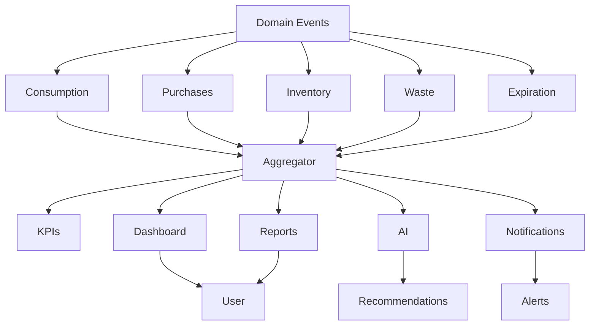

# Baulera

**Document:** 18-statistics.md

**Title:** Statistics Module

**Version:** 1.0

---

# 1 Purpose

The Statistics module defines how Baulera transforms raw product, inventory, shopping, and consumption events into meaningful insights.

It aggregates domain events into structured metrics that help users understand:

- Consumption patterns
- Purchase behavior
- Inventory efficiency
- Waste reduction
- Cost trends
- Household usage habits

---

# 2 Objectives

The Statistics module must:

- Provide real-time and historical insights.
- Operate fully offline using local aggregation.
- Synchronize aggregated and raw data consistently.
- Support flexible filtering (time, category, product).
- Enable dashboard and reporting features.
- Remain performant at large data scale.

---

# 3 Scope

Included:

- Consumption statistics
- Purchase statistics
- Inventory trends
- Expiration and waste tracking
- Category-based analytics
- Product-level analytics
- Household-level analytics
- Time-based aggregation

Not included:

- External financial integrations
- Banking or payment analysis
- Predictive financial modeling (future AI module)

---

# 4 Domain Model

Statistics are derived from domain events:

```text
Product Events
Shopping Events
Inventory Events
Batch Events
```

These events are aggregated into:

```text
Statistic Records
Aggregates
KPI Metrics
Time Series Data
```

---

# 5 Statistics Philosophy

The Statistics module follows strict principles:

- Statistics are derived, never manually entered.
- Raw events are the source of truth.
- Aggregations are reproducible.
- Offline calculations must match server results.
- No loss of granularity at the source level.

---

# 6 Core Entities

## 6.1 Statistic

Represents an aggregated metric.

Attributes:

- StatisticId
- HouseholdId
- Type
- Scope
- Value
- TimeRange
- GeneratedAt

---

## 6.2 Metric Types

| Type | Description |
|------|-------------|
| Consumption | Quantity used |
| Purchase | Quantity acquired |
| Waste | Expired or discarded items |
| Inventory | Current stock levels |
| Frequency | Usage patterns |
| Cost | Spending data (optional) |

---

## 6.3 Time Granularity

Supported time ranges:

- Daily
- Weekly
- Monthly
- Yearly
- Custom range

Granularity depends on query type and performance constraints.

---

# 7 Aggregation Model

Statistics are computed using a layered aggregation model:

```text
Raw Events
   ↓
Local Aggregation
   ↓
Cached Metrics
   ↓
Server Aggregation
   ↓
Final Reports
```

Each layer improves performance while preserving correctness.

---

# 8 Offline Statistics

All statistics must be computed locally when offline.

Behavior:

- Events are stored locally.
- Aggregations are recalculated incrementally.
- UI displays cached values.
- Sync merges and reconciles differences.

Offline statistics must match server output after synchronization.

---

# 9 Consumption Statistics

Consumption statistics measure how products are used over time.

Metrics include:

- Total quantity consumed
- Consumption frequency
- Average daily consumption
- Weekly trends
- Monthly trends
- Category consumption
- Product consumption ranking

Consumption data originates exclusively from Product Consumption Events.

---

# 10 Consumption KPIs

Core KPIs

| KPI | Description |
|------|-------------|
| Total Consumed | Total quantity consumed |
| Average Daily Consumption | Mean daily usage |
| Average Weekly Consumption | Mean weekly usage |
| Most Consumed Product | Highest consumption count |
| Most Consumed Category | Highest category usage |
| Consumption Frequency | Events per period |

These KPIs power the Home Dashboard and Reports.

---

# 11 Purchase Statistics

Purchase statistics analyze inventory replenishment.

Metrics

- Number of purchases
- Quantity purchased
- Purchase frequency
- Average purchase interval
- Purchases per category
- Purchases per product

Example

```text
Milk

Purchased

12 times

during last 90 days
```

---

# 12 Purchase KPIs

| KPI | Description |
|------|-------------|
| Total Purchases | Purchase events |
| Average Purchase Interval | Days between purchases |
| Most Purchased Product | Highest purchase frequency |
| Most Purchased Category | Category ranking |
| Average Purchase Quantity | Mean quantity per purchase |

Purchase statistics are calculated independently from consumption statistics.

---

# 13 Inventory Statistics

Inventory statistics represent the current state of household stock.

Metrics

- Total products
- Total units
- Products per category
- Low-stock products
- Out-of-stock products
- Active batches
- Archived products

Inventory metrics update immediately after inventory events.

---

# 14 Inventory KPIs

Examples

| KPI | Description |
|------|-------------|
| Total Inventory Items | Number of active products |
| Inventory Value | Future optional metric |
| Low Stock Count | Products below threshold |
| Out of Stock Count | Empty inventory |
| Expiring Soon Count | Products within warning window |

These indicators appear prominently on the dashboard.

---

# 15 Category Analytics

Statistics are grouped by category.

Examples

```text
Dairy

↓

Consumption

↓

Purchases

↓

Inventory
```

Supported analytics

- Quantity consumed
- Purchase frequency
- Inventory size
- Expiration rate
- Waste percentage

Categories enable household-wide trend analysis.

---

# 16 Product Analytics

Each product has its own statistics profile.

Available metrics

- Lifetime purchases
- Lifetime consumption
- Average inventory level
- Average purchase interval
- Consumption trend
- Expiration history

Product analytics support better purchasing decisions.

---

# 17 Time-Based Analysis

Statistics are available across multiple periods.

Supported views

```text
Today
```

```text
Last 7 Days
```

```text
Last 30 Days
```

```text
This Month
```

```text
Last 12 Months
```

```text
Custom Range
```

Comparisons between periods should be supported where applicable.

---

# 18 Trend Indicators

Trend calculations compare the current period against a previous equivalent period.

Examples

```text
Milk Consumption

↑ 12%
```

```text
Vegetable Purchases

↓ 8%
```

Trend indicators include

- Increase
- Decrease
- Stable

Trend thresholds should be configurable to avoid highlighting insignificant fluctuations.

---

# 19 Aggregation Principles

- Statistics are derived exclusively from domain events.
- Consumption and purchases are calculated independently.
- Inventory metrics reflect the latest synchronized state.
- Category analytics aggregate product-level information.
- Product analytics provide detailed historical insight.
- Time-based reports support multiple granularities.
- Trend indicators compare equivalent periods.
- KPI calculations remain deterministic across offline and synchronized devices.

---

# 20 Expiration Statistics

Expiration statistics help reduce food waste and improve purchasing decisions.

Tracked metrics

- Products expired
- Batches expired
- Expiration rate
- Products expiring soon
- Average time until expiration
- Category expiration trends

Expiration statistics are calculated using batch-level information.

---

# 21 Waste Analytics

Waste represents inventory that was discarded rather than consumed.

Supported waste reasons

- Expired
- Damaged
- Spoiled
- Lost
- Manual disposal

Metrics

- Total waste quantity
- Waste by category
- Waste by product
- Waste percentage
- Monthly waste trend

Waste is tracked independently from consumption.

---

# 22 Waste KPIs

Examples

| KPI | Description |
|------|-------------|
| Total Waste | Quantity discarded |
| Waste Rate | Waste / Purchased |
| Most Wasted Product | Highest discarded quantity |
| Most Wasted Category | Category ranking |
| Estimated Preventable Waste | Future AI metric |

Waste KPIs help users optimize inventory management.

---

# 23 Inventory Turnover

Inventory turnover measures how quickly products are consumed after purchase.

Formula

```text
Purchased

↓

Stored

↓

Consumed
```

Metrics

- Average storage duration
- Average days before consumption
- Slow-moving products
- Fast-moving products

Turnover improves purchasing recommendations.

---

# 24 Product Lifetime Analytics

Each product exposes lifecycle metrics.

Examples

- First purchase
- Last purchase
- First consumption
- Last consumption
- Total lifetime purchases
- Total lifetime consumption
- Average inventory level
- Average stock duration

These metrics remain available even after archiving.

---

# 25 Household Overview

Household-wide statistics summarize the complete inventory.

Dashboard metrics

- Active products
- Total inventory
- Shopping list size
- Products expiring soon
- Low-stock products
- Recent purchases
- Recent consumption
- Waste indicators

These values refresh incrementally as events occur.

---

# 26 Storage Analytics

Statistics are grouped by storage location.

Examples

```text
Pantry

↓

Products

↓

Inventory

↓

Waste
```

Possible metrics

- Products stored
- Average occupancy
- Expiration frequency
- Inventory turnover
- Low-stock distribution

Storage analytics help optimize household organization.

---

# 27 Seasonal Trends

Historical data enables seasonal comparisons.

Examples

```text
Ice Cream

Summer

↑
```

```text
Soup

Winter

↑
```

Applications

- Better purchase planning
- Consumption forecasting
- AI recommendations
- Household insights

Seasonal analysis requires sufficient historical data.

---

# 28 Comparative Analytics

Users may compare

- Week vs Week
- Month vs Month
- Year vs Year
- Category vs Category
- Product vs Product

Comparisons include

- Absolute difference
- Percentage difference
- Trend direction

Comparisons always use equivalent time periods.

---

# 29 Statistical Accuracy Rules

- Waste is never counted as consumption.
- Expired products contribute to waste statistics.
- Archived products remain part of historical analytics.
- Deleted products preserve historical metrics.
- Batch information drives expiration analytics.
- Household metrics aggregate all active and historical events.
- Seasonal analysis never modifies underlying event data.
- Comparative analytics require equivalent reference periods.

---

# 30 Dashboard Statistics

The Home Dashboard displays a curated subset of statistics for quick access.

Recommended widgets

- Total Products
- Low Stock
- Expiring Soon
- Shopping List Items
- Purchases This Week
- Consumption This Week
- Waste This Month
- Recently Added Products

Dashboard statistics prioritize readability over completeness.

---

# 31 Reports

The Statistics module supports detailed reports.

Report types

- Inventory Report
- Consumption Report
- Purchase Report
- Waste Report
- Expiration Report
- Category Report
- Product Report

Reports support filtering, sorting, and exporting in future versions.

---

# 32 Filtering

Statistics may be filtered by

- Date range
- Product
- Category
- Brand
- Storage location
- Household member (future)
- Archived products

Multiple filters may be combined.

Filtering never alters stored statistics.

---

# 33 Drill-Down Navigation

Every aggregated metric should allow navigation to its underlying data.

Example

```text
Low Stock

↓

Products Below Threshold

↓

Milk

↓

Purchase History
```

Benefits

- Transparency
- Easier troubleshooting
- Better user understanding
- Increased trust in reported metrics

---

# 34 Real-Time Updates

Statistics update immediately after domain events.

Example

```text
Purchase Recorded

↓

Inventory Updated

↓

Statistics Updated

↓

Dashboard Refreshed
```

Updates should occur without requiring manual refresh.

---

# 35 Caching Strategy

Statistics are cached to improve performance.

Caching layers

```text
Raw Events

↓

Local Cache

↓

Aggregated Cache

↓

Dashboard
```

Cache invalidation occurs after relevant domain events.

---

# 36 Incremental Calculation

The application avoids recalculating all statistics.

Instead

```text
New Event

↓

Affected Metrics Identified

↓

Incremental Update

↓

Dashboard Refresh
```

Benefits

- Better battery usage
- Faster UI
- Lower CPU consumption
- Improved scalability

---

# 37 Historical Snapshots

Future versions may generate periodic snapshots.

Examples

- Daily summary
- Weekly summary
- Monthly summary

Advantages

- Faster historical queries
- Simplified reporting
- Reduced aggregation cost

Raw events remain the authoritative source of truth.

---

# 38 Export Support

Future export formats

- CSV
- Excel
- PDF
- JSON

Possible exports

- Inventory history
- Purchase history
- Consumption history
- Waste reports
- Category analytics

Exports are generated from aggregated statistics and underlying events.

---

# 39 Performance Requirements

Statistics module targets

| Operation | Target |
|-----------|--------|
| Dashboard Load | < 200 ms |
| Incremental Update | < 50 ms |
| Local Aggregation | < 100 ms |
| Search Within Reports | < 100 ms |
| Cached Dashboard Refresh | < 16 ms |

Performance targets apply to typical household datasets.

---

# 40 Reporting Principles

- Dashboard displays the most actionable metrics.
- Reports provide detailed historical analysis.
- Every aggregate supports drill-down exploration.
- Statistics update automatically after relevant events.
- Incremental calculations minimize computation cost.
- Cached values improve responsiveness.
- Historical snapshots optimize long-term reporting.
- Export functionality uses aggregated and event-level data.
- Performance remains predictable as datasets grow.

---

# 41 User Insights

The Statistics module transforms raw metrics into user-friendly insights.

Examples

```text
You usually buy milk every 6 days.
```

```text
Vegetable consumption increased by 18% this month.
```

```text
Three products expired this week.
```

Insights are generated from aggregated data and should be concise, actionable, and easy to understand.

---

# 42 Smart Recommendations

Based on statistics, the system may suggest actions.

Examples

- Buy products before reaching zero stock.
- Reduce purchases of frequently wasted items.
- Increase inventory for frequently consumed products.
- Consume products nearing expiration first.
- Review rarely used products.

Recommendations are advisory only and never modify user data automatically.

---

# 43 Shopping List Integration

Statistics contribute to Shopping List generation.

Examples

```text
Average milk consumption

↓

Threshold prediction

↓

Shopping suggestion
```

or

```text
Frequently purchased product

↓

Low inventory

↓

High-priority shopping item
```

Historical behavior improves suggestion quality over time.

---

# 44 Inventory Optimization

Statistics help users optimize storage.

Potential indicators

- Overstocked products
- Frequently depleted products
- Slow-moving inventory
- Frequently relocated products
- Seasonal inventory changes

Optimization focuses on reducing waste while maintaining availability.

---

# 45 Household Behavior Analysis

Long-term statistics reveal household habits.

Examples

- Weekly shopping rhythm
- Preferred product categories
- Consumption peaks
- Seasonal changes
- Frequently repeated purchases

Behavior analysis supports future AI features without changing the underlying event model.

---

# 46 AI Integration

The AI module consumes statistical aggregates rather than raw UI data.

Possible AI features

- Demand forecasting
- Purchase recommendations
- Waste prediction
- Inventory optimization
- Seasonal planning
- Personalized insights

AI models must use historical statistics as inputs while respecting user privacy.

---

# 47 Notification Integration

Statistics drive intelligent notifications.

Examples

```text
Waste increased by 25% this month.
```

```text
Milk consumption is higher than usual.
```

```text
Five products will expire this week.
```

Notifications should be timely, actionable, and configurable.

---

# 48 Privacy Rules

Statistics remain household-scoped.

Rules

- No statistics are shared publicly.
- Household data remains isolated.
- Anonymous aggregates may be used for future product improvements only with explicit user consent.
- Personal insights are generated locally whenever possible.

Privacy requirements apply equally online and offline.

---

# 49 Data Retention

Historical events are retained indefinitely unless explicitly removed by the user.

Derived statistics may be:

- Recomputed at any time.
- Cached temporarily.
- Archived as snapshots.
- Purged and regenerated when required.

Raw events remain the authoritative source.

---

# 50 Statistics Business Rules

BR-STAT-001

Statistics are always derived from domain events.

---

BR-STAT-002

User insights never modify source data.

---

BR-STAT-003

Recommendations are advisory only.

---

BR-STAT-004

Shopping suggestions may use statistical aggregates.

---

BR-STAT-005

AI consumes aggregated statistics rather than presentation-layer data.

---

BR-STAT-006

Notifications generated from statistics must remain configurable.

---

BR-STAT-007

Historical events must remain reproducible after synchronization.

---

BR-STAT-008

Privacy boundaries apply to all statistical processing.

---

# 51 Synchronization Strategy

Statistics are synchronized using the same event-driven architecture as the rest of the application.

Principles

- Raw events are synchronized.
- Derived statistics are never the primary synchronization unit.
- Local aggregations may be discarded and rebuilt.
- Server-side aggregation must produce identical results.

Synchronization flow

```text
Domain Events

↓

Sync Engine

↓

Server Events

↓

Aggregation

↓

Statistics Cache

↓

Dashboard
```

---

# 52 Offline Calculation Strategy

When the device is offline

```text
New Event

↓

Local Database

↓

Incremental Aggregation

↓

Dashboard Update
```

When synchronization completes

```text
Remote Events

↓

Merge

↓

Recalculate Affected Metrics

↓

Refresh UI
```

Only affected statistics are recalculated.

---

# 53 Cache Management

The Statistics module uses multiple cache levels.

Level 1

```text
Raw Events
```

Persistent.

---

Level 2

```text
Incremental Aggregates
```

Persistent and rebuildable.

---

Level 3

```text
Dashboard Cache
```

Ephemeral.

---

Level 4

```text
UI State
```

In-memory only.

---

# 54 Rebuild Strategy

Statistics must always be reproducible.

Rebuild process

```text
Delete Cache

↓

Replay Events

↓

Recalculate Statistics

↓

Refresh Dashboard
```

This process should produce identical results regardless of device.

---

# 55 Error Recovery

If inconsistencies are detected

Recovery steps

1. Validate event history.
2. Discard derived caches.
3. Replay events.
4. Rebuild aggregates.
5. Refresh statistics.

Users should not lose historical data.

---

# 56 Scalability

The Statistics module must support

- Thousands of products
- Hundreds of thousands of events
- Multi-year history
- Multiple devices
- Continuous synchronization

Performance is achieved through

- Incremental aggregation
- Cached metrics
- Indexed event storage
- Lazy loading
- Background processing

---

# 57 Future Enhancements

Potential additions

- Financial dashboards
- Budget analysis
- Household comparisons
- Carbon footprint estimation
- Nutritional insights
- Predictive consumption models
- Advanced AI analytics
- Custom reports
- Scheduled report generation

The current architecture intentionally supports these extensions without requiring domain redesign.

---

# 58 Quality Attributes

The Statistics module emphasizes

Reliability

- Reproducible calculations
- Deterministic aggregation

Performance

- Incremental updates
- Cached dashboard metrics

Scalability

- Efficient event replay
- Indexed historical data

Maintainability

- Clear separation between events and aggregates
- Independent calculation services

---

# 59 Acceptance Criteria

| Area | Acceptance Criteria |
|------|----------------------|
| Consumption | Consumption metrics update immediately after events. |
| Purchases | Purchase statistics reflect synchronized inventory changes. |
| Dashboard | Dashboard refreshes without manual intervention. |
| Offline | Local statistics remain available without internet. |
| Synchronization | Rebuilt statistics match server calculations. |
| Reports | Filters return deterministic results. |
| Performance | Incremental updates meet response-time targets. |
| Recovery | Statistics can be fully regenerated from raw events. |

---

# 60 Statistics Module Principles

- Domain events are the single source of truth.
- Statistics are reproducible and deterministic.
- Aggregations are incremental whenever possible.
- Dashboard metrics prioritize responsiveness.
- Cached values improve performance without sacrificing correctness.
- Offline calculations mirror synchronized behavior.
- Event replay guarantees recovery from inconsistencies.
- The architecture scales to large households and long histories.
- Future analytical capabilities can be added without changing the domain model.

---

# 61 Module Diagram



---

# 62 Cross-Module Traceability

| Statistics Feature | Related Document |
|--------------------|------------------|
| Domain Events | 04-domain-model.md |
| Use Cases | 05-use-cases.md |
| Architecture | 06-architecture.md |
| Database Schema | 08-database-design.md |
| Offline Processing | 10-offline-first.md |
| Synchronization | 11-sync-engine.md |
| Product Lifecycle | 16-products.md |
| Shopping Suggestions | 17-shopping-list.md |
| Voice Commands | 19-voice.md |
| AI Recommendations | 20-ai.md |
| Notifications | 22-notifications.md |

---

# 63 Design Principles Summary

The Statistics module is based on the following principles.

## 63.1 Event-Sourced Analytics

Every metric is calculated from immutable domain events.

No statistic is treated as authoritative data.

---

## 63.2 Deterministic Results

Given the same event history:

- Every device
- Every synchronization
- Every rebuild

must produce identical statistical results.

---

## 63.3 Incremental Processing

New events update only affected aggregates.

Full recalculation is reserved for:

- Recovery
- Migration
- Cache rebuild
- Data verification

---

## 63.4 Offline-First Analytics

Statistics continue to work without connectivity.

All calculations execute locally and are reconciled after synchronization.

---

## 63.5 Explainable Metrics

Every displayed KPI must support drill-down to the underlying domain events.

Users should always be able to understand why a metric has a given value.

---

## 63.6 Performance by Design

The module favors:

- Incremental aggregation
- Indexed queries
- Cached summaries
- Lazy loading
- Background computation

instead of repeated full-table scans.

---

## 63.7 Modular Consumers

The Statistics module produces data for:

- Dashboard
- Reports
- Shopping List
- Notifications
- Voice
- AI

without creating direct coupling between modules.

---

## 63.8 Future-Proof Architecture

The aggregation pipeline is intentionally generic.

Future additions may include:

- Financial analytics
- Nutritional analytics
- Sustainability metrics
- Household benchmarking
- Machine learning models

without changing existing event contracts.

---

# 64 Key Performance Indicators

The initial dashboard should expose at least the following KPIs.

| KPI | Description |
|------|-------------|
| Active Products | Number of products currently in inventory |
| Low Stock | Products below threshold |
| Out of Stock | Products with zero available quantity |
| Expiring Soon | Products inside warning window |
| Purchased This Month | Purchase events during current month |
| Consumed This Month | Consumption events during current month |
| Waste This Month | Quantity discarded or expired |
| Shopping List Items | Pending shopping items |
| Most Consumed Category | Highest consumption category |
| Most Purchased Product | Highest purchase frequency |

These KPIs represent the minimum viable analytics dashboard.

---

# 65 Final Summary

The Statistics module transforms immutable domain events into actionable household insights.

It provides:

- Real-time dashboards
- Historical reports
- Consumption analysis
- Purchase analysis
- Waste monitoring
- Inventory optimization
- AI-ready aggregates
- Notification triggers
- Offline-first analytics
- Deterministic synchronization

The architecture is designed to scale from small households to years of historical data while maintaining correctness, reproducibility, and high performance.

---


