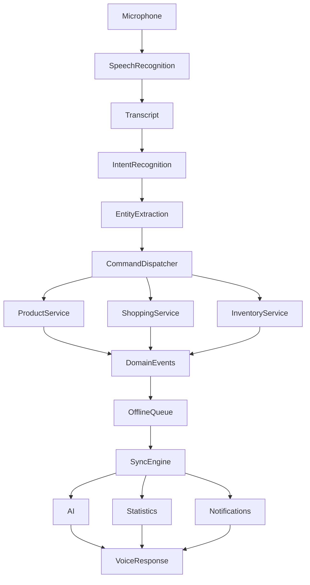

# Baulera

**Document:** 19-voice.md

**Title:** Voice Module

**Version:** 1.0

---

# 1 Purpose

The Voice module enables users to interact with Baulera using natural speech.

It provides a fast, hands-free interface for common household tasks such as:

- Adding products
- Recording purchases
- Recording consumption
- Managing shopping lists
- Querying inventory
- Receiving spoken responses (future)

Voice interactions are designed to minimize friction while preserving the same business rules as manual interactions.

---

# 2 Objectives

The Voice module must:

- Understand natural language.
- Execute supported commands reliably.
- Integrate with existing domain services.
- Support offline operation when possible.
- Preserve user privacy.
- Be extensible for future AI capabilities.

---

# 3 Scope

Included

- Speech recognition
- Intent recognition
- Entity extraction
- Product commands
- Shopping commands
- Inventory queries
- Context-aware interactions
- Voice shortcuts

Not included in version 1

- Continuous listening
- Wake-word detection
- Smart speaker integration
- Voice biometrics
- Voice authentication

---

# 4 Architecture Overview

The Voice module consists of:

```text
Microphone

↓

Speech Recognition

↓

Intent Recognition

↓

Entity Extraction

↓

Command Dispatcher

↓

Domain Services

↓

Response Generator
```

Each stage is isolated and independently testable.

---

# 5 Design Philosophy

Voice interaction follows five principles.

## Speed

The fastest path to completing common tasks.

---

## Natural Language

Users should not memorize rigid commands.

---

## Consistency

Voice operations execute the same domain logic as manual interactions.

---

## Transparency

Users always know what action will be performed.

---

## Recoverability

Incorrect recognition should be easy to correct.

---

# 6 Domain Model

The Voice module introduces the following concepts.

```text
VoiceSession

↓

VoiceCommand

↓

Intent

↓

Entities

↓

Domain Action
```

No inventory data is stored directly inside the Voice module.

---

# 7 Voice Session

A Voice Session represents a single interaction.

Attributes

- SessionId
- StartedAt
- EndedAt
- Language
- RecognitionResult
- Intent
- ConfidenceScore

Sessions are short-lived and not synchronized.

---

# 8 Voice Command

A Voice Command contains:

- Original transcript
- Detected language
- Intent
- Extracted entities
- Confidence score
- Execution result

Example

```text
"Add two liters of milk"
```

↓

```text
Intent

AddProduct
```

↓

```text
Entities

Milk

2

Liters
```

---

# 9 Intent

An Intent represents the user's goal.

Examples

- Add Product
- Purchase Product
- Consume Product
- Search Product
- Show Inventory
- Add Shopping Item
- Remove Shopping Item

Intent recognition is independent of the UI.

---

# 10 Entity Extraction

Entities provide structured parameters.

Typical entities

- Product name
- Quantity
- Unit
- Category
- Location
- Date
- Time
- Brand

Example

```text
Buy three bottles of water
```

Entities

```text
Quantity

3
```

```text
Unit

Bottle
```

```text
Product

Water
```

---

# 11 Command Dispatcher

The dispatcher converts recognized intents into domain operations.

Workflow

```text
Intent

↓

Validation

↓

Domain Service

↓

Result

↓

Voice Response
```

The dispatcher contains no business logic.

---

# 12 Voice Module Principles

- Natural language is preferred over rigid command syntax.
- Voice commands execute the same domain services as manual actions.
- Recognition results are validated before execution.
- Voice sessions are ephemeral.
- Entities are extracted independently from intent detection.
- The dispatcher coordinates execution but does not implement business rules.
- All voice interactions remain compatible with offline-first architecture.

---

# 13 Intent Recognition

Intent recognition determines the user's objective independently of wording.

Examples

```text
Buy milk
```

```text
Purchase milk
```

```text
I need milk
```

↓

All resolve to

```text
PurchaseProduct
```

Intent recognition should be language-aware and tolerant of natural phrasing.

---

# 14 Supported Intents

Version 1 supports the following intents.

Inventory

- SearchProduct
- ShowInventory
- ShowLowStock
- ShowExpiringProducts

Products

- AddProduct
- EditProduct
- ArchiveProduct
- DeleteProduct

Purchases

- PurchaseProduct
- ConsumeProduct
- AdjustInventory

Shopping List

- AddShoppingItem
- RemoveShoppingItem
- CompleteShoppingItem
- ShowShoppingList

General

- Help
- Cancel
- Repeat

Future versions may extend this list without affecting the domain model.

---

# 15 Entity Types

The NLP pipeline extracts structured entities.

Supported entities

| Entity | Example |
|---------|---------|
| Product | Milk |
| Quantity | 2 |
| Unit | Liters |
| Category | Dairy |
| Brand | Coca-Cola |
| Storage Location | Pantry |
| Shelf | Top Shelf |
| Date | Tomorrow |
| Time | 6 PM |
| Relative Period | Next week |

Entity extraction is independent of intent classification.

---

# 16 Grammar Flexibility

Users should not be required to use predefined phrases.

Equivalent examples

```text
Buy milk
```

```text
Add milk
```

```text
I need milk
```

```text
Put milk on my shopping list
```

The system maps semantically equivalent expressions to the appropriate intent.

---

# 17 Confidence Thresholds

Each recognition result includes a confidence score.

| Confidence | Behavior |
|------------|----------|
| ≥ 0.90 | Execute immediately |
| 0.70–0.89 | Confirm when action is destructive or ambiguous |
| < 0.70 | Ask for clarification |

Confidence thresholds are configurable.

---

# 18 Clarification Flow

When intent or entities are ambiguous:

```text
User

↓

Recognition

↓

Low Confidence

↓

Clarification Question

↓

Updated Intent

↓

Execution
```

Example

User:

```text
Add milk
```

Assistant:

```text
To your inventory or your shopping list?
```

Only after clarification is the command executed.

---

# 19 Multi-Entity Parsing

Commands may contain multiple entities.

Example

```text
Buy two liters of milk and one dozen eggs
```

Parsed as

| Product | Quantity | Unit |
|---------|----------|------|
| Milk | 2 | Liters |
| Eggs | 12 | Units |

Each parsed item generates its own domain operation within the same transaction when possible.

---

# 20 Number Normalization

The recognition pipeline converts spoken numbers into structured values.

Examples

```text
Two
```

↓

```text
2
```

---

```text
One and a half
```

↓

```text
1.5
```

---

```text
Half kilogram
```

↓

```text
0.5 kg
```

Normalization supports decimal quantities and localized expressions.

---

# 21 Unit Recognition

Supported units include

Mass

- Gram
- Kilogram

Volume

- Milliliter
- Liter

Count

- Unit
- Bottle
- Can
- Box
- Package
- Dozen

The system maps synonyms to canonical units.

Example

```text
Litre
```

↓

```text
Liter
```

---

# 22 Language Support

The Voice module is designed to support multiple languages.

Version 1 targets

- English
- Spanish

Future languages may be added through additional recognition models and localized grammars without modifying the domain layer.

---

# 23 NLP Pipeline

```text
Speech

↓

Transcript

↓

Normalization

↓

Intent Recognition

↓

Entity Extraction

↓

Validation

↓

Domain Command

↓

Execution
```

Each stage is independent, allowing individual replacement or improvement.

---

# 24 Recognition Principles

- Intent detection prioritizes user intent over exact wording.
- Entity extraction is language-aware.
- Confidence determines execution strategy.
- Clarification is preferred over incorrect execution.
- Multiple products may be processed in a single command.
- Spoken numbers are normalized into canonical values.
- Units are standardized before reaching the domain layer.
- NLP components remain decoupled from business logic.
- New intents and languages can be introduced without redesigning the pipeline.

---

# 25 Product Commands

Voice commands can perform common product operations.

Supported actions

- Create product
- Update product
- Search product
- Archive product
- Show product details

Examples

```text
Add olive oil
```

```text
Show my rice
```

```text
Archive tomato sauce
```

All commands execute through the Product domain services.

---

# 26 Purchase Commands

Purchases increase inventory.

Examples

```text
I bought two liters of milk
```

```text
Add three cans of tuna
```

```text
I purchased one kilogram of rice
```

Workflow

```text
Voice

↓

Intent

↓

Product Resolution

↓

Purchase Event

↓

Inventory Update

↓

Statistics Update

↓

Synchronization
```

---

# 27 Consumption Commands

Consumption decreases inventory.

Examples

```text
I used one liter of milk
```

```text
Consume two eggs
```

```text
Remove one package of pasta
```

The FIFO batch selection rules remain identical to manual operations.

---

# 28 Inventory Queries

Users can request inventory information.

Examples

```text
Do I have milk?
```

```text
How many eggs are left?
```

```text
Which products expire this week?
```

```text
What is running low?
```

The response is generated from the local inventory whenever possible.

---

# 29 Shopping List Commands

Supported operations

Add

```text
Add coffee to my shopping list
```

Remove

```text
Remove butter from my shopping list
```

Complete

```text
Mark milk as purchased
```

Query

```text
Show my shopping list
```

Voice commands follow the same business rules as the Shopping List module.

---

# 30 Batch Commands

Future versions may expose batch-specific commands.

Examples

```text
Show milk batches
```

```text
Which milk expires first?
```

```text
Consume the oldest yogurt
```

Batch commands rely on FIFO rules and expiration metadata.

---

# 31 Multi-Step Operations

Complex commands are decomposed into multiple domain operations.

Example

```text
I bought two liters of milk and consumed one liter
```

Execution

```text
Purchase

↓

Inventory Update

↓

Consumption

↓

Inventory Update

↓

Statistics

↓

Synchronization
```

Operations execute sequentially to preserve event ordering.

---

# 32 Voice Responses

Version 1 supports concise confirmation messages.

Examples

```text
Milk added.
```

```text
Two liters of milk purchased.
```

```text
Shopping list updated.
```

Future versions may support configurable verbosity and synthesized speech responses.

---

# 33 Error Handling

Examples

Unknown product

```text
I couldn't find that product.
Would you like to create it?
```

Ambiguous product

```text
Did you mean whole milk or almond milk?
```

Missing quantity

```text
How much milk did you buy?
```

Errors should guide the user toward successful completion rather than simply rejecting the request.

---

# 34 Context Retention

During a voice session, limited context may be retained.

Example

User

```text
Buy milk.
```

Assistant

```text
How much?
```

User

```text
Two liters.
```

The second response completes the original command.

Session context expires automatically after a short period or when the interaction ends.

---

# 35 Voice Command Principles

- Voice commands invoke existing domain services only.
- Purchase and consumption commands generate the same domain events as manual actions.
- Inventory queries prioritize local data for speed.
- Shopping List operations remain fully compatible with offline mode.
- Multi-step commands preserve execution order.
- Confirmation messages are brief and unambiguous.
- Error messages assist recovery through clarification.
- Temporary conversational context improves usability without creating long-lived state.
- Voice interactions remain deterministic and fully auditable.

---

# 36 AI Integration

The Voice module can leverage the AI module to improve intent recognition and conversational capabilities.

Responsibilities delegated to AI

- Natural language understanding
- Synonym resolution
- Context interpretation
- Recommendation generation
- Conversational responses

Responsibilities retained by the Voice module

- Audio capture
- Speech recognition
- Command validation
- Domain execution
- Session management

AI enhances interpretation but never bypasses domain rules.

---

# 37 Context Awareness

The Voice module may use contextual information to improve recognition.

Available context

- Current screen
- Recently accessed product
- Active shopping list
- Current household
- Previous command (same session)

Example

```text
User

Show milk.
```

↓

Product displayed.

↓

User

Buy two.

↓

System

Purchase two units of the displayed product.
```

Context expires when the voice session ends.

---

# 38 Multi-Turn Conversations

Complex operations may require several exchanges.

Example

```text
User

Add milk.
```

↓

```text
Assistant

To inventory or shopping list?
```

↓

```text
User

Shopping list.
```

↓

```text
Assistant

How much?
```

↓

```text
User

Two liters.
```

↓

```text
Assistant

Added two liters of milk to your shopping list.
```

Each step advances the conversation toward a complete domain command.

---

# 39 Confirmation Policy

Confirmation depends on action risk.

| Action | Confirmation |
|---------|--------------|
| Search | No |
| Show inventory | No |
| Add shopping item | No |
| Purchase product | Usually no |
| Consume product | Usually no |
| Delete product | Always |
| Archive product | Always |
| Large inventory adjustment | Always |

The goal is to balance speed with safety.

---

# 40 Ambiguity Resolution

When multiple interpretations exist, the system requests clarification.

Example

```text
User

Add apples.
```

Possible interpretations

- Add product
- Purchase product
- Shopping list

Assistant

```text
Would you like to add apples to your inventory or your shopping list?
```

Clarification questions should be as specific as possible.

---

# 41 Personalization

Future versions may personalize recognition using non-sensitive preferences.

Examples

- Frequently used products
- Preferred units
- Preferred language
- Frequently used commands

Personalization improves recognition without changing domain behavior.

---

# 42 Conversation Memory

Conversation memory is intentionally limited.

Retained

- Current intent
- Missing entities
- Previous clarification
- Current product context

Not retained

- Long-term conversational history
- Sensitive spoken content
- Audio recordings beyond processing requirements

This minimizes privacy risks and simplifies recovery.

---

# 43 AI-Assisted Recommendations

During conversations, AI may provide optional suggestions.

Examples

```text
Milk is running low.
Would you like to add it to your shopping list?
```

```text
This product expires tomorrow.
Would you like to consume it first?
```

Recommendations require explicit user confirmation before execution.

---

# 44 Explainability

Whenever feasible, the system should explain why an action or suggestion occurred.

Examples

```text
Milk was suggested because inventory is below the configured threshold.
```

```text
Yogurt was recommended because it expires tomorrow.
```

Explainability increases user trust and simplifies troubleshooting.

---

# 45 AI & Conversation Principles

- AI improves understanding but does not execute business logic.
- Context is limited to the active voice session.
- Multi-turn conversations collect missing information progressively.
- High-risk actions require explicit confirmation.
- Ambiguity is resolved through targeted clarification.
- Personalization enhances recognition without affecting domain rules.
- Conversation memory is intentionally short-lived.
- Recommendations remain optional and require user approval.
- Explanations should accompany AI-driven suggestions whenever appropriate.

---

# 46 Offline Operation

The Voice module supports offline operation whenever the underlying speech recognition engine allows it.

Offline capabilities may include:

- Product lookup
- Inventory queries
- Shopping list operations
- Purchase registration
- Consumption registration
- Local intent execution

Features requiring cloud-based language models are unavailable until connectivity is restored.

---

# 47 Offline Processing Pipeline

```text
Microphone

↓

Local Speech Recognition

↓

Intent Recognition

↓

Entity Extraction

↓

Domain Command

↓

Offline Queue

↓

Synchronization
```

All successful commands generate the same domain events as online execution.

---

# 48 Synchronization

Voice commands produce ordinary domain events.

Example

```text
Voice Purchase

↓

Purchase Event

↓

Offline Queue

↓

Synchronization

↓

Server

↓

Statistics Update
```

The Sync Engine does not distinguish whether an event originated from:

- Voice
- Manual UI
- Barcode scanning
- AI recommendation

---

# 49 Privacy

Voice interactions prioritize user privacy.

Principles

- Audio is processed only as required.
- Audio recordings are not permanently stored.
- Transcripts are retained only when necessary for execution or auditing.
- Sensitive information is never used for unrelated purposes.

Whenever possible, processing should occur locally.

---

# 50 Security

Voice commands follow the same authorization model as every other interaction.

Security requirements

- Household isolation
- User authentication
- Permission validation
- Domain rule enforcement
- Audit logging

Voice input never bypasses security policies.

---

# 51 Performance Targets

| Operation | Target |
|-----------|--------|
| Speech recognition | < 2 s |
| Intent detection | < 100 ms |
| Entity extraction | < 100 ms |
| Local command execution | < 100 ms |
| UI confirmation | Immediate |
| Complete interaction | < 3 s |

Targets represent expected performance on supported devices.

---

# 52 Failure Recovery

Possible failures

- Recognition failure
- Missing entities
- Unknown product
- Offline recognition unavailable
- Permission denied
- Synchronization failure

Recovery strategy

1. Explain the problem.
2. Preserve user progress when possible.
3. Request missing information.
4. Retry safely.
5. Never execute uncertain commands automatically.

---

# 53 Accessibility

The Voice module improves accessibility by reducing dependence on manual interaction.

Accessibility goals

- Hands-free operation
- Large microphone controls
- Clear confirmations
- Minimal typing
- Simple recovery flow

Voice complements, but never replaces, the graphical interface.

---

# 54 Extensibility

The architecture supports future integrations such as:

- Wake-word activation
- Smart speakers
- Wearables
- Automotive systems
- External voice assistants
- Home automation platforms

These integrations reuse the same intent and command pipeline.

---

# 55 Voice Business Rules

BR-VOICE-001

Every voice command must execute through existing domain services.

---

BR-VOICE-002

Voice commands generate the same domain events as manual actions.

---

BR-VOICE-003

Offline execution must preserve event ordering.

---

BR-VOICE-004

Audio recordings are not retained longer than necessary.

---

BR-VOICE-005

Voice interactions never bypass authentication or authorization.

---

BR-VOICE-006

Uncertain recognition requires clarification before execution.

---

BR-VOICE-007

Accessibility improvements must not compromise correctness.

---

BR-VOICE-008

Future voice platforms must integrate without changing the domain model.

---

# 56 Voice Module Diagram



---

# 57 Cross-Module Traceability

| Voice Feature | Related Document |
|---------------|------------------|
| Domain Model | 04-domain-model.md |
| Use Cases | 05-use-cases.md |
| Architecture | 06-architecture.md |
| Offline Queue | 10-offline-first.md |
| Synchronization | 11-sync-engine.md |
| Security | 12-security.md |
| Products | 16-products.md |
| Shopping List | 17-shopping-list.md |
| Statistics | 18-statistics.md |
| AI | 20-ai.md |
| Notifications | 22-notifications.md |

---

# 58 Design Principles Summary

## 58.1 Voice as an Input Method

Voice is an alternative user interface.

It never contains business logic and always delegates execution to existing domain services.

---

## 58.2 Single Source of Truth

Regardless of whether an action originates from:

- UI
- Voice
- Barcode scanning
- AI recommendation

the resulting domain events are identical.

---

## 58.3 Natural Language First

Users should communicate naturally.

The system adapts to the user instead of forcing rigid command syntax.

---

## 58.4 Explainable Execution

Before executing destructive or ambiguous actions, the system should clearly explain what will happen.

When clarification is required, execution is postponed until the intent is unambiguous.

---

## 58.5 Deterministic Behavior

Equivalent commands must always produce the same domain operations.

Example

```text
Buy milk
```

```text
Purchase milk
```

```text
I bought milk
```

should resolve consistently according to the detected intent and context.

---

## 58.6 Privacy by Design

The module minimizes retention of voice-related data.

Only information required for command execution, synchronization, and auditing is preserved.

Audio recordings are considered transient.

---

## 58.7 Offline-First Voice

Whenever supported by the speech recognition engine:

- Recognition
- Intent resolution
- Command execution

should continue working without connectivity.

Cloud services enhance recognition quality but are not required for core functionality.

---

## 58.8 Extensible Pipeline

Every processing stage can evolve independently.

Possible replacements include:

- New speech engines
- Alternative NLP providers
- Local language models
- AI-assisted parsing
- Additional supported languages

without affecting the rest of the architecture.

---

# 59 Acceptance Criteria

| Area | Acceptance Criteria |
|------|----------------------|
| Recognition | Supported commands are correctly recognized under normal conditions. |
| Intent Detection | Equivalent natural-language commands map to the same intent. |
| Entity Extraction | Quantities, units, and products are correctly identified. |
| Execution | Voice commands invoke the same domain services as manual actions. |
| Offline | Supported commands continue functioning without internet access. |
| Synchronization | Voice-generated events synchronize identically to other events. |
| Privacy | Audio is not retained longer than necessary. |
| Security | Authorization and business rules are enforced consistently. |
| Accessibility | Common inventory tasks can be completed hands-free. |
| Performance | Typical voice interactions complete within target response times. |

---

# 60 Future Enhancements

Potential future capabilities include:

- Wake-word activation
- Continuous conversation mode
- Streaming speech recognition
- Real-time transcription
- Speaker identification
- Voice shortcuts and macros
- Context-aware proactive suggestions
- Smart speaker integrations
- Wearable device support
- Multimodal interactions (voice + camera + barcode)

The current architecture supports these additions without requiring changes to the core domain model.

---

# 61 Final Summary

The Voice module provides a natural, hands-free interface for interacting with Baulera while remaining fully aligned with the application's domain architecture.

Key characteristics include:

- Natural-language command processing
- Intent and entity recognition
- Offline-first execution when supported
- Event-driven synchronization
- Strong privacy and security guarantees
- AI-assisted understanding without bypassing domain rules
- Consistent behavior across voice, UI, barcode scanning, and future interaction methods

By treating voice as another presentation layer rather than a separate execution model, the module remains maintainable, deterministic, extensible, and fully compatible with the overall Offline-First architecture.

---

