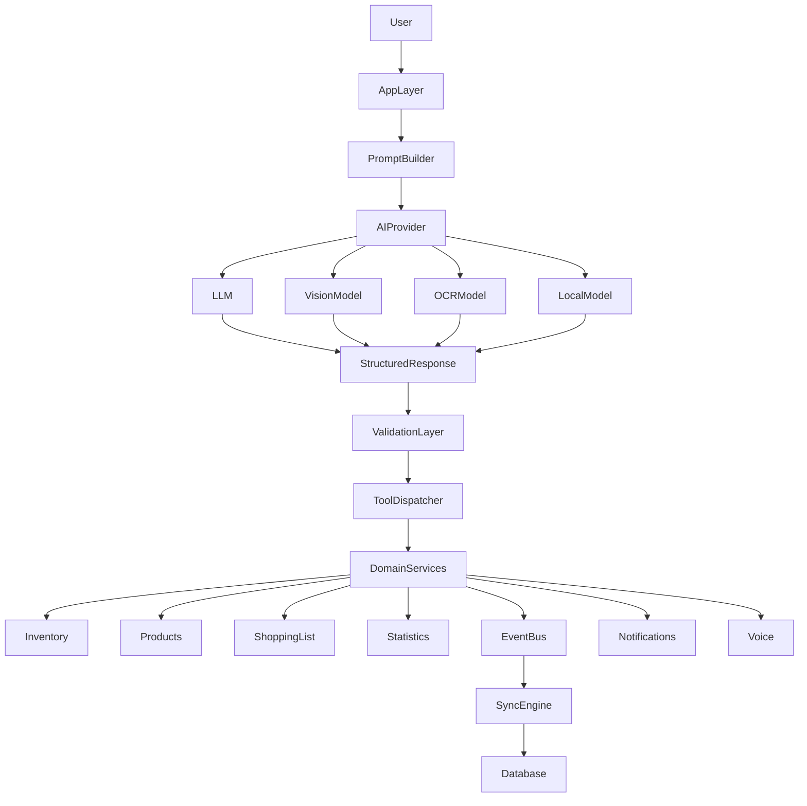

# Baulera

**Document:** 20-ai.md

**Title:** Artificial Intelligence Module

**Version:** 1.0

---

# 1 Purpose

The Artificial Intelligence (AI) module provides intelligent assistance across Baulera while preserving the integrity of the domain model.

Its primary role is to:

- Assist users with natural interactions.
- Generate recommendations.
- Interpret unstructured information.
- Analyze historical data.
- Improve user productivity.

The AI module is **advisory**, not authoritative.

---

# 2 Objectives

The AI module must:

- Improve usability.
- Reduce repetitive work.
- Never bypass business rules.
- Explain its recommendations.
- Respect privacy.
- Be replaceable without affecting the core domain.

---

# 3 Scope

Included

- Product recommendations
- Shopping recommendations
- Consumption insights
- Inventory optimization
- Natural language assistance
- Image understanding
- OCR support
- Conversational interactions

Excluded

- Autonomous inventory modification
- Automatic purchases
- Automatic synchronization decisions
- Domain rule execution
- Financial advice

---

# 4 AI Philosophy

Baulera follows five fundamental AI principles.

## AI Assists

AI suggests.

Users decide.

---

## Domain Decides

Business rules remain deterministic.

The domain always validates AI output.

---

## Transparency

Recommendations should be explainable.

---

## Replaceability

Any AI provider can be replaced without changing business logic.

---

## Privacy First

Only the minimum required information is processed.

---

# 5 Architecture Overview

```text
User

↓

Presentation Layer

↓

AI Services

↓

Structured Recommendation

↓

Domain Validation

↓

Domain Services

↓

Result
```

The AI module never writes directly to the database.

---

# 6 AI Position in Architecture

```text
Presentation

↓

AI

↓

Application Layer

↓

Domain

↓

Infrastructure
```

The Domain layer remains the single source of truth.

---

# 7 Responsibilities

The AI module is responsible for

- Understanding natural language
- Extracting structured information
- Explaining recommendations
- Ranking alternatives
- Summarizing data
- Detecting anomalies

The AI module is not responsible for

- Persisting data
- Applying business rules
- Managing synchronization
- Updating inventory
- Security decisions

---

# 8 AI Service Model

The architecture supports multiple AI providers.

Example

```text
OpenAI
```

```text
Azure OpenAI
```

```text
Local LLM
```

```text
Future Provider
```

All providers implement the same abstraction layer.

---

# 9 AI Request Lifecycle

```text
User Action

↓

AI Request

↓

Prompt Builder

↓

AI Provider

↓

Structured Response

↓

Validation

↓

Domain Operation

↓

User Feedback
```

Every AI-generated response is validated before execution.

---

# 10 AI Output

The AI never returns executable business actions directly.

Instead, it returns structured suggestions.

Example

```json
{
  "intent": "AddShoppingItem",
  "product": "Milk",
  "quantity": 2,
  "unit": "Liter",
  "confidence": 0.96
}
```

The Application layer transforms this into domain commands.

---

# 11 Failure Strategy

If AI fails

```text
↓

Fallback

↓

Manual Workflow
```

The application remains fully functional without AI.

AI enhances usability but is never required for core operations.

---

# 12 AI Module Principles

- AI is advisory rather than authoritative.
- The Domain layer remains the only source of business truth.
- Every AI response is validated before execution.
- AI providers are interchangeable through abstraction.
- Recommendations must be explainable whenever possible.
- Privacy is prioritized by minimizing transmitted data.
- Core application functionality never depends on AI availability.
- The AI module contains no business rules.

---

# 13 Product Recommendations

The AI module may recommend products based on historical household behavior.

Recommendation signals

- Consumption history
- Purchase frequency
- Current inventory
- Expiration dates
- Seasonal trends
- Shopping history

Example

```text
You usually purchase milk every 6 days.

Current inventory is low.

Recommendation:
Add milk to your shopping list.
```

Recommendations require explicit user approval before becoming domain actions.

---

# 14 Shopping Assistance

AI assists users while building shopping lists.

Capabilities

- Suggest forgotten products
- Detect recurring purchases
- Recommend quantities
- Group related products
- Prioritize urgent items

Example

```text
You are buying pasta.

Would you also like tomato sauce?
```

Shopping assistance is optional and configurable.

---

# 15 Inventory Optimization

AI analyzes inventory to identify opportunities for improvement.

Possible recommendations

- Reduce overstocked products
- Increase frequently depleted items
- Consume products nearing expiration
- Consolidate duplicate products
- Reorganize storage locations

AI never modifies inventory automatically.

---

# 16 Consumption Analysis

The AI module identifies consumption patterns.

Examples

```text
Milk consumption increased by 18% this month.
```

```text
Rice consumption has remained stable for six months.
```

```text
Coffee purchases have decreased compared to last quarter.
```

Insights are generated from historical statistics.

---

# 17 Smart Suggestions

Suggestions are contextual.

Examples

Inventory context

```text
You have only one bottle of cooking oil remaining.
```

Shopping context

```text
You usually buy eggs together with milk.
```

Expiration context

```text
Two yogurts expire tomorrow.
```

Suggestions are informative and non-intrusive.

---

# 18 Product Discovery

When a product is unknown, AI may help classify it.

Capabilities

- Infer category
- Suggest unit
- Estimate storage location
- Recommend default thresholds
- Suggest expiration defaults

Example

```text
Product

Parmesan Cheese
```

↓

Suggested

```text
Category

Dairy
```

```text
Storage

Refrigerator
```

The user can modify any suggested values before saving.

---

# 19 Quantity Recommendations

AI may recommend purchase quantities.

Inputs

- Historical consumption
- Current inventory
- Household size (future)
- Seasonal adjustments

Example

```text
Recommendation

Buy two liters instead of one.

Average consumption is higher than usual.
```

Recommendations never override user input.

---

# 20 Duplicate Detection

The AI module helps detect potential duplicates.

Examples

```text
Whole Milk
```

```text
Milk
```

```text
Organic Whole Milk
```

Possible response

```text
These products appear to be related.

Would you like to merge them?
```

Merge operations always require user confirmation and follow domain validation rules.

---

# 21 Recommendation Ranking

Recommendations are prioritized using multiple signals.

Possible ranking factors

- Confidence
- Historical frequency
- Inventory urgency
- Expiration risk
- User preferences
- Seasonal relevance

Ranking algorithms remain implementation details and may evolve independently.

---

# 22 Recommendation Principles

- Recommendations are based on historical behavior and current context.
- Inventory optimization is advisory only.
- Product classification assists initial setup but never bypasses user review.
- Quantity suggestions are estimates, not commands.
- Duplicate detection proposes, but never performs, merges automatically.
- Ranking prioritizes relevance while remaining explainable.
- All recommendations require explicit user acceptance before affecting domain data.
- Recommendation algorithms can evolve without changing the domain model.

---

# 23 Natural Language Interface

The AI module enables users to interact with Baulera using natural language.

Examples

```text
I bought milk yesterday.
```

```text
What products expire this week?
```

```text
What should I buy today?
```

```text
How much rice do I have left?
```

Natural language requests are converted into structured application commands or information queries.

---

# 24 Conversational AI

The AI module supports multi-turn conversations.

Example

```text
User

Add milk.
```

↓

```text
AI

To your inventory or shopping list?
```

↓

```text
User

Shopping list.
```

↓

```text
AI

How much?
```

↓

```text
User

Two liters.
```

↓

```text
Application

Creates Shopping Item.
```

Conversation ends once the domain operation completes.

---

# 25 Context Management

AI may use temporary context to improve responses.

Available context

- Current screen
- Current household
- Recent commands
- Selected product
- Active shopping list
- Current filters

Context is session-scoped and automatically discarded after the interaction.

---

# 26 Conversation Memory

The AI distinguishes between temporary conversation context and persistent application data.

Temporary memory

- Previous question
- Missing entities
- Clarification requests
- Active conversation state

Persistent data

- Products
- Inventory
- Shopping lists
- Statistics

Persistent data is managed exclusively by the domain layer.

---

# 27 Prompt Builder

The Prompt Builder assembles the minimum context required for each AI request.

Inputs may include

- User message
- Relevant inventory data
- Current screen
- Product metadata
- Historical statistics
- Language settings

The builder intentionally excludes unrelated household information.

---

# 28 Structured Responses

AI responses should be machine-readable whenever possible.

Example

```json
{
  "intent": "PurchaseProduct",
  "entities": {
    "product": "Milk",
    "quantity": 2,
    "unit": "Liter"
  },
  "confidence": 0.98
}
```

Natural-language explanations may accompany structured results but are not used for execution.

---

# 29 Clarification Strategy

If information is incomplete or ambiguous, the AI requests clarification.

Example

User

```text
Add apples.
```

AI

```text
Would you like to add apples to your inventory or your shopping list?
```

Example

User

```text
I bought milk.
```

AI

```text
How much milk did you buy?
```

Clarification reduces incorrect domain operations.

---

# 30 Explainable AI

Whenever practical, the AI should explain the reasoning behind its responses.

Examples

```text
Milk was recommended because your inventory is below the configured threshold.
```

```text
Coffee was suggested because it is typically purchased every two weeks.
```

Explanations increase user confidence and facilitate troubleshooting.

---

# 31 Prompt Safety

Prompt construction must avoid exposing unnecessary information.

Rules

- Include only relevant domain data.
- Exclude secrets and credentials.
- Exclude internal identifiers when not required.
- Avoid transmitting unrelated household information.
- Minimize personally identifiable information.

Prompt minimization supports privacy and reduces token usage.

---

# 32 Language Support

The AI module supports multilingual conversations.

Initial languages

- English
- Spanish

Future support

- Portuguese
- Italian
- French
- German
- Japanese

Language selection should be independent of the application's internal data model.

---

# 33 Conversational Principles

- Natural language is translated into structured intents and entities.
- Conversation context is temporary and session-scoped.
- Persistent application state is managed only by the domain layer.
- Prompt builders transmit the minimum necessary information.
- Structured responses are preferred for deterministic execution.
- Clarification is requested whenever confidence is insufficient.
- AI explanations should accompany recommendations when appropriate.
- Multilingual support is independent of business logic.
- Conversational features enhance usability without altering domain behavior.

---

# 34 Image Analysis

The AI module may analyze images to simplify inventory management.

Supported scenarios

- Product identification
- Label recognition
- Expiration date detection
- Packaging analysis
- Category suggestion
- Brand recognition

Image analysis produces recommendations rather than direct domain updates.

---

# 35 Barcode Assistance

When a barcode cannot be resolved through local or external databases, AI may assist.

Workflow

```text
Barcode

↓

No Match

↓

Image Analysis

↓

Product Suggestion

↓

User Confirmation

↓

Product Creation
```

The barcode remains the primary identifier whenever available.

---

# 36 Receipt Analysis

AI may extract structured purchase information from receipts.

Typical workflow

```text
Receipt Photo

↓

OCR

↓

Line Item Detection

↓

Product Matching

↓

Purchase Suggestions

↓

User Review

↓

Purchase Events
```

Every extracted purchase requires user confirmation before being recorded.

---

# 37 OCR Integration

Optical Character Recognition (OCR) converts images into structured text.

Possible sources

- Receipts
- Product labels
- Expiration dates
- Ingredient lists
- Storage instructions

OCR output is validated before being used by the AI pipeline.

---

# 38 Expiration Date Detection

AI may identify expiration information from packaging.

Example

```text
Image

↓

Detected

12/09/2027
```

↓

```text
Suggested Expiration Date

12 September 2027
```

Users may edit detected values before saving.

---

# 39 Product Recognition

AI may recognize products using visual characteristics.

Possible outputs

- Product name
- Brand
- Category
- Packaging type
- Estimated unit
- Confidence score

Example

```json
{
  "product": "Olive Oil",
  "brand": "Borges",
  "category": "Oils",
  "confidence": 0.93
}
```

Recognition results are advisory only.

---

# 40 Image Quality Handling

If image quality is insufficient, AI should report the limitation rather than guessing.

Examples

```text
The expiration date is not clearly visible.
```

```text
Please capture the label with better lighting.
```

Low-confidence predictions should trigger user review.

---

# 41 Vision Processing Pipeline

```text
Image

↓

Preprocessing

↓

OCR

↓

Object Detection

↓

Product Recognition

↓

Structured Output

↓

Domain Validation

↓

User Confirmation
```

Each stage may be replaced independently as technology evolves.

---

# 42 Vision Provider Abstraction

The architecture supports multiple computer vision providers.

Possible implementations

- OpenAI Vision
- Azure AI Vision
- Google Vision
- Apple Vision Framework
- On-device vision models

The application communicates through a provider-independent interface.

---

# 43 Vision Principles

- Images are analyzed only when initiated by the user.
- OCR and visual recognition complement, but do not replace, barcode identification.
- Low-confidence results require user verification.
- Structured outputs are validated before affecting domain operations.
- Image quality feedback is preferred over unreliable predictions.
- Computer vision providers remain interchangeable through abstraction.
- User confirmation is required before creating or modifying domain data.
- Vision capabilities enhance productivity while preserving deterministic business behavior.

---

# 44 Predictive Models

The AI module may use predictive models to anticipate future household needs.

Prediction targets include:

- Product consumption
- Purchase frequency
- Inventory depletion
- Product expiration
- Seasonal demand
- Shopping behavior

Predictions are probabilistic and are never treated as facts.

---

# 45 Consumption Forecasting

AI estimates future consumption using historical data.

Possible inputs

- Consumption history
- Purchase history
- Current inventory
- Seasonality
- Product category

Example

```text
Milk

Expected depletion

4 days
```

Forecasts improve shopping recommendations but never modify inventory automatically.

---

# 46 Inventory Depletion Prediction

The AI estimates when products will reach configured thresholds.

Example

```text
Rice

Current Stock

2 kg

↓

Estimated Threshold Date

Next Tuesday
```

These estimates help users plan purchases proactively.

---

# 47 Waste Prediction

AI identifies products with a high probability of becoming waste.

Signals

- Historical waste
- Expiration proximity
- Consumption rate
- Inventory level
- Seasonal changes

Example

```text
Three yogurts are unlikely to be consumed before expiration.
```

Users remain responsible for deciding how to act on the prediction.

---

# 48 Seasonal Analysis

The AI detects recurring seasonal behavior.

Examples

```text
Ice cream purchases increase every summer.
```

```text
Soup consumption increases during winter.
```

Applications

- Better shopping suggestions
- Inventory planning
- Demand forecasting

Seasonal models require sufficient historical data.

---

# 49 Smart Notifications

AI may generate contextual notifications.

Examples

```text
You usually buy coffee every two weeks.

It has been 15 days since your last purchase.
```

```text
Your fruit waste increased by 30% compared to last month.
```

Notification delivery follows the Notification module's configuration and user preferences.

---

# 50 Personalized Insights

The AI transforms statistics into concise household insights.

Examples

```text
You consume eggs faster than last month.
```

```text
Cleaning supplies typically last three months.
```

```text
Your pantry inventory has become more balanced.
```

Insights should emphasize actionable information rather than raw metrics.

---

# 51 Recommendation Confidence

Every AI recommendation should expose an internal confidence score.

Conceptual levels

| Confidence | Meaning |
|------------|---------|
| High | Strong historical evidence |
| Medium | Moderate confidence |
| Low | Weak prediction, requires caution |

Confidence influences ranking and presentation but does not change domain behavior.

---

# 52 Learning Strategy

The AI adapts using household history.

Learning sources

- Purchases
- Consumption
- Shopping lists
- Inventory changes
- Accepted recommendations
- Rejected recommendations

The system learns preferences without altering immutable historical events.

---

# 53 Predictive Principles

- Predictions estimate future behavior rather than guaranteeing outcomes.
- Historical events remain the foundation for every prediction.
- Waste prevention is a primary optimization objective.
- Seasonal trends improve long-term recommendations.
- Personalized insights summarize behavior in an understandable way.
- Recommendation confidence supports transparency.
- Learning adapts to user behavior without modifying historical records.
- Predictive models assist decision-making while preserving deterministic domain rules.

---

# 54 Privacy

The AI module is designed according to the principle of data minimization.

Rules

- Only the minimum required information is sent to AI providers.
- Sensitive information is excluded whenever possible.
- Personally identifiable information (PII) is not transmitted unless explicitly required.
- Household data remains isolated.
- AI requests are generated on demand and are not continuously streamed.

Whenever feasible, anonymized or aggregated data should be preferred.

---

# 55 Security

AI interactions follow the same security model as the rest of the application.

Security requirements

- User authentication
- Household authorization
- Secure transport
- Encrypted communication
- Prompt validation
- Response validation
- Audit logging

The AI module cannot bypass authorization or business rules.

---

# 56 Offline AI

Some AI-assisted features may operate locally.

Possible offline capabilities

- Intent recognition
- Basic recommendations
- OCR using on-device models
- Product classification
- Simple natural language parsing

Offline AI enhances availability but may provide lower-quality results than cloud models.

---

# 57 Cloud AI

Advanced capabilities may require cloud-based models.

Examples

- Conversational assistance
- Complex reasoning
- Vision analysis
- Advanced recommendations
- Receipt interpretation
- Predictive analytics

Cloud AI should fail gracefully when connectivity is unavailable.

---

# 58 Model Selection

The architecture supports multiple model classes.

Possible categories

- Large Language Models (LLMs)
- Small Language Models (SLMs)
- Vision Models
- OCR Models
- Embedding Models
- Classification Models

Model selection depends on the requested task rather than a single universal model.

---

# 59 AI Provider Abstraction

All providers implement a common interface.

```text
AI Service

↓

Provider Adapter

↓

OpenAI

Azure OpenAI

Local LLM

Future Provider
```

Changing providers must not affect:

- Domain logic
- Application services
- User interface
- Database schema

---

# 60 Performance Targets

| Operation | Target |
|-----------|--------|
| Local AI response | < 300 ms |
| Cloud AI recommendation | < 3 s |
| OCR extraction | < 2 s |
| Image analysis | < 5 s |
| Recommendation generation | < 500 ms |
| Prompt construction | < 50 ms |

Performance targets are goals rather than strict guarantees and depend on provider capabilities.

---

# 61 Cost Optimization

AI usage should be optimized to minimize operational costs.

Strategies

- Reuse cached results when appropriate.
- Build concise prompts.
- Send only relevant context.
- Prefer local models for simple tasks.
- Batch compatible requests.
- Avoid duplicate AI calls.

Efficiency benefits both latency and operating costs.

---

# 62 Failure Handling

Possible failures

- Provider unavailable
- Timeout
- Invalid response
- Low-confidence result
- Rate limit exceeded
- Network failure

Recovery strategy

1. Retry when appropriate.
2. Fallback to local capabilities.
3. Offer manual workflow.
4. Preserve user progress.
5. Log diagnostic information.

Core application functionality must remain available even when AI services fail.

---

# 63 AI Infrastructure Principles

- Privacy is achieved through data minimization.
- AI services follow the same authentication and authorization rules as the application.
- Offline AI complements cloud capabilities.
- Multiple model types are supported through abstraction.
- Provider changes require no modifications to domain logic.
- Performance and cost are optimized through efficient prompt construction and caching.
- Failures degrade gracefully without interrupting core functionality.
- AI infrastructure remains modular, replaceable, and resilient.

---

# 64 Prompt Engineering Strategy

Prompts are constructed dynamically using a minimal and structured context.

Guidelines

- Include only relevant domain data.
- Avoid redundant or duplicated context.
- Prefer structured inputs over raw text when possible.
- Ensure prompts are deterministic for identical inputs.
- Separate system instructions from user data.

Prompt structure

```text
System Instructions
+
User Intent
+
Relevant Context
+
Task Definition
```

---

# 65 Prompt Minimization Rules

To reduce cost and improve performance:

- Do not include full inventory unless required.
- Include only relevant products or categories.
- Limit historical data to meaningful windows.
- Avoid including unrelated household metadata.
- Truncate large datasets using summarization.

Minimization improves latency and reduces token usage without affecting correctness.

---

# 66 Function Calling / Tooling

The AI module may request structured actions via function-style outputs.

Example

```json
{
  "tool": "AddShoppingItem",
  "arguments": {
    "product": "Milk",
    "quantity": 2,
    "unit": "Liter"
  }
}
```

Rules

- Tools are validated before execution.
- AI cannot execute actions directly.
- Invalid tool calls are rejected.
- Tool execution is handled by application services.

---

# 67 AI Services Layer

The AI layer is composed of independent services:

- Intent Service
- Recommendation Service
- Vision Service
- OCR Service
- Conversation Service
- Embedding Service

Each service can be replaced independently.

---

# 68 Acceptance Criteria

| Area | Requirement |
|------|------------|
| Recommendations | Must be explainable and user-approved |
| Intent parsing | Must map natural language to valid domain intents |
| Vision | Must require confirmation before data creation |
| OCR | Must allow user correction before persistence |
| Offline AI | Must degrade gracefully |
| Cloud AI | Must be optional for core features |
| Tool calling | Must be validated by application layer |
| Performance | Must meet defined latency targets |
| Privacy | Must minimize transmitted data |

---

# 69 Business Rules

BR-AI-001  
AI must never directly modify domain state.

---

BR-AI-002  
All AI-generated actions must be validated by the application layer.

---

BR-AI-003  
User confirmation is required for any persistent change.

---

BR-AI-004  
AI outputs are always advisory unless explicitly converted into domain commands.

---

BR-AI-005  
Tool calls must be strictly schema-validated.

---

BR-AI-006  
Prompt context must be minimized to the required scope.

---

BR-AI-007  
AI failures must not block core application functionality.

---

# 70 System Diagram



---

# 71 Cross-Module Traceability

| AI Feature | Related Document |
|------------|------------------|
| Domain constraints | 04-domain-model.md |
| Architecture | 06-architecture.md |
| Sync engine | 11-sync-engine.md |
| Security | 12-security.md |
| Products | 16-products.md |
| Shopping list | 17-shopping-list.md |
| Statistics | 18-statistics.md |
| Voice | 19-voice.md |
| Notifications | 22-notifications.md |
| OpenFoodFacts | 21-openfoodfacts.md |

---

# 72 Design Principles Summary

## 72.1 AI is not the system of record

AI only interprets and suggests. The domain model defines truth.

---

## 72.2 Deterministic core

All AI outputs must be validated against deterministic domain rules before execution.

---

## 72.3 Multi-model architecture

Different AI models are used for different tasks:

- LLMs for reasoning
- Vision models for image understanding
- OCR for text extraction
- Embedding models for similarity search
- Local models for offline support

---

## 72.4 Minimal context principle

Prompts must include only necessary data to reduce cost and preserve privacy.

---

## 72.5 Replaceability

Any AI provider can be replaced without impacting:

- Domain logic
- Database schema
- Sync engine
- UI behavior

---

## 72.6 Human-in-the-loop

User confirmation is required for all persistent or destructive actions.

---

## 72.7 Graceful degradation

System remains fully functional when AI is unavailable.

---

## 72.8 Explainability

AI recommendations should be understandable and traceable to data sources.

---

# 73 Future Evolution

Planned enhancements:

- On-device multimodal models
- Personalized household assistants
- Advanced forecasting models
- Cross-device conversational continuity
- Real-time voice + vision fusion
- Autonomous suggestion tuning (still user-approved)
- Smarter prompt compression techniques
- Federated learning (privacy-preserving improvements)
- Edge AI acceleration

All future features must preserve deterministic domain boundaries.

---

# 74 Final Summary

The AI module in Baulera acts as an intelligent augmentation layer that enhances usability without compromising system correctness.

Key properties:

- Advisory-only behavior
- Strict separation from domain logic
- Multi-model architecture (LLM, Vision, OCR, local AI)
- Minimal and privacy-aware context usage
- Tool-based structured outputs
- Human-in-the-loop validation
- Offline and cloud hybrid operation
- Fully replaceable providers
- Deterministic core system guarantees

AI improves interaction quality while the domain model remains the single source of truth.

---

